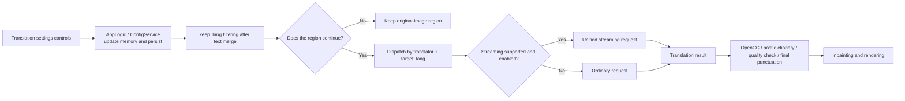

# Translation settings

## What these settings control {#feature-boundary}

This guide focuses on the 11 rows on the “Translation” settings tab: translator, target/kept languages, streaming, terminology extraction, RPM, context, and the visible post-processing switches. It explains how those values enter the desktop configuration and the core translation stage.

It does not replace implementation selection in [Translator selection and languages](../translator/selection-and-languages.md), prompt content in [Context and prompts](../translator/context-and-prompts.md), or API keys, models, candidate slots, and rotation in API Management. `translator_chain`, `skip_lang`, the high-quality prompt path, and post-translation quality checks are fields accepted by core/API or CLI configuration but are not rows in the current settings layout; this page therefore does not represent them as UI controls.

## Change it in the desktop app {#ui-operations}

Open “Settings” and select “Translation”. A combo box selects its stored value. When a switch or numeric editor changes, `AppLogic.update_single_config()` immediately updates the in-memory configuration and writes its configuration file. Changing “Translator” also updates the desktop translation service’s current implementation; changing “Target Language” updates its current target language. The remaining rows take effect when a later task reads the complete configuration.

1. Select “Translator” and “Target Language”. To continue processing only regions recognized as one source language, select “Keep Source Language”; otherwise select “No Filter”.
2. For a supported OpenAI/Gemini implementation, choose whether to “Enable Streaming”; use “Max Requests Per Minute” to cap request rate, where `0` means no limit.
3. Enable “Auto Extract Glossary” only when a matching high-quality prompt resource is available. “Don't Skip Target Lang” forces translation of text that appears already to be the target language.
4. Enable final-punctuation removal or one-way Chinese conversion as required. “Context Size” appears on the same tab but is stored in `cli.context_size`.

## Parameters {#parameters}

> For the mapping of UI names, storage keys, and default values of the parameters on this page, see the [Settings Parameter Index](../../reference/settings-index.md).

#### Translator {#translator-translator}

Choose the translation implementation in the “Translator” combo box. Options: OpenAI, OpenAI High Quality, Google Gemini, Gemini High Quality, Sakura, “None”, and “Original”. The first four require matching API credentials; “None” performs no online translation, and “Original” keeps the source text. Default: `openai`.

See [Translator Selection and Target Languages](../translator/selection-and-languages.md) for details.

#### Target Language {#translator-target-lang}

Choose the target language in the “Target Language” combo box. Options: Simplified Chinese, Traditional Chinese, Czech, Dutch, English, French, German, Hungarian, Italian, Japanese, Korean, Polish, Portuguese (Brazil), Romanian, Russian, Spanish, Turkish, Ukrainian, Vietnamese, Arabic, Serbian, Croatian, Thai, Indonesian, and Filipino (Tagalog). Default: `CHS`.

See [Translator Selection and Target Languages](../translator/selection-and-languages.md) for details.

#### Keep Source Language {#translator-keep-lang}

Choose whether to filter by recognized source language in the “Keep Source Language” combo box. With “No Filter”, every recognized region is processed; after choosing a specific language, only regions recognized as that language are processed, and the others are not inpainted, translated, or rendered. Default: `none` (No Filter).

See [Translator Selection and Target Languages](../translator/selection-and-languages.md) for details.

#### Enable Streaming {#translator-enable-streaming}

Switch. When enabled, supported OpenAI/Gemini implementations use streaming transport; when disabled, they use ordinary requests. Default: `false` (disabled).

See [Glossary, Streaming, and Line Breaking](../translator/glossary-stream-and-linebreak.md) for details.

#### Don't Skip Target Lang {#translator-no-text-lang-skip}

Switch. When enabled, text that appears already to be the target language is still translated; when disabled, text identical to the target-language result can be retained. Default: `false` (disabled).

See [Translator Selection and Target Languages](../translator/selection-and-languages.md) for details.

#### Auto Extract Glossary {#translator-extract-glossary}

Switch. Enable it only when a matching high-quality prompt resource is available; when enabled, the translation request additionally requests and parses new terms. Default: `false` (disabled).

See [Glossary, Streaming, and Line Breaking](../translator/glossary-stream-and-linebreak.md) for details.

#### Max Requests Per Minute {#translator-max-requests-per-minute}

Integer input that caps translation requests per minute; `0` means no limit. Default: `0`.

See [Retry, Rate Limits, and Translation Quality](../translator/retry-rate-limit-and-quality.md) for details.

#### Auto Remove Final Period/Comma {#translator-remove-trailing-period}

Switch. When enabled, only when the source text has no terminal punctuation, one removable final period or comma is removed from the translation. Default: `true` (enabled).

#### Context Size {#cli-context-size}

Integer input for the number of history pages used during translation; `0` disables history. When enabled, up to this many recent non-empty translated pages before the current page are used as context. Default: `3`.

See [Context and Prompts](../translator/context-and-prompts.md) for details.

#### Convert to Traditional Chinese / Convert to Simplified Chinese {#translator-chinese-conversion}

Two switches that convert the finished translation: “Convert to Traditional Chinese” turns simplified results into traditional, and “Convert to Simplified Chinese” turns traditional results into simplified; when both are on, simplified-to-traditional takes precedence. Default: both off (`false`).

## How the settings take effect {#runtime-behavior}

Before the request, `context_size` additionally builds separate messages from recent non-empty history pages. `extract_glossary` requests extra terminology only when a custom high-quality prompt exists. The fixed core post-processing path also has bracket/quote handling, a post dictionary, optional quality checks, and this page’s final-punctuation handling; the quality-check fields are not in this UI layout.
