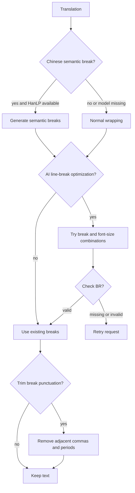
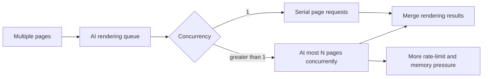
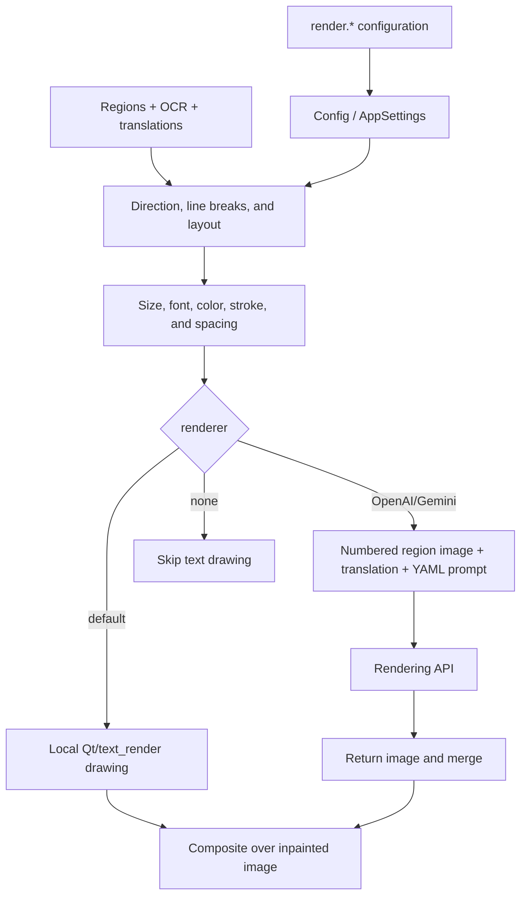

# Typesetting and Rendering

This guide covers the `render.*` parameters in the “Typesetting” settings tab and the direct-paste parameters in “Mode Specific”. They control line breaking, font size, direction, color, stroke, spacing, and final text drawing. Detection, OCR, translation content, and inpainting belong to their respective settings pages. This guide does not document API credentials; it explains how AI rendering consumes an already configured rendering API.

## Configure it in the UI

Open “Settings” → “Typesetting”. Each dynamic row shows a field label on the left and a selector, checkbox, numeric/text input, or an “Edit” file action on the right; the description panel shows the current field’s explanation. Changes update the in-memory configuration immediately, and a `render.*` change emits the render-settings-changed signal so the editor can refresh; the config service then writes the configuration file. Selecting `openai_renderer` or `gemini_renderer` requires the corresponding API candidates in API management before translation can start.

The “Font” dropdown lists operating-system fonts and `.ttf`, `.otf`, and `.ttc` files in the project `fonts/` directory. Add a font file there and reopen the dropdown to refresh it. Enable “Disable System Fonts” to keep only project fonts in the list. The AI renderer prompt is a file-edit action: “Edit” opens the fixed YAML file directly; do not treat its path as an ordinary renderer enum.

## Parameter reference

> For the mapping of UI names, storage keys, and default values of the parameters on this page, see the [Settings Parameter Index](../../reference/settings-index.md).

#### Renderer

Choose how text is drawn in the “Renderer” combo box. Options: Default (local drawing), OpenAI Renderer, Gemini Renderer, and None (skip text rendering). Before selecting OpenAI Renderer or Gemini Renderer, configure the matching rendering credentials in API management. Default: `default`.

#### Font

Choose a font in the “Font” combo box; options come from operating-system fonts and `.ttf`, `.otf`, and `.ttc` files in the project `fonts/` directory. Add a font file there and reopen the combo box to refresh it. In the editor’s “Style Settings → Font” list, hovering temporarily refreshes the text-box preview; clicking commits the font, and leaving the list restores the current font. Default: `Microsoft YaHei UI`.

#### Disable System Fonts

When enabled, the Typesetting and editor font lists only show fonts registered from the project `fonts/` directory and exclude fonts installed by the operating system. Default: off (`false`). An existing system font remains as the current value for configuration compatibility; new selections are limited to project fonts.

#### Alignment

Choose horizontal alignment for horizontal text in the “Alignment” combo box: Auto (inferred from region and direction), Left, Center, or Right. Default: `auto`.

#### Text Direction

Choose the layout direction in the “Text Direction” combo box: Auto (judged from region/language), Horizontal, or Vertical. Default: `auto`.

#### Layout Mode

Choose the text-box fitting algorithm in the “Layout Mode” combo box: Smart Scaling (balances readability and region fit), Strict Boundary (stays inside the region), or Smart Bubble (fills the bubble shape). Default: `balloon_fill`.

#### Font Color

Enter a color in the “Font Color” field: leave it empty for automatic (uses the detected region color), use `RRGGBB` for a foreground color, or `RRGGBB:RRGGBB` for foreground and background. Default: empty (automatic).

#### Stroke

“Stroke Width Ratio” accepts a ratio from 0.0–1.0, where `0` disables the stroke; the “Disable Font Border” switch turns the border off directly and takes precedence over the ratio. Defaults: ratio `0.07`, switch off.

#### Font Size

“Font Size”, “Font Size Offset”, “Minimum Font Size”, “Maximum Font Size”, and “Font Scale Ratio” together determine the font size. Leaving Font Size empty uses automatic measurement; the offset adjusts the automatic size; minimum/maximum bound the range (`0` means no upper limit); the scale ratio is an overall multiplier applied before layout. Defaults: Font Size empty (automatic), offset `0`, minimum `0`, maximum `0` (no limit), ratio `1.0`.

#### Spacing

“Line Spacing” and “Letter Spacing” accept a multiplier from 0.1–5.0; empty falls back to the renderer default. Default: `1.0`.

#### Line Breaking

Seven switches — “Chinese Semantic Line Break”, “AI Line Breaking”, “AI Line Break Auto Enlarge”, “Don't Expand Box on Auto Enlarge”, “AI Line Break Check”, “Trim Around Line Breaks”, and “Disable Hyphenation” — control line breaking. Semantic breaking requires a local model and falls back to normal wrapping when absent; AI line-break options require a supported OpenAI/Gemini translator. Default: all off.

#### Case

The “Uppercase” and “Lowercase” switches convert text case before drawing; do not enable both at once. Default: off.

#### Bubble Layout

“Bubble Layout (Force Horizontal)” applies bubble-shape layout to every language and forces horizontal layout; “Center in Bubble” centers the text block inside the bubble. Default: off.

#### Right to Left

When enabled, Arabic, Hebrew, and similar text is processed in right-to-left order. Default: on (`true`).

#### AI Renderer Prompt

Clicking the edit action on the “AI Renderer Prompt” row edits the fixed YAML prompt file directly; it is not an ordinary enum value. Default: resolved by the application.

#### AI Renderer Concurrency

Enter the number of simultaneous AI rendering requests: `1` runs page requests serially, and larger values improve throughput while increasing network, API rate-limit, and memory/GPU pressure. Default: `1`.

#### Direct Paste

The “Enable Direct Paste Mode” switch and the “Paste Mode Mask Dilation Pixels” integer input affect only the Replace Translation workflow: when enabled, regions from the translated image are pasted onto the raw image by coordinate matching, and the dilation value expands the mask before pasting, where `0` disables it. Defaults: switch off, dilation `10`.

## Runtime mechanism: configuration to final image

The normal path starts with detected regions, OCR text, translated text, and an inpainted image. Direction and language select the layout axis; line-breaking rules produce line boundaries; font size and layout mode measure text within the region; font, color, spacing, and stroke enter the text renderer; finally the drawing layer is composited onto the output. An AI renderer combines numbered region images and translations with the fixed YAML request, receives a rendered image, and merges it by page/region. `renderer=none` does not draw translations.

Configuration updates are written through `ConfigService`; the runtime core configuration is then passed to the processing pipeline. User configuration, Qt defaults, release examples, and core fallbacks are separate sources; explicit CLI parameters can override runtime values. API renderers additionally pass through API-management feature/provider selection and candidate resolution; candidate rotation does not change `render.renderer`.

## Dependencies, conflicts, and resources

- `openai_renderer` / `gemini_renderer` require matching API configuration, network access, and a valid model; higher concurrency is more likely to trigger rate limits.
- `semantic_linebreak` requires local HanLP models and should fall back to normal wrapping when absent.
- `optimize_line_breaks` and `check_br_and_retry` require a supported OpenAI/Gemini translator; retry checks need bounded conditions to prevent loops.
- System/project fonts, glyph coverage, licenses, and fallback affect final pixels; the release font name is only an example.
- Fixed size, strict boundaries, min/max size, disabled wrapping, and forced horizontal layout can constrain one another, causing shrinking, overflow, or cropping.
- Higher AI concurrency, large fonts, and complex regions increase CPU, memory, GPU, or network usage. Do not share intermediate requests or user images when cancelling or reporting a task.
