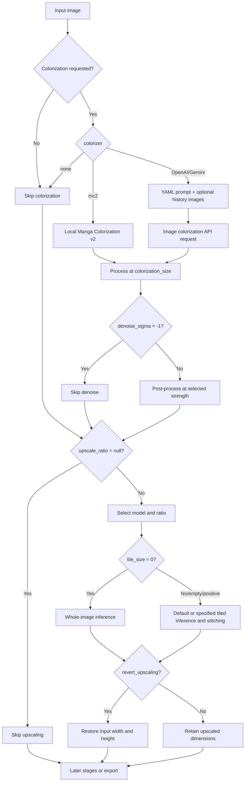

# Upscale and Colorization

## What these settings control

This guide covers the Upscaling and Colorization groups in the Mode Specific tab: image super-resolution, output-size restoration, local colorization, the AI colorizer prompt, and previous-page image context. It does not replace the nine-workflow matrix in [Mode Specific](./mode-specific.md), nor does it document translation, detection, OCR, inpainting, or typesetting parameters. Upscaling changes pixel dimensions; colorization changes color information; neither automatically enables detection, OCR, translation, or typesetting.

## Change it in the desktop app

Open “Settings” and select “Upscaling” or “Colorization” under Mode Specific. The layout file determines row order; the dynamic settings page creates a combo box, toggle, or numeric input from the field type. After an edit, the in-memory configuration updates immediately and the config service schedules a merged write to `config/config.json`; numeric inputs submit on focus loss, and invalid input is not written as a valid configuration value.

### Upscaling

1. Choose a model in “Upscaling Model”: `Waifu2x`, `ESRGAN`, `4x UltraSharp`, `Real-CUGAN`, or `MangaJaNai`.
2. Choose “Not Use” or a value offered by the current model in “Upscale Ratio”. A Real-CUGAN selection also writes its internal model field.
3. Enter a tile edge length in “Tile Size (0=No Split)”; `0` disables tiling, while an empty value uses the runtime default of 400.
4. Enable “Revert Upscaling” when the final output must retain the original width and height. This does not skip upscaling; it restores the final size.

### Colorization

1. Choose “None”, `Manga Colorization v2`, `OpenAI Colorizer`, or `Gemini Colorizer` in “Colorization Model”.
2. Selecting an AI colorizer exposes the corresponding color API credential group in API management. A valid configuration is required; otherwise the UI may block start or the request may fail.
3. Use the edit action for “AI Colorizer Prompt” to modify the fixed YAML file. It is a resource editor, not an ordinary JSON configuration field.
4. Adjust “Colorization Size” and “Denoise Strength”. For AI colorization, “AI Colorizer History Pages” attaches images of earlier completed colorized pages; `0` disables it.

“Colorize Only” shows “Start Colorizing”, while “Upscale Only” shows “Start Upscaling”; both skip detection, OCR, translation, and rendering. The other nine workflows’ forced overrides and input/output ownership belong to the Mode Specific page.

## Parameters and runtime behavior

> For the mapping of UI names, storage keys, and default values of the parameters on this page, see the [Settings Parameter Index](../../reference/settings-index.md).

#### Upscaling Model {#upscale-upscaler}

The “Upscaling Model” combo box is on Settings → Mode Specific → Upscaling and selects the offline model used for image upscaling: `Waifu2x`, `ESRGAN`, `4x UltraSharp`, `Real-CUGAN`, or `MangaJaNai`. Whether upscaling runs and the scale factor come from “Upscale Ratio”; MangaJaNai is the most resource-intensive. Default: `mangajanai`.

#### Upscale Ratio {#upscale-upscale-ratio}

The “Upscale Ratio” combo box changes with “Upscaling Model”. Choose “Not Use” to skip upscaling or a ratio offered by the current model: ordinary models offer 2, 3, and 4; MangaJaNai offers x2, x4, and DAT2 x4; Real-CUGAN offers the full model tiers (such as 2x-conservative and 2x-denoise3x), and choosing a tier also writes its internal model field. Default: `null` (Not Use).

#### Real-CUGAN Model {#upscale-realcugan-model}

“Real-CUGAN Model” is not a separate visible row; it is maintained by the “Upscale Ratio” selector and is used only when “Upscaling Model” is Real-CUGAN. Choosing a tier writes both the internal model field and a parseable ratio. Default: `null`.

#### Tile Size {#upscale-tile-size}

“Tile Size” is an optional integer input on Settings → Mode Specific → Upscaling. Enter `0` to disable tiling, a positive integer as the tile edge length, or leave it empty to use the runtime default of 400. Tiling splits large images into tiles for inference and stitches them, lowering peak VRAM; whole-image inference can be faster but is more prone to OOM. Default: `400`.

#### Revert Upscaling {#upscale-revert-upscaling}

“Revert Upscaling” is a toggle on Settings → Mode Specific → Upscaling. When enabled, the image is upscaled first and the final output is restored to the input width and height; when disabled, the enlarged dimensions are kept. It does not skip upscaling. Default: `false`.

#### Colorization Model {#colorizer-colorizer}

The “Colorization Model” combo box is on Settings → Mode Specific → Colorization. “None” skips colorization; Manga Colorization v2 runs locally; OpenAI Colorizer and Gemini Colorizer send image colorization API requests. Selecting an AI colorizer exposes the corresponding color credential group in API management. Default: `none` (None).

#### AI Colorizer Prompt {#colorizer-ai-colorizer-prompt-path}

“AI Colorizer Prompt” is an edit action for a fixed YAML prompt file, not an ordinary configuration row. Its content is used for AI colorization requests; do not mix it with AI OCR, AI renderer, or translation prompts.

#### AI Colorizer History Pages {#colorizer-ai-colorizer-history-pages}

“AI Colorizer History Pages” is an integer input. It attaches images of earlier completed colorized pages to the AI colorization request; `0` disables it. It is image-only context, not translation text history; if fewer pages exist, only existing pages are used. Larger values increase upload, memory, latency, and cost. Default: `0`.

#### Colorization Size {#colorizer-colorization-size}

“Colorization Size” is an integer input. A positive value sets the processing size and `-1` requests the original/full size. Larger sizes usually preserve more detail but are slower, and depend on model and VRAM/network limits. Default: `2048`.

#### Denoise Strength {#colorizer-denoise-sigma}

“Denoise Strength” is an integer input in the range `0–255`. Larger values apply stronger smoothing; `-1` disables it. It only matters in the post-colorization stage, and excessive strength can erase detail. Default: `30`.

## How the settings take effect

### Upscale and colorization branches {#upscale-colorization-flow}

Colorize Only and Upscale Only export after their respective stage; the complete main chain and mutual exclusions for detection, OCR, translation, and rendering belong to the other pages.

## Interactions and caveats

- `upscale_ratio=null` skips upscaling; `tile_size=0` only disables tiling. They are not interchangeable.
- Ratio options depend on the model; Real-CUGAN tiers maintain the internal model field as well.
- `revert_upscaling` restores output dimensions but does not cancel upscaling.
- `colorizer=none` skips colorization; MC2 needs a local model, while AI values need the corresponding API configuration and network.
- History pages are AI colorization image context, not translator text context; larger values increase upload, memory, latency, and cost.
- Colorization size, tile size, and upscale ratio affect different stages.
- Colorize Only and Upscale Only skip detection, OCR, translation, and rendering; nine-workflow forced overrides belong to `mode-specific.md` and workflow pages.
