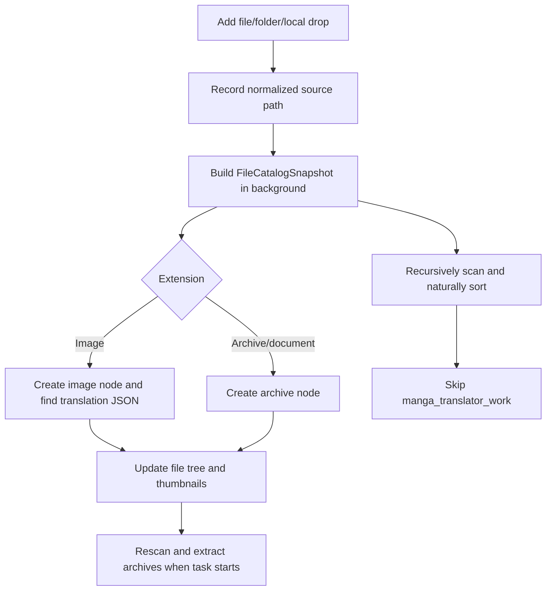

# File List and Input

## What this part handles

This guide explains how the desktop “Translation Interface” collects, displays, and removes pending inputs: individual image files, folders, dropped paths, and supported archives/documents. The file list only manages input sources, the thumbnail tree, and selection state; output directory, workflow selection, start action, and task progress belong to [Output Directory and Workflow](./output-directory-and-workflow.md) and [Progress, Stop, and Task State](./progress-stop-and-task-state.md).

An archive can appear in the input list without having been extracted. Extraction and image discovery happen during the scan that starts the task.

## Use it on the Translation page

### Adding files, folders, and drops

The translation page input card has three buttons. The file dialog remembers the last open directory; after a successful selection, the directory containing the first file becomes the next starting directory.

1. Click “Add Files” and choose one or more supported images or archives in the file dialog.
2. Click “Add Folder” and choose one or more directories in the folder selector. Folder scanning recurses into child directories.
3. You can also drag files or folders into the file-list area. The Qt drop handler accepts local file URLs and sends their paths through the same input coordinator used by the buttons.
4. The same path is not added twice. Adding a parent folder supersedes separately added paths below it; adding a path already covered by a listed parent does not create another source.

“Clear List” removes all input sources and the exclusion records for items in the list. While a task is running, adding, removing, and clearing are rejected and a warning is logged.

### File tree, thumbnails, and single-item removal

The list displays scan results as a one- or multi-level folder tree: folder nodes show their file count, while image nodes show a thumbnail, file name, and status dot. An image is “Translated” or “Untranslated” according to whether an associated translation JSON was found during the scan; archives show an archive icon rather than an image thumbnail.

- Selecting an image node emits a selection event that the main window can use to open or synchronize the editor.
- Visible image thumbnails load asynchronously and use a bounded cache. A thumbnail read failure leaves the file node in place instead of turning it into a list-scan failure.
- Clicking the close icon at the right of a node removes only that item. Removing a folder removes its descendants; if an item is still covered by a retained parent folder, the removal is recorded as an excluded file/subfolder so the next scan does not add it again.
- During a rescan, the model is cleared and shows a loading message. When the result arrives, the view attempts to restore expanded directories and the selected path.

### Empty, loading, ready, and error states

| State | UI behavior | User action |
| --- | --- | --- |
| Empty | The list shows “Drag and drop files or folders here / or click the buttons above to add” and a dashed area | Click “Add Files” or “Add Folder”, or drop local paths |
| Loading | The list model is temporarily cleared and shows “正在加载文件列表...” | Wait for the background scan; an older result cannot replace a newer request |
| Ready | The folder tree, counts, thumbnails, and “Translated”/“Untranslated” status are visible | Select files, expand directories, or remove an item |
| Error | The list model is cleared and the specific message is shown in an error color | Correct the path or permissions and add it again; do not copy private paths from the error into a public report |

If the scan started with a task finds no valid images, the application shows “File List Empty” and “Please add image files to translate!”. An archive that cannot be extracted, or an unsupported file, is not a valid image input by itself.

## How the task runs

### From input sources to the file tree

Directories use natural sorting, so `file2` comes before `file10`; duplicate sources are removed using a normalized path key. Scanning skips directories named `manga_translator_work`, preventing a previous task’s project files from becoming new input.

An image node retains its source image path and any discovered JSON path. The scanner checks `<image-dir>/manga_translator_work/json/<stem>_translations.json` first, then the legacy image-directory location. Therefore the status dot means only that an associated JSON was found at scan time; it does not mean that the current task translated successfully.

### Archive handling when a task starts

The list phase only identifies and displays archives. When a task starts, the archive extractor unpacks the archive, collects images inside it, and records a mapping from archive to its temporary extraction directory. When extraction is directed to the output directory, it also checks same-name extraction-directory conflicts and skips or clears them according to the overwrite setting. An archive with no images, an extraction failure, or a stopped task is reported through progress/error messages.

The actual relative layout for different archive contents, duplicate names, and output directories must be confirmed in practice; the page does not promise that sidecar TXT/JSON files automatically pair with paths inside an archive.

### Removal and snapshot updates

Removing a source node does not delete the original image, archive, or translation JSON from disk. When a file or folder is removed, the main logic updates its source list and exclusion sets, then the main window requests a new snapshot; the list view also immediately removes the node from its in-memory model and clears related thumbnail-cache entries. Clearing the list likewise changes only in-memory sources and exclusions and does not clean the user work directory.

## Task limitations

- An input path must exist and be readable, and an image extension must belong to the supported set. The legacy `FileService.validate_image_file()` also checks the image MIME type and read permission.
- Recursive folder scans skip `manga_translator_work`; do not treat the project directory as a fresh original-image directory.
- The file list is locked while a task runs; adding, removing, and clearing are rejected. See the next page for stop and task states.
- Large directories use background scanning and asynchronous thumbnail reads. Snapshot and thumbnail loading have cancellation/generation guards so an old scan cannot replace a new list, but disk access and thumbnails still consume CPU, memory, and I/O.
- Archive recognition is not extraction success. The contents, permissions, same-name conflicts, and temporary-directory cleanup for PDF, EPUB, CBZ, CBR, and ZIP should be confirmed with an actual run.
