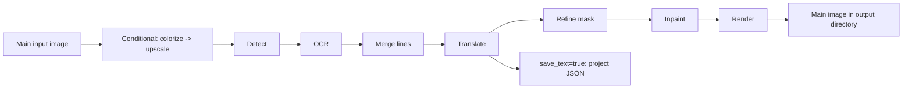

# Output Directory and Workflow

In the “Translation Task” card on the translation page, you can set the main output directory and choose the processing mode. This guide focuses on the output-path controls, the nine workflows, and their effect on outputs and processing stages. Adding inputs and list states are in [File List and Input](./file-list-and-input.md); start, progress, and stop states are in [Progress, Stop, and Task State](./progress-stop-and-task-state.md).

## What this part handles

This guide covers:

- Entering, browsing, and opening the output directory.
- The nine options of the “Translation Workflow Mode:” combo box, and the button and hint text after switching.
- Input discovery, output files, processing stages, skipped stages, and mutual-exclusion limits for each mode.

It does not define the parameter algorithms of detectors, OCR, translators, inpainting, or renderers, nor does it treat workflow selection as translator or API candidate-slot switching. Setting multiple workflow fields manually is not a GUI-supported combination.

## Use it on the Translation page

### Setting the output directory

1. Type a path in the input next to “Output Directory:”, or drag an output folder into the input. The placeholder text is “Select or drag output folder...”.
2. Click “Browse...” to open the directory-selection action and choose a target folder.
3. Click “Open” to ask the system to open the selected output directory.
4. After choosing files, select the processing mode in “Translation Workflow Mode:” and click that mode’s start button.

In the source, the output input and the Browse/Open buttons connect to the controller’s directory-selection and open actions. This static review did not launch the GUI, so the actual dialog text when a directory does not exist, is not writable, or fails to open still needs a runtime check. The output directory does not replace the per-image work directory; JSON, TXT, and inpainted images still follow the input image’s work-directory rules.

### Choosing a workflow

When the combo box changes, the GUI first clears the eight mutually exclusive CLI workflow fields, then sets only the field for the selected mode and saves the configuration. Switching also updates the title, description text, and start button; it never starts a task automatically.

After a selection, the title shows the current mode and the subtitle shows the matching hint. For example, Export Translation hints to check `manga_translator_work/translations/`, and Import Translation and Render hints to read TXT from `manga_translator_work/originals/` or `translations/`, preferring `_original.txt`. These paths are program-displayed hints and work-directory names, not private user paths.

## How the task runs

### Normal output chain

Normal Translation conditionally runs colorization and upscaling, then proceeds through detection, OCR, text-line merging, translation, mask refinement, inpainting, and rendering. When there are no detection boxes or OCR text, the core may return the input image or the upscaled image early. Normal Translation is the only mode that may enter the `batch_concurrent` pipeline.

### Stages and outputs of the nine modes

| Workflow | Input/discovery | Output | Running stages | Skipped or special boundary |
| --- | --- | --- | --- | --- |
| Normal Translation | Main input image | Main output image; project JSON when `save_text=true`; inpainted image when inpainting runs; editor base when colorization/upscaling is enabled | Conditional colorize → upscale → detect → OCR → merge → translate → mask → inpaint → render | May return early when no detection boxes or OCR text; the only mode that uses the concurrent pipeline |
| Export Translation | Main image by default; existing project JSON and template when the toggle is on | Project JSON and translated sidecar by default; with the toggle on only `<stem>_translated.<template-format>` and unchanged JSON; no main image | Detect → OCR → translate → template export by default; with the toggle on read JSON `translation` and export through template | `export_from_local_json=true` skips image loading, detection, OCR, API translation, and JSON write-back |
| Export Original Text | Main image and template by default; existing project JSON and template when the toggle is on | Project JSON and original sidecar by default; with the toggle on only `<stem>_original.<template-format>` and unchanged JSON; no main image | Detect → OCR → template export by default; with the toggle on read JSON `text` and export through template | `export_from_local_json=true` skips image loading, detection, OCR, and JSON write-back |
| Translate JSON Only | Must find a project JSON; supports legacy region lists and the new `regions` object | Writes the project JSON back; deletes the same-image original sidecar on success; no main output image | Load JSON → translate → write JSON back | Skips colorize, upscale, detect, OCR, merge, mask, inpaint, and render; saving does not depend on `save_text` |
| Import Translation and Render | Requires a project JSON; TXT prefers the original sidecar, otherwise the translation sidecar | Main output image and updated project JSON; inpainted image when needed | Read JSON/in-memory payload → reuse or refine mask → inpaint → render | Skips colorize, upscale, detect, OCR, merge, and translate; extra detection when JSON has no mask and YOLO labels are imported; reuses an existing inpainted image and may skip real inpainting with an AI renderer |
| Colorize Only | Main input image | Main output image; editor base when colorization is active | Conditional colorize | Skips upscale, detect, OCR, merge, translate, mask, inpaint, and render; does not force a colorizer, so `none` may pass the image through |
| Upscale Only | Main input image; ratio from `upscale.upscale_ratio` | Main output image; editor base when colorization or a ratio is enabled | Conditional colorize → conditional upscale | Skips detect, OCR, merge, translate, mask, inpaint, and render; does not force a ratio, so an empty ratio keeps the colorized result or the original |
| Inpaint Only | Main input image | Main output image; the branch clears `text_regions` and does not render translation | Conditional colorize → upscale → detect → fill detected lines with literal `TEXT` → merge → mask → inpaint | Skips OCR, translation, and rendering; may return an uninpainted image when no lines/mask/merged regions exist; an AI renderer skips real inpainting and uses the working image |
| Replace Translation | Raw image; a same-name translated image must exist in the work directory | Main output image; the re-render branch can write an inpainted image and JSON, the direct-paste branch writes neither nor PSD | Both images conditional colorize → upscale → detect → OCR → merge → region pairing → inpaint and render, or paste text directly | Does not call a translation service; forces `disable_auto_wrap=true` and `layout_mode='strict'`; `enable_template_alignment=true` uses direct paste, and `paste_mask_dilation_pixels` is consumed only by that branch |

A workflow’s display name describes its goal and does not always auto-enable the related model: for example, Upscale Only does not force a ratio and the source may still run an enabled colorizer first; Colorize Only does not force the colorizer from `none` to a concrete implementation.

### Workflow mutual exclusion and concurrency

When the GUI switches, the eight boolean fields are mutually exclusive. When the combo box is synced from an existing configuration, the source priority is: Replace Translation, Inpaint Only, Upscale Only, Colorize Only, Import Translation, Translate JSON Only, Export Original Text, Export Translation, Normal. Manual JSON, service requests, or other entry points can provide combinations, but runtime dispatch handles them with a fixed priority; there is no “run simultaneously” contract.

`batch_concurrent` is incompatible with Import Translation, JSON-only, both exports, Colorize Only, Upscale Only, Inpaint Only, and Replace Translation; both the desktop controller and the core treat these modes as non-concurrent. Special modes do not become concurrent pipelines just because the UI still saves a concurrent configuration.

## Task limitations

- Both text exports use legacy detection/OCR from the main image by default. Only enabling `cli.export_from_local_json` requires an existing project JSON; missing JSON then fails explicitly without OCR fallback.
- `cli.overwrite` checks existing TXT, sidecar, or main output files per mode before starting.
- `cli.save_text` defaults to `true` in Qt/release configuration and affects normal-mode and legacy-export project writes. It remains part of the Export Original Text workflow flags.
- Selected stage parameters determine model, VRAM, network, and API costs; enabling local text export skips those stages.
