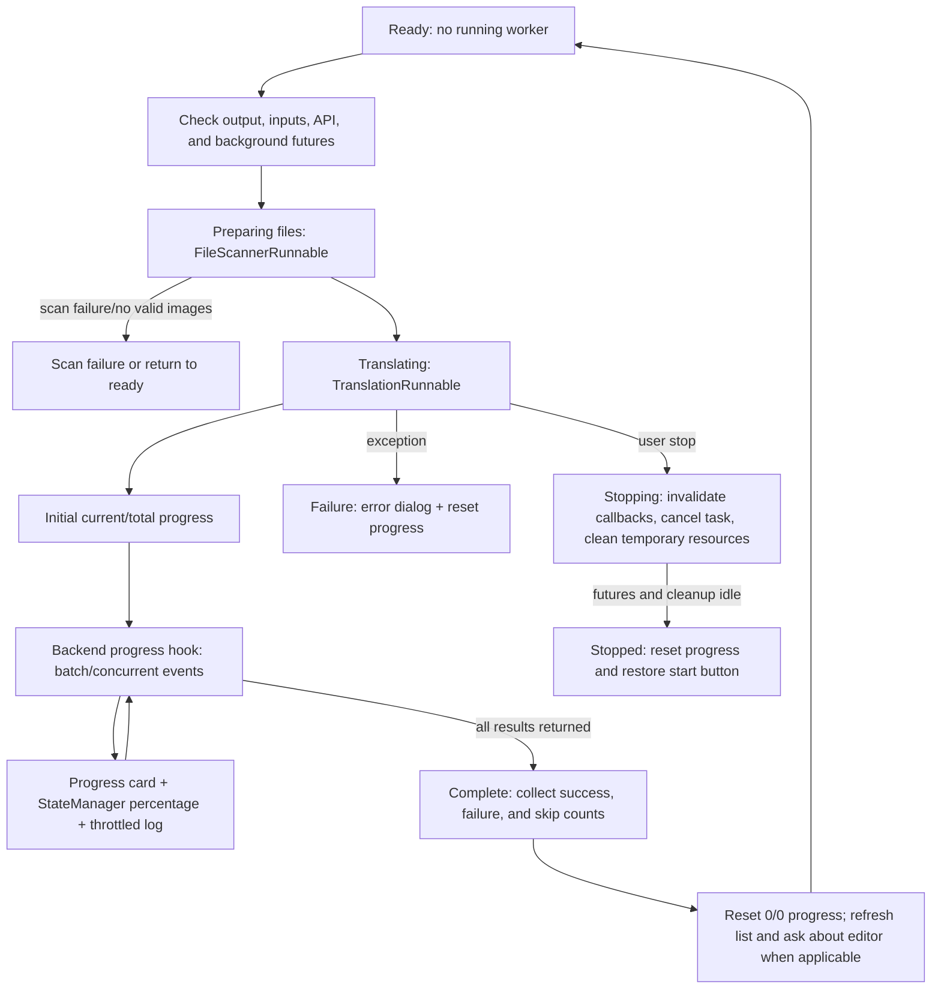

# Progress, Stop, and Task State

After the translation page has input files, a valid output directory, and passing API checks, this guide explains the button states, file counts, percentages, stop request, and cleanup from start through completion, failure, or stopping. See [Output Directory and Workflow](./output-directory-and-workflow.md) for workflow inputs and outputs, and [File List and Input](./file-list-and-input.md) for adding, scanning, and empty-list states.

## What this part handles

This guide covers the desktop Qt translation workspace's:

- Start-button transitions through preparation, startup, running, stopping, and ready.
- How scanning, processed files, skipped files, failed files, and completed counts reach the progress display.
- The cancellation boundary, background cleanup, error feedback, and the post-completion editor prompt.

It does not define detector, OCR, translator, inpainting, or renderer algorithms, and it does not treat the progress bar as a server-side task protocol. Stage differences among the nine workflows remain on the workflow page.

## Use it on the Translation page

### Start a task

1. Confirm that the output directory exists and is a directory, and leave at least one input item in the file list.
2. Choose a workflow and click that mode's start button. The controller checks again that no task is running, that the previous scan/translation/cleanup futures are idle, and that the selected configuration's API credentials are available.
3. After validation, the UI first enters “正在准备文件...”; a background scanner handles folders, archives, and exclusions. Only after scanning finishes does it create the translation worker and enter “正在翻译...”.
4. Once processing starts, the button briefly shows “Starting...” (this key is absent from the Chinese locale, so the actual fallback is the English key), and becomes clickable as “Stop Translation” after about two seconds. This avoids duplicate starts or an overly early stop request.

If scanning or translation cannot start, the state returns to non-running and records “任务启动失败”; no valid image returns to “就绪”. Invalid output, an empty file list, or failed API validation shows a blocking dialog before the task actually starts.

### Read progress

The progress card shows a detail line, a `current/total (percentage%)` counter, and a progress bar. `current` is the number of original inputs completed or skipped, while `total` is the original scanned count; therefore, existing outputs skipped with overwrite disabled still count toward the total. With no valid total, the display is `0/0 (0%)` rather than a fabricated percentage.

The detail can include “批量处理中” or “并发处理中”, average seconds per image, estimated remaining time, skipped count, and failed count. The controller also writes `[current/total] message` to the state manager. Log output is throttled to roughly once per second, while the first, final, and boundary progress events are logged.

### Stop a task

1. When the task is running and the delayed stop button is enabled, click “Stop Translation”.
2. The controller immediately sets the stop-request flag, changes the status message to “正在停止...”, disables the button, and displays “Stopping...”.
3. It increments both the scan request ID and task ID so late scan, progress, completion, or error callbacks become stale; `worker.stop()` clears its running flag and cancels the current asyncio task.
4. Only after scan, translation, and temporary archive cleanup futures are idle does the state become “任务已停止”; the progress card resets to `0/0 (0%)`, and the button returns to the current workflow's start text.

Stopping is cooperative cancellation. It cannot guarantee interruption of an already-issued network request, an uncancellable synchronous model call, or output already written to disk. While stopping, the button cannot be clicked again, and the UI cannot immediately return to start; it remains in the stopping state while background work finishes.

### Completion or failure

After completion, the controller collects returned saved paths, then sets status based on success, failure, and skipped counts and resets the progress card. For workflows whose results are meaningful in the editor, the main window refreshes the file snapshot and asks “Translation completed, {count} files saved.\n\nOpen results in editor?”; modes that are not editor-friendly, such as exports, JSON-only, Colorize Only, Upscale Only, and Inpaint Only, do not show this prompt.

On failure, the state becomes “任务失败”, progress is reset, and a “Translation Error” dialog opens. The dialog shows a friendly error summary and offers “Open log folder”. A partially failed batch keeps successful results while reporting success and failure counts. When every input is skipped because an output already exists, this is not treated as an API translation failure; the warning suggests deleting same-named files or enabling overwrite.

## How the task runs

### State and progress flow

Progress counts are adjusted with the skipped offset and bounded to 0–100 percent while the main-view progress bar is updated. Both concurrent and ordinary batch processing use the original input total; special workflows are forced to run non-concurrently.

### Stop and resource boundary

Stopping first invalidates callbacks and then asks the worker to cancel; the state changes to “任务已停止” only after background scan, translation, and archive cleanup are truly finished. Model unloading depends on `app.unload_models_after_translation`.

## Task limitations

- Starting depends on a valid output directory, a non-empty input list, credentials required by the selected translator, and no unfinished previous-task cleanup.
- Scanning is still represented by the translating state, so Add Files, Add Folder, Clear List, the file list, and API management are disabled.
- Stopping coordinates thread-pool work, the asyncio task, archive temporary directories, and model-memory cleanup; forcibly terminating the process can leave partial outputs or temporary files.
- With `cli.overwrite=false`, existing outputs count toward progress but are not processed. If all files are skipped, the task completes with an overwrite warning instead of calling the translation service.
- `batch_concurrent` applies only to the normal workflow; text/JSON import, exports, Colorize Only, Upscale Only, Inpaint Only, and Replace Translation run serially.
- Task IDs prevent late signals from an old task contaminating a new task, but cannot undo files already written to disk; the user must inspect the output directory if cleanup is needed.
