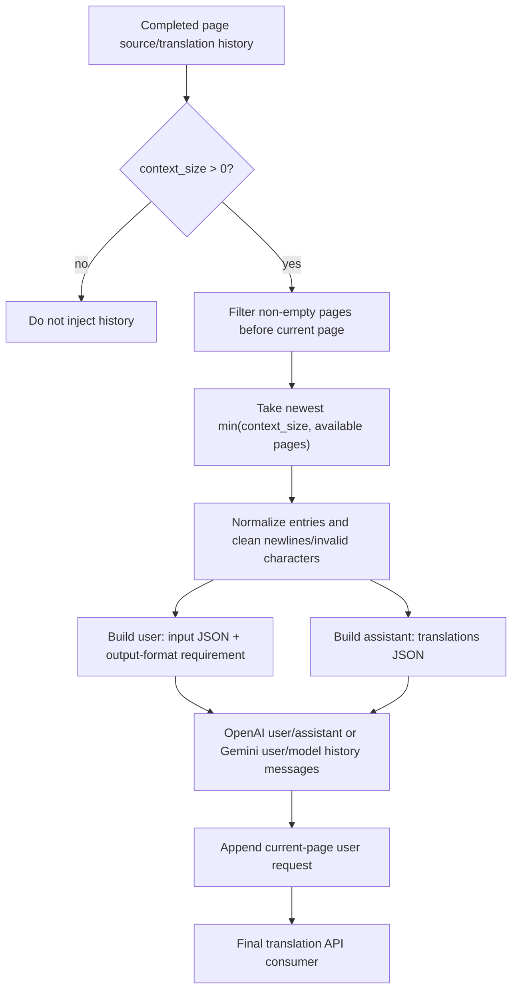
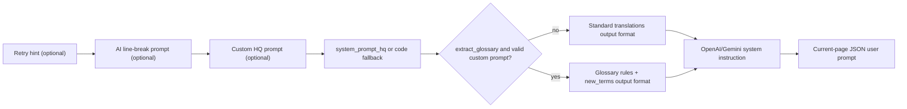

# Context and Prompts

Use this page when adjacent pages share names, terminology, tone, or formatting. It documents the history pages attached to translation requests and the system, custom, and line-break prompts consumed by translators. It does not cover translator/API selection or candidate slots (see [Translator selection](./selection-and-languages.md) and the API-management pages), nor the complete prompt-file CRUD workflow (see [Prompt list, apply, and preview](../prompts/list-apply-and-preview.md)).

## When to use it

- “Context Pages” limits the number of most recent non-empty history pages used for joint translation; it is not a text-region count or an API-slot count.
- “Custom Prompt” is a translator resource path/file-edit action for a custom HQ prompt. This page never embeds private prompt text and does not describe AI OCR, AI colorizer, or AI renderer prompts as if they were one file.
- HQ system, output-format, glossary-extraction, and AI line-break prompts are loaded separately and combined in a fixed order; this page follows their translation-path consumers.

## Set it in the desktop app

### Choose context and prompts in Settings

1. Open “Settings” and select the “Translation” group.
2. Enter a non-negative integer in “Context Pages”. `0` means that history messages are not injected.
3. Use the file action on “Custom Prompt” to choose or edit a prompt. The available prompt files are `.yaml`, `.yml`, and `.json`; system-only prompt files are not listed.
4. Click “Edit” to modify the file directly. Keep a parseable YAML/JSON structure. Rebuilding the settings page or reloading configuration refreshes the path and description panel.
5. “Enable Streaming” changes response transport only; it does not change history selection or prompt composition.

### Inspect and apply a file in Prompt Management

Open “Prompt Management”. The list contains user prompt files. Select one and use “Apply Selected Prompt” to write its path to translator configuration, or use “Prompt Preview” and “Edit” to inspect structured fields or Raw content.

When the list is empty, a file is missing, or parsing fails, the preview shows the corresponding empty/error state. Do not copy a local path from an error message into a public report.

## Parameters and options

> For how each parameter's UI name, storage key, and default value map to each other, see [UI Options Reference](../../reference/options-i18n-matrix.md).

#### Context Pages {#cli-context-size}

- Control: integer input.
- Location: Settings → Translation.
- Options: non-negative integer; there is no enum dropdown.
- Default: `3`.
- Mechanism: after a page finishes, its source/translation entries are retained; the next page filters non-empty pages before the current one, carries only the newest “Context Pages” pages, and appends the current-page request. Empty pages do not consume a slot; more pages increase prompt characters and token cost.

#### Custom Prompt {#translator-high-quality-prompt-path}

- Control: prompt-file selection/edit action, not an ordinary text configuration field.
- Location: the Custom Prompt row in Settings → Translation, or the Apply Selected Prompt button in Prompt Management.
- Options: discovered `.yaml`, `.yml`, and `.json` files; system-only prompt files are not listed as ordinary user prompts.
- Default: `dict/prompt_example.yaml`.
- Mechanism: the translation request parses this file, replaces the target-language placeholder with the full target-language name, and combines it with the system and output-format prompts. Parse failures are logged as warnings/errors and are not sent as valid prompts. With glossary extraction enabled, new terms from a successful response are written back to this file; longer prompts increase token and network cost.

## How translation requests are handled

### How history pages become context messages {#history-to-messages}

The processor uses only pages completed before the current page, skipping pages that do not contain both valid source and translated text. History messages contain text only and never include historical images.

After processing, history is pruned to avoid memory growth in long batches. It is process-local runtime state, not a persisted prompt archive. If a concurrent or import workflow has no strict completion order, do not assume every image sees the same history sequence.

### Prompt composition order {#prompt-composition}

On every retry the system prompt is rebuilt, with a retry hint first when applicable. The order then is AI line-break prompt (only when `render.disable_auto_wrap` is enabled and the file loads), custom HQ prompt, base HQ system prompt, and standard output-format prompt. When `translator.extract_glossary` is enabled with a valid custom prompt, glossary rules and an extended `new_terms` output format are appended after the base prompt.

The target-language placeholder in custom fields is replaced with the full target-language name. With AI line breaking, the request also carries `original_region_count` so final rendering checks can validate `[BR]` markers.

## Models, network, and quality

- Context quality depends on prior OCR text and successful translations; history does not automatically correct bad OCR.
- “Context Pages”, “Batch Size”, and “Concurrent Batch Processing” are different layers: the first controls history-page count, while the latter two control region batches and image orchestration.
- A custom HQ prompt affects translation requests only. Fixed AI OCR/colorizer/renderer prompts have separate keys and consumers; do not interchange their files.
- OpenAI/Gemini requests are also affected by streaming, RPM, ordinary retries, and API candidate rotation. These mechanisms do not change history content; see the translation-settings and API-management pages.
- Prompt content may contain business text. Before sharing logs, request exports, or debug directories, remove request bodies, historical text, paths, and credentials.
