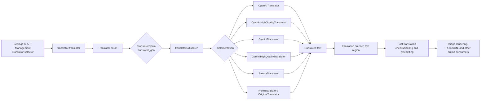
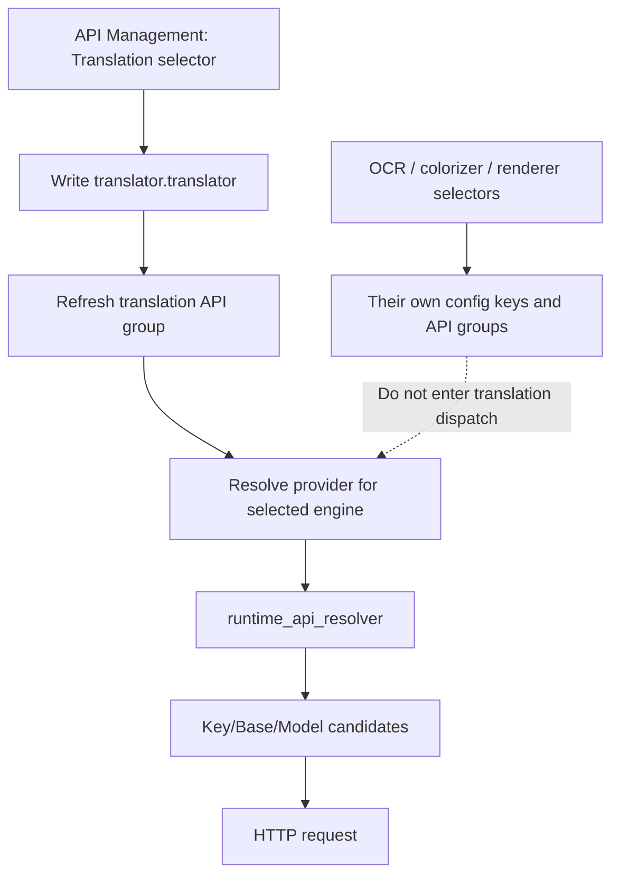

# Translator Engine Dispatch

Use this page when you need to know which implementation the Translator selector calls, when an API is required, or how multi-step translation is chained. It covers the boundary from the Translator selector to a translator implementation and the final text consumers; target languages, skipped languages, context, prompts, streaming, and post-processing belong to [Translator selection and languages](./selection-and-languages.md) and the adjacent specialist pages.

## When to use it

- **In scope**: translator selection in the desktop Settings and API Management pages; mapping from the stored value to the `Translator` enum, `TranslatorChain`, and `dispatch`; the differences between regular and high-quality OpenAI/Gemini implementations, Sakura, no translation, and original text.
- **Out of scope**: OCR, colorizer, and renderer selectors; Key/Base/Model candidate rotation within one provider; prompt contents, context construction, and quality retries. Those belong to API Management or the other translator pages.
- The Translator selector in API Management is not just a view filter: it writes the same `translator.translator` setting and refreshes the translation API group. API slots themselves do not change the selected engine.

## Set it in the desktop app

### Select an engine in Settings

1. Open **Settings**, enter the **Translation** group, and choose an implementation from **Translator**.
2. The combo box shows localized names but writes a stored value such as `openai_hq`. The dynamic settings layer emits a `translator.translator` change; `MainAppLogic.update_single_config()` updates the in-memory model, saves the config, and calls `TranslationService.set_translator()`.
3. The target language and other translation settings remain in the same group; changing the engine does not change the target language.
4. In **API Management**, open the Translation tab and use the same selector at the top. The page asynchronously rebuilds the credential/address/model group for the selected feature without changing OCR, colorizer, or renderer keys.

## Runtime behavior: from stored value to final consumer

1. A single translator enters the chain as `translator:target-language`; each chain component must be `enum-name:language`, and the language must be in `VALID_LANGUAGES`.
2. High-quality implementations receive context, and regular AI implementations can also receive context for AI line breaking. Empty queries return without an API request.
3. Results return to each text region's `translation` field and are then consumed by post-translation processing, typesetting, and save services. Selecting an engine does not directly write the final image.

### Regular, high-quality, and local branches

- `openai` and `gemini` are regular chat translation implementations and can use unified streaming and context.
- `openai_hq` and `gemini_hq` use dedicated high-quality classes; their prompt/structured handling and quality behavior must not be conflated with ordinary retries.
- `sakura` is an independent service implementation and is not automatically switched by OpenAI/Gemini API candidate rotation.
- `none` and `original` are not automatic fallbacks after an API failure. The former clears the translation; the latter retains the source text. They are explicit user-selected implementations.

## API feature-selector boundary

API Management has four feature selectors: Translation, OCR, Colorizer, and Renderer. Each is bound to one real configuration key; the keys and the refreshed API groups are listed in [UI Options Reference](../../reference/options-i18n-matrix.md).

Therefore changing the Translation selector to `gemini` in API Management really changes the translation engine and refreshes Gemini translation API fields; it is not merely changing a credential label. Conversely, multiple OpenAI Key, Base, or Model slots only affect runtime candidates within the selected OpenAI provider. Candidate resolution, `failover`/`round_robin`, cooldown, and recovery belong to API Management rather than this page.

### Dependencies and conflicts

- `openai*` requires at least one usable OpenAI or OpenAI-compatible credential/address/model; `gemini*` requires Gemini credentials. Real keys must stay in local environment or secure runtime overrides and are not shown in this page or screenshots.
- `sakura` depends on its Sakura service address and dictionary/service configuration. It is a different group from OpenAI/Gemini fields, so inspect the corresponding group after switching.
- `none` and `original` require no network API but have different downstream semantics: empty translation can render as empty, while original retains source text. Do not use either as automatic failover.
- `translator_chain`/`selective_translation` and the single `translator` are competing sources of the translation generator: when a chain or language selection is present, `translator_gen` constructs that chain first; every provider in the chain still needs its own credentials and language support.
- `batch_size` changes the number of texts submitted in one dispatch, while `batch_concurrent` changes the concurrent image pipeline. Neither changes the engine enum. Context and API request concurrency are documented on the Translation settings page.
- Target language is independent of UI language; `auto` is the source-language argument passed to an implementation, not automatic engine selection.
