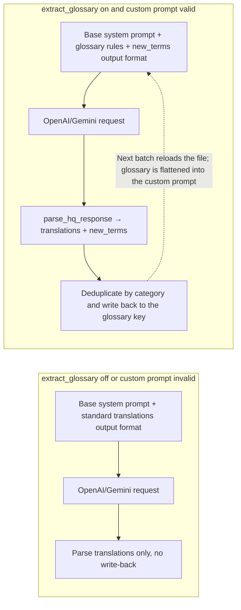
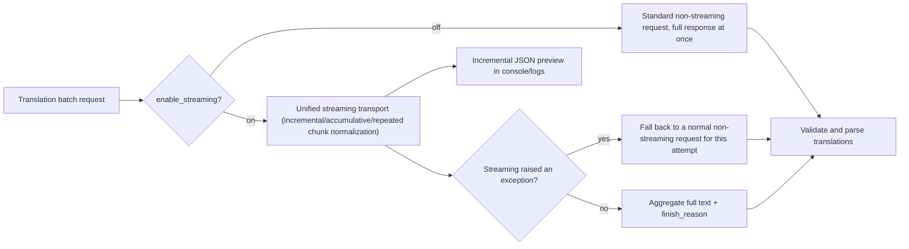

# Glossary, Streaming, and Line Breaking

Use this page when a long manga series must keep names, places, and skills consistent, when you want to see incremental output while a translation is in flight, or when translations should wrap according to the original line count. It documents automatic glossary extraction (`translator.extract_glossary`), streaming (`translator.enable_streaming`), and AI line breaking (`render.disable_auto_wrap`). Extracted terms are written back to the custom prompt file; streaming changes request transport only; AI line breaking uses a line-break prompt plus `original_region_count` so the model returns `[BR]` markers.

It does not cover translator or target-language selection (see [Translator selection](./selection-and-languages.md)), the full history and prompt-composition picture (see [Context and prompts](./context-and-prompts.md)), or renderer-side auto wrapping, semantic breaking, and punctuation trimming (see [Typesetting and rendering](../settings/typesetting-and-rendering.md)).

## When to use it

- There is no `translator.glossary` configuration key in the current config model; the glossary lives under a `glossary` key inside the custom HQ prompt file (`translator.high_quality_prompt_path`) and is written back by the auto-extraction feature.
- `translator.extract_glossary` is the automatic glossary-extraction switch; it enters the extraction branch only when the custom HQ prompt loads successfully, otherwise the switch alone still uses normal translation.
- `translator.enable_streaming` (the `translator.stream` shorthand in the task brief) changes request transport only for OpenAI/Gemini translators, including HQ modes; it does not change prompts, context, glossary extraction, or the final translation.
- `render.disable_auto_wrap` is displayed as “AI Line Breaking”. It drives both the translator-side line-break prompt and the renderer-side `[BR]` forced-wrap semantics; renderer auto wrapping itself is covered by the typesetting page.
- `OPENAI_GLOSSARY_PATH` (displayed as “Glossary Path”) is a legacy environment-variable-backed glossary path and is separate from the location where `extract_glossary` writes terms (the custom prompt file).

## Set it in the desktop app

### Enable glossary extraction and streaming in Settings

1. Open “Settings” and select the “Translation” group.
2. Toggle “Auto Extract Glossary”. When enabled, the description panel shows “Auto-extract proper nouns (names, places) from translations to ensure consistency in long manga series.”
3. Toggle “Enable Streaming”. The description panel explains the difference between streaming and non-streaming requests.
4. Glossary extraction requires a parseable prompt file selected under “Custom Prompt”; without one, the switch does not produce the extraction branch.
5. Open “Settings” → “Typesetting” and toggle “AI Line Breaking” to enable the AI line-break prompt.

### Inspect the glossary in Prompt Preview

Open “Prompt Management”, select a custom prompt file, and click “Prompt Preview”. If the file contains a `glossary` key, the preview shows a “Glossary” section with a total entry count and per-category tabs for Person / Location / Org / Item / Skill / Creature; when empty it shows “No glossary entries”.

## Parameters and options

> For how each parameter's UI name, storage key, and default value map to each other, see [UI Options Reference](../../reference/options-i18n-matrix.md).

#### Auto Extract Glossary {#translator-extract-glossary}

- Control: toggle.
- Location: Settings → Translation.
- Options: on or off.
- Default: `false`.
- Mechanism: when enabled, every attempt appends glossary-extraction rules and an extended output format that requires `new_terms`. Proper nouns such as names and places are extracted from the response and written back under the `glossary` key of the custom prompt file. A new original creates a same-name first `aliases` form and stores its translation in that alias's `translations`; an existing original accepts only genuinely new aliases when `overwrite: true`, while `false` or an omitted field leaves it unchanged. An alias that already exists is discarded as a whole, so AI never adds a second translation to it. AI deltas use the `original`/`category`/`aliases` shape; conditions, descriptions, overwrite flags, and other unknown fields are ignored on write-back. The next batch reloads the file, forming the “extract → write back → carried by the next request” feedback loop. The extraction branch runs only when a custom prompt loads successfully; otherwise the switch alone still uses normal translation. Write-back modifies the user prompt file, so sanitize it before sharing.



The switch only changes prompt content and write-back behavior; translation-count validation, retries, and candidate rotation still run as usual.

#### Enable Streaming {#translator-enable-streaming}

- Control: toggle.
- Location: Settings → Translation.
- Options: on or off.
- Default: `false`.
- Mechanism: when enabled, OpenAI/Gemini translators, including HQ modes, prefer the unified streaming transport to receive incremental responses in real time, with incremental previews in the console/logs; when disabled, they always use standard non-streaming requests. If a streaming request raises an exception (for example an endpoint that does not support streaming), this attempt automatically falls back to a normal non-streaming request without interrupting the task.



The fallback affects a single attempt only; if the endpoint keeps failing, retries and candidate rotation take over as usual.

#### AI Line Breaking {#render-disable-auto-wrap}

- Control: toggle.
- Location: Settings → Typesetting.
- Options: on or off.
- Default: `false`.
- Mechanism: when enabled, the translation side adds the line-break prompt to the system-prompt prefix and asks the model to output `[BR]` markers according to the original line count; the renderer treats `[BR]` as a forced wrap during typesetting. It interacts with options such as “AI Line Break Check”; the full behavior is in the typesetting-and-rendering page. Replace-translation mode forces AI line breaking and the strict layout. For single-line regions (N=1), if the model still returns `[BR]`/`<br>`/`【BR】`, the markers are automatically cleaned into a single line during line-break validation; this cleanup does not depend on the “AI Line Break Check” switch.

```mermaid
flowchart LR
    subgraph Off["disable_auto_wrap off"]
        O1["No line-break prompt loaded"] --> O2["User prompt without original_region_count"]
        O2 --> O3["Rendering: auto-wrap layout"]
    end
    subgraph On["disable_auto_wrap on"]
        A1["Load system_prompt_line_break.yaml"] --> A2["Line-break prompt enters the system-prompt prefix"]
        A1 --> A3["Attach original_region_count per region"]
        A2 --> A4["OpenAI/Gemini output [BR] markers"]
        A3 --> A4
        A4 --> A5["Rendering: forced wrap on [BR]"]
        A5 --> A6{"check_br_and_retry and region count ≥ 2?"}
        A6 -->|translation lacks [BR]| A7["Trigger retry"]
        A6 -->|ok| A8["Proceed to next stage"]
    end
```

The full renderer branches for auto wrapping, HanLP semantic breaking, and punctuation trimming are covered by the typesetting page; this guide only explains how the line-break prompt enters the translation request.

## How translation requests are handled

### Glossary extraction, merge, and feedback {#glossary-feedback-loop}

Glossary extraction relies on two facts: the extraction branch runs only when a valid custom prompt is loaded and `extract_glossary` is on, and new terms are written back to the custom prompt file (`high_quality_prompt_path`), not to the file pointed to by the `OPENAI_GLOSSARY_PATH` environment variable. The written `glossary` key is organized by standard categories. Existing originals stay unchanged by default; only entries that explicitly allow automatic additions receive genuinely new aliases. An alias that already exists is discarded, even when the AI proposes a different translation. Automatic merging does not modify authored translations, conditions, descriptions, overwrite flags, or other authored content. The preview page shows these entries in per-category tabs. The feedback loop takes effect only after the next batch reloads the file; it never mutates an already-built request.

### Unified streaming transport and fallback {#streaming-transport}

The stream preview affects console/log output only; the aggregated full text still goes through the shared response validation and parsing. A streaming failure does not switch translators or candidates; it only falls back to a normal request for that attempt.

### AI line-break prompt and `[BR]` markers {#ai-line-break}

The user prompt carries `original_region_count`, which the renderer uses to judge whether the `[BR]` count in the translation matches the original line count; `check_br_and_retry` retries only translations with ≥2 regions that are missing `[BR]`. For single-line regions (`original_region_count=1`), even if the model returns `[BR]`/`<br>`/`【BR】`, the markers are automatically cleaned into a single line; this cleanup depends only on `disable_auto_wrap`, not on the `check_br_and_retry` switch.

## Models, network, and quality

- `extract_glossary` is tightly coupled to `high_quality_prompt_path`: without a valid custom prompt there is no extraction branch and no term write-back.
- `enable_streaming` is independent of prompts, context, and glossary extraction; it changes transport only.
- `disable_auto_wrap` affects both translation and rendering stages; the full combination of `optimize_line_breaks`, `semantic_linebreak`, `remove_linebreak_punctuation`, and `check_br_and_retry` is on the typesetting page.
- Streaming, RPM, ordinary retries, and API candidate rotation stack on the same request path; they do not change glossary or line-break content.
- Glossary and prompt files may contain business text. Remove request bodies, glossary entries, paths, and credentials before sharing logs, request exports, or debug directories.
