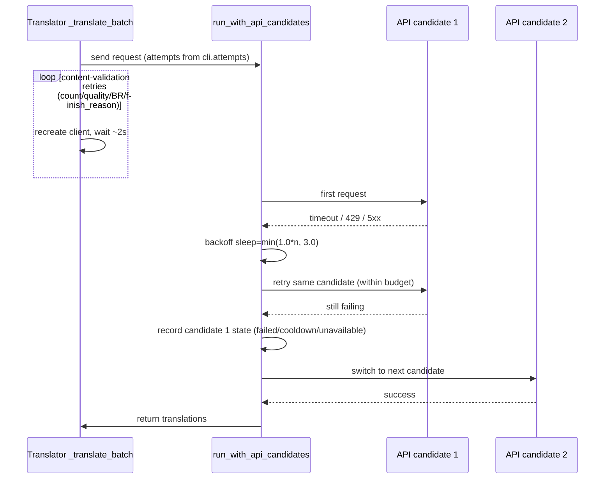
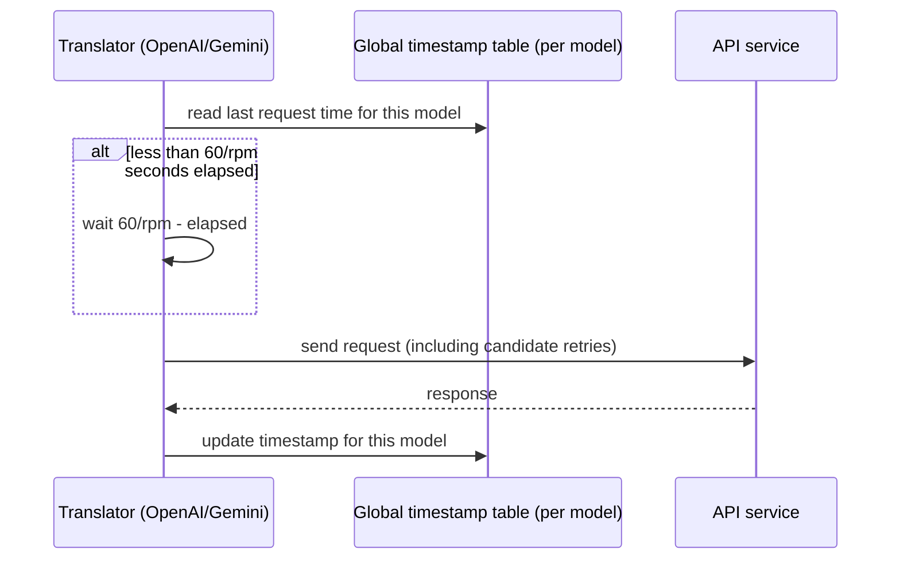
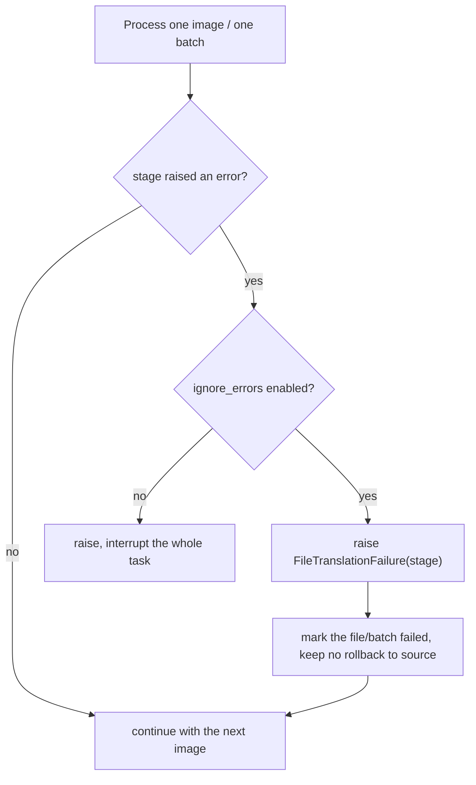
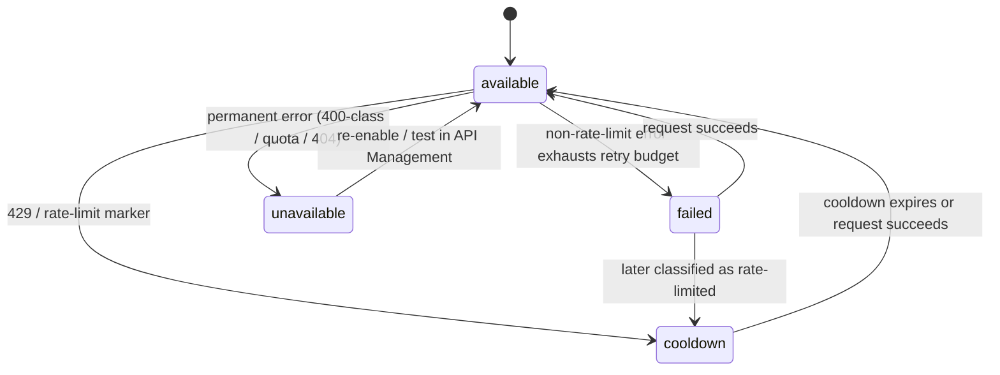
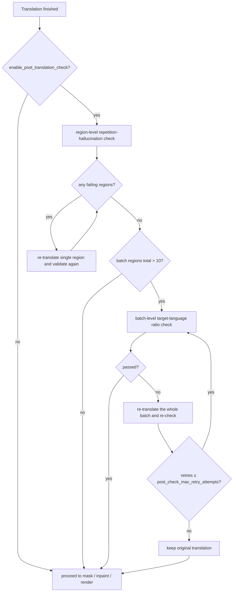

# Retry, Rate Limits, and Translation Quality

Use this page when translation requests occasionally time out or hit rate limits, or when you need to control API cost and how failures affect an entire batch. It covers retry attempts (`cli.attempts`), the per-minute request cap (`translator.max_requests_per_minute`), error ignoring (`cli.ignore_errors`), and post-translation quality checks. It does not cover translator selection (see [Translator selection and languages](./selection-and-languages.md)), prompt and context composition (see [Context and prompts](./context-and-prompts.md)), or API candidate slot management, `failover`/`round_robin` strategy, cooldown, and recovery (see the API-management pages).

## When to use it

- **Owned here**: `cli.attempts` decides the retry budget for request transport and content validation; `translator.max_requests_per_minute` decides the actual request pacing; `cli.ignore_errors` decides how failures are isolated at the file/batch level; `translator.enable_post_translation_check` and the three `post_check_*` thresholds decide post-translation quality checks.
- **Not owned here**: adding/removing candidate slots such as `OPENAI_API_KEY`/`_2`/`_3`, rotation strategy, cooldown, and unavailable states belong to API management; `cli.save_quality` (Image Save Quality) is output-file compression quality, not translation quality.
- High-quality translators (`openai_hq`/`gemini_hq`) and custom prompts affect translation quality but belong to the translator-selection and prompt pages; this guide only notes that they are not part of the retry budget.
- `cli.attempts` and `translator.post_check_max_retry_attempts` are two independent retry budgets: the former covers request sending, the latter covers post-translation checks. They do not replace each other.

## Set it in the desktop app

### Configure retry and error handling in Settings

1. Open “Settings” and select the “General” group.
2. Enter an integer in “Retry Attempts”: `-1` means unlimited retries, `0` means no retry after the first failure, and a positive integer is the number of extra retries.
3. Turning on “Ignore Errors” marks a failed image or batch and continues with the remaining images; turning it off makes any stage exception interrupt the whole task.

### Configure request pacing in Settings

1. In “Settings”, select the “Translation” group.
2. Enter a non-negative integer in “Max Requests Per Minute”: `0` means no limit, and a positive integer is the maximum number of requests per minute.

### Post-translation quality check options

The current desktop settings layout does not include the post-translation check toggle or its threshold rows in the “Translation” group; these parameters are read by the backend configuration and take effect only through CLI/JSON configuration, so they must not be described as visible UI controls.

## Parameters and options

> For how each parameter's UI name, storage key, and default value map to each other, see [UI Options Reference](../../reference/options-i18n-matrix.md).

#### Retry Attempts {#cli-attempts}

“Retry Attempts” is an integer input in the General group that sets how many times a translation request is retried after failure: `-1` means unlimited retries, `0` means no retry after the first failure, and a positive integer is the number of extra retries. See [CLI, Batch, and Output](../settings/cli-batch-and-output.md) for details.

#### Max Requests Per Minute {#max-requests-per-minute}

- Control: integer input.
- Location: Settings → Translation.
- Options: non-negative integer; `0` means no limit.
- Default: `0`.
- Mechanism: a positive value is the maximum number of requests per minute; consecutive requests are spaced at least `60 / rpm` seconds apart, and retries re-enter the pacing check. It is a request-rate cap only and does not handle 429 automatically.

#### Ignore Errors {#cli-ignore-errors}

“Ignore Errors” is a toggle in the General group: when enabled, a failed image or batch is marked and processing continues with the remaining images; when disabled, any stage exception interrupts the whole task. See [CLI, Batch, and Output](../settings/cli-batch-and-output.md) for details.

#### Enable Post-Translation Check {#enable-post-translation-check}

- Control: no UI control (the current desktop settings layout does not bind it; enable it through CLI/JSON configuration).
- Location: backend configuration.
- Options: on or off.
- Default: `false`.
- Mechanism: when enabled, every text region is checked for repeated-content hallucination, and failed regions are re-translated up to “Max Retry Attempts”; when a batch has more than 10 regions, a batch-level target-language ratio check also runs. If it still fails, the original translation is kept.

#### Max Retry Attempts {#post-check-max-retry-attempts}

- Control: no UI control (configured through CLI/JSON).
- Location: backend configuration.
- Options: non-negative integer.
- Default: `3`.
- Mechanism: when a post-translation quality check fails, the region is re-translated and validated again up to this many attempts; if it still fails, the original translation is kept.

#### Repetition Detection Threshold {#post-check-repetition-threshold}

- Control: no UI control (configured through CLI/JSON).
- Location: backend configuration.
- Options: positive integer.
- Default: `20`.
- Mechanism: consecutive character repeats, word/character repeats, and phrase repeats are checked in order; reaching the threshold marks the region as a repetition hallucination and triggers re-translation. A smaller threshold is more sensitive.

#### Target Language Ratio Threshold {#post-check-target-lang-threshold}

- Control: no UI control (configured through CLI/JSON).
- Location: backend configuration.
- Options: a ratio between `0` and `1`.
- Default: `0.5`.
- Mechanism: when a batch has more than 10 regions, the translations of all regions in the batch are merged and language-detected; if the result is not the target language, the whole batch is re-translated up to “Max Retry Attempts”.

## How translation requests are handled

### Retry layers and candidate rotation {#retry-layers}

`cli.attempts` is the number of extra retries, not the total number of requests. The same budget is consumed by two nested layers: the candidate-rotation layer retries retryable errors on the same API candidate until the budget runs out or a permanent error occurs, then switches candidates; the content-validation layer retries count mismatches, failed quality checks, missing BR markers, and unexpected `finish_reason` values. A single translation operation can therefore issue far more than `attempts + 1` HTTP requests.

### RPM request pacing {#rpm-pacing}

When `translator.max_requests_per_minute` is `0` there is no pacing; for a positive value, consecutive requests are at least `60 / rpm` seconds apart. Retries also re-enter the pacing check.

### Failure isolation and candidate states {#failure-isolation}

Failure isolation has two layers. At the file/batch layer, `cli.ignore_errors` decides: when disabled, an exception interrupts the task immediately; when enabled, the current file is marked as failed and processing continues. At the candidate layer, only `unavailable` and a `cooldown` that is still active exclude a candidate from the list, while a plain `failed` state does not exclude it and the candidate can be tried again on the next request.

The candidate state machine follows. The cooldown duration defaults to 60 seconds, uses the `Retry-After` header when present, and is capped at 600 seconds; permanent errors (400-class, 402, 404, quota, invalid key) go straight to `unavailable` and can only be cleared by re-enabling or testing in API Management.

### Post-translation check flow {#post-check-flow}

The post-translation check runs only when `translator.enable_post_translation_check=true`, and the current desktop layout does not expose this toggle. The check has two layers: first, each region is checked for repetition hallucination and failing regions are re-translated individually; then, the whole batch is checked for target-language ratio and re-translated as a batch. Both loops are bounded by `post_check_max_retry_attempts`.

## Models, network, and quality

- `cli.attempts`, `translator.max_requests_per_minute`, `cli.ignore_errors`, and the post-translation check are four independent dimensions: retry budget, request pacing, failure isolation, and quality checking do not replace each other.
- `attempts=-1` combined with content filters or persistent 5xx responses may run for a long time; `max_requests_per_minute` only throttles sending and does not reduce the cost of a single request.
- `ignore_errors` is file/batch-level isolation; a single failing region inside a page still goes through quality retries or keeps its original translation and is not affected by this toggle.
- Candidate rotation only matters when more than one API candidate exists; with a single candidate, `cli.attempts` decides the retry budget on it. Candidate state is kept in the process across tasks and is not written to configuration files.
- `save_quality` (Image Save Quality) and `context_size` (Context Pages) also affect the perceived “quality”, but they are output compression quality and context quality respectively; see [CLI batch and output](../settings/cli-batch-and-output.md) and [Context and prompts](./context-and-prompts.md).
