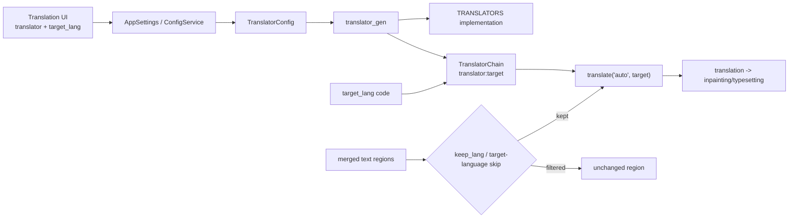
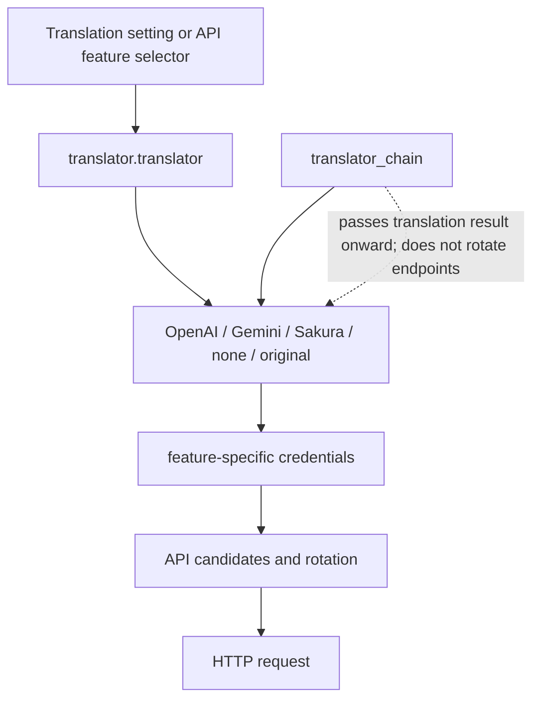

# Translator Selection and Target Languages

This guide documents desktop translator selection, target language, and source-language filtering after text-line merging. It does not document API slot rotation, prompt editing, context construction, or detailed translation-chain behavior.

## When to use it

- `translator.translator` selects OpenAI, Gemini, Sakura, high-quality variants, no translation, or original text. It changes the translation implementation, not endpoint rotation within one provider.
- `translator.target_lang` stores a three-letter code used as the target of an individual translation request.
- `translator.keep_lang` filters regions after text-line merging by detected source language. Non-matching regions remain unchanged and are not inpainted, translated, or rendered.
- `translator.no_text_lang_skip` controls whether text already detected as the target language may be skipped. Enabling “Don't Skip Target Lang” forces it through translation.
- API Key/Base/Model, `failover`/`round_robin`, prompts, glossary, streaming, RPM, and quality retries belong to API-management or other translator pages.

## Set it in the desktop app

### Select values in the Translation settings tab

1. Open Settings and select the “Translation” tab.
2. Choose an implementation in “Translator”. Display text comes from the localized UI mapping, not directly from internal enum names.
3. Choose a language in “Target Language”. Display text comes from the interface language files and is reverse-mapped when saved; for example, “English” is stored as `ENG`.
4. In “Keep Source Language”, choose a source language or “No Filter”. With a language selected, only regions detected as that language continue to translation and later image processing.
5. Enable “Don't Skip Target Lang” to force target-language text through translation. Changes update memory immediately and are persisted by the configuration service.

The translator feature selector in API Management writes the same “Translator” setting and refreshes the required credential groups; it is not a separate translator setting. API slots only change the request endpoint inside the selected provider.

## Parameters

> For how each parameter's UI name, storage key, and default value map to each other, see [UI Options Reference](../../reference/options-i18n-matrix.md).

### Translator

The “Translator” combo box is in Settings → Translation and decides which translation implementation is used:

- OpenAI: uses the OpenAI-compatible API.
- OpenAI High Quality (OpenAI高质量翻译): uses the OpenAI-compatible API with high-quality prompt/structured handling; the default option.
- Google Gemini: uses the Gemini API.
- Gemini High Quality (Gemini高质量翻译): uses the Gemini API with high-quality prompt/structured handling.
- Sakura: uses a Sakura service address/dictionary configuration.
- None (无): performs no translation.
- Original (原文): keeps the original text as the result.

Default: `openai_hq`.

### Target Language

The “Target Language” combo box is in Settings → Translation and chooses the target of a single translation request. It currently offers 25 languages: Simplified Chinese, Traditional Chinese, Czech, Dutch, English, French, German, Hungarian, Italian, Japanese, Korean, Polish, Portuguese (Brazil), Romanian, Russian, Spanish, Turkish, Ukrainian, Vietnamese, Arabic, Serbian, Croatian, Thai, Indonesian, and Filipino (Tagalog). Display text comes from the interface language files and is reverse-mapped to a three-letter code when saved.

Default: `CHS`.

### Keep Source Language

The “Keep Source Language” combo box is in Settings → Translation and filters regions after text-line merging by detected source language: choose “No Filter” to disable filtering; with a language selected, only regions detected as that language continue to translation and later image processing, and non-matching regions remain unchanged without erasure, translation, or rendering. The available languages are Simplified Chinese, Traditional Chinese, English, Japanese, Korean, and so on; the exact set is decided by the backend.

Default: `none` (No Filter).

### Don't Skip Target Lang

The “Don't Skip Target Lang” toggle is in Settings → Translation. When enabled, text already detected as the target language is also forced through translation; this increases requests and API cost.

Default: `false`.

## How translation requests are handled

The saved translator enum and target-language code are resolved into a chain, and implementations run in chain order. `translator_chain` or `selective_translation` is chaining/language-based selection, not API slot rotation. API Management can change the same `translator.translator` key; candidate resolution and cooldown remain API-management concerns.

## Models, network, and quality

- Detection/OCR must produce text regions and source-language information before `keep_lang` can operate; it runs after merging.
- `none` performs no translation while `original` explicitly preserves the original result. Neither requires a remote API; later rendering remains workflow-dependent.
- HQ options depend on the corresponding high-quality prompt resource. `extract_glossary` also depends on HQ prompt configuration.
- Changing target language changes the request and typesetting input, not OCR language, render direction, or provider.
- `keep_lang` filters by source language; `no_text_lang_skip` controls target-language skipping. Source filtering still applies first.

## Translator/API selection boundary

Translator selection changes the implementation; the API feature selector is another UI write point; Key/Base/Model slots and `failover`/`round_robin` rotate only within the selected implementation; `translator_chain` passes output to the next translator.
