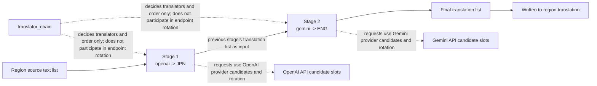
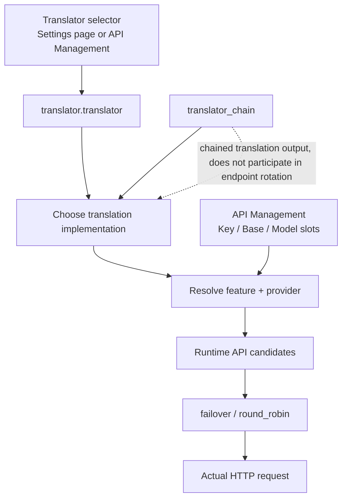

# Translator Chaining

Use `translator_chain` when the same batch of text must first be translated to an intermediate language by one translator and then continued by another translator into the final language. It feeds the output text list of one translator directly into the next one and runs the stages in configuration order. This guide covers the chain-string format, the execution order, the difference from API candidate-slot rotation, and the boundary with context and prompts.

## When to use it

- `translator.translator_chain` is a string field on the core `TranslatorConfig`, defaulting to `null`; it splits translation into multiple `translator:language` stages executed in sequence.
- Chaining decides only “which translators, in what order, and into which language each stage translates”. It does not pick request endpoints and does not handle retries, cooldown, unavailability, or recovery.
- Chaining does not change context or prompt settings: `cli.context_size` history pages, `translator.high_quality_prompt_path`, and `extract_glossary` still work through their own mechanisms.
- It competes with the single `translator` as a source of the translation generator: `translator_gen` builds `selective_translation` first, then `translator_chain`, then the single `translator`.
- `selective_translation` is a sibling field parsed into the same `TranslatorChain` (language-based translator selection); this guide does not expand it. See [Translator engine dispatch](./engine-dispatch.md).
- The Translation group in the desktop Settings page has no `translator_chain` control row; the Web UI hides the field as an advanced key by default.

## Configuration format

### Chain-string format

The value of `translator_chain` is a `;`-separated chain string; each segment is `translator:language-code`, for example `openai:JPN;gemini:ENG`. The chain string is parsed segment by segment:

- The translator name must be a `Translator` enum member (`openai`, `openai_hq`, `gemini`, `gemini_hq`, `sakura`, `none`, `original`) and must exist in the `TRANSLATORS` registry.
- The language code must be a three-letter stored code from `VALID_LANGUAGES` (for example `JPN`, `ENG`, `CHS`, `CHT`, `KOR`) and is case-sensitive.
- The source language of every stage is fixed to `auto`; the target language is that stage's code. `prepare_translation()` validates `supports_languages('auto', target)` for each stage before running.
- An empty string, a missing `:`, an unknown translator name, or an unknown language code raises an error during config parsing; nothing is silently skipped at translation time.

`openai:JPN;gemini:ENG` means: OpenAI first translates the source text into Japanese, then the Japanese output is handed to Gemini, which translates it into English.

### Configuration entry points and UI text

`translator_chain` is not a row in the desktop Settings page. The places that accept it are:

- Config file: JSON key `translator.translator_chain` (for example `config/config.json`). It is a core `TranslatorConfig` field defaulting to `null`; the Qt model and the release template do not include it.
- CLI: local mode reads the config file via `--config <file>`. Current `args.py` has no standalone `--translator-chain` argument (the `--translator ... -l ...` example in the `config.py` exception message is historical and is not a current CLI argument).
- Web/server: the `/config` configuration API can read and write the field, but `translator.translator_chain` is in the server and web-frontend hidden-key sets, so it is not shown to users by default.

## Execution order and data flow

The chain runs every stage in configuration order: each stage parses the configuration and then translates the text list into its stage language. The translated list returned by one stage becomes the input of the next stage, and the final stage's result is written back to the region's translation field.

Notes: the output of `S1` is not a file or an intermediate render; it is an in-memory list of translated strings, passed verbatim as `S2`'s queries. `A1`/`A2` show that every chain stage still resolves its own provider Key/Base/Model candidates and runs `failover`/`round_robin` on its requests; that rotation happens inside each stage's request, and `translator_chain` itself does not take part.

Batch queries are handled by the same chain, and the chain semantics are unchanged.

## Difference from API candidate-slot rotation

- The chain decides “which translators, in what order, and into which language each stage translates”; candidate slots decide “which request endpoint to use inside the chosen provider”.
- Every chain stage is its own translator instance that still resolves its Key/Base/Model candidates (the OpenAI stage resolves the OpenAI group, the Gemini stage resolves the Gemini group) and handles retries, cooldown, and recovery on its requests.
- `translator_chain` has no relationship with numbered slots such as `OPENAI_API_KEY_2`; a failing stage does not switch the chain to another API candidate.
- The Key/Base/Model slots and `failover`/`round_robin` on the API Management page belong to [API slots and rotation](../api-management/slots-and-rotation.md).

## Boundary with context and prompts

- `cli.context_size` (history pages) and the prompt fields are still used by the overall translation stage; the chain itself neither builds history messages nor changes prompt composition.
- The chained branch passes plain text lists and does not build history messages. Multi-page history injection, region-level AI line breaking, and HQ batch data are handled by the single-translator branch and the context mechanism.
- Every chain stage reads the same `TranslatorConfig`, so streaming, RPM, and ordinary retry settings apply per translator instance, but they are not part of the chain semantics on this page.
- The configuration boundary of context and prompts is documented in [Context and prompts](./context-and-prompts.md).

## Limits and notes

- Every provider in the chain must satisfy its own credentials and language support; `prepare_translation()` validates the target language of each stage before running.
- Putting `none` in a chain produces empty strings that continue into the next stage, so it is not a meaningful chain stage; `original` passes text through unchanged.
- If a chain contains an HQ stage (`openai_hq`/`gemini_hq`), its region-level batch behavior differs from the single-translator path.

- Every stage produces one (or several) translation request; a longer chain multiplies API calls and cost and enlarges the failure surface.
