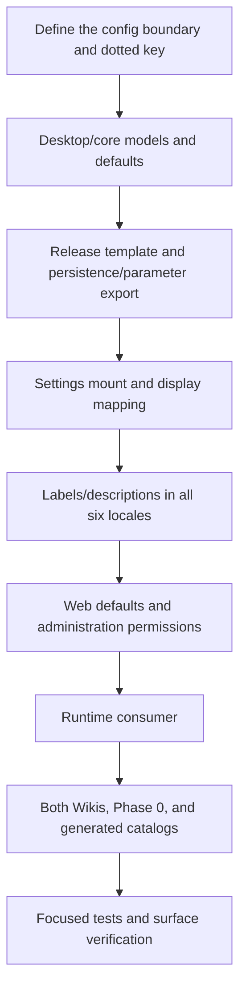

# Adding or Changing a Feature

Use this page when you want to add a new feature to Manga Translator — a new setting, a new translator/OCR/renderer option, a new page, or new UI copy — or modify an existing one. It describes the full path from configuration to UI to runtime consumption. It is not an architecture overview (see [Architecture and code boundaries](./architecture-and-code-boundaries.md)), and it does not expand on test methodology, packaging/release, or HTTP API details (see [Tests and code quality](./tests-and-code-quality.md), [Packaging and release](./packaging-and-release.md), and the pages under `developer/http-api/`).

## Relevant code {#feature-boundary}

- This guide focuses on how a code change takes effect: config model → settings-page mounting → i18n → persistence → backend consumption → tests and manual verification.
- The detailed module boundaries of the desktop UI, business logic, services, and backend pipeline live in [Architecture and code boundaries](./architecture-and-code-boundaries.md); this page lists which files a new feature usually touches at each layer.
- Adding API credentials, slots, or rotation strategies is not described here (see the API-management pages); adding prompt files, batch schemes, or rich-text rules is covered by the corresponding feature pages.
- This page contains no real `.env`, user `config.json`, API key, token, username, private absolute path, or private prompt; example defaults come only from tracked templates and code.

## Development workflow {#development-workflow}

Adding or changing a feature usually follows the path below. Not every step requires a change: a pure copy change touches only i18n, and a pure backend algorithm change may skip the settings page; but every step below must be checked when adding a user-configurable parameter.

1. **Define the boundary**: decide which module the change belongs to — `desktop_qt_ui/` (UI and business logic), `manga_translator/` (pipeline and algorithms), `config/` (release templates), `locales/` (copy).
2. **Change the config model**: add a field to the matching `AppSettings` submodel in `desktop_qt_ui/core/config_models.py` for user-configurable desktop settings, and to the matching `Config` submodel in `manga_translator/config.py` for backend runtime configuration. Field names, types, and defaults should stay in sync.
3. **Update the release template**: write the new field and its default into `config/config-example.json`. The desktop startup priority is user `config/config.json` > `config/config-example.json` > Qt model defaults (see `config_service.py`).
4. **Mount the settings page**: append the config key to the `items` list of the matching tab in `desktop_qt_ui/ui/main_page/settings_tab_layout.json`; tab titles are themselves i18n keys.
5. **Add display mapping**: add a `key -> label_*` mapping to `labels` in `desktop_qt_ui/app_logic.py#get_display_mapping`; for dropdowns, also provide options and display names in `get_options_for_key` / `get_display_mapping`.
6. **Add all six locale entries**: add each `label_*` and `desc_*` key to `zh_CN`, `zh_TW`, `en_US`, `ja_JP`, `ko_KR`, and `es_ES`. A missing non-Chinese locale key falls back to Simplified Chinese, so updating only English and Chinese is incomplete.
7. **Confirm persistence and parameter export**: besides the `config_service.py` deep merge, inspect save-time default payloads, region-parameter dataclasses, import filtering, and backend export fields. Updating only a Pydantic model does not guarantee that the editor pipeline passes the value.
8. **Wire the backend consumer**: after `manga_translator/config.py` reads the field, `manga_translator/manga_translator.py` or the relevant detection/OCR/translation/inpainting/typesetting/upscaling/colorization module must consume it.
9. **Wire Web exposure and administration permissions**: confirm that `manga_translator/server/routes/config.py` supplies defaults/options. When administrators must allow or hide the parameter, add it to `manga_translator/server/static/js/admin/components/permission-editor.js` with `createFormRow(..., section, key)` so the disable toggle, group/user inheritance, and `collectFormData()` share the exact dotted key.
10. **Update both Wiki trees**: update the matching settings page and `reference/settings-index.md` under `doc/wiki/zh/` and `doc/wiki/en/`, including the default, activation conditions, precedence, fallback behavior, and runtime consumption stage.
11. **Update Phase 0 evidence**: add a visible setting to `doc/wiki/phase0-ui-parameter-fields.json`; when the count changes, update the baselines in `verify_phase0_ui_parameter_fields.py` and `doc/wiki/scripts/build-settings-catalog.py`.
12. **Regenerate catalogs**: run the settings and i18n generators for `doc/wiki/data/settings.generated.json` and `i18n.generated.json`; never edit generated JSON by hand.
13. **Test and verify the surface**: add a pytest-style regression under `test/` (first import `_bootstrap`) and run it with `uv run --no-sync pytest`. For Web administration controls, render the component and confirm that both the field and its `data-fullkey="section.key"` disable control exist; syntax validation does not replace surface verification.

## Adding i18n copy {#adding-i18n}

UI copy goes through the JSON language packs under `desktop_qt_ui/locales/`. `I18nManager.translate(key)` first checks the current locale; a missing key in a non-fallback locale uses `zh_CN`, and only a key also missing from `zh_CN` is returned literally. Missing Japanese, Korean, Spanish, or Traditional Chinese copy therefore displays Simplified Chinese in that UI.

Keys come in three common shapes:

- **English sentence as key**: menus, buttons, and hints use the English copy directly as the key, for example `Settings` or `Export Config`; `en_US.json` stores the same value as the key and `zh_CN.json` stores the Chinese.
- **`label_*`**: setting names, bound to config keys via `get_display_mapping('labels')`, for example `label_context_size`.
- **`desc_*`**: description-panel text in the form `desc_{full_key}` (dots become underscores), for example `desc_cli_context_size`; when missing, the panel shows "No description available."

The language packs are `zh_CN`, `zh_TW`, `en_US`, `ja_JP`, `ko_KR`, and `es_ES` (six in total); the one-time script `scripts/add_batch_edit_locale_keys.py` demonstrates the batch pattern "add if missing, never touch existing, `en_US` uses the key itself".

On the wiki side, the i18n evidence catalog `doc/wiki/data/i18n.generated.json` is generated from the two language packs by `doc/wiki/scripts/build-i18n-catalog.mjs` (`--check` detects stale output), and the settings catalog `doc/wiki/data/settings.generated.json` is generated by `doc/wiki/scripts/build-settings-catalog.py` from `app_logic.py#get_display_mapping`, the release template, and the two packs. After editing a language pack, rerun both scripts; never hand-edit the generated JSON.

## Constraints and notes {#dependencies-and-conflicts}

- When adding a user-configurable parameter, the field names/types in `config_models.py` and `manga_translator/config.py` must match, or the value saved by the desktop app may not line up with what the backend reads.
- Setting labels come from `get_display_mapping('labels')`; if the mapping is missing, `dynamic_settings.py` falls back to the raw field name without raising an error.
- A missing `desc_*` key does not raise an error; the description panel shows “No description available.” All six locale files must contain the key, because a missing non-Chinese locale falls back to Simplified Chinese.
- Editing `settings_tab_layout.json` changes the visible parameter set and grouping. The current generated-catalog baseline is 110 visible fields; regenerate and verify the Phase 0 evidence after a change.
- A `permission-editor.js` field must use `createFormRow(..., section, key)` or administrators cannot disable it and group/user inheritance will not collect the dotted key.
- Never hand-edit generated catalogs under `doc/wiki/data/`, and never read or commit real `.env`, user `config.json`, keys, tokens, or private absolute paths.

## Developer Guide {#developer-guide}

### Option matrix {#option-matrix}

The following copy is directly relevant to this workflow (key → actual `en_US` value → actual `zh_CN` value):

| UI call key | English actual value | Simplified Chinese actual value |
| --- | --- | --- |
| `Settings` | Settings | 设置 |
| `Settings Page Title` | Settings | 参数设置 |
| `Settings Page Subtitle` | Adjust translation pipeline parameters. Changes are saved automatically. | 调整翻译流程的各项参数。修改后将自动保存。 |
| `Settings Desc Header` | Parameter Description | 参数说明 |
| `Settings Desc Key` | Parameter Key: {config_key} | 参数键：{config_key} |
| `Settings Desc No Description` | No description available. | 暂无说明。 |
| `Settings Desc Placeholder` | Click any setting on the left to view details | 点击左侧任意设置项查看详细说明 |
| `Export Config` | Export Config | 导出配置 |
| `Import Config` | Import Config | 导入配置 |
| `General` | General | 通用 |
| `OCR` | OCR | 文字识别 |
| `Detection` | Detection | 检测 |
| `Translation` | Translation | 翻译 |
| `Inpainting` | Inpainting | 修复 |
| `Typesetting` | Typesetting | 排版 |
| `Mode Specific` | Mode Specific | 模式相关 |
| `&Language` | &Language | &语言 |
| `Language:` | Language: | 语言： |
| `Apply` | Apply | 应用 |
| `Save` | Save | 保存 |
| `Cancel` | Cancel | 取消 |
| `OK` | OK | 确定 |
| `label_translator` | Translator | 翻译器 |
| `label_context_size` | Context Pages | 上下文页数 |
| `desc_cli_context_size` | Translation context page count for multi-page joint translation. Larger values improve quality but consume more tokens. | 翻译上下文页面数，用于多页联合翻译。值越大翻译质量越好，但 token 消耗越多。 |
| `label_batch_concurrent` | Concurrent Batch Processing | 并发批量处理 |

### Code locations {#source-evidence}
| Layer | File | What was checked |
| --- | --- | --- |
| Config models | `desktop_qt_ui/core/config_models.py`, `manga_translator/config.py` | `AppSettings` / `Config` submodels and defaults |
| Release template | `config/config-example.json` | Release defaults and `get_default_config_path` usage |
| Settings UI | `desktop_qt_ui/ui/main_page/settings_tab_layout.json`, `dynamic_settings.py`, `pages/settings_page.py` | Tab grouping, parameter rows, description panel, language refresh |
| Display mapping | `desktop_qt_ui/app_logic.py` | `get_display_mapping`, `get_options_for_key`, `_t` |
| i18n | `desktop_qt_ui/services/i18n_service.py`, `locales/en_US.json`, `zh_CN.json` | Six-locale loading, missing-key fallback, key/actual-value triples |
| Persistence | `desktop_qt_ui/services/config_service.py` | Priority loading, per-key validation, user-config sync |
| Backend consumption | `manga_translator/manga_translator.py`, `manga_translator/translators/__init__.py` | Parameters entering the pipeline, translator registration |
| Web config and permissions | `manga_translator/server/routes/config.py`, `manga_translator/server/static/js/admin/components/permission-editor.js` | Defaults/options exposure, field control, disable toggle, and inherited dotted key |
| Wiki field evidence | `doc/wiki/phase0-ui-parameter-fields.json`, `verify_phase0_ui_parameter_fields.py` | Visible field, control type, default source, and field-count baseline |
| Test conventions | `test/README.md`, `pyproject.toml` | `import _bootstrap`, pytest `testpaths` / `pythonpath` |
| Wiki tooling | `doc/wiki/scripts/build-i18n-catalog.mjs`, `build-settings-catalog.py` | i18n and settings catalog generation/checks |
