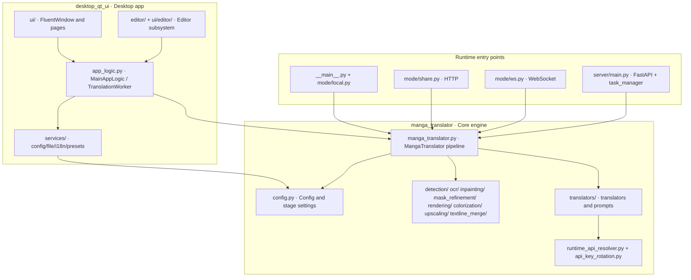

# Architecture and Code Boundaries

Use this page before modifying or debugging a feature to locate which layer it belongs to and which module boundaries it crosses. The repository consists of two packages: `desktop_qt_ui` (PyQt6 desktop app) and `manga_translator` (core engine, CLI, and server). The desktop app and the CLI `local` mode share the same `MangaTranslator` pipeline; the web, shared, and WebSocket modes reuse the same core with different entry points and transports. This guide only maps module boundaries and call relationships; it does not repeat the operations or parameters of individual features (see the corresponding feature pages).

## Relevant code

- `desktop_qt_ui` is responsible for the UI, i18n, file lists, settings persistence, and task orchestration; it does not implement detection, OCR, translation, or rendering algorithms.
- `manga_translator` is responsible for the config model, processing pipeline, per-stage implementations, and API calls; it contains no Qt windows, but `rendering` text layout depends on PyQt6 offscreen rendering.
- Desktop `TranslationWorker`, CLI `local`, shared `shared`, WebSocket `ws`, and the web server all instantiate `manga_translator.manga_translator.MangaTranslator`; they differ only in parameter source, progress reporting, and result transport.
- The web-server mode does not own a translator instance directly: `server/core/task_manager.py` limits concurrency with a semaphore, and `translation_integration` wraps core calls with permission, quota, history, and logging.
- Do not collapse "translator selection", "API feature selector", "API slot rotation", and `translator_chain` into one layer: they belong to the desktop translator pages, the API-management pages, and the core `runtime_api_resolver.py` / `api_key_rotation.py` respectively.

## How to use it

### Observe module entry points in the desktop app

After launching the desktop app, the left navigation registers the seven main pages in `desktop_qt_ui/ui/main_window.py`, plus the editor view. Each main page is an independent constructor under `ui/main_page/pages/`, created by `MainView` and hosted by `FluentWindow`.

### Workflow mode selector

The "Translation Workflow Mode:" combo box on the translation page maps one selection to a single workflow boolean field in the `cli` config (`runtime.py#on_workflow_mode_changed` clears all flags first, then sets one). It is the direct entry point for observing the "UI state -> core parameter" boundary.

The combo box only changes the eight `cli` booleans; the actual behavior differences come from the branches in core `translate_batch()` (see [Workflow and file modes](../cli/workflow-and-file-modes.md)).

## Layers and module boundaries

The solid arrows are direct calls in source: the desktop `TranslationWorker` constructs `MangaTranslator` and calls `translate_batch()`; every stage module exposes `get_*`, `prepare()`, and `dispatch()` (and some `unload()`) consistently. `config.py` is the single core configuration source, and `desktop_qt_ui/core/config_models.py` `AppSettings` is the Qt-side mirror model; their keys are not one-to-one.

## Call relationships

### Standard per-image pipeline

`translate_batch()` advances stages in a fixed order per image; colorization and upscaling run conditionally, and whether the remaining stages run depends on detection/OCR results:

### Three non-desktop entry points

`local`, `shared`, and `ws` share the same `MangaTranslator` as the desktop app: `local` reuses the desktop `FileService` to collect inputs; `shared` exposes an HTTP interface on port 5003; `ws` hands images and config to the core over WebSocket. The `web` server mode calls the core through `task_manager` + `translation_integration` and runs the translator instance in a thread pool so the FastAPI event loop is not blocked.

## Constraints and notes

- The desktop app imports `manga_translator` directly (e.g., `app_logic.py`, `mode/local.py`); changing a core public interface requires checking desktop, CLI, and server callers at the same time.
- `rendering` depends on PyQt6 offscreen rendering, and the server and shared modes use the same rendering implementation; headless environments must provide Qt platform plugins themselves, which is not a module-boundary issue.
- `.env` is loaded by each entry point at startup and `runtime_api_resolver` only reads environment variables; never write real keys into config files or documentation.
- `batch_concurrent` only applies to the "Normal Translation" workflow; import/export, colorize-only, upscale-only, inpaint-only, and replace-translation force the sequential pipeline.
- Server concurrency is limited by the `task_manager` semaphore; desktop concurrency is limited by the `TranslationWorker` QRunnable thread pool. The two do not know about each other.

## Developer Guide {#developer-guide}

### Option matrix {#option-matrix}

#### Observe module entry points in the desktop app

| UI call key | English actual value | Simplified Chinese actual value |
| --- | --- | --- |
| `Translation Interface` | Translation Interface | 翻译界面 |
| `Settings` | Settings | 设置 |
| `API Management` | API Management | API 管理 |
| `Prompt Management` | Prompt Management | 提示词管理 |
| `Replacement Rules` | Replacement Rules | 替换规则 |
| `Rich Text Rules` | Rich Text Rules | 富文本规则 |
| `Batch Management` | Batch Management | 批量管理 |
| `Editor` | Editor | 编辑器 |
| `Editor View` | Editor View | 编辑器视图 |

#### Workflow mode selector

| UI call key | English actual value | Simplified Chinese actual value |
| --- | --- | --- |
| `Translation Workflow Mode:` | Translation Workflow Mode: | 翻译流程模式： |
| `Normal Translation` | Normal Translation | 正常翻译流程 |
| `Export Translation` | Export Translation | 导出翻译 |
| `Export Original Text` | Export Original Text | 导出原文 |
| `Translate JSON Only` | Translate JSON Only | 仅翻译（JSON） |
| `Import Translation and Render` | Import Translation and Render | 导入翻译并渲染 |
| `Colorize Only` | Colorize Only | 仅上色 |
| `Upscale Only` | Upscale Only | 仅超分 |
| `Inpaint Only` | Inpaint Only | 仅修复 |
| `Replace Translation` | Replace Translation | 替换翻译 |
| `Start Translation` | Start Translation | 开始翻译 |

### Related files and formats

| File/directory | Actual role on this page | Note |
| --- | --- | --- |
| `desktop_qt_ui/main.py` | Desktop entry: logging, environment, QApplication | The `sys.frozen` branch changes log and resource directories when packaged |
| `desktop_qt_ui/ui/main_window.py` | Main window, navigation registration, editor assembly | Seven main pages plus one editor view |
| `desktop_qt_ui/app_logic.py` | Controller and `TranslationWorker` | The single orchestration point from desktop to core |
| `desktop_qt_ui/services/` | Service container and dependency injection | `ServiceManager` provides global singleton access |
| `desktop_qt_ui/core/config_models.py` | Qt-side `AppSettings` mirror model | Its keys differ from core `Config` |
| `manga_translator/config.py` | Core `Config` and enums | Shared config source for server, CLI, and desktop |
| `manga_translator/manga_translator.py` | Core pipeline `MangaTranslator` | Final consumer of all entry points |
| `manga_translator/mode/` | local/shared/ws entry points | `subprocess_manager.py` handles CLI memory management |
| `manga_translator/server/` | FastAPI server and core services | Routes, auth, quota, history, cleanup, etc. |
| `desktop_qt_ui/locales/en_US.json` / `zh_CN.json` | UI copy source | Every value in the tables above was checked against the locales |

### Mermaid diagram limits

The diagrams above show layers and call relationships, not "every request passes through every node". Special workflows (export original text, colorize-only, replace translation, etc.) skip most stages; with `batch_concurrent` enabled, detection, OCR, translation, and inpainting advance in parallel, and no real keys are included.

### Code locations {#source-evidence}
| Layer | File | What was checked |
| --- | --- | --- |
| Desktop entry | `desktop_qt_ui/main.py`, `ui/main_window.py` | Navigation registration, editor initialization, and window assembly |
| Desktop controller | `desktop_qt_ui/app_logic.py` | `TranslationWorker` constructs `MangaTranslator`, progress hooks, and `translate_batch` calls |
| Desktop services | `desktop_qt_ui/services/__init__.py`, `core/config_models.py` | Service container and `AppSettings` mirror |
| Core config | `manga_translator/config.py` | `Config` groups, enums, and defaults |
| Core pipeline | `manga_translator/manga_translator.py` | `translate_batch` stage order, special-workflow branches, and concurrent pipeline |
| Stage modules | `manga_translator/detection/__init__.py` and others | `get_*` / `prepare()` / `dispatch()` contracts |
| Translation and API | `manga_translator/translators/__init__.py`, `runtime_api_resolver.py`, `api_key_rotation.py` | Translator dispatch, candidate resolution, and rotation |
| CLI/modes | `manga_translator/__main__.py`, `mode/local.py`, `mode/share.py`, `mode/ws.py` | Four mode entry points and core reuse |
| Server | `manga_translator/server/main.py`, `core/task_manager.py`, `core/translation_integration.py` | FastAPI assembly, concurrency control, and integration calls |
| UI/i18n | `desktop_qt_ui/locales/en_US.json`, `zh_CN.json` | Actual navigation and workflow combo copy |
