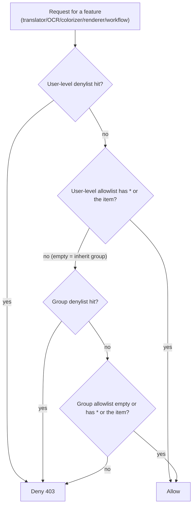
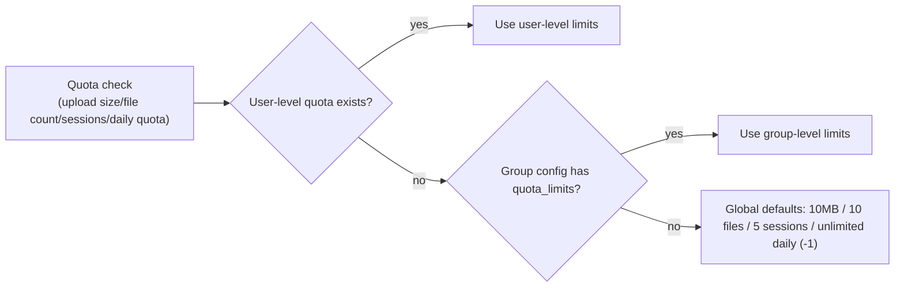

# Admin Endpoints: Users, Groups, Quota, and Audit

Use this page when a third-party admin script or integration needs to create accounts, divide user groups, set quota, or export audit logs. It documents four groups of admin HTTP endpoints: `/api/admin/users`, `/api/admin/groups`, the quota endpoints (`/api/quota/stats` and `/api/admin/quota/*`), and `/audit/*`. For the Web admin UI entry points, see [Administrator interface](../../web/administrator-interface.md); for the UI-side account and permission concepts, see [Accounts, permissions, and API keys](../../web/accounts-permissions-and-api-keys.md). Session establishment, `X-Session-Token` validation, and common status codes are in [HTTP API authentication and errors](./authentication-and-errors.md); server configuration and preset endpoints are in [Configuration, environment, and resources](./config-env-and-resources.md).

## Endpoint scope {#feature-boundary}

- This guide covers the four admin endpoint groups (users, groups, quota, audit) and their backend services: `account_service`, `group_management_service`, `quota_service`, `audit_service`, and `permission_service`.
- Except for `GET /api/quota/stats`, which only requires a session (`require_auth`), every endpoint here requires `require_admin`: a missing or invalid token returns `401`, and a non-admin role returns `403`.
- This page never records real accounts, usernames, passwords, tokens, API keys, or private absolute paths; defaults come from source constants and do not represent the actual running configuration.
- The legacy `/admin/*` management endpoints (settings, tasks, logs, storage, cleanup) and legacy file-management endpoints (`/upload/font`, `/prompts`, `/fonts`) belong to other pages and are not expanded here.

## Admin endpoint overview {#endpoint-overview}

Endpoints without an explicit success status default to `200`; the error envelope and `401`/`403`/`422` shapes are documented in [HTTP API authentication and errors](./authentication-and-errors.md).

## User management endpoints {#user-endpoints}

### Endpoint inventory {#user-endpoint-inventory}

| Method and path | Request | Response | Notes |
| --- | --- | --- | --- |
| `POST /api/admin/users` | `CreateUserRequest` | `UserResponse` (`201`) | Creates the account and writes the `create_user` audit event; duplicate username or weak password returns `400` |
| `GET /api/admin/users` | None | Array of users | Each user includes `quota` (`daily_used`, `daily_limit`, `monthly_used`, `monthly_limit`) |
| `GET /api/admin/users/{username}` | Path parameter | `UserResponse` | Missing user returns `404 USER_NOT_FOUND` |
| `PUT /api/admin/users/{username}` | `UpdateUserRequest` | `UserResponse` | Updates role/group/active/force-password-change; deactivating terminates all of the user's sessions; writes the `update_user` audit event |
| `DELETE /api/admin/users/{username}` | Path parameter | Empty (`204`) | Deleting yourself is rejected (`400 CANNOT_DELETE_SELF`); terminates sessions and deletes; writes the `delete_user` audit event |
| `PUT /api/admin/users/{username}/permissions` | `UpdatePermissionsRequest` | `UserResponse` | No field provided returns `400 NO_UPDATES`; writes the `update_permissions` audit event |

`CreateUserRequest` fields: `username` (1–50 chars), `password` (at least 6 chars), `role` (`admin` or `user`), `group` (default `default`), `permissions` (optional). `UpdateUserRequest` fields: `role`, `group`, `is_active`, `must_change_password`, all optional.

### User permission fields {#user-permission-fields}

The permission fields in the `PUT /api/admin/users/{username}/permissions` body map one-to-one to the `UserPermissions` model:

| Field | Meaning | Notes |
| --- | --- | --- |
| `allowed_translators` / `denied_translators` | Translator allowlist / denylist | `*` means all |
| `allowed_ocr` / `denied_ocr` | OCR allowlist / denylist | An empty array means inherit from the group |
| `allowed_colorizers` / `denied_colorizers` | Colorizer allowlist / denylist | Same as above |
| `allowed_renderers` / `denied_renderers` | Renderer allowlist / denylist | Same as above |
| `allowed_workflows` / `denied_workflows` | Workflow allowlist / denylist | Same as above |
| `allowed_parameters` / `denied_parameters` | Parameter allowlist / denylist | `*` means all |
| `max_concurrent_tasks` | Maximum concurrent tasks | `ge=0` |
| `daily_quota` | Daily translation quota | `ge=-1`; `-1` means unlimited |
| `can_upload_files` / `can_delete_files` | Upload / delete files | Boolean |

### Permission inheritance and checks {#permission-inheritance}

The translation entry validates feature permissions with `permission_service.check_feature_permission()`. An empty user-level allowlist means "inherit from the group"; user-level settings can override the group (denylist wins). The resolution order is:

`allowed_parameters` uses a separate `check_parameter_permission()`: a user-level `*` allows everything, otherwise the allowlist is checked; parameter filtering is also used by `filter_config_for_user()` to hide configuration from the user. A newly created admin gets all allowlists (`*`) with `max_concurrent_tasks=10` and `daily_quota=-1`; a regular user inherits the group by default with `max_concurrent_tasks=2` and `daily_quota=100`.

## Group management endpoints {#group-endpoints}

### Endpoint inventory {#group-endpoint-inventory}

| Method and path | Request | Response | Notes |
| --- | --- | --- | --- |
| `POST /api/admin/groups` | `CreateGroupRequest` | `{success, message, group}` (`201`) | Duplicate group ID returns `400 CREATE_FAILED` |
| `PUT /api/admin/groups/{group_id}/rename` | `RenameGroupRequest` | `{success, old_group_id, new_group_id, new_name}` | System groups cannot be renamed; all user associations are updated automatically; writes the `rename_group` audit event |
| `DELETE /api/admin/groups/{group_id}` | Path parameter | `{success, message, group_id}` | System groups cannot be deleted; members move to `default`; writes the `delete_group` audit event |
| `GET /api/admin/groups` | None | `{success, groups}` | Returns the group list |
| `GET /api/admin/groups/{group_id}` | Path parameter | `{success, group}` | Missing group returns `404 GROUP_NOT_FOUND` |
| `PUT /api/admin/groups/{group_id}/config` | `UpdateGroupConfigRequest` | `{success, message, group_id}` | Updates parameter configuration and feature allow/deny lists; writes the `update_group_config` audit event |

`CreateGroupRequest` fields: `group_id`, `name`, `description`, `parameter_config`, `permissions`, `quota_limits`, `visible_presets`, `default_preset_id`. `UpdateGroupConfigRequest` fields: `parameter_config`, plus translator/OCR/colorizer/renderer/workflow allow and deny lists, `default_preset_id`, and `visible_presets`.

### System groups and member migration {#system-groups-and-migration}

`GroupRepository.SYSTEM_GROUPS = {'admin', 'default', 'guest'}` are the system-defined groups: `admin` (administrator group), `default` (default group for new users), and `guest` (restricted guest group). They can be neither renamed nor deleted. Renaming a group makes `group_management_service.rename_group()` scan `accounts.json` and move every account in the old group to the new group ID; deleting a group moves all members to `default`.

## Quota endpoints {#quota-endpoints}

### Endpoint inventory {#quota-endpoint-inventory}

| Method and path | Request | Response | Notes |
| --- | --- | --- | --- |
| `GET /api/quota/stats` | None | `QuotaStatsResponse` | Quota stats for the current session user; missing stats return `404` |
| `GET /api/admin/quota/stats` | None | `AllQuotaStatsResponse` (`quotas` map + `total_users`) | Stats for all users |
| `POST /api/admin/quota/reset` | `QuotaResetRequest` | `QuotaResetResponse` | An empty `user_id` resets all users; returns the `users_reset` count |
| `POST /api/admin/quota/set-limits` | `SetQuotaLimitsRequest` | `{success, message}` | Sets limits for a single user |
| `GET /api/admin/quota/user/{user_id}` | Path parameter | `QuotaStatsResponse` | Stats for the given user; missing user returns `404` |

`QuotaStatsResponse` fields: `user_id`, `daily_limit`, `used_today`, `remaining`, `active_sessions`, `total_uploaded`. `SetQuotaLimitsRequest` fields: `user_id`, `max_file_size`, `max_files_per_upload`, `max_sessions`, `daily_quota`. Note that in `GET /api/admin/users`, `daily_limit` is reported as `999999` when unlimited, while `QuotaStatsResponse` still uses `-1`; the two conventions differ.

### Quota sources and priority {#quota-resolution}

`QuotaManagementService._get_user_quota_limit()` resolves limits as "user level > group level > global default"; the resolved user-level quota is written back to `quotas.json` for fast reads:

Global default constants: `DEFAULT_MAX_FILE_SIZE = 10MB`, `DEFAULT_MAX_FILES_PER_UPLOAD = 10`, `DEFAULT_MAX_SESSIONS = 5`, `DEFAULT_DAILY_QUOTA = -1` (unlimited). `active_sessions` comes from the in-memory `_active_sessions` dict of `QuotaManagementService` and is not persisted.

### Daily reset {#daily-reset}

`QuotaScheduler` checks the UTC date hourly and, when the day changes, calls `reset_daily_quota(user_id=None)` to reset every user's daily counter; admins can also reset one or all users manually with `POST /api/admin/quota/reset`. The translation entry enforces its own daily quota with `permission_service.check_daily_quota()` using in-memory counters; the two are independent mechanisms (see [Dependencies and conflicts](#dependencies-and-conflicts)).

## Audit endpoints {#audit-endpoints}

### Endpoint inventory {#audit-endpoint-inventory}

| Method and path | Query parameters | Response | Notes |
| --- | --- | --- | --- |
| `GET /audit/events` | `username`, `event_type`, `result` (`success\|failure`), `start_time`, `end_time` (ISO format), `limit` (default 100, max 1000), `offset` | `list[AuditEventResponse]` | Invalid time returns `400 INVALID_TIME_FORMAT`; newest-first with pagination |
| `GET /audit/export` | Same plus `format` (`json` or `csv`, default `json`) | File download (`Content-Disposition: attachment`) | Filename is `audit_log_YYYYMMDD_HHMMSS.{json,csv}`; the operation itself writes the `export_audit_log` audit event |

`AuditEventResponse` fields: `event_id`, `timestamp`, `event_type`, `username`, `ip_address`, `details`, `result`.

### Event types {#audit-event-types}

Event types found by statically scanning all `log_event(...)` calls: `login`, `logout`, `initial_setup`, `register`, `password_change`, `create_user`, `update_user`, `delete_user`, `update_permissions`, `create_task`, `translation_start`, `translation_progress`, `translation_complete`, `translation_error`, `permission_denied`, `export_audit_log`, `system_init`, `session_cleanup`, `log_rotation_check`. The `event_type` filter of `/audit/events` accepts any string; whether it matches depends on the types actually recorded in the log.

### Storage, rotation, and consistency {#audit-storage-rotation}

`AuditService` appends events to `manga_translator/server/data/audit.log` as JSON Lines and rotates the file once it exceeds 10MB, keeping 5 backups. Two writers append to the same file with different schemas: the user/translation routes write the `AuditEvent` structure (with `event_id`/`event_type`/`username`/`result`), while `group_management_service._log_audit()` writes `{timestamp, admin_id, action, details}`. The latter lacks fields such as `event_id`, so `/audit/events` skips those lines while parsing; "a group operation was written to audit.log" therefore does not mean "it can be queried through the audit API".

## Admin UI operations {#admin-ui-operations}

Admins manage accounts and groups at `GET /admin` (`admin-new.html`). The sidebar modules User Management (`users`), Group Management (`groups`), and Quota Management (`quota`) call `GET /api/admin/users`, `GET /api/admin/groups`, `GET /api/admin/groups/{id}`, and `PUT /api/admin/groups/{id}/config`; the user/group edit dialogs reuse the `permission-editor.js` component, whose labels come from the desktop-locale i18n keys. The Quota module's "default quota settings" uses the legacy `GET/PUT /admin/settings` (`default_quota` field), and the user-quota table comes from the `quota` field of `GET /api/admin/users`; it does not call the `/api/admin/quota/*` endpoints. The audit endpoints have no admin-UI tab.

## API constraints {#dependencies-and-conflicts}

- A group's `parameter_config` is both the per-parameter visibility/readonly control (`GroupService`) and the carrier of group-level quota (`daily_image_limit`, `max_concurrent_tasks` under `quota`); the `quota_limits` field is saved by `GroupManagementService` and read by `QuotaManagementService`. The two group-level quota paths coexist, so both must be checked when editing.
- Translation requests enforce daily quota and concurrency through `permission_service` (in-memory counters; group `daily_image_limit` takes priority over the user `daily_quota`); `/api/quota/*`'s `QuotaManagementService` is an independent, file-persisted implementation with user-level priority. They are not synchronized: a reset via `/api/admin/quota/reset` does not directly affect the translation entry's `daily_usage`.
- Deactivating a user terminates all of their sessions; deleting a user also terminates sessions before deletion. Deleting yourself is explicitly rejected (`400 CANNOT_DELETE_SELF`).
- The system groups `admin`, `default`, and `guest` cannot be renamed or deleted; renaming rewrites the `group` field of every member, and deleting moves members to `default`.
- The audit API can only query the `AuditEvent` line schema; the other line schema written by group management is skipped and must not be mistaken for missing audit-API data.
- Admin endpoint responses can contain identifiers such as usernames and group names; real account names, tokens, API keys, and private paths must be removed before sharing logs, exports, or debug directories.

## Developer Guide {#developer-guide}

### Option matrix {#option-matrix}

#### Admin endpoint overview

| Route group (prefix) | Methods and paths | Count | Auth boundary / source |
| --- | --- | ---: | --- |
| Users (`/api/admin/users`) | `POST /`, `GET /`, `GET\|PUT\|DELETE /{username}`, `PUT /{username}/permissions` | 6 | All `require_admin`; create `201`, delete `204`; `routes/users.py` |
| Groups (`/api/admin/groups`) | `POST /`, `GET /`, `GET /{group_id}`, `PUT /{group_id}/rename`, `/{group_id}/config`, `DELETE /{group_id}` | 6 | All `require_admin`; create `201`; `routes/groups.py` |
| Quota (`/api`) | `GET /quota/stats`, `GET /admin/quota/stats`, `POST /admin/quota/reset`, `/admin/quota/set-limits`, `GET /admin/quota/user/{user_id}` | 5 | First one `require_auth`, the rest admin; `routes/quota.py` |
| Audit (`/audit`) | `GET /events`, `GET /export` | 2 | All `require_admin`; `routes/audit.py` |

#### Admin UI i18n copy

| UI call key | English actual value | Simplified Chinese actual value |
| --- | --- | --- |
| `web_user_management` | User Management | 用户管理 |
| `web_group_management` | Group Management | 用户组管理 |
| `web_quota_management` | Quota Management | 配额管理 |
| `web_create_group` | Create Group | 创建用户组 |
| `web_group_name` | Group Name | 用户组名称 |
| `web_group_description` | Group Description | 用户组描述 |
| `web_group_config` | Group Configuration | 用户组配置 |
| `web_default_preset` | Default Configuration | 默认配置 |
| `web_daily_quota` | Daily Quota | 每日配额 |
| `web_daily_limit` | Daily Limit | 每日限制 |
| `web_upload_limit` | Upload Limit | 上传限制 |
| `web_max_file_size` | Max File Size | 单文件最大 |
| `web_max_files` | Max Files | 最多文件数 |
| `web_resource_management` | Resource Management | 资源管理 |
| `web_can_upload_font` | Can Upload Font | 可上传字体 |
| `web_can_upload_prompt` | Can Upload Prompt | 可上传提示词 |
| `web_can_view_history` | Can View History | 可查看历史 |
| `web_can_view_logs` | Can View Logs | 可查看日志 |
| `web_save` | Save | 保存 |
| `web_cancel` | Cancel | 取消 |
| `web_delete` | Delete | 删除 |
| `web_reset` | Reset | 重置 |

`admin-new.html` also contains hardcoded Chinese strings without i18n keys, such as "用户列表" (user list), "添加用户" (add user), "暂无用户" (no users), "活跃" (active), "禁用" (disabled), "编辑" (edit), "删除" (delete), "保存配额设置" (save quota settings), "默认配额设置" (default quota settings), and "用户配额使用情况" (user quota usage). These parts of the admin interface remain Chinese when English is selected. The bilingual values above come from `desktop_qt_ui/locales/en_US.json` and `zh_CN.json`, which the admin UI reuses via `/i18n/{locale}`.

### Related files and formats {#related-files-and-formats}

| File/format | Actual role on this page | Notes |
| --- | --- | --- |
| `manga_translator/server/data/accounts.json` | Account persistence (bcrypt password hashes) | Atomic writes with backups; never read or display real accounts |
| `manga_translator/server/data/group_config.json` | Group persistence (`GroupRepository` / `GroupService`) | System groups `admin`/`default`/`guest` cannot be edited or deleted |
| `manga_translator/server/data/quotas.json` | User-level quota persistence (`QuotaRepository`) | User-level quota takes priority over group and global defaults |
| `manga_translator/server/data/audit.log` | Audit-event JSON Lines log | 10MB rotation, 5 backups; contains two line schemas |
| `manga_translator/server/data/sessions.json` | Session persistence | Sessions are terminated when users are deactivated/deleted; never show real tokens |

### Code locations {#source-evidence}
| Layer | File | What was checked |
| --- | --- | --- |
| Routes | `manga_translator/server/routes/users.py`, `groups.py`, `quota.py`, `audit.py` | Endpoint paths, methods, request/response models, status codes, and audit events |
| Auth | `manga_translator/server/core/middleware.py` | `require_auth` / `require_admin`, `401` / `403` envelopes |
| Services | `manga_translator/server/core/account_service.py`, `group_management_service.py`, `group_service.py`, `quota_service.py`, `permission_service.py`, `audit_service.py` | Create/update/delete, member migration, quota resolution, permission inheritance, audit rotation |
| Models and repositories | `manga_translator/server/models/group_models.py`, `quota_models.py`, `repositories/group_repository.py`, `repositories/quota_repository.py`, `core/models.py` | `UserGroup`, `QuotaLimit`/`QuotaStats`, system groups, `UserPermissions`/`AuditEvent` |
| Scheduling and startup | `manga_translator/server/core/quota_scheduler.py`, `system_init.py` | Daily quota reset, default admin, session cleanup, and log rotation |
| Web UI | `manga_translator/server/static/admin-new.html`, `static/js/admin/modules/{users,groups,quota}.js`, `static/js/admin/components/permission-editor.js`, `desktop_qt_ui/locales/en_US.json`, `zh_CN.json` | Admin-UI entry, called endpoints, and the i18n three-column table |
