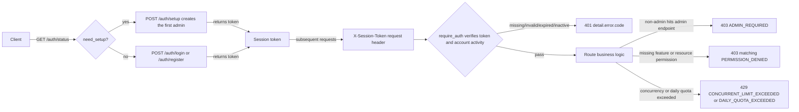
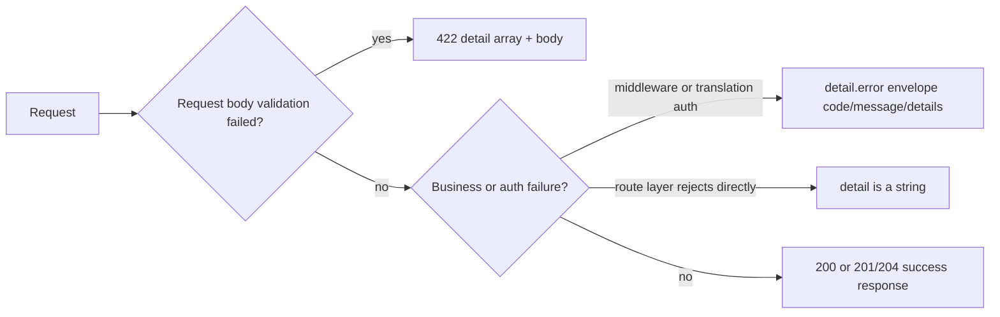

# HTTP API Authentication and Errors

Use this page when a third-party client or the web frontend calls translation, history, resource, quota, or admin HTTP endpoints. It explains how sessions are created, how the token is carried and verified, how permissions are layered, and which status codes and error structures failures return. This guide covers the developer HTTP API authentication and error contract only; the login and session UI is documented in [Login, language, and session](../../web/login-language-and-session.md), workspace and translation operations in [Upload, configure, and translate](../../web/upload-config-and-translate.md), and the request/response models of translation, streaming, batch, and history endpoints in [Translation endpoints](./translation-endpoints.md) and the other `http-api/` pages.

## Endpoint scope {#feature-boundary}

- This guide documents session creation and verification from a developer perspective: the `/auth/*` session endpoints, the `X-Session-Token` request header, FastAPI dependencies such as `require_auth` / `require_admin`, and `verify_translation_auth` at the translation entry.
- The status-code matrix covers the static behavior of every router group; the error-response section distinguishes the middleware envelope, route-layer strings, and the `422` validation shape.
- The session token is an opaque random string persisted in memory plus `sessions.json`; it is not a JWT and carries no decodable user information.
- This page records no real account, token, password, nonce, API key, or private absolute path. Rate-limit counts, timeout minutes, and similar values come from source constants and do not represent a running deployment's actual configuration.

## Session authentication flow {#session-auth-flow}

### Initial setup and login {#setup-and-login}

1. When no account exists, `GET /auth/status` returns `{"need_setup": true, "registration_enabled": ...}`; the client calls `POST /auth/setup` to create the first admin and receives a `token` on success.
2. With existing accounts, `POST /auth/login` submits JSON `{"username": "…", "password": "…"}`; success returns `success`, `token`, `user`, and `must_change_password`. Invalid credentials still return HTTP `200` with `success: false`.
3. When the admin enables registration, `POST /auth/register` creates a normal user and returns a `token`; otherwise it returns `403`.
4. After login/registration, the frontend stores the `token` in browser `localStorage.session_token` and every protected request carries the `X-Session-Token` request header.
5. `POST /auth/logout` terminates the current session; `POST /auth/change-password` requires a token and verifies the old password. `GET /auth/check` returns `{"valid": true, "user": {...}}` or `{"valid": false}`, and the web frontend clears the local token and returns to the login page accordingly.



### Token lifecycle {#token-lifecycle}

- Generation: `SessionService.create_session()` uses `secrets.token_urlsafe(32)` to produce a 32-byte URL-safe random token; the token is opaque and contains no username or role.
- Expiry: `SessionService` defaults to `session_timeout_minutes=60` with sliding expiry based on `last_activity`; every `verify_token` / `update_activity` refreshes it, and 60 minutes without activity invalidates it.
- Persistence: at startup the server creates `SessionService(..., enable_persistence=True)`, atomically writing active sessions to `manga_translator/server/data/sessions.json`; only active, non-expired sessions are loaded after restart.
- Invalidation: `/auth/logout` terminates a session; a disabled account is rejected by `require_auth` with `USER_INACTIVE`; a cleanup service periodically removes expired sessions.

## Authentication dependencies and permissions {#auth-dependencies}

The dependencies below are defined in `manga_translator/server/core/middleware.py` and `manga_translator/server/routes/translation_auth.py`. `require_auth` reads the token from the `X-Session-Token` header and returns a session object; `require_admin` additionally requires `role == 'admin'`.

| Dependency/function | Source | Failure status | Error code |
| --- | --- | --- | --- |
| `require_auth` | `X-Session-Token` request header | `401` | `NO_TOKEN` / `INVALID_TOKEN` / `USER_INACTIVE` |
| `require_admin` | reuses `require_auth` | `403` | `ADMIN_REQUIRED` |
| `check_translator_permission` | session + translator parameter | `403` | `TRANSLATOR_PERMISSION_DENIED` |
| `check_parameter_permission` | session + parameter dictionary | no error | silently filters unauthorized parameters |
| `check_concurrent_limit` | called from business logic | `429` | `CONCURRENT_LIMIT_EXCEEDED` |
| `check_daily_quota` | called from business logic | `429` | `DAILY_QUOTA_EXCEEDED` |
| `verify_translation_auth` | reads the request header directly | `401` / `403` | session codes + `TRANSLATOR/OCR/COLORIZER/RENDERER_PERMISSION_DENIED` |

At the translation entry, `verify_translation_auth` first verifies the token, then applies default values for parameters disabled by the user/group configuration, and finally checks translator, OCR, colorizer, and renderer permissions. Concurrency and daily-quota checks run in the route layer inside `track_task_start` / `track_task_end`, and failures roll back the concurrent counter.

## Public endpoints and exceptions {#public-endpoints}

The following endpoints do not require `X-Session-Token`; business-data requests inside those pages still authenticate separately.

| Endpoint category | Static behavior and boundary |
| --- | --- |
| Pages, static, locale, API info | `GET /`, `GET /admin`, `GET /api`, `GET /favicon.ico`, `/static/*`, and the conditionally mounted `/locales/*` when the desktop locale directory exists |
| Before a session exists | `/auth/login`, `/auth/status`, `/auth/setup`, `/auth/register` (registration still honors the admin switch and rate limits) |
| Legacy password gate | `GET /user/access`, `POST /user/login`; see the subsection below |
| Download tickets | `GET|HEAD /api/history/downloads/t/{ticket}`; see the subsection below |
| Public/compatibility metadata | `/config`, `/config/defaults`, `/config/options`, `/fonts`, `/translators`, `/languages`, `/workflows`, `/translator-config/{translator}`, `/user/access`, `/i18n/*`, `/announcement`; with a token the responses are filtered per user |
| Internal instance registration | `POST /register` is verified with the `X-Nonce` header (see Dependencies and conflicts), not `X-Session-Token` |

### Legacy password gate {#legacy-password-gate}

`GET /user/access` returns `require_password`; `POST /user/login` verifies a single password supplied as the form field `password`. When no password is required it succeeds directly; otherwise it rate-limits per IP (10 attempts in 10 minutes) and returns `429` with `Retry-After` when exceeded. It does not issue an `X-Session-Token`; the frontend records success in `sessionStorage.user_logged_in`. This is not the main login flow of the current startup path.

### Download tickets {#download-tickets}

History downloads first request a short-lived ticket from an authenticated endpoint, then download via `GET|HEAD /api/history/downloads/t/{ticket}`. The default ticket TTL is 5 minutes and the token is generated with `secrets.token_urlsafe(32)`; invalid, expired, or deleted files return `404`. The ticket endpoint does not read the session header, so the ticket itself is sensitive and must not be written into logs or documentation.

## Error response structure {#error-response-structure}

Actual responses have three shapes; a client should read `detail` first and then branch on its type:

1. Middleware and translation auth: they raise `HTTPException(status_code=..., detail={"error": {...}})`, which the FastAPI default handler wraps as-is into the `detail.error` envelope.
2. Route layer: most `400/403/404/409/500` responses use a plain string `detail`.
3. Global validation: `422` returns a `detail` array plus the raw request `body` string.

`core/middleware.py` also defines the `create_error_response(code, message, details, status_code)` helper that can produce the `{"error": {...}}` shape directly; current routes do not call it, so real errors follow the HTTPException shapes above.

```json
{
  "detail": {
    "error": {
      "code": "TRANSLATOR_PERMISSION_DENIED",
      "message": "您没有权限使用翻译器 '<translator>'",
      "details": {
        "translator": "<translator>",
        "allowed_translators": ["*"]
      }
    }
  }
}
```

```json
{
  "detail": [
    { "loc": ["body", "password"], "msg": "String should have at least 6 characters", "type": "string_too_short" }
  ],
  "body": "<raw request body string>"
}
```

```json
{ "detail": "会话不存在" }
```



Error codes are stable program identifiers such as `NO_TOKEN`, `ADMIN_REQUIRED`, or `DAILY_QUOTA_EXCEEDED`; `message` is user-facing and may change between versions. Clients should branch on `code`, not on `message`.

## Rate limits and quotas {#rate-limits-and-quotas}

| Endpoint/check | Window and limit (source constants) | Response |
| --- | --- | --- |
| `POST /auth/login` | IP 15 attempts / 10 minutes; username 8 attempts / 10 minutes | `429` + `Retry-After` |
| `POST /auth/register` | IP 5 attempts / 10 minutes | `429` + `Retry-After` |
| `POST /user/login` (legacy) | IP 10 attempts / 10 minutes | `429` + `Retry-After` |
| Concurrent tasks | effective concurrency limit of user/group | `429` `CONCURRENT_LIMIT_EXCEEDED` |
| Daily quota | effective daily quota of user/group | `429` `DAILY_QUOTA_EXCEEDED` |

`SlidingWindowRateLimiter` implements a sliding window; `Retry-After` is in seconds. When concurrency or quota checks fail, the route layer rolls back the concurrent counter it already incremented. A `429` does not mean invalid credentials, and the client should not clear the session token.

## API constraints {#dependencies-and-conflicts}

- At the translation entry, `verify_translation_auth` runs first (permission filtering and disabled-parameter defaults), then the route layer counts concurrency/quota; `401/403` are returned before counting and `429` is returned during counting.
- Parameter permissions are silently filtered rather than rejected: `check_parameter_permission` keeps only the parameters the user may change, and hiding a control in the frontend cannot replace the server-side check.
- CORS is configured as `allow_origins=["*"]`, `allow_credentials=True`, with all methods and headers; this is source configuration and does not prove the browser will allow every origin/credential combination.
- FastAPI default docs are not disabled: a running instance also serves `/openapi.json`, `/docs`, `/docs/oauth2-redirect`, and `/redoc`.
- The internal `POST /register` (instance registration) uses `X-Nonce` (`secrets.token_hex(16)`, generated at startup) instead of `X-Session-Token`; the two mechanisms must not be mixed, and documentation and logs must never contain a real nonce.
- Download tickets are 5-minute short-lived credentials; they do not require the session header, so their exposure window is bounded but they remain sensitive.

## Developer Guide {#developer-guide}

### Option matrix {#option-matrix}

#### Web session UI strings {#web-ui-strings}

The table below lists login/session/error-related strings actually called by the web main script and verified in both desktop locales. The `login.html` form texts ("用户名", "密码", "登录", "注册", "首次使用，请创建管理员账户", etc.) are hardcoded Chinese without i18n keys and must not be recorded as localized text.

| UI call key | English actual value | Simplified Chinese actual value |
| --- | --- | --- |
| `Manga Translator` | Manga Translator | 漫画翻译器 |
| `admin` | missing, caller fallback | missing, caller fallback |
| `web_session_token` | Session Token | 会话令牌 |
| `web_active_sessions` | Active Sessions | 活跃会话 |
| `web_permission_denied` | Permission Denied | 权限不足 |
| `web_quota_exceeded` | Quota Exceeded | 配额已用完 |
| `web_error` | Error | 错误 |
| `web_daily_quota` | Daily Quota | 每日配额 |
| `web_used_today` | Used today | 今日已使用 |
| `API Keys (.env)` | API Keys (.env) | API密钥 (.env) |
| `Start Translation` | Start Translation | 开始翻译 |

`t(key, defaultText)` in `static/script.js` returns the default value or the key itself when the locale is not loaded or the key is missing, so parts of the UI still show hardcoded Chinese under the English locale.

#### Status code matrix {#status-code-matrix}

The table below covers the statically verified triggers of every status code; except for explicit overrides, the default success status is `200`.

| Status | Static trigger scope | Source |
| --- | --- | --- |
| `200` | Ordinary successful JSON/HTML/stream/file/delete responses; `/auth/login`, `/auth/register`, `/auth/logout`, and `/auth/change-password` also return `200` with `success: false` on business failures such as wrong password or wrong old password | FastAPI default; `routes/auth.py` |
| `201` | Successful creation via `POST /sessions/`, `POST /api/admin/users/`, `POST /api/admin/groups/` | `sessions.py:61`, `users.py:79`, `groups.py:87` |
| `204` | Successful `DELETE /api/admin/users/{username}` | `users.py:378` |
| `400` | Request fields, initial setup/registration validation, no batch images, invalid import, or resource/admin inputs; some history/ticket requests too | `auth.py:362`, `translation.py:449`, `history.py:582`, `config_management.py:227` |
| `401` | Missing session header, invalid/expired token, activity refresh failure, disabled account, or invalid internal `/register` nonce | `core/middleware.py:119`, `translation_auth.py:253`, `main.py:317` |
| `403` | Non-admin, missing feature/resource/history permission, or registration disabled by the admin | `core/middleware.py:198`, `:246`, `translation_auth.py:345`, `auth.py:460` |
| `404` | favicon/file/user/group/session/history/download-ticket/preset object not found | `main.py:288`, `history.py:136`, `users.py:236`, `config_management.py:182` |
| `409` | Creating an admin preset whose name already exists | `config_management.py:227` |
| `422` | Global `RequestValidationError` handler returns `detail` plus a request body string | `main.py:255`–`:273` |
| `429` | Login or registration rate limit (with `Retry-After`), legacy password-gate rate limit, concurrent-task limit, or daily quota exceeded | `auth.py:52`, `web.py:89`, `core/middleware.py:326`, `:365` |
| `499` | Batch translation task force-cancelled or detected as cancelled | `translation.py:421`, `:518` |
| `500` | Uninitialized services, translation/import/export, persistence, resource, and admin service failures, handled or unhandled | `auth.py:135`, `translation.py:527`, `resources.py:111`, `logs.py:249` |

### Related files and formats {#related-files-and-formats}

| File/path | Actual role on this page | Manual-edit and compatibility note |
| --- | --- | --- |
| `manga_translator/server/data/sessions.json` | Active-session persistence (atomic writes) | Never read or display a real token; format is `version` plus a `sessions` list |
| `manga_translator/server/data/accounts.json` | Accounts, roles, permissions, and password verification | Never display real accounts or passwords |
| `manga_translator/server/data/audit.log` | Login/logout/password/registration/task audit | Must be sanitized before sharing |
| `manga_translator/server/data/server_config.json` | Admin settings: registration switch, `user_access`, API key policy | Never display real configuration content |
| `.env` | Server API key loading | `/env` and `/env/effective` never return plaintext server keys |
| `manga_translator/server/static/login.html` | Session entry page | Form texts are hardcoded Chinese without i18n keys |

### Mermaid data-flow limits {#mermaid-limits}

The diagrams describe session establishment, token verification, and error-classification paths; they do not claim every run makes a network request, nor that `/auth/check`, rate limits, or quotas trigger in every deployment. Deployment-specific behavior may vary.

### Code locations {#source-evidence}
| Layer | File | What was checked |
| --- | --- | --- |
| Service initialization | `manga_translator/server/main.py` | `SessionService` 60 minutes, persistence, CORS, `422` handler, router registration, internal `/register` nonce |
| Middleware | `manga_translator/server/core/middleware.py` | `require_auth`/`require_admin`, feature permissions, concurrency/quota, error envelope, `create_error_response` |
| Session services | `manga_translator/server/core/session_service.py`, `session_security_service.py` | `token_urlsafe(32)`, sliding expiry, persistence, session ownership and access audit |
| Auth routes | `manga_translator/server/routes/auth.py` | login/setup/register/logout/change-password/check/status and rate limits |
| Translation auth | `manga_translator/server/routes/translation_auth.py` | `verify_translation_auth`, disabled-parameter defaults, feature permissions, task counting |
| Route status codes | `manga_translator/server/routes/translation.py`, `history.py`, `web.py`, `users.py`, `groups.py`, `config_management.py`, `sessions.py` | 200/201/204/400/404/409/429/499/500, download tickets |
| UI/i18n | `manga_translator/server/static/script.js`, `login.html`, `static/js/i18n.js`, `desktop_qt_ui/locales/en_US.json`, `zh_CN.json` | key mapping, hardcoded texts, `localStorage.session_token` |
