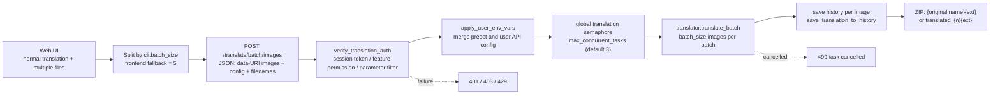
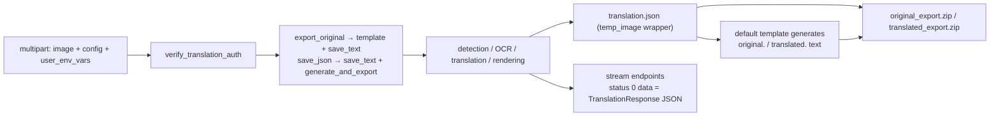
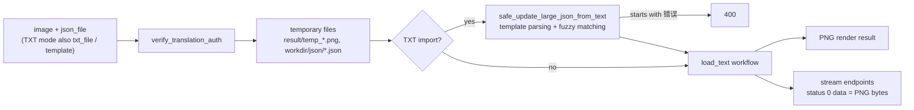

# Batch, Export, and Import Processing

Use the endpoints on this page when a script or third-party client needs to translate several images in one request, pack detection and translation results into editable JSON/text, or re-render edited translations back onto images. This is a developer HTTP API contract page: it documents the methods, request bodies, responses, authentication, status codes, and runtime flow of the batch, export, and import endpoints under `/translate`. For the complete Web UI user workflow see [Web upload, config, and translate](../../web/upload-config-and-translate.md); single-image endpoints and the custom binary streaming protocol are covered in [Translation endpoints](./translation-endpoints.md) and [Streaming protocol](./streaming-protocol.md); history and download tickets are covered in [History, files, and download tickets](./history-files-and-download-tickets.md).

## Endpoint scope {#feature-boundary}

- Batch endpoints handle “many images in one request”: `POST /translate/batch/json` returns `list[TranslationResponse]` and `POST /translate/batch/images` returns a ZIP of images; `POST /translate/queue-size` reports the distributed-executor queue length.
- Export endpoints pack processing results for reuse: `POST /translate/export/original` and `POST /translate/export/translated` return a ZIP (`translation.json` plus template text), while the matching `/stream` variants return the same JSON over the custom binary stream.
- Import endpoints write translation text back onto images and render them: `POST /translate/import/json` and `POST /translate/import/txt` return a PNG, and the matching `/stream` variants stream PNG bytes.
- Every endpoint above requires `X-Session-Token` and goes through `verify_translation_auth` for session, feature permission, parameter filtering, concurrency, and daily-quota checks; see [Request and response contract](#request-response-contract).
- The “Translation Workflow Mode:” dropdown in the Web UI is only an entry point; the actual requests land on the endpoints above. File selection, the result list, and batch download in the UI are Web user features and are not repeated here.
- The “Export Config” / “Import Config” buttons read and write `config.json` in the browser locally; they are not the same feature as the server-side translation export/import endpoints. See [Web UI workflow entry](#web-ui-workflow-entry).
- Single-image endpoints (`/translate/json`, `/translate/with-form/*`, etc.) and the multipart response of `POST /translate/complete` belong to [Translation endpoints](./translation-endpoints.md) and are not expanded here.

## Web UI workflow entry {#web-ui-workflow-entry}

In the Web workspace, the “Translation Workflow Mode:” dropdown lists seven workflows. The frontend picks an endpoint by mode: normal translation with more than one file is split into batches by `cli.batch_size` and sent to the batch-images endpoint; Export Translation and Export Original Text call the export endpoints; Import Translation and Render calls the JSON import endpoint (the Web UI supports JSON only, not TXT).

“Export Config” serializes the current UI configuration to `config.json` and triggers a browser download; “Import Config” reads a local JSON file and rebuilds the settings panel with `generateConfigUI()`. Both stay in the browser: no server round trip and no key upload.

## Batch endpoints {#batch-endpoints}

### Batch JSON and batch images {#batch-json-and-images}

Both batch endpoints accept a `BatchTranslateRequest` JSON body and differ only in the response: `/batch/json` returns `list[TranslationResponse]`, `/batch/images` returns a ZIP of translated images.

| Method | Path | Request body | Response | Source |
| --- | --- | --- | --- | --- |
| `POST` | `/translate/batch/json` | `BatchTranslateRequest` JSON | `200` `list[TranslationResponse]` | `routes/translation.py:353` |
| `POST` | `/translate/batch/images` | `BatchTranslateRequest` JSON | `200` ZIP (`application/octet-stream` + `X-Content-Type: application/zip`) | `routes/translation.py:436` |
| `POST` | `/translate/queue-size` | none | `200` integer | `routes/translation.py:642` |

`BatchTranslateRequest` fields (`server/request_extraction.py:106`):

| Field | Type | Default | Description |
| --- | --- | --- | --- |
| `images` | `list[bytes\|str]` | required | Image bytes or a prefixed base64 data URI such as `data:image/png;base64,...` |
| `config` | `dict` / `Config` | `{}` | Full configuration; a `dict` is converted through `parse_config` first |
| `batch_size` | `int` | `4` | How many images the translator processes per inner batch (a separate layer from the frontend HTTP chunking) |
| `filenames` | `list[str]` | `[]` | Optional original filenames used for output naming and history |

ZIP entries in `/batch/images` are named from `filenames` (`{basename}{extension}`; the extension comes from `config.cli.format` via `resolve_output_image_format`). Without filenames the entry is `translated_{i+1}{ext}`. The response intentionally omits `Content-Disposition: attachment` and uses `application/octet-stream` plus a custom `X-Content-Type: application/zip` header; the source comment explains this avoids interception by download managers such as IDM. An empty image list returns `400` (detail “没有提供图片”, “no images provided”).

### Batch processing flow {#batch-flow}

Note: `batch_size` controls how many images the translator processes at once, while frontend chunking controls how many images one HTTP request carries; the two numbers may differ. Enabling batching does not mean all images hit the API concurrently; requests still respect the global semaphore and per-user concurrency limits.

### Queue size and cancellation {#queue-size-and-cancellation}

`POST /translate/queue-size` returns `len(task_queue.queue)`, where `task_queue` is the `TaskQueue` used by the distributed executor (`--start-instance` mode) in `server/myqueue.py:99`. In single-process mode this queue is normally empty; it is a different mechanism from the semaphore wait queue, and the Web UI does not call it for progress display.

Both batch endpoints call `generate_task_id()` and register an active task (`register_active_task`) so the admin panel can see it, and `get_batch_ctx` polls `is_task_cancelled(task_id)` at checkpoints. An admin cancels via `POST /admin/tasks/{task_id}/cancel`: a normal cancel sets the `cancel_requested` flag and waits for a cooperative response, while `force=true` calls `asyncio.Task.cancel()` directly. On `CancelledError` or a detected cancel flag, the batch endpoints return `499` (detail “任务已被取消” / “任务已被强制取消”, task cancelled / force-cancelled).

`/batch/images` also checks offline-translation permission (`check_offline_translation_permission`): when granted, the original request is replaced with a wrapper whose `is_disconnected()` always returns `False`, so the task keeps running and writes history even after the client disconnects.

## Export endpoints {#export-endpoints}

### Export original and export translated {#export-zip}

Both export endpoints take multipart/form-data fields `image` (file), `config` (JSON string, default `{}`), and `user_env_vars` (JSON string, default `{}`). The server runs `verify_translation_auth` and `apply_user_env_vars` first, then drives the matching workflow through `get_ctx`:

| Method | Path | Workflow | ZIP contents | Download filename |
| --- | --- | --- | --- | --- |
| `POST` | `/translate/export/original` | `export_original` (`template` + `save_text`) | `translation.json` + `original.{format}` | `original_export.zip` |
| `POST` | `/translate/export/translated` | `save_json` (`save_text` + `generate_and_export`) | `translation.json` + `translated.{format}` | `translated_export.zip` |
| `POST` | `/translate/export/original/stream` | `export_original` | binary stream; status 0 data is JSON | — |
| `POST` | `/translate/export/translated/stream` | `save_json` | binary stream; status 0 data is JSON | — |

`translation.json` uses the same structure as the main program: `{"temp_image": <TranslationResponse.model_dump()>}`, containing `regions`, `original_width`, `original_height`, upscale/colorizer info, and `mask_raw` (base64 PNG; the optimized mask is stored and marked `mask_is_refined: true`). The text file is generated by the desktop-layer `workflow_service` from the default template: `generate_original_text` for the original and `generate_translated_text` for the translation; the extension comes from the template via `get_translation_output_format`. The ZIP is returned as `application/zip` with `Content-Disposition: attachment`. A missing template or generation failure returns `500`.

### Streaming export {#export-stream}

`/export/original/stream` and `/export/translated/stream` reuse `while_streaming(req, transform_to_json, ...)`, sending progress and result frames in the custom binary protocol (1-byte status + 4-byte length + data): status `1` is a progress JSON with `stage`/`message`, status `0` is the final `TranslationResponse` JSON, and status `2` is an error JSON. Streaming export does not return a ZIP; clients must parse it per the [streaming protocol](./streaming-protocol.md). Unlike the ZIP endpoints, the streaming paths save history internally through `save_translation_to_history`.

### Export data flow {#export-flow}

Note: ZIP and streaming export share the same translation pipeline and differ only in response wrapping; `export_original` requires the default template to exist, otherwise it returns `500`.

## Import endpoints {#import-endpoints}

### JSON import {#import-json}

`POST /translate/import/json` accepts multipart fields `image`, `json_file`, `config`, and `user_env_vars`. The server writes the JSON into the work directory as `json/temp_{random}_translations.json`, saves the image as `result/temp_{random}.png`, then renders through `get_ctx` with the `load_text` workflow. On success it returns `image/png`; on failure it returns `500`. Temporary files are cleaned up on both success and error paths (except the streaming variants, below).

### TXT import {#import-txt}

`POST /translate/import/txt` adds `txt_file` (required) and `template` (optional, a template file) to the JSON-import fields. After writing the TXT and JSON to temporary files, the server calls the desktop-layer `workflow_service.safe_update_large_json_from_text(temp_txt_path, json_path, template_path)`, which supports template parsing and fuzzy matching and writes the TXT translations back into the JSON; a result starting with “错误” (error) is rejected with `400`. It then renders through `load_text` and returns a PNG. The Web UI does not call this endpoint (the UI supports JSON import only); it is mainly for scripts and desktop workflows.

### Streaming import {#import-stream}

`/import/json/stream` and `/import/txt/stream` use `while_streaming(req, transform_to_image, ..., "load_text")`; status 0 data is the final PNG bytes, with progress frames such as `queued` / `slot_acquired` sent first. The source comment is explicit: temporary files cannot be deleted in a `finally` block while the streaming response is active, so `result/` and work-directory temporary files accumulate and need periodic cleanup.

### Import data flow {#import-flow}

Note: JSON import and TXT import both end up in `load_text`; TXT only adds a “write text back into JSON” merge step, and a failed merge never reaches rendering.

## Request and response contract {#request-response-contract}

- Auth header: `X-Session-Token`. `verify_translation_auth` returns `401` (`NO_TOKEN`) when the token is missing and `401` (`INVALID_TOKEN`) when it is invalid or expired. After the session validates, `filter_disabled_parameters` replaces disabled parameters with admin defaults, then translator/OCR/colorizer/renderer permissions are checked; unauthorized features return `403`.
- Environment variables: the `user_env_vars` form field and preset resolution are merged in `apply_user_env_vars` (priority: user-provided > user preset > group default preset). The merged result is stored in `config._user_env_vars` and passed to `runtime_api.apply_runtime_api_overrides`. No real key is shown in this documentation or in examples.
- Concurrency and quota: `track_task_start` increments the concurrent-task counter and checks the per-user concurrency limit and daily quota; exceeding either returns `429`. `track_task_end` rolls the counter back in `finally`.
- Input validation: images must be bytes or prefixed base64 data URIs, otherwise `422`; an empty list on `/batch/images` returns `400`.
- Batch cancellation returns `499`; internal export/import/render failures return `500`.

## Request handling {#runtime-behavior}

- Batching layers: `cli.batch_size` (release default `3`, see `config/config-example.json`) controls how many images the translator processes per inner batch; `BatchTranslateRequest.batch_size` defaults to `4`; the Web frontend falls back to `5` when splitting HTTP batches. These are defaults of different layers and must not be merged.
- Concurrency: both `get_batch_ctx` and `while_streaming` acquire the global `translation_semaphore` (`server_config.max_concurrent_tasks`, default `3`) before entering the translator thread pool; per-user concurrency and daily quota are maintained by `track_task_start` / `track_task_end` at the route layer.
- History writes: the batch endpoints call `save_translation_to_history` per image (history session shaped like `{task_id}_{i}`); streaming export/import save internally through `while_streaming`. A history-save failure is only logged as WARNING and does not interrupt the response.
- Temporary files: ZIP and non-streaming export/import clean up temporary JSON/TXT/images on both success and error paths; streaming import keeps them for the duration of the response (the source comment requires periodic cleanup).
- Response transport: ZIP export and image import return complete bytes; `/stream` variants return custom binary frames. The full frame protocol is described in [Streaming protocol](./streaming-protocol.md).

## API constraints {#dependencies-and-conflicts}

- Batch, export, and import all depend on the session and permission system: they are unreachable without login, feature permission, or with an exceeded quota, even when the Web UI hides the entry.
- Export original/translated depends on the default template existing (`ensure_default_template_exists`); a missing template returns `500`.
- Import requires the `json_file` to correspond one-to-one with the image; TXT import additionally depends on the template-parsing logic in `desktop_qt_ui/services/workflow_service.py`, which makes that endpoint a server-side reuse of desktop-layer code.
- `batch_size`, `batch_concurrent`, and frontend chunking are three layers: `batch_size` is the translator batch, `batch_concurrent` controls image-orchestration concurrency (desktop settings), and frontend chunking controls HTTP request size. The Web frontend does not use `batch_concurrent` for chunking; it only splits by `batch_size`.
- The batch ZIP uses `application/octet-stream` instead of `application/zip`, so clients should read the `X-Content-Type` header to detect a ZIP rather than relying on the standard MIME type.
- Never write real keys, user images, or private prompts into logs, request examples, or debug artifacts.

## Developer Guide {#developer-guide}

### Option matrix {#option-matrix}

#### Workflow option copy

| UI call key | English actual value | Simplified Chinese actual value |
| --- | --- | --- |
| `Translation Workflow Mode:` | Translation Workflow Mode: | 翻译流程模式： |
| `Normal Translation` | Normal Translation | 正常翻译流程 |
| `Export Translation` | Export Translation | 导出翻译 |
| `Export Original Text` | Export Original Text | 导出原文 |
| `Import Translation and Render` | Import Translation and Render | 导入翻译并渲染 |
| `Colorize Only` | Colorize Only | 仅上色 |
| `Upscale Only` | Upscale Only | 仅超分 |
| `Inpaint Only` | Inpaint Only | 仅修复 |
| `Start Translation` | Start Translation | 开始翻译 |
| `Add Files` | Add Files | 添加文件 |
| `Clear List` | Clear List | 清空列表 |
| `Export Config` | Export Config | 导出配置 |
| `Import Config` | Import Config | 导入配置 |
| `label_batch_size` | Batch Size | 批量大小 |

#### Import-mode hint copy

In import mode the frontend pairs an image with a same-base-name `.json` file. When it is missing or has the wrong type, the following hints appear in the log output (these are log messages, not control labels):

| UI call key | English actual value | Simplified Chinese actual value |
| --- | --- | --- |
| `import_mode_no_json` | Import mode: JSON file not found | 导入翻译模式：未找到JSON文件 |
| `import_mode_hint` | Hint: Please upload both image and corresponding JSON file (e.g., image.png and image.json) | 提示：请同时上传图片和对应的JSON文件（例如：image.png 和 image.json） |
| `import_mode_json_only` | Import mode: Only JSON files are supported, TXT files are not supported | 导入翻译模式：只支持JSON文件，不支持TXT文件 |
| `import_mode_json_hint` | Hint: Please use 'Export Original' or 'Export Translation' to generate JSON files | 提示：请使用「导出原文」或「导出翻译」功能生成JSON文件 |

#### Status codes

| Status | Trigger |
| --- | --- |
| `200` | JSON array, ZIP, PNG, stream, queue size |
| `400` | empty batch images; TXT import merge returns the “错误” prefix |
| `401` | missing or invalid/expired `X-Session-Token` |
| `403` | no translator, OCR, colorizer, or renderer permission |
| `422` | image is not bytes/base64 data URI; JSON validation failed |
| `429` | per-user concurrency limit or daily quota exceeded |
| `499` | batch task cancelled or cancel detected |
| `500` | service not initialized, template missing, export/import/render failure |

### Related files and formats {#related-files-and-formats}

| File/format | Actual role on this page | Notes |
| --- | --- | --- |
| `translation.json` (inside ZIP) | `{"temp_image": <TranslationResponse>}` | Matches the main program JSON format; `mask_raw` is base64 PNG |
| `original.{ext}` / `translated.{ext}` | template text inside export ZIPs | Extension decided by template `get_translation_output_format` |
| `result/temp_*.png` | temporary image for import/export | Accumulates during streaming import; needs periodic cleanup |
| `{workdir}/json/temp_*_translations.json` | temporary translation JSON written by import | Work directory decided by `get_work_dir` |
| `desktop_qt_ui/services/workflow_service.py` | TXT import and ZIP text generation | `safe_update_large_json_from_text`, `generate_original_text`, `generate_translated_text` |
| `config/config-example.json` | release default `batch_size: 3` | sanitized defaults only |

### Code locations {#source-evidence}
| Layer | File | What was checked |
| --- | --- | --- |
| Routes | `manga_translator/server/routes/translation.py` | batch, export, import, and queue endpoints and response wrapping (`353`–`1333`) |
| Request extraction | `manga_translator/server/request_extraction.py` | `BatchTranslateRequest`, `get_batch_ctx`, `while_streaming`, `prepare_translator_params`, `pack_message`, `save_translation_to_history` |
| Auth | `manga_translator/server/routes/translation_auth.py` | `verify_translation_auth`, `filter_disabled_parameters`, `track_task_start/end` |
| Environment vars | `manga_translator/server/core/response_utils.py`, `server/runtime_api.py` | `apply_user_env_vars`, `apply_runtime_api_overrides` |
| Concurrency and tasks | `manga_translator/server/core/task_manager.py`, `server/myqueue.py` | semaphore, thread pool, active tasks, cancel check, `task_queue` |
| Serialization | `manga_translator/server/to_json.py`, `core/response_utils.py` | `TranslationResponse`, `to_translation`, `transform_to_json`, `transform_to_image` |
| Web frontend | `manga_translator/server/static/script.js`, `index.html` | workflow dropdown, batch chunking, `/batch/images` calls, JSON pairing for import, export/import config |
| i18n | `desktop_qt_ui/locales/en_US.json`, `zh_CN.json` (via `doc/wiki/data/i18n.generated.json`) | actual display values of workflow options and import hints |