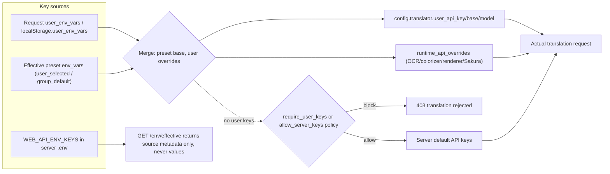

# HTTP Config, Environment, and Resource Endpoints

Use this page when a third-party client or the web frontend needs to read parameter structure and options, save API keys, upload fonts and prompts, or apply admin presets. It documents the paths, auth boundaries, request/response contracts, and underlying behavior of these HTTP endpoints. This guide covers the developer HTTP API only; the web user-side configuration tabs and uploads are documented in [Upload, configure, and translate](../../web/upload-config-and-translate.md) and [Resources, fonts, and prompts](../../web/resources-fonts-and-prompts.md), the admin interface in [Administrator interface](../../web/administrator-interface.md), and the session/status-code contract in [HTTP API authentication and errors](./authentication-and-errors.md).

## Endpoint scope {#feature-boundary}

- This guide covers four endpoint groups: config metadata (`/config*`, `/fonts`, `/translators`, `/languages`, `/workflows`, `/translator-config/{translator}`, `/user/settings`, `/user/access`, `/api-key-policy`, `/i18n/*`, `/announcement`, `/api`), environment variables (`GET|POST /env`, `GET /env/effective`), user resources (`/api/resources/*`), and config management (`/api/admin/config/*`, `/api/admin/presets*`, `/api/presets*`, `/api/config/user*`).
- It does not cover translation, streaming, batch, history, log, user/group/quota, or audit endpoints; see [Translation endpoints](./translation-endpoints.md), [Streaming protocol](./streaming-protocol.md), [History files and download tickets](./history-files-and-download-tickets.md), and [Admin, users, groups, quota, and audit](./admin-users-groups-quota-audit.md).
- `GET /env` and `GET /env/effective` never return server API key plaintext; even admins only see plaintext via `GET /api/admin/config/server?show_values=true`, which requires an admin session.
- This page records no real API key, token, username, private absolute path, user prompt body, or font file. Defaults and whitelists come from source constants and do not represent a running deployment's actual configuration.

## Config metadata endpoints {#config-metadata-endpoints}

### Config structure {#config-structure}

| Endpoint | Auth boundary | Static behavior |
| --- | --- | --- |
| `GET /config/defaults` | no token dependency | Returns the server default config template: filters `SERVER_HIDDEN_CONFIG_KEYS`, removes the Qt-UI-only `app` section, and appends `quota` and `permissions` defaults |
| `GET /config` | `mode=user` without token; `mode=authenticated` needs `X-Session-Token`; `mode=admin` returns full config after hidden-key filtering | Returns user-visible config per mode; the authenticated mode also applies user/group parameter permissions and appends `user_permissions` |
| `GET /config/options` | optional `X-Session-Token` | Returns parameter dropdown options; with a token it appends the user's uploaded fonts and prompts and filters translator/OCR/colorizer/renderer options by permission |

- `GET /config` in `mode=user` (legacy) filters by the `admin_settings` `visible_sections`, `hidden_keys`, and `default_values`; `mode=authenticated` verifies the token, filters by user permissions and group hidden parameters/defaults, and adds `user_permissions`; a missing or invalid token returns `{"error": {"code": "NO_TOKEN" | "INVALID_TOKEN", ...}}`.
- `GET /config/defaults` appends the `quota` defaults `daily_image_limit: 100`, `daily_char_limit: 100000`, `max_concurrent_tasks: 3`, `max_batch_size: 20`, `max_image_size_mb: 10`, `max_images_per_batch: 50`; in `permissions`, all defaults are `true` except `can_view_logs`, `show_env_editor`, `require_user_keys`, and `save_user_keys_to_server`, which are `false`.

### Options and metadata {#options-and-metadata}

| Endpoint | Auth boundary | Response content |
| --- | --- | --- |
| `GET /fonts` | none | `.ttf`/`.otf`/`.ttc` filenames from the shared fonts directory (server fonts) |
| `GET /translators` | `mode` parameter | Translator list (hidden entries excluded); the authenticated mode filters by user permission |
| `GET /languages` | `mode` parameter | `VALID_LANGUAGES`; the authenticated mode currently returns all (language-level permission is reserved) |
| `GET /workflows` | `mode` parameter | The seven workflows; the authenticated mode filters by user and group allow/deny lists |
| `GET /translator-config/{translator}` | none | If `config/translators.json` exists, returns only the public fields `name`, `display_name`, `required_env_vars`, `optional_env_vars` |

- `GET /config/options` returns keys including `renderer`, `alignment`, `direction`, `upscaler`, `detector`, `colorizer`, `inpainter`, `inpainting_precision`, `ocr`, `secondary_ocr`, `translator`, `target_lang`, `keep_lang`, `upscale_ratio`, `realcugan_model`, `font_family`, `high_quality_prompt_path`, `layout_mode`, `ocr_vl_language_hint`, `format`, and `image_extensions`. `font_family` merges server fonts and the current session user's fonts; `high_quality_prompt_path` merges prompt files under `dict/` with user-uploaded prompts.

### User settings and access {#user-settings-and-access}

| Endpoint | Auth boundary | Response content |
| --- | --- | --- |
| `GET /user/settings` | optional `X-Session-Token` | `show_env_editor`, `can_upload_fonts`, `can_upload_prompts`, `allow_server_keys`, `max_image_size_mb`, `max_images_per_batch`; logged-in users also get group quota and permission overrides |
| `GET /user/access` | none | `{"require_password": bool}`, the legacy single-password gate |
| `GET /api-key-policy` | optional `X-Session-Token` | The effective API key policy (global plus group overrides) with `merge_order` and `fallback_rule` |

- The web frontend uses `/user/settings` to decide whether to show the "API Keys" tab and the font/prompt upload sections; hiding them is a frontend behavior only, and the server enforces the final permission.

### i18n, announcement, and server info {#i18n-and-announcement}

| Endpoint | Auth boundary | Response content |
| --- | --- | --- |
| `GET /i18n/languages` | none | A `{locale_code: locale_code}` map from the desktop locales directory |
| `GET /i18n/{locale}` | none | The desktop translation JSON for the locale; realpath checks prevent path traversal, and a missing locale returns `{}` |
| `GET /announcement` | none | The admin announcement; disabled returns `{"enabled": false}`, enabled includes `message` and `type` |
| `GET /api` | none | Server info: `message`, `version: "2.0"`, `endpoints` |

## Environment variable endpoints {#env-endpoints}

### Reading {#env-read}

- `GET /env` (`require_auth`): returns `{}` whether or not `show_env_editor` is true; it never exposes server API key plaintext.
- `GET /env/effective` (`require_auth`): returns API key source metadata, not values. The response contains `policy`, `selected_preset_id`, `selected_preset_name`, `selected_preset_source`, `effective_keys`, and `sources`; `server_env_vars`, `preset_env_vars`, and `merged_env_vars` are always empty objects. `sources` marks each key with `server` or `preset`, and preset overrides server.
- When `show_env_editor` is false, `GET /env/effective` still returns the same shape with an empty `sources`.

### Saving {#env-save}

- `POST /env` (`require_auth`): the body is a key-value object such as `{"OPENAI_API_KEY": "...", ...}`. The server keeps only keys in the `WEB_API_ENV_KEYS` whitelist (translation, OCR, colorizer, and renderer groups for OpenAI/Gemini/Sakura); when `show_env_editor` is false it returns `403`.
- When `save_user_keys_to_server` is `false` (default), nothing is written to the server and the response is `{"success": true, "saved_to_server": false}`; the frontend stores the keys in browser `localStorage.user_env_vars` and sends them with translation requests, so they are valid for the current use only.
- When `save_user_keys_to_server` is `true`, `EnvService.update_env_var` writes each key to the application `.env`, then `load_app_dotenv(..., override=True)` reloads it; failure returns `500`.
- Empty values (`null` is normalized to `""`) clear saved keys; keys outside the whitelist are dropped.

## User resource endpoints {#user-resource-endpoints}

### Prompts {#prompt-resources}

| Endpoint | Auth boundary | Behavior |
| --- | --- | --- |
| `POST /api/resources/prompts` | `require_auth` + upload-prompt permission | multipart upload; supports `.txt`/`.json`; insufficient permission `403`, bad format `400` |
| `GET /api/resources/prompts` | `require_auth` | The current user's prompt list and `count` |
| `DELETE /api/resources/prompts/{resource_id}` | `require_auth` + delete permission | Deletes one prompt |
| `DELETE /api/resources/prompts/by-name/{filename}` | `require_auth` + delete permission | Deletes by filename |

### Fonts {#font-resources}

| Endpoint | Auth boundary | Behavior |
| --- | --- | --- |
| `POST /api/resources/fonts` | `require_auth` + upload-font permission | multipart upload; supports `.ttf`/`.otf`/`.ttc` and tries to extract the font family |
| `GET /api/resources/fonts` | `require_auth` | The current user's font list |
| `DELETE /api/resources/fonts/{resource_id}` | `require_auth` + delete permission | Deletes one font |
| `DELETE /api/resources/fonts/by-name/{filename}` | `require_auth` + delete permission | Deletes by filename |

### Statistics {#resource-stats}

- `GET /api/resources/stats` (`require_auth`): returns `stats`, the current user's resource statistics.
- Files are stored under `manga_translator/server/data/user_resources/prompts/{username}/{filename}` and `.../fonts/{username}/{filename}`; filenames are sanitized (to prevent path traversal) and duplicates get a numeric suffix.

## Config management endpoints {#config-management-endpoints}

### Server .env and backups {#server-env-and-backups}

| Endpoint | Auth boundary | Behavior |
| --- | --- | --- |
| `GET /api/admin/config/server?show_values=false` | `require_admin` | Server `.env` config; sensitive values are masked by default (length ≤4 becomes all `*`, otherwise the first and last 2 characters are kept); `show_values=true` returns plaintext |
| `PUT /api/admin/config/server` | `require_admin` | Body `{"config": {"KEY": "value"}}` updates `.env`; `create_backup=true` (default) backs up first |
| `GET /api/admin/config/backups` | `require_admin` | Lists `.env.backup.*` backups (`path`, `filename`, `created_at`, `size`) |
| `POST /api/admin/config/restore` | `require_admin` | Body `{"backup_path": "..."}` restores from a backup; the path must live in the backups directory and start with `.env.backup.`, otherwise it fails |

- Every update backs up first and keeps the latest 10 backups; a restore also backs up the current state first.
- Sensitive values in presets and user configs (keys containing `API_KEY`, `SECRET`, `PASSWORD`, or `TOKEN`) are encrypted with Fernet (key derived from machine info) and persisted in `env_presets.json` and `user_configs.json`.

### Presets {#presets}

| Endpoint | Auth boundary | Behavior |
| --- | --- | --- |
| `POST /api/admin/presets` | `require_admin` | Creates a preset; a duplicate name returns `409`; sensitive config values are encrypted |
| `GET /api/presets` | `require_auth` | Presets visible to the current user's group (without config details) |
| `GET /api/admin/presets?include_config=false` | `require_admin` | All presets |
| `GET /api/admin/presets/{preset_id}` | `require_admin` | One preset; `decrypt=true` decrypts it |
| `PUT /api/admin/presets/{preset_id}` | `require_admin` | Updates a preset |
| `DELETE /api/admin/presets/{preset_id}` | `require_admin` | Deletes a preset |
| `POST /api/presets/{preset_id}/apply` | `require_auth` | Applies a preset to the current user: writes `selected_preset_id` and `config_mode='server'`; returns non-uppercase config keys for the UI to apply |
| `DELETE /api/config/user/preset` | `require_auth` | Clears the current user's selected preset |

- Preset visibility is controlled by `visible_to_groups`; an empty list means visible to all groups.

### User config {#user-config}

- `GET /api/config/user` (`require_auth`): returns the current user's config with API keys masked; when absent it returns the default structure (`api_keys: {}`, `selected_preset_id: null`, `custom_settings: {}`, `config_mode: "server"`).
- `PUT /api/config/user` (`require_auth`): body is any combination of `api_keys`, `selected_preset_id`, `custom_settings`, and `config_mode`; sensitive `api_keys` are encrypted before storage.
- `config_mode` is `server` or `custom`; applying a preset only writes `selected_preset_id` and `config_mode`, and never copies preset key plaintext into the user config.

## API key policy and merging {#api-key-policy-and-merge}

The policy keys come from `admin_settings.api_key_policy` (including `show_env_to_users`) with group `parameter_config.permissions` overrides: `require_user_keys`, `allow_server_keys`, `save_user_keys_to_server`, and `show_env_editor`. All defaults are `false` except `allow_server_keys`, which is `true`. `/api-key-policy` returns a fixed `merge_order` of `["user_input", "selected_preset", "server_default"]` and `fallback_rule` of `feature_specific_then_provider_default`.

At translation-request construction, `apply_user_env_vars` merges in this order:

1. Parse `user_env_vars` from the request (keep only non-empty, uppercase keys).
2. Read the effective preset's `env_vars`: the source is `user_selected` (explicitly selected by the user) or `group_default` (the group's default preset).
3. Merge with the preset as the base and the user's direct values on top; `_apply_env_vars_to_config` maps `OPENAI_*`/`GEMINI_*` to `config.translator.user_api_key` / `user_api_base` / `user_api_model`, and `apply_runtime_api_overrides` handles OCR, colorizer, renderer, and the Sakura base.
4. When neither the user nor a preset provides keys: `require_user_keys` true returns `403`; `allow_server_keys` false returns `403`; otherwise fall back to the server default API keys.

The diagram describes the API key source and merge path; whether `POST /env` persists is decided by `save_user_keys_to_server` and does not change the merge order itself.

## API constraints {#dependencies-and-conflicts}

- The web frontend first uses `/user/settings` to decide whether to show the "API Keys" tab and upload sections, but hiding is frontend-only; the server enforces the final permission.
- `font_family` and `high_quality_prompt_path` in `/config/options` merge server and user resources; after deleting a user font or prompt, the frontend must re-request `/config/options` to refresh the options.
- Environment variables do not persist by default (`save_user_keys_to_server=false`); multi-user deployments should keep server-side saving off so users do not overwrite each other's server keys.
- `GET /env` and `GET /env/effective` do not return server key plaintext; `GET /api/admin/config/server?show_values=true` does and must be limited to trusted admin sessions.
- Sensitive keys in presets and user configs are encrypted; applying a preset never copies key plaintext into the user config.
- Endpoint boundaries: translation/streaming/batch in [Translation endpoints](./translation-endpoints.md) and [Streaming protocol](./streaming-protocol.md), history and downloads in [History files and download tickets](./history-files-and-download-tickets.md), users/groups/quota/audit in [Admin, users, groups, quota, and audit](./admin-users-groups-quota-audit.md), and sessions/status codes in [Authentication and errors](./authentication-and-errors.md).
- `429` concurrency and daily-quota limits are handled by the translation route layer (see [Authentication and errors](./authentication-and-errors.md)) and do not belong to the endpoints on this page.

## Developer Guide {#developer-guide}

### Option matrix {#option-matrix}

#### UI copy {#ui-copy}

The following is the UI copy the web frontend uses when calling the endpoints on this page. `index.html` contains some hardcoded Chinese static text (e.g. “导出配置”, “导入配置”, “API密钥”, “上传字体文件”, “上传提示词文件”, “字体管理”, “提示词管理”, “日志输出”), and `script.js` overrides part of it with locale keys after startup.

| UI call key | English actual value | Simplified Chinese actual value |
| --- | --- | --- |
| `API Keys (.env)` | API Keys (.env) | API密钥 (.env) |
| `Basic Settings` | Basic Settings | 基础设置 |
| `Advanced Settings` | Advanced Settings | 高级设置 |
| `Options` | Options | 选项 |
| `Export Config` / `Import Config` | Export Config / Import Config | 导出配置 / 导入配置 |
| `env_hint` | API key input fields will appear below based on the selected translator | 根据选择的翻译器，下方会显示所需的 API 密钥输入框 |
| `error_loading_translator_config` | Failed to load translator configuration | 加载翻译器配置失败 |
| `label_OPENAI_API_KEY` | OpenAI API Key | OpenAI API 密钥 |
| `label_OPENAI_API_BASE` | OpenAI API Base | OpenAI API 地址 |
| `label_OPENAI_MODEL` | OpenAI Model | OpenAI 模型 |
| `label_GEMINI_API_KEY` | Gemini API Key | Gemini API 密钥 |
| `label_SAKURA_API_BASE` | SAKURA API Base | SAKURA API 地址 |
| `label_OCR_OPENAI_MODEL` | OCR OpenAI Model | 文字识别 OpenAI 模型 |
| `label_COLOR_GEMINI_MODEL` | Colorization Gemini Model | 上色 Gemini 模型 |
| `label_RENDER_OPENAI_MODEL` | Rendering OpenAI Model | 渲染 OpenAI 模型 |
| `font_uploaded` | Font uploaded successfully | 字体上传成功 |
| `prompt_uploaded` | Prompt uploaded successfully | 提示词上传成功 |
| `web_server_config` | Server Configuration | 服务器配置 |
| `web_use_server_config` | Use Server Config | 使用服务器配置 |
| `web_user_config` | User Configuration | 用户配置 |
| `web_visible_to` | Visible To | 可见范围 |
| `web_presets` | Presets | 配置预设 |

The following keys are missing from both `en_US.json` and `zh_CN.json`, so `script.js` falls back to the call-site text: `preset_select`, `preset_hint`, `preset_empty`, `preset_none`, `preset_applying`, `preset_applied`, `preset_apply_failed`, `login_required_for_api_keys`, `api_keys_saved_to_server`, `api_keys_saved_session`, `api_keys_save_failed`, `font_deleted`, `prompt_deleted`. The English UI shows the call-site Chinese fallback when these keys are missing.

### Related files and formats {#related-files-and-formats}

| File/path | Actual role on this page | Manual-edit and compatibility note |
| --- | --- | --- |
| `manga_translator/server/data/user_resources/prompts/`, `fonts/` | Storage and index for user prompts and fonts | Filenames sanitized, duplicates deduplicated; never display real user files |
| `manga_translator/server/data/env_presets.json` | Preset persistence with encrypted sensitive values | Never display real preset content |
| `manga_translator/server/data/user_configs.json` | User-config persistence with encrypted API keys | Never display real keys |
| `manga_translator/server/data/backups/` | `.env.backup.*` backups (10 kept) | The restore endpoint validates path boundaries |
| `manga_translator/server/data/admin_config.json` | Admin settings: `api_key_policy`, `show_env_to_users`, `upload_limits`, `announcement` | Never display real configuration |
| Application `.env` | Server API key persistence | `POST /env` (persist mode) and admin updates write it; `GET /env` never echoes plaintext |
| `config/config.json` (copied from `config-example.json` when absent) | Default source for `/config/defaults` and `/config` | Record sanitized examples only |
| `config/translators.json` (if present) | Public metadata for `/translator-config/{translator}` | The endpoint returns `{}` when the repo does not track the file |
| `desktop_qt_ui/locales/*.json` | `/i18n/{locale}` and the conditionally mounted `/locales/*` | realpath prevents path traversal; a missing locale returns `{}` |
| `manga_translator/server/static/index.html`, `script.js`, `js/shared/api-key-schema.js` | Frontend driving the config/env/resource endpoints | Some static text is hardcoded Chinese |

### Mermaid data-flow limits {#mermaid-limits}

The diagram above describes the API key sources, merging, and runtime overrides; it does not mean every translation run goes through a preset or user keys, nor that `/env/effective` returns the same source combination on every run. Policy values such as `require_user_keys`, `allow_server_keys`, and `save_user_keys_to_server` come from configuration, not code constants. This page did not start a server, take screenshots, or read a real `.env`, preset, user config, or key; runtime behavior must be validated with a minimal runnable server.

### Code locations {#source-evidence}
| Layer | File | What was checked |
| --- | --- | --- |
| Config routes | `manga_translator/server/routes/config.py` | `/config/defaults`, `/config`, `/config/options`, `/fonts`, `/translators`, `/languages`, `/workflows`, `/translator-config/{translator}`, `/user/settings`, `/user/access`, `/api-key-policy`, `/env`, `/env/effective`, `/i18n/*`, `/announcement` and the `WEB_API_ENV_KEYS` whitelist |
| Env service | `manga_translator/server/core/env_service.py`, `manga_translator/utils/dotenv_utils.py` | `.env` loading, masking, writing, hot reload, and key normalization |
| Config management service | `manga_translator/server/core/config_management_service.py` | Server-config backup/restore, preset CRUD and encryption, user-config saving |
| Config management routes | `manga_translator/server/routes/config_management.py` | `/api/admin/config/*`, `/api/presets*`, `/api/admin/presets*`, `/api/config/user*` |
| Resource service and routes | `manga_translator/server/core/resource_service.py`, `routes/resources.py`, `server_paths.py` | Prompt/font upload, list, delete, stats, and storage layout |
| Config management core | `manga_translator/server/core/config_manager.py`, `api_key_policy.py`, `response_utils.py`, `runtime_api.py` | Default config, admin settings, policy merge, `apply_user_env_vars`, and runtime overrides |
| Server assembly | `manga_translator/server/main.py` | Route registration, static mounts, `init_server_config_file` |
| UI/i18n | `manga_translator/server/static/script.js`, `index.html`, `js/shared/api-key-schema.js`, `desktop_qt_ui/locales/en_US.json`, `zh_CN.json` | Key mapping, hardcoded copy, fallback for missing keys |
