# History, Files, and Download Tickets

Use this page when you integrate server-side translation history, read history files, or hand translation results to users for download. It documents the HTTP API contract and storage behavior. History is written automatically by the translation pipeline and isolated per user; files never expose disk paths but are addressed by session token plus filename; downloads go through short-lived tickets whose URLs are valid for 5 minutes by default.

This guide covers the developer HTTP API and storage mechanics only. The corresponding web user operations are in [Progress, results, and history](../../web/progress-results-and-history.md), session authentication and common errors in [Authentication and errors](./authentication-and-errors.md), streaming translation endpoints in [Streaming protocol](./streaming-protocol.md), and batch export/import flows in [Batch export and import process](./batch-export-import-process.md).

## Endpoint scope {#feature-boundary}

- History is written only on translation paths that call `save_translation_to_history()`: the web frontend writes for single-file and batch “normal translation”, while the non-streaming export-original/export-translation/import-and-render/colorize-only/upscale-only/inpaint-only paths do not write.
- On the write path, `session_token` is the task ID (single file: `task_id`; batch: `{task_id}_{i}`). `HistoryManagementService.generate_session_token()` (UUID v4) exists but is not used on the write path.
- History is isolated per user: a regular user can only reach their own sessions, while an administrator can reach all of them; insufficient view/delete permission makes the endpoint return 403.
- File access must satisfy both the session-ownership check and filename sanitization plus the `resolve_path_within` root constraint, preventing path traversal.
- A download ticket is a capability: `GET /api/history/downloads/t/{ticket}` does not require a session header, so anyone holding the URL can download within the validity window. Tickets are therefore short-lived and the response sets `Cache-Control: private, no-store`.
- This guide does not cover web user operations, log endpoints, or the translation endpoints themselves; those belong to the web pages, the logs page, and [Streaming protocol](./streaming-protocol.md).

## History storage and write {#history-storage-and-write}

### Directory and index layout {#storage-layout}

On startup (`main.py`) the server initializes `HistoryManagementService(result_directory="manga_translator/server/data/results", translation_repo=TranslationRepository("manga_translator/server/data/translation_history.json"))`:

| Path | Content | Notes |
| --- | --- | --- |
| `manga_translator/server/data/results/{session_token}/` | Session result directory | Holds result images (names depend on the output format) and `metadata.json` |
| `…/results/{session_token}/metadata.json` | Session metadata | `user_id`, `session_token`, `timestamp`, `file_count`, `files` (basename list) |
| `manga_translator/server/data/history/_index.json` | `session_token → user_id` index | Fast shard lookup; on a miss it scans all shards and back-fills the index |
| `manga_translator/server/data/history/{user_id}.json` | Per-user shard | `{sessions: [...], last_updated}`; writes use a temp file plus atomic `os.replace` |
| `manga_translator/server/data/translation_history.json` | Legacy single-file format | Auto-migrated at repository init; the old file is renamed to `.json.migrated` |

`TranslationResult` serialized fields: `id`, `user_id`, `session_token`, `timestamp`, `file_count`, `total_size`, `result_path`, `metadata`, `status` (default `completed`).

### Write flow {#write-flow}

`request_extraction.py#save_translation_to_history()` saves `ctx.result` into a temporary directory using the output format (filename derived from the original filename plus the output format, or `translated_{timestamp}{ext}`), then calls `history_service.save_translation_result()`:

```mermaid
flowchart LR
    A["Translation pipeline done<br/>ctx.result available"] --> B["save_translation_to_history()"]
    B --> C["Save result image to tempdir<br/>format derived from cli.format"]
    C --> D["save_translation_result(user_id, task_id, files, metadata)"]
    D --> E["Validate token (no path separators or NUL)"]
    E --> F["Copy files into results/{session_token}/"]
    F --> G["Write metadata.json"]
    G --> H["Create TranslationResult (status=completed)"]
    H --> I["Shard JSON and _index.json"]
    I --> J["Frontend GET /api/history can list it"]
```



- Only paths inside `tempfile.gettempdir()` are accepted (`resolve_path_within`); only the basename is kept when copying into the session directory.
- `metadata` is provided by the caller and merged with `user_id`, `session_token`, `timestamp`, `file_count`, `files`; the web write path also adds `workflow` and `task_id`, and `text_regions` when text regions exist.
- A failed save only logs a warning and does not interrupt the translation flow (best effort).

## History query and delete {#history-query-and-delete}

All history endpoints require login (header `X-Session-Token`); when `view_permission` is `none` they return 403. The level comes from `get_view_history_permission()`, which reads the permission model’s `view_permission` field: default `own`, options `own` / `none` / `all`.

### Query endpoints {#query-endpoints}

| Method | Path | Parameters | Response |
| --- | --- | --- | --- |
| `GET` | `/api/history` | `start_date`, `end_date`, `status` (optional) | `{success, history: [...], count}`, newest first |
| `GET` | `/api/history/{session_token}` | path parameter | `{success, session: {...result, files: [basenames...]}}` |
| `GET` | `/api/history/admin/all` | `user_id`, `start_date`, `end_date`, `status`, `limit` (default 20), `offset` (default 0) | `{success, records: [...], total, history: [...], count}`; requires `require_admin` |

- A regular user’s query is automatically scoped to `user_id = session.username`; an administrator passes `user_id=None` and sees every session.
- In `get_session_details`, `files` is the sorted list of basenames in the session directory excluding `metadata.json`.
- `/admin/all`’s `records` is the frontend-mapped shape: `id` (taken from `session_token`), `username`, `filename` (first file in metadata), `translator`, `status`, `created_at`, `file_count`, `total_size`; the legacy `history` field is kept for compatibility.

### Search endpoint {#search-endpoint}

`GET /api/history/search?q=...` (also accepts `start_date`, `end_date`, `status`) fuzzy-matches case-insensitively against session tokens, filenames, and user IDs, returning `{success, query, results, count, stats}`.

Static inspection found that `GET /{session_token}` is registered before `GET /search`, and FastAPI matches paths in registration order, so `GET /api/history/search` is captured by `/{session_token}` first (with `session_token="search"`). A minimal FastAPI reproduction confirmed that registration order decides the match; in the real service, with a valid session, the request goes through session lookup and usually returns 404 “session does not exist”, so the search logic is effectively unreachable. The current static frontend does not call this endpoint. The behavior should be checked against the deployed version.

### Delete endpoint {#delete-endpoint}

`DELETE /api/history/{session_token}`: an administrator can always delete; a regular user needs `check_delete_own_files_permission()` to be true, otherwise 403. On success the session directory is removed with `shutil.rmtree` and the shard record plus index entry are removed from the repository, returning `{success: true, message}`; a missing session returns 404.

## File access {#file-access}

`GET /api/history/{session_token}/file/{filename}` returns a single history file (`FileResponse`); `media_type` is derived with `mimetypes.guess_type` and falls back to `application/octet-stream`. Constraints:

1. View permission is checked first, then `_get_history_user_id()` decides the visible scope (administrators see everything).
2. `_sanitize_history_filename()` rejects empty values, names containing `/` or `\`, and `.` or `..` (400).
3. `_resolve_history_file_path()` constrains `result_path` inside `result_directory` and the filename inside the session directory (`resolve_path_within`); a missing/out-of-root directory returns 404, an illegal filename returns 400, and a missing file returns 404.

## Download tickets {#download-tickets}

### Ticket lifecycle {#ticket-lifecycle}

`DownloadTicketService` keeps tickets in an in-memory dictionary with a default TTL of 5 minutes (`DEFAULT_TTL = timedelta(minutes=5)`); tokens are generated with `secrets.token_urlsafe(32)`:

```mermaid
sequenceDiagram
    participant C as Client
    participant R as /api/history routes
    participant T as DownloadTicketService
    C->>R: POST .../download-ticket (X-Session-Token)
    R->>R: Check view permission; build ZIP (tempdir)
    R->>T: issue_ticket(path, allowed_root, filename, media_type, delete_on_cleanup)
    T-->>R: Ticket expires_at = now + 5 minutes
    R-->>C: {url, filename, expires_in, expires_at}
    C->>R: GET /api/history/downloads/t/{ticket}
    R->>T: get_ticket(token)
    T-->>R: Valid ticket → FileResponse (private, no-store)
    Note over T: Expired tickets are cleaned on each get/issue;<br/>delete_on_cleanup=true removes the temp ZIP
```

- `issue_ticket()` first runs `resolve_path_within(allowed_root, path)` and raises `FileNotFoundError` (converted to 404 by the routes) when the file does not exist or is not a file.
- `get_ticket()` purges expired tickets and checks that the underlying file still exists; if the file is gone it removes the ticket and returns None (routes convert to 404).
- Expiry cleanup and `revoke_ticket()` delete a temporary file only when the ticket has `delete_on_cleanup=true`: session/batch ZIP tickets set it to `true`, single-file tickets set it to `false` (the source file in the results directory must not be deleted).

### Ticket endpoints {#ticket-endpoints}

| Method | Path | Request | Notes |
| --- | --- | --- | --- |
| `POST` | `/api/history/{session_token}/download-ticket` | optional `filename` query parameter | Packs the whole session into a ZIP (flat basenames), ticket `media_type=application/zip`, `delete_on_cleanup=true`; default download name `history_{first 8 chars of token}.zip` |
| `POST` | `/api/history/{session_token}/file/{filename}/download-ticket` | — | Single-file ticket, `delete_on_cleanup=false` |
| `POST` | `/api/history/batch-download-ticket` | JSON `{session_tokens: [...], filename?: str}` | At most 50 sessions, otherwise 400; ZIP entries are organized as `session_{number}/basename` |
| `GET` / `HEAD` | `/api/history/downloads/t/{ticket}` | — | Download by ticket; no session required; invalid or expired returns 404 |

The ticket response is always `{url, filename, expires_in, expires_at}`: `url` looks like `/api/history/downloads/t/{token}` and `expires_in` is the remaining seconds (minimum 1).

### Direct download endpoints {#direct-download-endpoints}

| Method | Path | Notes |
| --- | --- | --- |
| `GET` | `/api/history/{session_token}/download` | Returns the ZIP directly without a ticket; a background task runs `cleanup_temp_file()` which deletes the temp file after a 1-second delay |
| `POST` | `/api/history/batch-download` | Returns the batch ZIP directly, cleaned up the same way by a background task |

`_sanitize_download_filename()` keeps only the basename, strips CR/LF, rejects `.` / `..`, and ensures the name ends with `.zip`.

## Dependencies and limits {#dependencies-and-limits}

- Batch downloads (both ticket and direct) are capped at 50 sessions; exceeding returns 400.
- A ticket is a capability: anyone holding the URL can download within the 5-minute TTL. Never put ticket URLs or `session_token` values into logs, reports, or public documents.
- The auto-cleanup service (`cleanup_service.py`, disabled by default: `auto_cleanup=false`, `max_age_days=7`, `max_size_gb=10`) deletes files under `results/`, `user_fonts/`, and `user_prompts/` by mtime/total size only; it does not clean `data/history/` shards or the index. After files are cleaned, the session record may still appear in the history list, and fetching files or downloading returns 404.
- History saving is best effort: a `save_translation_to_history()` failure only logs a warning and does not affect the translation result.
- The session token is the task ID, not the UUID v4 from `generate_session_token()`; token predictability and uniqueness depend on how task IDs are generated and need confirmation in the deployed version.
- A regular user can only access their own history; `view_permission` defaults to `own`, and an administrator’s `/admin/all` and deletes are not restricted by “own”.
- The search endpoint is shadowed by `/{session_token}` (see [Search endpoint](#search-endpoint)) and is not used by the static frontend.
- This page shows no real history records, images, session tokens, usernames, or private paths; it documents the contract and sanitized structure only.

## Developer Guide {#developer-guide}

### Option matrix {#option-matrix}

#### Status codes and errors {#status-codes-and-errors}

| Status | Triggered by (this page’s endpoints) |
| --- | --- |
| `200` | Successful query, search, and delete, plus file/ZIP downloads (`FileResponse`) |
| `400` | Illegal filename, batch download exceeding 50 sessions |
| `401` | Missing, invalid, or expired `X-Session-Token` (`require_auth`) |
| `403` | `view_permission == "none"`, or insufficient delete permission |
| `404` | Missing session or no access, missing file, invalid/expired ticket, missing session directory |
| `500` | Uninitialized history service or uncaught query/delete/packing exceptions |

#### UI copy reference {#ui-copy}

On the user side, `script.js` reads keys through `t()` from `/i18n/{locale}` (data source `desktop_qt_ui/locales/*.json`); the result-list keys used here:

| UI call key | English actual value | Simplified Chinese actual value |
| --- | --- | --- |
| `view` | View | 查看 |
| `download` | Download | 下载 |
| `delete` | Delete | 删除 |
| `packing_results` | Packing all results... | 正在打包所有结果... |
| `download_complete` | Download complete | 下载完成 |
| `download_failed` | Download failed | 下载失败 |

The admin permission editor uses `web_can_view_history` (Can View History). The remaining copy in the history gallery and the admin history module is hardcoded Chinese in HTML/JS and does not use i18n keys:

| Location/element | English | Simplified Chinese actual value |
| --- | --- | --- |
| `#history-empty` | none (hardcoded Chinese) | 暂无翻译历史 |
| `#open-gallery-btn` / `#refresh-history-btn` tooltips | none (hardcoded Chinese) | 打开相册 / 刷新 |
| Gallery modal title | none (hardcoded Chinese) | 📷 翻译历史相册 |
| Gallery buttons | none (hardcoded Chinese) | 查看 / 下载 / 删除 / 下载选中 / 下载全部 |
| Admin history module | none (hardcoded Chinese) | 用户 / 翻译次数 / 查看相册 / 删除全部 / 暂无历史记录 |

In addition, the locale files contain a set of `web_*` keys (for example `web_history_management`, `web_translation_history`, `web_session_token`, `web_file_count`, `web_total_size`, `web_download_all`, `web_batch_download`, `web_no_history`, `web_search_placeholder`, `web_download_started`, `web_download_failed`, `web_history_load_failed`) that the current static frontend does not reference; they are treated as legacy/standby keys. This page records their values from the i18n catalog but does not claim they are currently visible UI copy.

### Related files and formats {#related-files}

| File/format | Actual role on this page | Note |
| --- | --- | --- |
| `manga_translator/server/data/results/{session_token}/` | Session result directory (images and `metadata.json`) | Never show real images or paths |
| `manga_translator/server/data/history/_index.json`, `{user}.json` | Index and per-user shards | Never show real tokens/usernames |
| `manga_translator/server/data/translation_history.json` | Legacy single-file format | Renamed to `.migrated` after startup migration |
| Temp ZIP (`history_*.zip` / `batch_download_*.zip`) | Ticket download payload | Cleaned up when the ticket expires or is revoked |
| `metadata.json` | Session metadata | Includes caller-provided fields such as `workflow`, `task_id`, and `text_regions` |

### Code locations {#source-evidence}
| Layer | File | What was checked |
| --- | --- | --- |
| Routes | `manga_translator/server/routes/history.py` | 12 route declarations / 13 method-path mappings; permissions, filename sanitization, ticket responses, search shadowing |
| History service | `manga_translator/server/core/history_service.py` | Session directory, `metadata.json`, ZIP packing, deletion, temp-file cleanup |
| Download tickets | `manga_translator/server/core/download_ticket_service.py` | TTL, token, `resolve_path_within`, `delete_on_cleanup`, expiry cleanup |
| Repository | `manga_translator/server/repositories/translation_repository.py` | Shard JSON, `_index.json`, atomic writes, legacy migration |
| Write caller | `manga_translator/server/request_extraction.py` | `save_translation_to_history`, `session_token = task_id` |
| Initialization | `manga_translator/server/main.py` | `result_directory`, `TranslationRepository` init |
| Cleanup | `manga_translator/server/core/cleanup_service.py` | `results/` cleaned by mtime/size; index untouched |
| Permissions | `manga_translator/server/core/permission_integration.py`, `permission_service_v2.py` | `view_permission` levels, delete permission |
| Frontend | `manga_translator/server/static/js/history-gallery.js`, `static/js/admin/modules/history.js` | Ticket request and trigger-download, hardcoded copy |
| i18n | `desktop_qt_ui/locales/en_US.json`, `zh_CN.json`, `doc/wiki/data/i18n.generated.json` | Actual three-column values |
