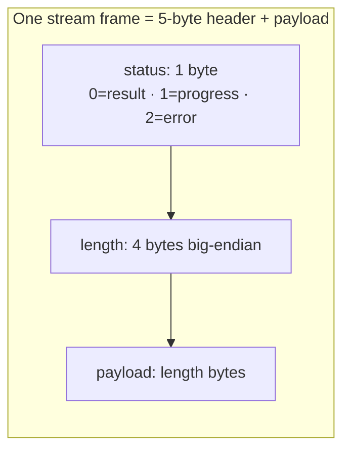
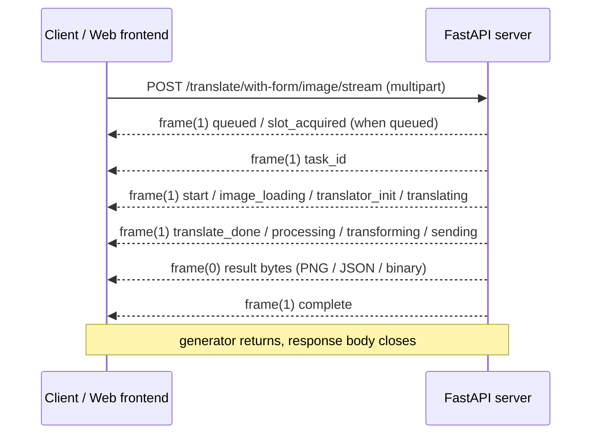
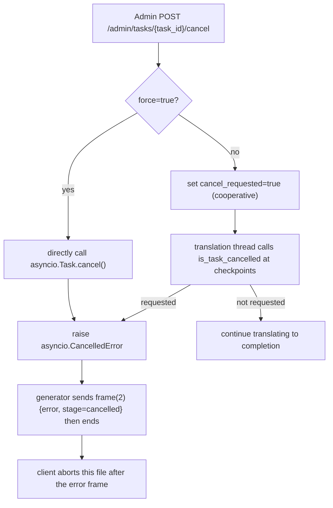

# HTTP Streaming Protocol

In addition to the plain endpoints that return the complete result, the translation endpoints provide `*_stream` variants: the server writes the "queued → processing → transforming → sending" process as a sequence of binary frames in real time, so the client can display progress while waiting for the final result. This guide describes only that transport layer (frame format, progress events, result payloads, cancellation, and client parsing); request/response models and authentication are covered in [Translation endpoints](./translation-endpoints.md) and [Authentication and errors](./authentication-and-errors.md), and the Web user interface flow in [Upload, configuration, and translation](../../web/upload-config-and-translate.md).

## Endpoint scope {#feature-boundary}

- This guide covers the binary stream produced by the `POST /translate/*/stream` endpoints and how `processStream()` in the Web frontend `static/script.js` parses it.
- Batch translation `/translate/batch/images` returns a ZIP binary stream instead of the per-frame protocol; it is documented only in [Batch, export, and import process](./batch-export-import-process.md). This page mentions its difference only at the boundary.
- The internal shared/ws executors (`mode/share.py`, `streaming.py`, `sent_data_internal.py`, `myqueue.py`) reuse the same "1-byte status + 4-byte length" frame header but are an internal protocol; see [Internal shared and websocket](../internal-shared-and-websocket.md). They are not part of the developer HTTP API.
- The progress-frame `message` texts are hardcoded server-side (Chinese) and displayed verbatim by the browser without frontend i18n translation; this is part of the runtime contract, not a documentation omission.
- This page never includes real keys, tokens, user images, or private prompts; examples use sanitized field names and endpoint paths only.

## Stream endpoints {#stream-endpoints}

All endpoints below return a `StreamingResponse` with `application/octet-stream`; the body is the framed stream described in [Frame format](#frame-format). The JSON variants under `translate` accept a `TranslateRequest` JSON body; the `with-form` variants accept `multipart/form-data` (`image` plus a `config` JSON string, and some also accept `user_env_vars`).

| Endpoint | Request body | Status-0 payload | Workflow |
| --- | --- | --- | --- |
| `POST /translate/json/stream` | JSON `TranslateRequest` | `TranslationResponse` JSON | `save_json` |
| `POST /translate/bytes/stream` | JSON `TranslateRequest` | `TranslationResponse.to_bytes()` binary | `save_json` |
| `POST /translate/image/stream` | JSON `TranslateRequest` | PNG bytes | `normal` |
| `POST /translate/with-form/json/stream` | multipart | `TranslationResponse` JSON | `save_json` |
| `POST /translate/with-form/bytes/stream` | multipart | `TranslationResponse.to_bytes()` binary | `save_json` |
| `POST /translate/with-form/image/stream` | multipart + `user_env_vars` | PNG bytes (generic mode) | `normal` |
| `POST /translate/with-form/image/stream/web` | multipart + `user_env_vars` | PNG bytes (web-optimized flag) | `normal` |
| `POST /translate/export/original/stream` | multipart + `user_env_vars` | `TranslationResponse` JSON | `export_original` |
| `POST /translate/export/translated/stream` | multipart + `user_env_vars` | `TranslationResponse` JSON | `save_json` |
| `POST /translate/upscale/stream` | multipart + `user_env_vars` | PNG bytes | `upscale_only` |
| `POST /translate/colorize/stream` | multipart + `user_env_vars` | PNG bytes | `colorize_only` |
| `POST /translate/inpaint/stream` | multipart + `user_env_vars` | PNG bytes | `inpaint_only` |
| `POST /translate/import/json/stream` | multipart (`image` + `json_file`) | PNG bytes | `load_text` |
| `POST /translate/import/txt/stream` | multipart (`image` + `txt_file` + `json_file` + optional `template`) | PNG bytes | `load_text` |

All stream endpoints run session and permission checks first (`X-Session-Token`) and are constrained by the concurrency slot and the daily quota. On validation failure they return a plain HTTP error such as `401`/`403`/`429` before the stream starts, not a progress frame.

## Frame format {#frame-format}

Each frame is a 5-byte header plus a payload, and frames are concatenated in the response body:

- Byte 1: status code (`0` = result, `1` = progress, `2` = error).
- Bytes 2–5: payload length as a **big-endian 32-bit unsigned integer**.
- Followed by `length` bytes of payload.

The server encodes with `pack_message(status, data)`: `status.to_bytes(1, 'big') + len(data).to_bytes(4, 'big') + data`. The response `media_type` is fixed to `application/octet-stream`. The stream ends when the generator returns: the normal path sends the result frame and the `complete` progress frame and then closes; the error path sends an error frame (status 2) and closes immediately.

A client must not assume each `read()` returns exactly one frame: a frame may span several network chunks, and one read may contain several frames. A pending buffer is required to split frames (see [Client parsing](#client-parsing)).

## Status byte and payload {#status-and-payload}

| Status | Meaning | Payload |
| --- | --- | --- |
| `0` | Result data | The final result bytes for the endpoint: PNG, `TranslationResponse` JSON, or `TranslationResponse.to_bytes()` binary |
| `1` | Progress event | UTF-8 JSON; fields in [Progress events](#progress-events) |
| `2` | Error | UTF-8 JSON with `error` and `stage` fields; see [Cancellation and abnormal termination](#cancellation) |

The status-0 payload is not pickle. `pickle` appears only in the legacy internal executor path (`notify()` in `streaming.py` does `pickle.loads` on status 0 before transforming); the current HTTP stream endpoints send the transformed result bytes directly.

## Progress events {#progress-events}

The status-1 payload is UTF-8 JSON. Common fields:

- `stage`: the event stage name.
- `message`: a server-hardcoded display text (Chinese) shown verbatim in the "log output" area of the browser.
- `task_id`: present only on the `stage = task_id` frame; it is the ID used by task monitoring and the log endpoints.
- `queue_position`: present only on the `stage = queued` frame; it is the task position in the waiting queue.

| stage | When it is emitted | message (server-hardcoded) |
| --- | --- | --- |
| `queued` | When tasks are waiting for a concurrency slot | `排队中... (前面还有 {n} 个任务)` |
| `slot_acquired` | When a concurrency slot is acquired | `获得翻译槽位，开始处理...` |
| `task_id` | Task start, carries `task_id` | none |
| `start` | Processing starts | `开始处理...` |
| `image_loading` | Loading the image | `加载图片中...` |
| `translator_init` | Initializing the translator | `初始化翻译器...` |
| `translating` | Running the translation | `翻译中...` |
| `translate_done` | Translation finished | `Processing result...` |
| `processing` | When text regions were found | `Found {n} text regions` |
| `transforming` | Transforming the result | `Converting...` |
| `sending` | Before the result frame is sent | `Sending...` |
| `complete` | After the result frame | `Done!` |

`queued` is sent only when the generator finds existing waiters on entry; a single uncontended task starts directly at `task_id`. `processing` is sent only when text regions exist. Different workflows (colorize-only/upscale-only/inpaint-only/import-render) emit a different subset of stages, but the frame protocol is the same.

## Result frames {#result-frames}

The status-0 payload depends on the transform function bound to the endpoint:

- Image endpoints (`image/stream`, `with-form/image/stream`, `with-form/image/stream/web`, `upscale/colorize/inpaint/stream`, `import/*/stream`): `transform_to_image(ctx)`, the PNG-encoded bytes of `ctx.result`.
- JSON endpoints (`json/stream`, `export/*/stream`): `transform_to_json(ctx)`, i.e. `to_translation(ctx).model_dump_json().encode("utf-8")`, the JSON text of a `TranslationResponse`.
- Bytes endpoint (`bytes/stream`): `transform_to_bytes(ctx)`, i.e. the compact binary form of `TranslationResponse.to_bytes()` (region count as `int` plus per-region `struct` fields such as coordinates, angle, probability, colors, and the text map), not JSON.

Top-level `TranslationResponse` JSON fields: `regions` (rendering and translation fields per text region), `original_width`, `original_height`, plus optional `upscale_ratio`, `upscaler`, `colorizer`, `mask_raw` (base64 PNG of the refined mask) and `mask_is_refined`.

Note: the endpoint comment for `/with-form/image/stream/web` claims a "placeholder optimization" for faster responses, but in the current source `_web_frontend_optimized` is only written into the config and never read by any consumer, and `use_placeholder` appears only in the legacy `mode/share.py`. In the current Web path this endpoint should return the full PNG. This may vary by release.

## Cancellation and abnormal termination {#cancellation}

Cancellation can only be triggered by an administrator, either from the "Task monitor" module of the admin panel or via `POST /admin/tasks/{task_id}/cancel?force=false|true` (`require_admin`):

- Cooperative (`force=false`, the default): sets `active_tasks[task_id].cancel_requested`; the translation thread calls `is_task_cancelled(task_id)` at checkpoints (before/after image loading, before/after translating) and raises `asyncio.CancelledError` when a cancellation is requested. The generator's `except asyncio.CancelledError` branch sends the error frame `{"error": "Task cancelled by admin", "stage": "cancelled"}` and terminates.
- Force (`force=true`): besides setting the flag, it directly calls `asyncio.Task.cancel()` on the registered task, entering the same error branch via `CancelledError`.
- The batch endpoints `/translate/batch/json` and `/translate/batch/images` do not use the frame protocol; on cancellation or on detecting "已被取消" they return HTTP `499` with `detail` `任务已被强制取消` or `任务已被取消`.
- Translation exceptions, missing results, and transform exceptions send error frames with `stage` `translate`, `no_result`, and `transform` respectively; unexpected exceptions send `stage = unknown`.

The error-frame JSON (status 2) always contains `error` and `stage`; the browser logs it and `throw`s, aborting processing of the current file without expecting further frames.

## Client parsing {#client-parsing}

`processStream()` in the Web frontend `static/script.js` is the reference implementation:

1. POST a multipart body (`image`, `config`, optional `user_env_vars`) with the `X-Session-Token` header.
2. Read chunks via `res.body.getReader()` and merge leftover bytes into `pendingBuffer`.
3. While the buffer is longer than 5 bytes, try to split a frame: `status = buffer[0]`, `len = (buffer[1]<<24)|(buffer[2]<<16)|(buffer[3]<<8)|buffer[4]`; if fewer than `5 + len` bytes are available, keep the remainder as the pending buffer until the next chunk.
4. Status `0`: append the payload to `resultChunks`; status `1`: parse JSON, record `currentTaskId` and print the first 8 characters of the task ID when `stage = task_id`, and log `message` when present; status `2`: parse JSON, log `错误: {error}`, and throw.
5. After the stream ends (`done`), if `resultChunks` is non-empty, assemble an `image/png` Blob into the "translation results" list; otherwise log that no result data was received.
6. In `finally`, if `currentTaskId` was recorded, fetch `/api/logs?limit=500&task_id={task_id}` for the full task log (`401` routes to the login-expiry handler).

The frontend makes no assumption about frame boundaries: one `read()` may contain zero, one, or several complete frames, or only half a header; buffering is mandatory. Multi-file normal translation uses the ZIP response of `/translate/batch/images` and does not go through `processStream`.

## Boundary with Web user operations {#web-ui-boundary}

- Single-file normal translation and colorize/upscale/inpaint/import-render modes call the `with-form` stream endpoints per file from the Web frontend; multi-file normal translation calls `/translate/batch/images` (ZIP). Full steps are in [Upload, configuration, and translation](../../web/upload-config-and-translate.md).
- Progress and error frames are rendered in the "log output" area, and the task log is fetched after completion; result preview, download, and history are in [Progress, results, and history](../../web/progress-results-and-history.md).
- The admin cancellation UI is in [Administrator interface](../../web/administrator-interface.md).
- This guide does not describe Web user operations; it describes the stream protocol the browser actually calls. Do not present endpoint paths as UI steps.

## Developer Guide {#developer-guide}

### Option matrix {#option-matrix}

#### UI text reference {#ui-texts}

The table below lists the shared locale texts involved in the streaming flow (`/i18n/{locale}` returns the `desktop_qt_ui/locales` JSON). The Web page `index.html` uses its own hardcoded Chinese for some controls (e.g. "翻译工作流模式", "开始任务", "普通翻译"), which does not exactly match the locale values below; `script.js` log fallbacks are also hardcoded bilingual strings.

| UI call key | English actual value | Simplified Chinese actual value |
| --- | --- | --- |
| `Translation Workflow Mode:` | Translation Workflow Mode: | 翻译流程模式： |
| `Normal Translation` | Normal Translation | 正常翻译流程 |
| `Export Translation` | Export Translation | 导出翻译 |
| `Export Original Text` | Export Original Text | 导出原文 |
| `Import Translation and Render` | Import Translation and Render | 导入翻译并渲染 |
| `Colorize Only` | Colorize Only | 仅上色 |
| `Upscale Only` | Upscale Only | 仅超分 |
| `Inpaint Only` | Inpaint Only | 仅修复 |
| `Start Translation` | Start Translation | 开始翻译 |

The `message` field of progress frames is hardcoded in `request_extraction.py` (`开始处理...`, `翻译中...`, etc.) and displayed directly by the browser, bypassing the locale table above.

### Code locations {#source-evidence}
| Layer | File | What was checked |
| --- | --- | --- |
| Frame encoding | `manga_translator/server/request_extraction.py` | `while_streaming()`, `pack_message()`, progress/error frames, and the stage list |
| Stream endpoints | `manga_translator/server/routes/translation.py` | The 14 stream endpoints, multipart/JSON request bodies, `transform_to_*`, and workflows |
| Result payloads | `manga_translator/server/server_utils.py`, `to_json.py` | PNG / JSON / binary transforms and the `TranslationResponse` fields |
| Cancellation | `manga_translator/server/core/task_manager.py`, `routes/admin.py` | `is_task_cancelled`, `cancel_task`, `/admin/tasks/{task_id}/cancel` |
| Non-framed batch | `manga_translator/server/routes/translation.py` | `/batch/images` ZIP, `X-Content-Type: application/zip`, `499` |
| Client parsing | `manga_translator/server/static/script.js` | `processStream()` frame splitting, error abort, and `task_id` log fetch |
| Frontend i18n | `manga_translator/server/static/js/i18n.js`, `routes/config.py` | `/i18n/{locale}` and the shared locale JSON |
| Legacy internal stream | `manga_translator/server/streaming.py`, `sent_data_internal.py`, `myqueue.py`, `mode/share.py` | pickle/status-code differences and the internal executor path |