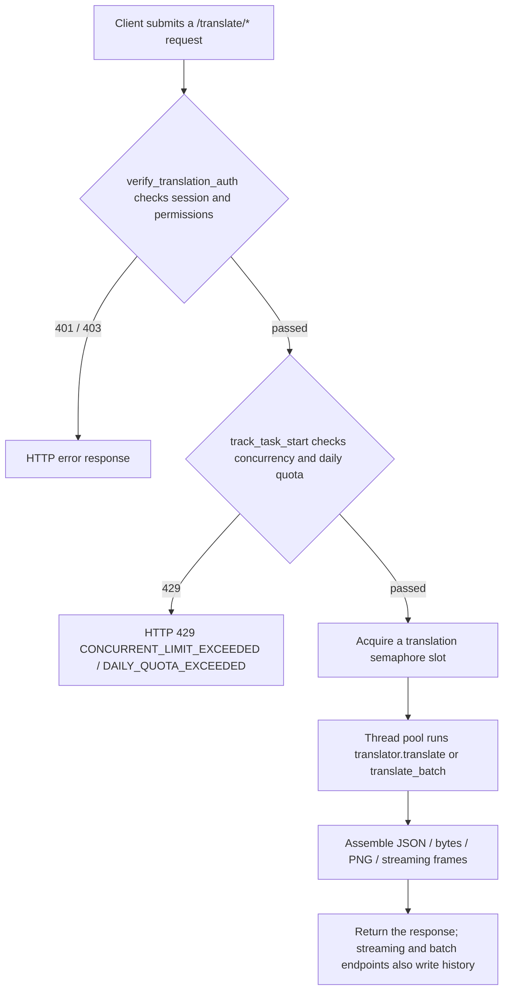

# HTTP Translation Endpoints

Use this page when a script, extension, or third-party application needs to submit manga images to the Manga Translator server for translation. It documents the endpoints under `/translate` that submit translation tasks, the request and response formats, and the task status while queued and running. It does not repeat the full streaming-frame protocol (see [Streaming protocol](./streaming-protocol.md)), the session and permission error conventions (see [Authentication and errors](./authentication-and-errors.md)), or the auxiliary export/import/colorize/upscale/inpaint endpoints (see [Batch, export, and import process](./batch-export-import-process.md)). For the Web UI entry points, see [Upload, configure, and translate](../../web/upload-config-and-translate.md).

## Endpoint scope {#feature-boundary}

- This guide covers the endpoints that submit a translation task and return a result: `POST /translate/json`, `/bytes`, `/image` and their `/stream` variants, the `/with-form/*` form variants, `/batch/json`, `/batch/images`, and `POST /translate/queue-size`.
- `manga_translator/server/routes/translation.py` registers 31 `/translate` route declarations in total; the export (`/export/*`), import (`/import/*`), process (`/upscale`, `/colorize`, `/inpaint`), and `/complete` endpoints belong to other pages.
- Except for `queue-size`, every translation endpoint calls `verify_translation_auth()` inside the route: a missing or invalid `X-Session-Token` returns `401`, missing translator/OCR/colorizer/renderer permission returns `403`, and parameters disabled for the user or group are overridden with admin defaults before execution.
- Single and batch requests share one global translator instance and thread pool; models are reused between requests. Server-side translation requests force `cli.use_gpu=False` and disable desktop-only modes such as replace translation and template alignment.

## Endpoint inventory {#endpoint-inventory}

### Single-translation endpoints {#single-endpoints}

| Method and path | Request | Response | Workflow |
| --- | --- | --- | --- |
| `POST /translate/json` | JSON: `TranslateRequest` | JSON `TranslationResponse` | `save_json` |
| `POST /translate/bytes` | JSON: `TranslateRequest` | Custom byte stream (see [Custom byte format](#custom-bytes-format)) | `save_json` |
| `POST /translate/image` | JSON: `TranslateRequest` | PNG `StreamingResponse` | `normal` |
| `POST /translate/with-form/json` | `multipart/form-data`: `image` file + `config` JSON string | JSON `TranslationResponse` | `save_json` |
| `POST /translate/with-form/bytes` | Same as above | Custom byte stream | `save_json` |
| `POST /translate/with-form/image` | Same as above | PNG `StreamingResponse` | `normal` |

The JSON variants encode the whole image as a data URI with the `data:image/...;base64,` prefix in the `image` field; the form variants upload the file. Both entries accept the same `config`: a Pydantic `Config` object in the JSON variants, and a JSON string validated by `parse_config()` in the form variants.

### Streaming translation endpoints {#streaming-endpoints}

| Method and path | Request | Response |
| --- | --- | --- |
| `POST /translate/json/stream` | JSON: `TranslateRequest` | Streaming frames whose result payload is JSON |
| `POST /translate/bytes/stream` | JSON: `TranslateRequest` | Streaming frames whose result payload is custom bytes |
| `POST /translate/image/stream` | JSON: `TranslateRequest` | Streaming frames whose result payload is PNG |
| `POST /translate/with-form/json/stream` | Form: `image` + `config` | Streaming frames whose result payload is JSON |
| `POST /translate/with-form/bytes/stream` | Form: `image` + `config` | Streaming frames whose result payload is custom bytes |
| `POST /translate/with-form/image/stream` | Form: `image` + `config` + `user_env_vars` | Streaming frames whose result payload is PNG (generic mode, suitable for API calls and scripts) |
| `POST /translate/with-form/image/stream/web` | Form: `image` + `config` + `user_env_vars` | Streaming frames whose result payload is PNG (Web-frontend optimized mode) |

Streaming endpoints go through `while_streaming()`, which registers the active task, emits queueing and stage progress, runs the translation, and finally produces result frames with `transform_to_json` / `transform_to_bytes` / `transform_to_image`. `/image/stream/web` sets the config flag `_web_frontend_optimized` to `true`; `transform_to_image()` returns a 1×1 placeholder PNG when `ctx.use_placeholder` is set so the response is faster, while the final image is still written to history.

### Batch and queue endpoints {#batch-and-queue-endpoints}

| Method and path | Request | Response |
| --- | --- | --- |
| `POST /translate/batch/json` | JSON: `BatchTranslateRequest` | `list[TranslationResponse]` |
| `POST /translate/batch/images` | JSON: `BatchTranslateRequest` | ZIP byte stream with the `X-Content-Type: application/zip` response header |
| `POST /translate/queue-size` | No body | JSON integer |

`POST /translate/batch/images` returns `400` when no image is provided; each result uses `config.cli.format` or the original filename to decide the output format and extension. `POST /translate/queue-size` returns the length of the module-level `task_queue.queue`; the active translation path controls concurrency with the translation semaphore (`task_manager.translation_semaphore`), so this endpoint is a read-only snapshot of the legacy queue structure and does not represent the number of semaphore waiters.

## Submitting tasks in the Web UI {#web-ui-submission}

The Web frontend (`static/index.html` + `static/script.js`) is the main consumer of these endpoints. The workflow dropdown at the top of the page decides which endpoint the request uses; multi-image “Normal Translation” goes to `/translate/batch/images` (images as data URIs in a JSON body), while a single image or a special workflow goes to the corresponding `/translate/*` form endpoint.

## Request and response contract {#request-response-contract}

### Single request `TranslateRequest` {#translate-request}

| Field | Type | Description |
| --- | --- | --- |
| `image` | `bytes` or `str` | Image bytes from a form upload, or a data URI with the `data:image/...;base64,` prefix |
| `config` | `Config` | Full translation configuration (Pydantic); defaults to `Config()` |

`to_pil_image()` accepts only these two input kinds; anything else (such as a bare base64 string or a file path) returns `422` with “Invalid image data” or a data-URI hint.

### Batch request `BatchTranslateRequest` {#batch-request}

| Field | Type | Default | Description |
| --- | --- | --- | --- |
| `images` | `list[bytes \| str]` | required | Each image as bytes or a data URI |
| `config` | `dict` or `Config` | `{}` | Configuration; a `dict` is converted with `parse_config()` |
| `batch_size` | `int` | `4` | Number of images processed per batch |
| `filenames` | `list[str]` | `[]` | Original filenames used for output naming and history |

### Response `TranslationResponse` {#translation-response}

| Field | Type | Description |
| --- | --- | --- |
| `regions` | `list[Translation]` | Text regions in reading order |
| `original_width` / `original_height` | `int` | Input image dimensions |
| `upscale_ratio` / `upscaler` | optional | Present only when upscaling is enabled |
| `colorizer` | optional | Present only when a non-`none` colorizer is used |
| `mask_raw` | optional | PNG base64 of the refined mask (the optimized `ctx.mask`) |
| `mask_is_refined` | `bool` | Always `true` when a mask is saved |

Each `Translation` region contains `text`, `translation`, `translation_raw`, `translation_rich`, `angle`, `font_size`, `fg_colors`, `bg_colors`, `direction`, `alignment`, `target_lang`, `source_lang`, `line_spacing`, `letter_spacing`, `stroke_width`, `font_family`, `prob`, and similar fields. Do not paste user image data such as `mask_raw` from a response into documentation or shared logs.

### Custom byte format {#custom-bytes-format}

`TranslationResponse.to_bytes()` layout: an `int32` region count followed by, for each region, `minX/minY/maxX/maxY` (four `int32`s), `is_bulleted_list` (1 byte), `angle` (`float32`), `prob` (`float32`), foreground color (3-byte RGB), background color (3-byte RGB), and a text map (`int32` entry count; each entry is `uint32` key length + UTF-8 key + `uint32` value length + UTF-8 value). See `examples/response.*` for decoding examples.

### Streaming frame format {#stream-frame-format}

Each streaming frame is “1 status byte + 4-byte big-endian length + payload”: status `0` is result bytes, `1` is progress JSON, and `2` is error JSON. The `stage` in progress JSON covers `queued`, `slot_acquired`, `task_id`, `start`, `image_loading`, `translator_init`, `translating`, `translate_done`, `processing`, `transforming`. See [Streaming protocol](./streaming-protocol.md) for the full protocol and client parsing.

## Task status, queue, and concurrency {#task-status-queue-and-concurrency}

- Concurrency slots come from `task_manager.translation_semaphore`, defaulting to `max_concurrent_tasks=3` (read from `server_config`); while waiting for a slot, `while_streaming()` first emits `stage: queued` (with `queue_position`), then `stage: slot_acquired` once the slot is obtained.
- Active tasks are registered in `task_manager.active_tasks` with initial status `queued`, updated to `running` after the slot is acquired; when an admin cancels a task, streaming tasks receive `CancelledError` and emit a status-`2` error frame.
- Batch endpoints pass `task_id` to `get_batch_ctx()`, which checks `is_task_cancelled()` before converting and translating each image; a forced or detected cancellation returns `499`.
- Users with offline translation permission (`allow_offline_translation`) get a never-disconnecting request wrapper in `/batch/images`, so the task keeps running and writes history even after the client disconnects.

## API constraints {#dependencies-and-conflicts}

- Session and permissions: every translation endpoint depends on `X-Session-Token`; a disabled account, expired token, or failed activity refresh returns `401`. Permission filtering first overrides disabled parameters, then checks translator/OCR/colorizer/renderer permissions.
- Configuration source: the `config` in a request is a full configuration snapshot; the server starts with `config/config.json` (copied from `config-example.json` when absent). Values submitted by the user are overridden by user-group/user allow and deny lists and must not be treated as the final effective values.
- `user_env_vars`: form endpoints accept uppercase environment-variable key/value pairs that are merged with the user's preset and validated by the API-key policy; a key that does not match the current translator returns `403`. Documentation and logs must never show real keys.
- Adjacent pages: streaming-frame decoding and task-cancellation timing are in [Streaming protocol](./streaming-protocol.md); export/import/colorize/upscale/inpaint endpoints are in [Batch, export, and import process](./batch-export-import-process.md); session, permission, and global error formats are in [Authentication and errors](./authentication-and-errors.md).
- Concurrency and history: translation is limited by both the semaphore and per-user concurrency/daily quotas; streaming and batch successes are written to history, whose reading and downloads are documented in [History, files, and download tickets](./history-files-and-download-tickets.md).

## Developer Guide {#developer-guide}

### Option matrix {#option-matrix}

#### Workflow options and endpoint mapping

| UI call key | English actual value | Simplified Chinese actual value |
| --- | --- | --- |
| `Translation Workflow Mode:` | Translation Workflow Mode: | 翻译流程模式： |
| `Normal Translation` | Normal Translation | 正常翻译流程 |
| `Export Translation` | Export Translation | 导出翻译 |
| `Export Original Text` | Export Original Text | 导出原文 |
| `Import Translation and Render` | Import Translation and Render | 导入翻译并渲染 |
| `Colorize Only` | Colorize Only | 仅上色 |
| `Upscale Only` | Upscale Only | 仅超分 |
| `Inpaint Only` | Inpaint Only | 仅修复 |
| `Start Translation` | Start Translation | 开始翻译 |
| `Log output...` | Log output... | 日志输出... |

Workflow stored-value to endpoint mapping: `normal` → `/translate/with-form/image/stream`; `export_trans` → `/translate/export/translated`; `export_raw` → `/translate/export/original`; `import_trans` → `/translate/import/json`; `colorize` → `/translate/colorize`; `upscale` → `/translate/upscale`; `inpaint` → `/translate/inpaint`. When `localStorage.session_token` exists, the frontend sends the token in the `X-Session-Token` header, and batch requests set an additional 30-minute `AbortController` timeout.

#### Errors, cancellation, and status codes {#errors-cancellation-and-status-codes}

| Status | Trigger (current code) | Source |
| --- | --- | --- |
| `200` | Success: JSON, image, stream, bytes, or the `queue-size` integer | FastAPI default |
| `400` | `/batch/images` without images; import/export validation failures | `translation.py:449` |
| `401` | Missing `X-Session-Token` (`NO_TOKEN`) or invalid/expired (`INVALID_TOKEN`) | `translation_auth.py:253` |
| `403` | Missing translator/OCR/colorizer/renderer permission; user API key does not match the translator | `translation_auth.py:345`; `core/response_utils.py` |
| `422` | Body validation failure or invalid image data; the global handler returns `detail` and the body | `main.py:255` |
| `429` | User concurrency limit (`CONCURRENT_LIMIT_EXCEEDED`) or daily quota (`DAILY_QUOTA_EXCEEDED`) exceeded | `core/middleware.py:326`, `:365` |
| `499` | Batch task forcibly cancelled or detected as cancelled | `translation.py:421`, `:518` |
| `500` | No result image, translation exception, or service not initialized | `translation.py:527`; `request_extraction.py` |

Streaming endpoints do not raise HTTP errors when translation fails midway; they emit a status-`2` error frame with `{"error": ..., "stage": ...}`. HTTP status codes are reserved for authentication, permission, concurrency, quota, and request-validation phases.

### Related files and formats {#related-files-and-formats}

| File/format | Actual role on this page | Notes |
| --- | --- | --- |
| `manga_translator/server/routes/translation.py` | 31 `/translate` route declarations and parameter binding | Endpoint inventory, workflows, and error codes follow this file |
| `manga_translator/server/request_extraction.py` | `TranslateRequest`, `BatchTranslateRequest`, `get_ctx`, `while_streaming`, `get_batch_ctx` | Image decoding, slots, task registration, and history saving |
| `manga_translator/server/to_json.py` | `TranslationResponse`, `Translation`, and the custom byte format | Response fields and the `to_bytes()` layout |
| `manga_translator/server/core/response_utils.py` | `transform_to_json/bytes/image`, `apply_user_env_vars` | Placeholder image, byte/JSON conversion, and API-key policy |
| `manga_translator/server/routes/translation_auth.py` | `verify_translation_auth`, task counting, and quotas | 401/403/429 and disabled-parameter filtering |
| `manga_translator/server/core/task_manager.py` | Semaphore, thread pool, active tasks, and cancellation | Concurrency defaults and task status |
| `manga_translator/server/myqueue.py` | Legacy `TaskQueue`, the `queue-size` data source | Read-only snapshot, not semaphore waiters |
| `manga_translator/server/runtime_api.py` | Runtime API overrides (Sakura/OCR/colorizer/renderer) | Environment-variable priority; no real keys |
| `manga_translator/server/static/index.html`, `static/script.js` | Web frontend submission entry and stream parsing | UI-text keys and request headers |

### Code locations {#source-evidence}
| Layer | File | What was checked |
| --- | --- | --- |
| Routes | `manga_translator/server/routes/translation.py` | Endpoint paths, methods, request/response models, workflows, and status codes |
| Request/response | `manga_translator/server/request_extraction.py`, `to_json.py`, `core/response_utils.py` | `TranslateRequest`/`BatchTranslateRequest`/`TranslationResponse`, byte and streaming-frame formats |
| Auth and limits | `manga_translator/server/routes/translation_auth.py`, `core/middleware.py` | 401/403/429, disabled-parameter filtering, concurrency, and quotas |
| Queue and tasks | `manga_translator/server/core/task_manager.py`, `myqueue.py` | Semaphore, thread pool, active tasks, cancellation, and `queue-size` |
| Runtime overrides | `manga_translator/server/runtime_api.py` | API key/base/model environment-variable priority |
| Web UI | `manga_translator/server/static/index.html`, `static/script.js`, `desktop_qt_ui/locales/en_US.json`, `zh_CN.json` | Workflow dropdown, submission endpoints, and the three-column UI texts |
