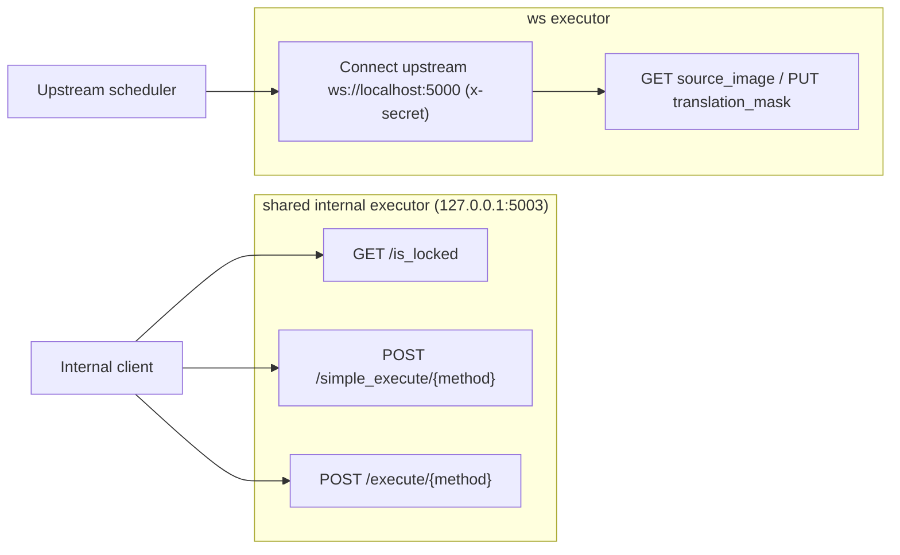
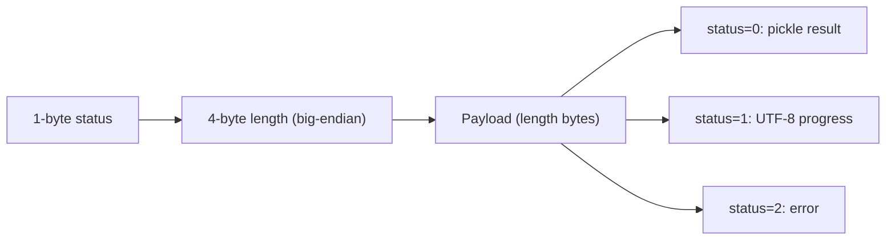
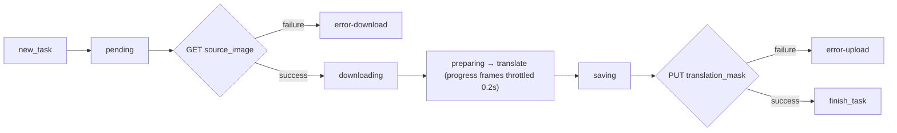

# Internal Shared and WebSocket Protocol

Use this page when debugging the internal executors, tracing connection or serialization issues in `shared`/`ws` modes, or assessing the consequences of exposing these internal protocols to a network. It documents the wire contracts of the two internal links: the HTTP + pickle-frame protocol of `shared`, and the WebSocket + protobuf task protocol of `ws`. It does not repeat how to start the three service modes or their mode-level differences (see [Web, WS, and Shared Modes](../cli/web-ws-and-shared-modes.md)), nor the `web` ports and deployment (see [Web Server Ports and Deployment](./web-server-ports-and-deployment.md)); public HTTP API authentication and errors live in [HTTP API Authentication and Errors](./http-api/authentication-and-errors.md).

## Relevant code {#feature-boundary}

- `shared` is an internal HTTP executor: `MangaShare` wraps `MangaTranslator` into a FastAPI service that listens on `127.0.0.1:5003` by default, exposes three controlled endpoints, and returns pickle bytes. It is not an external service for browsers.
- `ws` is an internal WebSocket executor client: `MangaTranslatorWS` extends the translator, actively connects to the upstream `ws://localhost:5000`, authenticates with the `x-secret` header, and exchanges protobuf `WebSocketMessage` frames. The local `--host 127.0.0.1 --port 5003 --nonce` declared by its parser are not consumed by the current implementation.
- Both links are internal protocols: `shared` binds to a loopback address by default and `ws` connects to a local upstream by default; nonce/secret are the only authentication and travel as plaintext HTTP/WebSocket headers; pickle deserialization and protobuf parsing both face untrusted input.
- Port boundaries: `web` exposes `0.0.0.0:8000`, `shared` listens on `127.0.0.1:5003`, and `ws` connects to upstream `ws://localhost:5000`; never mix up `5000`, `5003`, and `8000`.

## Ports and endpoint contract {#ports-and-endpoints}

## Shared internal protocol {#shared-protocol}

`MangaShare` is an internal executor: it accepts JSON requests, runs translation serially under a thread lock, and returns pickle bytes or a stream of frames. Every execution endpoint performs four checks in a fixed order: nonce validation (once a nonce is set, `X-Nonce` must match or the request returns `401`), method whitelist (only `translate` and `translate_batch` are allowed, otherwise `403`), method existence (`404` if absent), and a non-blocking lock (`429` while busy).

### Request encoding {#shared-request-encoding}

- Single image: `{"image": "<PNG base64>", "config": {...}}`; batch: `{"images": ["<PNG base64>", ...], "config": {...}, "batch_size": n}`.
- `config` is produced by `Config.model_dump(mode="json")`; the server validates images with `_decode_image`, and invalid images, configs, or batch requests return `422` (`Invalid image data` / `Invalid translation config` / `Invalid batch request`).
- Client encoding lives in `sent_data_internal.py`: `_encode_image` / `_encode_config` / `_encode_attributes`.

### Stream frame format {#shared-frame-format}

Each stream frame is `status(1 byte) + length(4 bytes big-endian) + payload`; the client splits frames with `extract_header` / `handle_buffer` using the 5-byte header:

When the result object carries `use_placeholder`, the server returns only a minimal `Context` with a 1x1 white placeholder image to avoid transferring a large image.

### Nonce and access control {#shared-nonce}

- Nonce sources: `shared --nonce` (`args.py`), or for `web` mode the `MT_WEB_NONCE` environment variable and a startup-time `secrets.token_hex(16)` generation (`server/main.py`, `server_utils.generate_nonce()`).
- `MangaShare.check_nonce()` only compares the `X-Nonce` request header with its own `self.nonce`; when `--nonce` is unset the service performs no validation at all.
- The nonce is a shared secret: it is printed in the startup log (`Nonce: ...`) and travels as a plaintext HTTP header; leaking it is equivalent to having no authentication. Never copy a nonce from logs into a public report.
- `/is_locked` skips the nonce check; the two execution endpoints both enforce it.

### Pickle serialization risk {#pickle-risk}

- Results are serialized with `pickle.dumps` and deserialized on the client with `pickle.loads` (`sent_data_internal.py#fetch_data`, `mode/share.py#run_method`).
- Pickle is not a safe format: deserializing untrusted data can execute arbitrary code (RCE). It is usable only when both ends are trusted and data has not been tampered with.
- Consequence: `shared` must stay an internal executor, must not be exposed to the public internet, and must not accept requests from untrusted callers.

## WebSocket internal protocol {#websocket-protocol}

`MangaTranslatorWS` works as a client: it does not listen on a port but connects to the `--ws-url` upstream, receives `new_task`, and after translating uploads the result to the `translation_mask` URL provided by the upstream.

### Connection and authentication {#ws-connection-and-auth}

- Connection: `websockets.connect(url, extra_headers={'x-secret': secret}, max_size=1_000_000)`; the message size limit is 1 MB.
- Secret sources: the `ws_secret` parameter or the `WS_SECRET` environment variable (`mode/ws.py`), defaulting to an empty string; the CLI `ws` subcommand has no `--ws-secret` option.
- `x-secret` is a plaintext WebSocket header; if the secret is empty and the upstream allows the connection, it is equivalent to no authentication.
- On Windows, `WSAStartup` is called and the `ProactorEventLoopPolicy` is set; the connection loop runs in a separate thread on `_server_loop`.

### Task lifecycle {#ws-task-lifecycle}

After receiving `new_task`: send `pending` → send `downloading` → HTTP GET `source_image` (send `error-download` on failure) → open the image (force `upscale_ratio=1` when either dimension exceeds 1200 pixels) → send `preparing` → run translation on the main loop (the progress hook coalesces frames through a 0.2-second throttler; statuses are translator pipeline stage names) → when the result is not empty send `saving`, resize back to the original dimensions, and encode PNG (verbose also saves `ws_final.png`) → send `uploading` → HTTP PUT `translation_mask` (send `error-upload` on failure) → finally send `finish_task`.

- All tasks are scheduled serially with `PriorityLock` (`task_lock((1 << 31) - ws_count)`); when `_run_text_translation` has to move the translation coroutine back to `ctx.ws_event_loop`, it releases the lock first and re-acquires it with `(1 << 30) - ws_count`.
- `_run_text_rendering` computes the render mask (input mask union changed output pixels) and, in verbose mode, writes `ws_render_in.png`, `ws_render_out.png`, `ws_mask.png`, `ws_inmask.png`, and `ws_output.png`; the final output is cropped to the mask as RGBA.
- `translation_params` (the CLI arguments) only fill default values for params that are `None`.

### Protobuf risk and missing module {#protobuf-risk}

- The client parses upstream messages directly with `ParseFromString(raw)`; `max_size=1_000_000` is the only size limit, and field validity is decided by the generated code.
- This repository does not track `manga_translator/server/ws_pb2.py` or a matching `.proto` file; the `from ..server import ws_pb2` in `listen()` raises `ImportError`, so `ws` mode currently cannot start. This is a source-level difference, not a verified runtime behavior.
- Restoring the mode requires regenerating `ws_pb2.py` and verifying the message fields against the upstream scheduler; until then, do not treat `ws` as a runnable service.

## Constraints and notes {#dependencies-and-conflicts}

- Port boundaries: `web` `0.0.0.0:8000`, `shared` `127.0.0.1:5003`, and `ws` upstream `ws://localhost:5000`; they serve different purposes and never overlap.
- `ws --host/--port/--nonce` exist in the parser, but `MangaTranslatorWS` does not consume them; do not infer from the help text that `ws` listens on `5003`.
- `shared`/`ws` are internal protocols: never access them directly from a browser and never expose them to the public internet; plaintext nonce/secret transport, pickle deserialization, and protobuf parsing all carry security risks.
- `web` mode forces `start_instance=False` and never spawns a `shared` instance; `start_translator_client_proc` in `server/main.py` is a legacy path that reads/appends `--ignore-errors`, `--pre-dict`, and `--post-dict` options not declared by the `shared` subparser, so it must not be treated as official behavior.
- This repository is missing `ws_pb2.py`, so `ws` mode cannot start; this is a source-level difference.
- This page never reads or shows real `.env` contents, `WS_SECRET`, nonces, API keys, tokens, usernames, or private paths.

## Developer Guide {#developer-guide}

### Option matrix {#option-matrix}

#### Ports and endpoint contract

| Entry | Source-fixed value | Notes and source |
| --- | --- | --- |
| `shared` listen | `--host` / `--port` default to `127.0.0.1:5003` | `manga_translator/args.py`; `mode/share.py#MangaShare.listen()` starts the internal FastAPI with it |
| shared endpoints | `GET /is_locked`, `POST /simple_execute/{method_name}`, `POST /execute/{method_name}` | Defined inline in `mode/share.py#listen()`; the method whitelist only allows `translate` and `translate_batch` |
| shared keep-alive | Uvicorn `timeout_keep_alive=1800` | Keeps connections for 30 minutes to support batch translation |
| `ws` upstream | `--ws-url` defaults to `ws://localhost:5000` | `manga_translator/args.py`; `mode/ws.py` reads `ws_url` |
| `ws` local fields | `--host 127.0.0.1`, `--port 5003`, `--nonce` | Declared by the parser; the current `MangaTranslatorWS` does not consume them |
| ws side channels | The task's `source_image` (HTTP GET) and `translation_mask` (HTTP PUT) | `mode/ws.py` uses an `aiohttp` session with a 30-second timeout |
| web legacy registration | `POST /register` (`X-Nonce` header) | `server/main.py#register_instance`; `web` mode forces `start_instance=False` and does not spawn `shared` automatically |

#### Shared internal protocol

| Endpoint | Behavior |
| --- | --- |
| `GET /is_locked` | Returns `{"locked": true/false}`; no nonce check |
| `POST /simple_execute/{method_name}` | Synchronous execution; on success returns pickle bytes as `application/octet-stream`; on failure returns 4xx/5xx |
| `POST /execute/{method_name}` | Streaming execution; immediately returns an `application/octet-stream` `StreamingResponse` while a background task writes progress/result frames |

#### Stream frame format

| status | Payload |
| --- | --- |
| `0` | Result: pickle-serialized translation result |
| `1` | Progress: UTF-8 state string (written by the translator progress hook) |
| `2` | Error: error message (currently `Shared worker failed`) |

#### Message schema {#ws-message-schema}

Messages are protobuf `WebSocketMessage` (`ws_pb2`), encoded with `SerializeToString()` / `ParseFromString(raw)`, and `WhichOneof('message')` distinguishes the three kinds:

| Message | Fields | Purpose |
| --- | --- | --- |
| `new_task` | `id`, `target_language`, `skip_language`, `detector`, `direction`, `translator`, `size`, `source_image`, `translation_mask` | Upstream dispatches a task |
| `status` | `id`, `status` | Executor reports a status |
| `finish_task` | `id`, `success`, `has_translation_mask` | Task finished |

#### UI copy reference {#ui-copy}

`shared`/`ws` are server-internal protocols; the desktop UI locale files contain no UI strings such as "shared", "websocket", or "5003". The desktop settings labels shared with the CLI switches are:

| UI call key | English actual value | Simplified Chinese actual value |
| --- | --- | --- |
| `label_use_gpu` | Use GPU | 使用 GPU |
| `label_disable_onnx_gpu` | Disable ONNX GPU Acceleration | 禁用 ONNX GPU 加速 |
| `label_verbose` | Verbose Logging | 详细日志 |
| `label_attempts` | Retry Attempts | 重试次数 |
| `label_ignore_errors` | Ignore Errors | 忽略错误 |

### Related files and formats {#related-files-and-formats}

| File/format | Actual role on this page | Note |
| --- | --- | --- |
| `manga_translator/mode/share.py` | shared executor: endpoints, nonce, lock, pickle, and stream frames | `X-Nonce` header, method whitelist, `use_placeholder` optimization |
| `manga_translator/mode/ws.py` | ws executor: upstream connection, `x-secret`, protobuf messages, download/upload | `ws_pb2` module missing |
| `manga_translator/server/sent_data_internal.py` | shared client: base64 images, config JSON, pickle round-trip, stream-frame parsing | `extract_header`/`handle_buffer` |
| `manga_translator/server/instance.py` | `ExecutorInstance` `sent*` calls and `Executors` registration | Legacy path |
| `manga_translator/server/server_utils.py` | `generate_nonce()`, image/JSON/bytes conversion | `secrets.token_hex(16)` |
| `manga_translator/server/main.py` | web startup, nonce generation, `POST /register`, `start_instance` | Forces `start_instance=False` |
| `manga_translator/args.py`, `__main__.py` | `ws`/`shared` subparsers and mode dispatch | Help strings are fixed Chinese and do not go through i18n |
| `manga_translator/utils/threading.py` | `PriorityLock` and `Throttler` | ws task scheduling and the 0.2-second throttle |
| `desktop_qt_ui/locales/en_US.json`, `zh_CN.json`, `doc/wiki/data/i18n.generated.json` | Actual bilingual `label_*` values | No shared/ws-specific UI strings |

### Mermaid boundary {#mermaid-boundary}

The diagrams describe the real endpoints, frame format, and task state transitions in the source; they do not claim that a listener for `ws://localhost:5000` exists inside this repository, nor that `ws` mode can currently start (missing `ws_pb2.py`). Shared-executor dispatch is a legacy path retained in the source, and the official `web` mode never spawns it.

### Code locations {#source-evidence}
| Layer | File | What was checked |
| --- | --- | --- |
| shared service | `manga_translator/mode/share.py` | Three endpoints, nonce, method whitelist, lock, pickle, frame status codes, `use_placeholder`, `timeout_keep_alive` |
| shared client | `manga_translator/server/sent_data_internal.py`, `instance.py` | JSON encoding, pickle round-trip, stream-frame splitting, executor registration |
| ws executor | `manga_translator/mode/ws.py` | `ws_url`, `WS_SECRET`/`x-secret`, protobuf messages, task state machine, throttling and PriorityLock, Windows initialization |
| web service | `manga_translator/server/main.py`, `server_utils.py` | Nonce generation and printing, `/register`, `start_instance=False`, legacy spawn command |
| Parameters and dispatch | `manga_translator/args.py`, `__main__.py` | `ws`/`shared` options and defaults, mode dispatch |
| Utilities | `manga_translator/utils/threading.py` | `PriorityLock`, `Throttler` |
| Research baseline | `doc/wiki/research/cli-command-inventory.md`, `phase0-web-user-http.md`, `phase0-page-coverage-matrix.md` | `--help` inventory, port/protocol boundaries, missing `ws_pb2.py` record |
