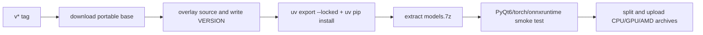

# Packaging and Release

This page is for maintainers. It explains how the project turns source code into distributable desktop and Docker artifacts, how version numbers are determined, how CI publishes to GitHub Releases and container registries, and the boundary of version-check and update-maintenance flows. It does not cover user-facing install and update steps (see [Update and version switching](../install/update-and-version-switching.md)), web-server ports and deployment (see [Web server ports and deployment](./web-server-ports-and-deployment.md)), repository module boundaries (see [Architecture and code boundaries](./architecture-and-code-boundaries.md)), or tests and code quality (see [Tests and code quality](./tests-and-code-quality.md)).

## Relevant code {#feature-boundary}

- Version: a `v*` Git tag (for example `v2.2.10`) is authoritative. `packaging/VERSION` is the in-package version file; `[project] version` in `pyproject.toml` and the hardcoded `VERSION` in `packaging/launch.py` are development markers.
- Release packages: `.github/workflows/build-and-release.yml` follows the layout of `scripts/manga-translator-ui-portable`. It downloads the `portable` Release as a base, overlays the selected source ref, installs locked CPU, NVIDIA CUDA 13.0 GPU, NVIDIA CUDA 12.6 GPU, or Windows AMD dependencies into bundled Python, installs model files, and creates split archives.
- Docker: `.github/workflows/docker-build-push.yml` continues to build and push CPU/GPU images.
- This guide covers packaging and release only. Module code boundaries, test flows, and web ports/deployment belong to [Architecture and code boundaries](./architecture-and-code-boundaries.md), [Tests and code quality](./tests-and-code-quality.md), and [Web server ports and deployment](./web-server-ports-and-deployment.md) respectively.

## How to use it {#ui-operations}

Only two kinds of visible copy relate to packaging and release: the desktop window-title/sidebar version display and the source-install maintenance menu's version-check entry. Neither is a settings-page parameter; the full maintenance-menu workflow lives in [Update and version switching](../install/update-and-version-switching.md).

## Version number {#version-number}

### Version sources {#version-sources}

| File/location | Current value | Role |
| --- | --- | --- |
| `packaging/VERSION` | `v2.2.10` (with `v`) | In-package version-check file; CI writes the release version without `v` |
| Git tag `v*` | e.g. `v2.2.10` | CI release source; `github.ref_name` is written into the portable package |
| `pyproject.toml [project] version` | `1.7.6` | Project metadata marker; unused by CI releases |
| `packaging/launch.py` constant `VERSION` | `1.7.6` | Development banner marker; unused by CI releases |

CI strips the leading `v` from the tag and writes both root `VERSION` and `packaging/VERSION`. The package keeps `Win-Start.bat`, `Win-Install-or-Update.bat`, bundled Python, uv, and PortableGit.

### Version check {#version-check}

Both `packaging/check_version.py` and `launch.py#check_version_info()` read the local `packaging/VERSION`, fetch from the remote, and compare it with `origin/<branch>:packaging/VERSION`; `launch.py` also counts the commits behind with `HEAD..origin/<branch>`. When the fetch fails or the network is unavailable, they honestly report that the remote version could not be obtained instead of misreporting "up to date" using stale `origin/*` refs.

## Portable release build {#desktop-packaging}

### Build entry {#packaging-script}

CI no longer publishes the PyInstaller `dist/` tree. `.github/workflows/build-and-release.yml` downloads the `portable` Release as a base package, using the same directory layout as `scripts/manga-translator-ui-portable`, then overlays current source.

Each CPU/GPU/AMD matrix job runs these steps in order:

1. Extract the base package while retaining bundled `packaging/python`, `packaging/uv.exe`, and `PortableGit`.
2. Overlay current source and write version files.
3. Export the matching dependency group with `uv export --locked`, then install it with `uv pip install --python packaging/python/python.exe --requirement requirements.txt`.
4. For AMD, remove normal PyTorch and install Radeon ROCm SDK 7.2.1 plus matching PyTorch wheels in the same order as `packaging/launch.py`.
5. Download and extract `models.7z` from Release `v1.7.9` into `models/`.
6. Import runtime modules for CPU/GPU, validate ROCm wheel metadata for AMD, then create split archives for CPU, default CUDA 13.0 GPU, CUDA 12.6 GPU, and AMD; RTX 50-series users must select one of the NVIDIA GPU archives.

`packaging/build_packages.py` and the spec files remain available for local PyInstaller debugging, but they are no longer the entry point for this CI release.

### Build steps {#build-steps}

Dependency and model installation happen inside the build jobs. The publish job only downloads the three archives, reads the changelog, and creates the GitHub Release.

## Release artifacts {#release-artifacts}

### Artifact layout {#artifact-layout}

Each release archive is a complete Windows portable directory and does not contain `app.exe`:

| Directory/file | Content | Note |
| --- | --- | --- |
| `Win-Start.bat` | Startup entry | Runs the desktop UI with bundled Python |
| `Win-Install-or-Update.bat` | Maintenance entry | Reinstalls dependencies or updates source |
| `packaging/python/` | Python 3.12 runtime and installed dependencies | Separate CPU/GPU/AMD environments |
| `packaging/uv.exe`, `PortableGit/` | Portable tools | No system Python or Git required |
| `config/`, `fonts/`, `dict/`, `doc/` | Application resources | Released with source |
| `models/` | AI model weights | Extracted from `models.7z` during the build |
| `VERSION` | Release version | Leading `v` removed |

### Split archives {#split-archives}

The four assets are named `manga-translator-cpu-<tag>.7z.*`, `manga-translator-cuda13.0-<tag>.7z.*`, `manga-translator-cuda12.6-<tag>.7z.*`, and `manga-translator-rocm7.2.1-<tag>.7z.*`. The command uses `7z a -v1990m -m0=lzma2 -ms=on`; extracting the first volume restores the complete portable directory.

## CI release pipeline {#ci-release-pipeline}

### Release triggers {#release-triggers}

`build-and-release.yml` runs for `v*` tag pushes and manual dispatch. It deliberately does not listen to `release: published`, because deleting and recreating a release would otherwise trigger a loop. The Docker workflow remains independent.

### Pipeline steps {#pipeline-steps}

```mermaid
flowchart LR
    T["v* tag / manual dispatch"] --> C["Windows matrix: cpu, gpu, amd"]
    C --> P["download portable base and overlay source"]
    P --> D["install locked dependencies into bundled Python"]
    D --> M["install model files"]
    M --> A["smoke test + split archive"]
    A --> R["Ubuntu publish job"]
    R --> L["read CHANGELOG"]
    L --> X["delete existing release for the tag"]
    X --> G["create GitHub Release"]
```

The publish job waits for every matrix job. Before uploading, it deletes any existing GitHub Release for the same tag and then creates the replacement. Any dependency install, model download, runtime import, or archive failure prevents publication.

## Docker images {#docker-images}

### Image build {#docker-build}

`packaging/Dockerfile` is a multi-stage build: `base-cpu` is based on `python:3.12-slim`, `base-gpu` on `nvidia/cuda:12.1.0-cudnn8-runtime-ubuntu22.04`, selected by the `BUILD_TYPE` argument. Both stages install system dependencies, run `uv sync --locked --no-default-groups --group cpu|gpu`, call `ensure_runtime_files()` to generate runtime config and prompt tables, and back up `config`, `fonts`, `dict`, and `server data` into `default_*` directories so the entrypoint can restore them when volumes are mounted empty. The image runs as a web service (`MANGA_TRANSLATOR_WEB_SERVER=true`, `QT_QPA_PLATFORM=offscreen`, `EXPOSE 8000`), its health check requests `http://localhost:8000/`, and the default command is `python -m manga_translator web --host 0.0.0.0 --port 8000`.

`docker-build-push.yml` uses a `[cpu, gpu]` matrix to build `linux/amd64`, logs in to Docker Hub and ghcr.io, deletes the current semver tag from Docker Hub and GHCR, and then pushes the replacement image. Tags carry a `-cpu`/`-gpu` suffix for branch/PR refs, semver `<version>` and `<major>.<minor>`, and `latest`.

### Compose deployment {#compose-deployment}

`packaging/docker-compose.yml` defines two services: `manga-translator-cpu` maps host `8000:8000`, and `manga-translator-gpu` maps `8001:8000`. Both mount `./data/{fonts,dict,result,models,logs,server,config}` into the container, use `MT_*` environment variables for the web host, port, GPU, model TTL, retries, and verbose logging, and set the admin password through `MANGA_TRANSLATOR_ADMIN_PASSWORD` (the template ships a default placeholder value that must be replaced on first startup). Uncommenting the `./data/app.env:/app/.env` mount keeps API keys saved in the web admin UI across container rebuilds.

## Constraints and notes {#dependencies-and-conflicts}

- The five hardware backend groups `cpu`, `cuda13.0`, `cuda12.6`, `rocm7.2.1`, and `metal` are mutually exclusive; CI builds Windows `cpu`, `cuda13.0`, `cuda12.6`, and `rocm7.2.1` portable packages.
- After locked common dependencies, the ROCm 7.2.1 package installs Radeon ROCm SDK 7.2.1 and matching PyTorch wheels in launcher order; AMD driver 26.2.2 and a supported GPU are required.
- Release packages already contain locked dependencies and `models/`; archive size is therefore large and the 1990 MiB split must remain.
- `packaging/VERSION`, `[project] version` in `pyproject.toml`, and the hardcoded launcher version may differ; the tag-derived `VERSION` in the package is authoritative for releases.
- The pipeline depends on the existing `portable` base asset and `v1.7.9/models.7z`; either asset missing or failing to download prevents publication.
- Docker builds exclude `doc/`, `*.md`, tests, and build artifacts via `packaging/.dockerignore`, so the image contains only runtime resources.
- This page never writes real API keys, tokens, usernames, or private absolute paths; admin-password and environment-variable values in compose are release-template values and are not copied into the documentation.

## Developer Guide {#developer-guide}

### Option matrix {#option-matrix}

#### Window title and version display {#window-title-and-version-display}

On startup the packaged app reads the `VERSION` file from runtime resources through `desktop_qt_ui/utils/app_version.py#get_app_version()` (search order `VERSION` then `packaging/VERSION`, strips the `v` prefix, and falls back to `unknown`), then appends it to the window title and the Qt application version:

| UI call key | English actual value | Simplified Chinese actual value |
| --- | --- | --- |
| `Manga Translator` | Manga Translator | 漫画翻译器 |
| `format_app_title` result | Manga Translator v2.2.10 | 漫画翻译器 v2.2.10 |
| `format_version_label` result | v2.2.10 | v2.2.10 |

#### Maintenance menu {#maintenance-menu}

`Win-Install-or-Update.bat` / `Unix-Install-or-Update.sh` ultimately run `packaging/launch.py --maintenance`. The menu copy comes from the hardcoded `L(Simplified Chinese, English)` calls in `launch.py`, not from `en_US.json`/`zh_CN.json`; the table uses the code literal as the key:

| UI call key | English actual value | Simplified Chinese actual value |
| --- | --- | --- |
| `[1] Install (...)` | Install (detect GPU, choose CPU/GPU build, install dependencies) | 安装 (检测显卡, 选择 CPU/GPU 版本并安装依赖) |
| `[2] Update (code + dependencies)` | Update (code + dependencies) | 更新 (代码+依赖) |
| `[3] Switch branch (main/beta)` | Switch branch (main/beta) | 切换分支 (main/beta) |
| `[4] Switch version (by tag)` | Switch version (by tag) | 切换版本 (按 tag) |
| `[5] Switch mirror` | Switch mirror | 切换镜像源 |
| `[6] Re-check version` | Re-check version | 重新检查版本 |
| `[7] Language (中文/English)` | Language (中文/English) | 切换语言 (中文/English) |
| `[8] Exit` | Exit | 退出 |

### Related files and formats {#related-files-and-formats}

| File/directory | Role on this page | Note |
| --- | --- | --- |
| `packaging/VERSION` | Authoritative version file | Carries the `v` prefix; read by build and check scripts |
| `packaging/build_packages.py` | Desktop packaging entry | Version required; writes back VERSION and `build_info.json` |
| `packaging/manga-translator-{cpu,gpu}.spec` | PyInstaller specs | Entry `desktop_qt_ui/main.py`, collects runtime data |
| `packaging/Dockerfile`, `docker-compose.yml`, `docker-entrypoint.sh` | Docker image and deployment | Multi-stage build, empty-volume restore, health check |
| `packaging/check_version.py` | Version-check script | Compares `origin/main:packaging/VERSION` |
| `packaging/launch.py` | Launcher and maintenance menu | `--maintenance`, `--update`, `--frozen` and more |
| `Win-Start.bat`, `Win-Install-or-Update.bat`, `Unix-*.sh` | Source-install entry points | Invoke `launch.py`; this guide does not copy their contents |
| `.github/workflows/build-and-release.yml` | Desktop release CI | Tag/release triggered; bundling, split archives, Release |
| `.github/workflows/docker-build-push.yml` | Docker release CI | Pushes to Docker Hub and ghcr.io |
| `.github/workflows/docs-pages.yml` | Wiki site publishing | Independent of desktop releases; deploys `doc/wiki` only |
| `.github/workflows/sync-to-gitee.yml` | Repository mirror sync | Mirrors branches and tags to Gitee/GitCode on every push |
| `doc/CHANGELOG_v<version>.md` | Release notes body | Release body shows a placeholder when missing |

### Code locations {#source-evidence}
| Layer | File | What was checked |
| --- | --- | --- |
| Version | `packaging/VERSION`, `packaging/build_packages.py`, `packaging/check_version.py`, `desktop_qt_ui/utils/app_version.py` | Version sources, `v` stripping, write-back, runtime read and display |
| Desktop packaging | `packaging/manga-translator-{cpu,gpu}.spec`, `pyproject.toml` | Entry, data collection, dependency groups and the packaging group |
| CI release | `.github/workflows/build-and-release.yml`, `.github/workflows/docker-build-push.yml` | Triggers, build matrix, resource bundling, split archives, Release/image push |
| Docker | `packaging/Dockerfile`, `packaging/docker-compose.yml`, `packaging/docker-entrypoint.sh`, `packaging/.dockerignore` | Multi-stage build, empty-volume restore, ports, health check |
| Maintenance/update | `packaging/launch.py`, `Win-*.bat`, `Unix-*.sh` | Maintenance menu, version check, update and switch |
| UI/i18n | `desktop_qt_ui/main.py`, `desktop_qt_ui/ui/main_window.py`, `desktop_qt_ui/locales/en_US.json`, `zh_CN.json` | Window-title version composition and visible copy |
