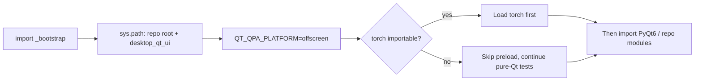
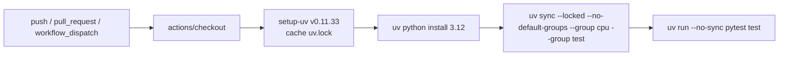

# Tests and Code Quality

Use this page when you modify source code, add a regression test, want to reproduce CI results locally, or need to confirm the code-style requirements. It documents the `test/` directory and its conventions, the commands for running tests locally, the `ruff` code-style configuration, and the CI quality gates defined by `.github/workflows/tests.yml`.

This guide does not cover packaging and release (see [Packaging and release](./packaging-and-release.md)), code layering and module boundaries (see [Architecture and code boundaries](./architecture-and-code-boundaries.md)), or the full steps for adding a feature (see [Adding or changing a feature](./adding-or-changing-a-feature.md)).

## Relevant code

- Test directory and conventions: the `test/` layout rules, and the roles of `test/README.md` and `test/_bootstrap.py`.
- Running tests locally: `uv` dependency sync, `pytest` invocation, and the pytest `testpaths`/`pythonpath` configuration.
- Code style: the rules in `desktop_qt_ui/ruff.toml`, the local self-check command, and its relationship to CI.
- CI quality gates: the triggers, steps, and environment variables of `tests.yml`, plus its boundary with the docs, packaging, Docker, and mirror-sync workflows.
- The desktop "Test Current Tab" (`Test Current Tab`) connection test belongs to API management; this guide only cites its i18n copy, while the full workflow lives on the API-management pages.

## Test directory and conventions

`test/` holds local tests and temporary regression scripts. The `.gitignore` rule is `/test/**` combined with `!/test/*.py`: only `.py` files directly under `test/` are tracked, while output images, temporary JSON, and files in subdirectories are ignored. Production code must not depend on anything in `test/`.

- Prefer pytest-style `test_*` test functions; every script should also run directly: `python test/<script>.py`.
- Scripts that use Qt or repository code must start with `import _bootstrap  # noqa: F401` as the first import.
- Prefer `pytest-qt` and `qtbot` for Qt widget tests (recommended by `test/README.md`; `pyproject.toml` does not currently declare `pytest-qt`, so fall back to direct script execution when it is not installed).
- 52 `test/*.py` files are currently tracked, 39 of them pytest-style `test_*.py` (verified with `git ls-files` on 2026-08-07).

`test/_bootstrap.py` centralizes the three things every test author must remember:

1. Add the repository root and `desktop_qt_ui` to `sys.path` (otherwise `No module named 'editor' / 'services'`).
2. Set `QT_QPA_PLATFORM=offscreen` before any PyQt6 import.
3. Load torch before PyQt6: on Windows, PyQt6's Qt DLL search path overrides `c10.dll` dependency resolution, and the reverse import order fails with `OSError: [WinError 1114] 动态链接库(DLL)初始化例程失败`. The desktop entry point `desktop_qt_ui/main.py` does the same (see pytorch#166628).



## Running tests locally

The repository is based on Python 3.12 (`requires-python = ">=3.12,<3.13"` in `pyproject.toml`) and dependencies are managed with `uv`. CI uses the CPU dependency group, so prefer matching it locally:

```powershell
uv sync --no-default-groups --group cpu --group test
uv run --no-sync pytest test
```

- The default `uv sync` installs `cuda13.0` + `packaging` + `test` (NVIDIA CUDA 13.0, PyInstaller, and test tools). The `cuda12.6` group provides the CUDA 12.6 environment from the same source branch. The installer disables default groups, so it does not check test dependencies. The `cpu`, `cuda13.0`, `cuda12.6`, `rocm7.2.1`, and `metal` groups are mutually exclusive via `[tool.uv] conflicts` in `pyproject.toml`.
- `[tool.pytest.ini_options]` in `pyproject.toml` fixes `testpaths = ["test"]` and `pythonpath = [".", "desktop_qt_ui"]`, preventing pytest from inheriting configuration and source paths from an adjacent older repository.
- When running the full suite, the pytest-reported `rootdir` must be the current Git repository root. If an older repository still exists in a parent directory, stale configuration can import the old `manga_translator` (e.g. `ModuleNotFoundError: No module named 'rusty_manga_image_translator'`); in that case verify the actual import path with `PYTHONPATH=.` first, and never report an adjacent repository's results as this repository's.
- Verified in this workspace on 2026-08-07: `uv run --no-sync pytest test --collect-only -q` collected 379 tests in about 26 seconds. This task did not run the full suite; CI owns the full run.

## Writing tests

- Start with `import _bootstrap  # noqa: F401`; build every test path from `_bootstrap.ROOT` instead of the current working directory (the cwd differs when launching from an IDE, PowerShell, or pytest).
- Put dependency replacements inside test functions or fixtures using `monkeypatch`, `unittest.mock.patch`, or another automatically restoring mechanism.
- Test modules must not write, delete, or bulk-mutate `sys.modules` at module level; `test_test_collection_isolation.py` scans and enforces this.
- Manage Qt widgets with `qtbot.addWidget(widget)` and prefer `qtbot.waitUntil(...)` / `qtbot.wait(...)` over bare `time.sleep()`; keep a module-level `QApplication` reference, because creating widgets after it is garbage-collected crashes the process.
- Production `except Exception: logger.error(...)` blocks swallow the `AttributeError` of a fake object missing a method, so failures look like "nothing happened"; if an assertion does not match, replace the fake logger with one that prints a traceback.
- When `ServiceManager`, caches, or temporary directories are involved, define initialization and cleanup boundaries inside the script; do not reuse real global service state without cleanup.
- Scripts that support both pytest and direct execution keep `if __name__ == "__main__": raise SystemExit(main())` at the bottom.
- Test behavior, not implementation details; name regression tests specifically, e.g. `test_region_list_preserves_dirty_translation_by_region_id`.

## Lint and code style

The only tracked static-analysis configuration is `desktop_qt_ui/ruff.toml` (verified with `git ls-files`: there is no `setup.cfg`, `tox.ini`, `.flake8`, or second `ruff.toml`, and `pyproject.toml` has no lint section). Its contents:

```toml
[lint]
select = ["E", "F", "I"]
ignore = ["E501", "E701", "E402"]
[format]
quote-style = "double"
```

Local self-check command (`ruff` is not declared in `pyproject.toml`, so install it separately):

```powershell
ruff check desktop_qt_ui manga_translator --config desktop_qt_ui/ruff.toml
```

Boundary note: `.github/workflows/tests.yml` currently has no explicit lint step, so the command above is a local self-check entry point, not a gate that CI currently enforces.

## CI and quality gates

`.github/workflows/tests.yml` (workflow name `Tests`) is the full-suite quality gate: every `push`, `pull_request`, and manual `workflow_dispatch` triggers it, and a new run for the same ref cancels the in-progress run (`concurrency.cancel-in-progress: true`). The `pytest` job runs on `windows-latest` with a 30-minute timeout and the environment variables `QT_QPA_PLATFORM=offscreen` and `PYTHONUTF8=1`.



Other workflows and their relationship to the quality gates:

| Workflow | Trigger | Role |
| --- | --- | --- |
| `.github/workflows/tests.yml` | push / pull_request / workflow_dispatch | Full pytest suite (Windows, Python 3.12, CPU) |
| `.github/workflows/docs-pages.yml` | `doc/wiki/**` changes on main / workflow_dispatch | Builds VitePress and deploys to GitHub Pages |
| `.github/workflows/build-and-release.yml` | `v*` tags / release published / workflow_dispatch | PyInstaller CPU/GPU packaging and release (see [Packaging and release](./packaging-and-release.md)) |
| `.github/workflows/docker-build-push.yml` | `v*` tags / workflow_dispatch | Builds and pushes CPU/GPU Docker images |
| `.github/workflows/sync-to-gitee.yml` | push / workflow_dispatch | Mirrors the repository to Gitee and GitCode |

## Test coverage overview

The table groups the currently tracked test files by area; it is not a coverage percentage (the repository does not wire a coverage tool into the test command or CI).

| Area | Representative files | Covered behavior |
| --- | --- | --- |
| Bootstrap and collection isolation | `test/_bootstrap.py`, `test/test_test_collection_isolation.py` | sys.path / offscreen / torch load order; bans module-level `sys.modules` mutation |
| Security regressions | `test/test_code_scanning_security.py` | Rejects remote image URLs and path traversal, API-status fingerprint sanitization, HQ-response fallback |
| Editor model and document | `test_editor_dirty_detection.py`, `test_editor_image_lifetime.py`, `test_editor_inpaint_cache_reset.py`, `test_editor_inpainted_fallback.py`, `test_editor_inpainted_layer_switch.py`, `test_editor_performance_refactor.py`, `test_editor_export_executor.py`, `test_translation_edit_ops_capture.py`, `test_textblock_rich_safety.py` | Dirty marking, image lifetime, inpaint cache/fallback/layer switching, export executor, translation edit operations, rich-text safety |
| Editor UI widgets | `test_editor_center_scale.py`, `test_editor_toolbar_menu.py`, `test_font_combo_box.py`, `test_font_combo_search_menu.py`, `test_font_family_sanitization.py` | Canvas scaling, toolbar menus, font combo and search, font-family sanitization |
| Rich text | `test_rich_text_editing.py`, `test_rich_text_floating_editor.py`, `test_rich_text_rendering.py`, `test_rich_text_rules.py`, `test_rich_text_rules_editor_live.py`, `test_rich_text_sync.py`, `test_rich_text_underline.py` | Editing, floating editor, rendering, rules, sync, underline |
| Batch editing | `test_batch_edit_engine.py`, `test_batch_edit_panel.py` | Batch-edit engine and panel |
| App logic and file pipeline | `test_app_logic_file_sources.py`, `test_file_list_snapshot_view.py`, `test_ui_io_pipeline.py`, `test_export_inmemory_payload.py`, `test_update_fetch_failure.py` | File sources, snapshot view, UI/IO pipeline, in-memory export, update-check failure |
| Engine and model adapters | `test_chinese_linebreak_spaces.py`, `test_layout_mode_common_flow.py`, `test_paddleocr_vl_native_loader.py`, `test_per_block_inpainting.py`, `test_yolo_obb_rearrange_edge_merge.py`, `test_yolo_obb_sfx_filter.py` | Chinese line breaking, layout, PaddleOCR-VL, per-block inpainting, YOLO OBB rearrange-edge merge / SFX filter |
| Prompts and translation | `test_gemini_hq_image_preparation.py`, `test_prompt_preview_fluent_icons.py` | Gemini HQ image preparation, prompt-preview icons |
| Directly runnable scripts | `check_char_tables.py`, `render_golden.py`, `repro_seam_dilution.py`, `ps_italic_angle.py`, etc. | Debug/regression scripts not collected by pytest; run with `python test/<script>.py` |

## Constraints and notes

- The `cpu` / `cuda13.0` / `cuda12.6` / `rocm7.2.1` / `metal` groups are mutually exclusive and cannot be installed together; CI and the commands on this page use `cpu` + `test`. The default `uv sync` is `cuda13.0` + `packaging` + `test`, so running tests on a machine without an NVIDIA environment may behave differently due to the torch backend.
- `uv.lock` is a committed lockfile that must not be hand-edited; CI uses `uv sync --locked` for reproducibility.
- On Windows, torch must load before PyQt6; `_bootstrap.py` handles this, so do not `import torch` yourself or assume "my test does not use torch".
- Only `test/*.py` is tracked; output images, temporary JSON, and subdirectory files are ignored. Do not treat ignored temporary artifacts as official test results, and do not modify `.gitignore` to un-ignore them.
- Tests and documentation never read real `.env`, user `config.json`, API keys, user images, or private prompts; the security regression test specifically verifies that path traversal and remote image URLs are rejected.
- The coverage overview is a file grouping, not proof that every feature is covered; the page claims no coverage percentage.

## Developer Guide {#developer-guide}

### Option matrix {#option-matrix}

#### Connection-test UI copy

The desktop app has no "run the test suite" button; the closest testing UI is the "Test Current Tab" (`Test Current Tab`) connection test on the API-management page. The following i18n strings appear while a developer checks credentials; when a key differs from its final display text, use the actual value. The full workflow is documented on the API-management pages.

| UI call key | English actual value | Simplified Chinese actual value |
| --- | --- | --- |
| `Test` | Test | 测试 |
| `Test Current Tab` | Test Current Tab | 测试当前页 |
| `Testing` | Testing | 测试中 |
| `API connection test successful!` | API connection test successful! | API连接测试成功！ |
| `API connection test failed` | API connection test failed | API连接测试失败 |
| `No API channels to test` | No API channels to test | 没有可测试的 API 通道 |
| `API test available` | available | 可用 |
| `API test unavailable` | unavailable | 不可用 |
| `Open log folder` | Open log folder | 打开日志文件夹 |
| `Log output...` | Log output... | 日志输出... |

### Related files

| File | Actual role on this page | Notes |
| --- | --- | --- |
| `pyproject.toml` | Dependencies, backend groups, pytest `testpaths`/`pythonpath` | No lint section |
| `uv.lock` | Locks dependency versions | CI uses `--locked` |
| `test/README.md` | Test-script conventions | The only test-conventions document |
| `test/_bootstrap.py` | Common test bootstrap | sys.path / offscreen / torch order |
| `test/test_*.py` | pytest cases | 39 files (verified 2026-08-07) |
| `desktop_qt_ui/ruff.toml` | lint/format configuration | Local self-check entry point |
| `.github/workflows/tests.yml` | Full-suite test CI | No lint step |
| `.github/workflows/docs-pages.yml` | Wiki build and deployment | Triggered by `doc/wiki/**` changes |
| `desktop_qt_ui/locales/en_US.json` / `zh_CN.json` | UI copy | Source for the three-column comparison |
| `.gitignore` | `/test/**` and `!/test/*.py` rules | Defines the tracked test boundary |

### Code locations {#source-evidence}
| Layer | File | What was checked |
| --- | --- | --- |
| Test conventions | `test/README.md`, `test/_bootstrap.py` | Directory rules, import order, Qt test conventions |
| Dependencies and pytest config | `pyproject.toml`, `uv.lock` | Python 3.12, backend groups, `testpaths`/`pythonpath` |
| CI | `.github/workflows/tests.yml` | Triggers, steps, environment variables, timeout, no lint step |
| Lint | `desktop_qt_ui/ruff.toml` | `select`/`ignore`/`format` rules |
| i18n | `desktop_qt_ui/locales/en_US.json`, `zh_CN.json` | Actual values of connection-test and log copy keys |
| Repository rules | `.gitignore` | `/test/**` and `!/test/*.py` |
