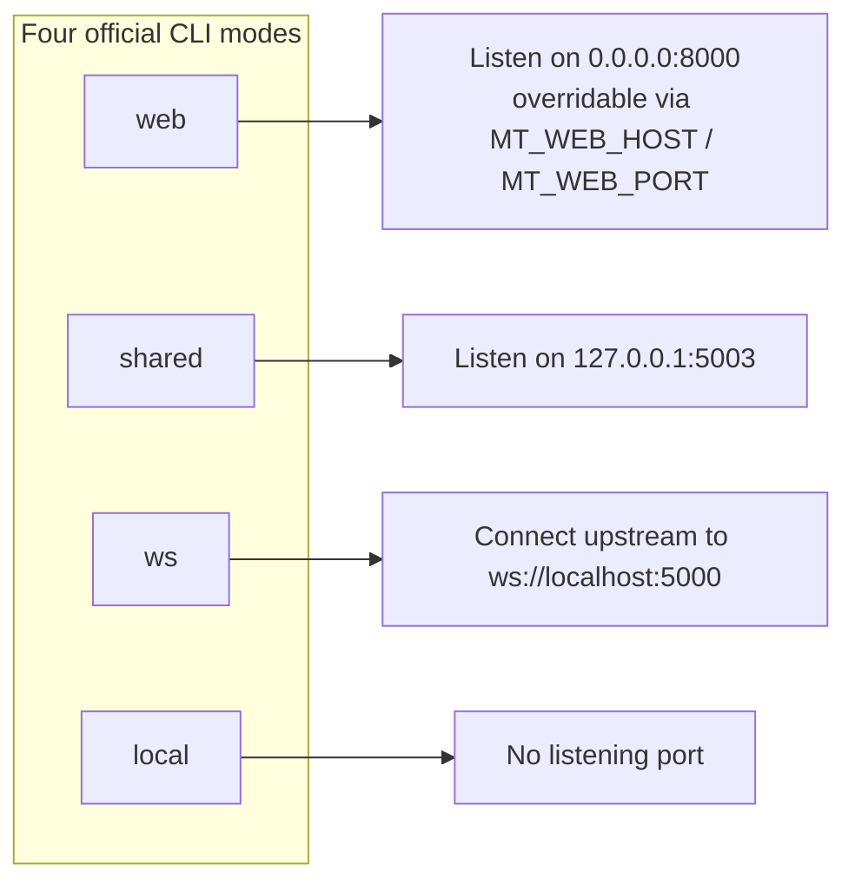

# Web Server Ports and Deployment

Use this page when you need to expose the Web service to a LAN or the public, debug a port conflict, or write a startup script for CI/CD. It documents the `web` mode listen contract, the official deployment methods, Docker port mappings, and the `MT_*` environment variables. This page targets developers and does not repeat end-user UI operations (see [Launch and access](../web/launch-and-access.md)), user-facing security boundaries (see [Deployment security and troubleshooting](../web/deployment-security-and-troubleshooting.md)), or image installation steps (see [Docker deployment](../install/docker.md)); HTTP route contracts live in [Developer HTTP API](./http-api/translation-endpoints.md) and related pages.

## Relevant code {#feature-boundary}

- `web` is the only official CLI entry that exposes both the HTTP API and the Web UI; it listens on `0.0.0.0:8000` by default and can be overridden with `MT_WEB_HOST` / `MT_WEB_PORT`.
- `shared` and `ws` are internal execution modes that listen on `127.0.0.1:5003` and connect upstream to `ws://localhost:5000` by default; they are not external ports for browser access.
- This page records only ports, deployment, and environment variables; model loading, GPU, timeout, and concurrency settings are only mentioned as entry points, with details in their respective parameter pages.

## Port contract {#ports-contract}

`0.0.0.0` means the server listens on all IPv4 interfaces; it is not a browser address. Locally you usually use `http://127.0.0.1:8000` or `http://localhost:8000`; LAN clients must use the server's real LAN address. External reachability depends on firewall, port mapping, and network environment, which source code alone cannot assert.



## Deployment methods {#deployment-methods}

### Run from source {#run-from-source}

```powershell
uv run --no-sync python -m manga_translator web
uv run --no-sync python -m manga_translator web --host 0.0.0.0 --port 8080
```

- Without `--host` / `--port`, the parser reads `MT_WEB_HOST` / `MT_WEB_PORT` at startup and falls back to the code defaults `0.0.0.0:8000`.
- Explicit command-line arguments take precedence over environment variables: `args.py` computes defaults with `os.getenv`, and argparse then overrides them with CLI values.
- Startup logs print `[SERVER CONFIG]` (GPU, verbose, TTL, retries, concurrency) and `Nonce:` but not the listen address; Uvicorn's own startup log shows the actual host/port.
- The server sets `MANGA_TRANSLATOR_WEB_SERVER=true` in the process environment at startup so translators skip reloading `.env`, preventing them from overwriting already-loaded server keys.

### Docker Compose {#docker-compose}

Run from the `packaging/` directory of the repository (the build context is still the project root):

```bash
docker compose up --build -d manga-translator-cpu   # after healthy, visit http://127.0.0.1:8000/
docker compose up --build -d manga-translator-gpu   # after healthy, visit http://127.0.0.1:8001/
```

- The CPU service maps host `8000` to container `8000`; the GPU service maps host `8001` to container `8000`. The container always listens on `8000`.
- Compose sets `MT_WEB_HOST=0.0.0.0` and `MT_WEB_PORT=8000` for both services, `MT_USE_GPU=false` for CPU, and `MT_USE_GPU=true` for GPU.
- The image health check uses `curl -f http://localhost:8000/`: after 3 consecutive failures and a 60-second start period the container is marked unhealthy.
- Mounted volumes persist the `fonts`, `dict`, `result`, `models`, `logs`, `server` data directories and `config`. To persist API keys saved in the admin UI, create an empty `./data/app.env` file and uncomment the `./data/app.env:/app/.env` mount.
- The example admin password in the Compose template is a placeholder that must be at least 6 characters; for public deployment always set a random password through an uncommitted environment override or the admin UI, never the sample value.

### Data locations and startup entry {#data-locations}

| Path | Role | Location in Docker |
| --- | --- | --- |
| `config/config.json` (`get_config_path`) | Web runtime configuration; generated from a template when missing | `/app/config` (restored from the image's default backup by the entrypoint when the mount is empty) |
| `manga_translator/server/data/admin_config.json` | Admin settings, password, registration and quota policy | `/app/manga_translator/server/data` |
| `<application dir>/.env` | Server-side API keys and other environment variables; loaded at startup by `main.py` with `override=False` | `/app/.env` (persists only when explicitly mounted) |
| `manga_translator/server/static/` | Frontend files such as `index.html`, `login.html`, `admin-new.html` | Read-only inside the image |

In packaged builds the application directory is the directory of `sys.executable` (`runtime_paths.py#get_application_dir`); when running from source it is the repository root. Therefore the release `config/` and `.env` live next to the executable and cannot be inferred from PyInstaller's internal directory.

## Environment variables {#environment-variables}

Precedence: explicit command-line argument > environment variables already present when the process starts > `.env` file > code default. `main.py` loads `.env` with `override=False`, so same-name variables already in the process environment are not overwritten; the admin `POST /env` endpoint writes the application-directory `.env` through `EnvService` and then reloads it with `override=True`.

This guide does not list or display any real secret. Credential variables such as `OPENAI_API_KEY` and `GEMINI_API_KEY` are only read by translators; the server `/env` and `/env/effective` endpoints never return plaintext.

## Constraints and notes {#dependencies-and-conflicts}

- Listening on `0.0.0.0` does not mean the service is externally reachable; the Windows firewall, cloud security groups, and NAT port mapping decide LAN/public reachability, and source code alone cannot prove the actual exposure.
- Port usage: `web` defaults to `8000`, the Docker GPU host entry is `8001`, and `shared` / `ws` use `5003` for different purposes; if another instance or an older service occupies a port on the same host, Uvicorn fails to start.
- CORS is configured as `allow_origins=["*"]` plus `allow_credentials=True`, but that is a source configuration and does not mean browsers will allow every origin/credential combination; cross-origin deployments need real browser preflight verification.
- `MANGA_TRANSLATOR_WEB_SERVER=true` makes translators (OpenAI/Gemini and others) skip reloading `.env` to avoid overwriting server keys; this differs from the CLI local mode's `.env` reload behavior.
- `web` mode forces `start_instance=False` and does not spawn a `shared` translator process automatically; the `server/args.py --start-instance` process-spawning path belongs to the unwired standalone entry and must not be treated as official `web` mode behavior.

## Developer Guide {#developer-guide}

### Option matrix {#option-matrix}

#### Port contract

| Entry point | Source-fixed value | Notes and source |
| --- | --- | --- |
| `web` mode | `--host` defaults to `MT_WEB_HOST` or `0.0.0.0`; `--port` defaults to `MT_WEB_PORT` or `8000` | `manga_translator/args.py`; `server/main.py#run_server()` starts Uvicorn with the same values |
| Uvicorn | `timeout_keep_alive=1800`, `timeout_graceful_shutdown=30` | Keeps long connections for 30 minutes to support batch translation; 30-second graceful shutdown |
| `shared` mode | `--host` / `--port` default to `127.0.0.1:5003` | `manga_translator/args.py`; `mode/share.py` starts the internal FastAPI with it |
| `ws` mode | Listens locally on `127.0.0.1:5003`; `--ws-url` defaults to `ws://localhost:5000` | `manga_translator/args.py`; `mode/ws.py` reads `ws_url` |
| Docker CPU | Container listens on `8000`; Compose maps `8000:8000` | `packaging/Dockerfile`, `packaging/docker-compose.yml` |
| Docker GPU | Container still listens on `8000`; Compose maps `8001:8000` | The host-facing entry is `8001`, not the in-container `8000` |
| Unwired parser | `manga_translator/server/args.py` defaults to `127.0.0.1:8000` (help text says `8080`) | Not used by the official top-level `manga_translator.args`; do not rewrite the official default from it |

#### Environment variables

| Environment variable | Role | Read from |
| --- | --- | --- |
| `MT_WEB_HOST` | Default listen address for `web` mode; falls back to `0.0.0.0` | `manga_translator/args.py` |
| `MT_WEB_PORT` | Default listen port for `web` mode; falls back to `8000` | `manga_translator/args.py` |
| `MT_USE_GPU` | Default for `web --use-gpu`; truthy when `true` / `1` / `yes` / `on` | `manga_translator/args.py` |
| `MT_DISABLE_ONNX_GPU` | Disables ONNX Runtime GPU acceleration; same truthiness rule | `manga_translator/args.py`, `utils/onnx_runtime.py` |
| `MT_MODELS_TTL` | Seconds to keep models in memory after last use; `0` means forever | `manga_translator/args.py` |
| `MT_RETRY_ATTEMPTS` | Retry count on failure; `-1` retries forever; when unset, delegates to the API-provided config | `manga_translator/args.py` |
| `MT_VERBOSE` | Verbose logging switch; truthy when `true` / `1` / `yes` | `manga_translator/args.py` |
| `MT_WEB_NONCE` | Nonce for internal `/register` and shared communication; generated with `secrets.token_hex(16)` when absent | `server/main.py`, `server/args.py`, `server/export_utils.py` |
| `MANGA_TRANSLATOR_ADMIN_PASSWORD` | Initializes the admin password on first startup (at least 6 characters; does not create a login account automatically) | `server/core/config_manager.py` |
| `MANGA_TRANSLATOR_WEB_SERVER` | Set to `true` by the server process so translators skip reloading `.env` | `server/main.py`, `translators/openai.py`, etc. |
| `MANGA_TRANSLATOR_ENV_PATH` | Hint path pointing to the application-directory `.env` (`APP_DOTENV_PATH_ENV`) | `utils/dotenv_utils.py` |
| `WS_SECRET` | Upstream WebSocket secret for `ws` mode | `mode/ws.py` |

#### UI copy {#ui-copy}

This page targets developers; the checkable UI copy mainly comes from the Web admin console and the shared locales:

| UI call key | English actual value | Simplified Chinese actual value |
| --- | --- | --- |
| `web_server_config` | Server Configuration | 服务器配置 |
| `web_admin_panel` | Admin Panel | 管理面板 |
| `web_use_server_config` | Use Server Config | 使用服务器配置 |
| `web_use_custom_config` | Use Custom Config | 使用自定义配置 |
| `web_save_config` | Save Config | 保存配置 |

These `web_*` keys come from the shared desktop locales (`desktop_qt_ui/locales/en_US.json`, `zh_CN.json`). `admin-new.html` currently hardcodes navigation and panel text such as “服务器配置” in Chinese and does not call these keys one by one, so parts of the admin interface remain Chinese when English is selected.

### Related files and formats {#related-files}

| File | Actual role on this page | Note |
| --- | --- | --- |
| `manga_translator/args.py` | Four subcommands, `web` options, and `MT_*` defaults | Environment-variable defaults are evaluated at process startup |
| `manga_translator/server/main.py` | Uvicorn startup, CORS, static mounts, `.env` loading, `/register` nonce | `timeout_keep_alive=1800` |
| `manga_translator/server/args.py` | Standalone parser (`127.0.0.1:8000`) | Not wired into the official top-level dispatch |
| `packaging/Dockerfile`, `packaging/docker-compose.yml`, `packaging/docker-entrypoint.sh` | CPU/GPU builds, port mapping, volumes, health checks, default-data restore | Sample admin password must be replaced |
| `manga_translator/server/core/env_service.py` | `.env` read/write, hot reload, and masking | Backend for admin UI key saving |
| `manga_translator/utils/dotenv_utils.py` | `load_app_dotenv` and `MANGA_TRANSLATOR_ENV_PATH` | `override` semantics affect precedence |
| `manga_translator/runtime_paths.py`, `manga_translator/server_paths.py` | Application dir, `config/`, `server/data/` paths | Packaged dir sits next to the executable |
| `manga_translator/server/core/config_manager.py` | `admin_config.json` and `MANGA_TRANSLATOR_ADMIN_PASSWORD` | Never shows a real password |

### Mermaid boundary {#mermaid-boundary}

The port diagram above only represents the endpoints bound by each official CLI mode; it does not mean `web` automatically spawns `shared` / `ws` processes, nor that a listener for `ws://localhost:5000` necessarily exists inside this repository. The Docker mapping only describes the Compose template's port mapping; the real exposure scope, firewall, and reverse-proxy configuration must be verified in the target environment.

### Code locations {#source-evidence}
| Layer | File | What was checked |
| --- | --- | --- |
| CLI contract | `manga_translator/args.py`, `manga_translator/__main__.py` | Four modes, `web --host/--port`, `MT_*` defaults, and dispatch |
| Server startup | `manga_translator/server/main.py` | Uvicorn host/port/timeouts, CORS, static mounts, `.env`, nonce |
| Internal ports | `manga_translator/mode/share.py`, `mode/ws.py` | `127.0.0.1:5003`, `ws://localhost:5000`, `WS_SECRET` |
| Standalone parser | `manga_translator/server/args.py`, `server/export_utils.py` | `127.0.0.1:8000` default and `--start-instance` differences |
| Docker | `packaging/Dockerfile`, `packaging/docker-compose.yml`, `packaging/docker-entrypoint.sh` | Port mapping, volumes, health checks, default-data restore, sample password |
| Environment service | `manga_translator/server/core/env_service.py`, `utils/dotenv_utils.py` | `.env` read/write, hot reload, masking, and `override` semantics |
| Paths | `manga_translator/runtime_paths.py`, `manga_translator/server_paths.py` | Application dir, `config/`, `server/data/` |
| Admin config | `manga_translator/server/core/config_manager.py` | `MANGA_TRANSLATOR_ADMIN_PASSWORD` initialization rules |
| UI/i18n | `desktop_qt_ui/locales/en_US.json`, `desktop_qt_ui/locales/zh_CN.json`, `server/static/admin-new.html` | Actual `web_*` key values and admin-console hardcoded differences |
