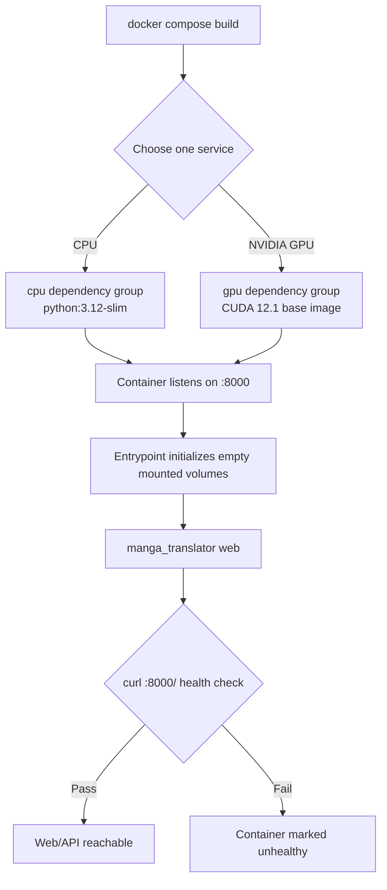

# Docker Deployment

This guide explains how to build the current-source CPU or NVIDIA GPU Web service containers, map ports, retain configuration, and inspect service state. The Docker image supplies the Web UI and HTTP API, not the desktop Qt workspace; Web user operations and HTTP contracts belong to their respective pages. This guide does not cover publishing image sources, concrete reverse-proxy configuration, or host-level backup policy.

## Start with Compose

`packaging/docker-compose.yml` defines both CPU and GPU services, but normally start only one to avoid consuming two Web ports and two sets of model resources.

### Quick start

For a quick test you can use the published images directly, with no local build:

```bash
docker run -d --name manga-translator -p 8000:8000 hgmzhn/manga-translator:latest-cpu
```

For NVIDIA GPUs use `hgmzhn/manga-translator:latest-gpu`. The images are published on both Docker Hub (`hgmzhn/manga-translator`) and GitHub Container Registry (`ghcr.io/hgmzhn/manga-translator`, possibly faster in some regions); choose either. After startup, visit `http://localhost:8000` (user interface) and `http://localhost:8000/admin` (admin interface).

### Persistent Compose example

For long-term use, mount the data directories as in `packaging/docker-compose.yml` (all paths are relative to `packaging/`):

```yaml
services:
  manga-translator:
    image: hgmzhn/manga-translator:latest-cpu
    container_name: manga-translator
    restart: unless-stopped
    ports:
      - "8000:8000"
    environment:
      MT_WEB_HOST: 0.0.0.0
      MT_WEB_PORT: 8000
      MANGA_TRANSLATOR_ADMIN_PASSWORD: change_me_123456
    volumes:
      - ./data/models:/app/models
      - ./data/fonts:/app/fonts
      - ./data/dict:/app/dict
      - ./data/config:/app/config
      - ./data/server:/app/manga_translator/server/data
      - ./data/logs:/app/logs
      - ./data/result:/app/result
      # To keep server API keys saved in the Web admin UI across recreation,
      # create an empty file ./data/app.env first, then uncomment the next line:
      # - ./data/app.env:/app/.env
```

The admin password in the example is a placeholder; replace it with a random password before public deployment.

### Ports and environment variables

| Item | Meaning |
| --- | --- |
| Container port | `8000` |
| Host port | CPU `8000`, GPU `8001` (customizable) |
| `MT_WEB_HOST` | Listening address, default `0.0.0.0` |
| `MT_WEB_PORT` | Service port, default `8000` |
| `MT_USE_GPU` | Set to `true` for the GPU image |
| `MT_MODELS_TTL` | Model in-memory TTL in seconds, default `0` (keep forever) |
| `MT_RETRY_ATTEMPTS` | Translation failure retry count; `-1` means unlimited |
| `MT_VERBOSE` | Verbose logging, default `false` |
| `MANGA_TRANSLATOR_ADMIN_PASSWORD` | Legacy admin password, at least 6 characters; does not replace `/auth/setup` |

The CPU service maps host `8000` to container `8000`; once healthy, visit `http://127.0.0.1:8000/`. The GPU service requires a compatible NVIDIA driver and NVIDIA Container Toolkit on the host, maps host `8001` to container `8000`, and is visited at `http://127.0.0.1:8001/` once healthy. The container always listens on `8000`.

On the first Web visit, create the first administrator account as prompted by the login page. `MANGA_TRANSLATOR_ADMIN_PASSWORD` in Compose only sets an older service-administration password: it requires at least six characters, does not replace `/auth/setup`, and does not automatically create a login account. Do not use the example password in the repository Compose file. Before a public deployment, set a new random password through an uncommitted environment override or administration configuration.

## How the image runs

The Dockerfile uses a multi-stage build: CPU is based on `python:3.12-slim`, GPU on `nvidia/cuda:12.1.0-cudnn8-runtime-ubuntu22.04`; both install system libraries and run the source in `/app`. The build runs `uv sync --locked --no-default-groups --group cpu` or `--group gpu`, so dependencies must match the lock file and chosen build type.

The image exposes and listens on container port `8000`; its default command is `python -m manga_translator web --host 0.0.0.0 --port 8000`. Before startup, the entrypoint checks mounted `config`, `fonts`, `dict`, and server-data directories. When one is empty, it copies initialization data from an image backup and then executes the main command. Both the image and Compose use `curl http://localhost:8000/` as the health check; after a 60-second start period, three consecutive failures mark the container unhealthy.



Host `8000:8000` (CPU) or `8001:8000` (GPU) changes only the external entry point, not the service's internal port. `0.0.0.0` listens on all IPv4 interfaces; it is not a browser address. LAN or Internet access also depends on firewalls, routing, and reverse proxies.

## Dependencies, resources, and conflicts

- CPU and GPU are alternative Compose services. Do not start both unless two isolated services are intentional and the machine can support each service's memory, model cache, and port use.
- The GPU service requires NVIDIA Container Toolkit and requests all available NVIDIA GPUs in Compose. AMD ROCm and macOS Metal have no corresponding Compose service, so neither CPU nor GPU service is their installation method.
- The CPU image uses uv's `cpu` group; the GPU image uses `gpu`. They respectively use `onnxruntime` or `onnxruntime-gpu`; GPU also has CUDA-matched Torch and `xformers`. Do not copy dependencies across groups.
- First model use can download models and consume substantial disk, RAM, or VRAM. Compose memory limits are container limits, not a model-compatibility guarantee. CPU is configured for an 8G limit and 2G reservation; GPU for 16G and 4G, which must be adjusted for the machine.
- The Dockerfile uses a CUDA 12.1 runtime base image, while bare `uv sync` uses the default GPU index specified by the current `pyproject.toml`. Do not derive commands for other platforms from the Dockerfile.

## Persistent volumes, environment variables, and formats

Compose paths are relative to `packaging/`:

| Host directory | Container directory | Contents and notes |
| --- | --- | --- |
| `data/fonts` | `/app/fonts` | Font resources; do not share volumes containing private font files |
| `data/dict` | `/app/dict` | Prompts, dictionaries, and rules; may contain private prompts |
| `data/result` | `/app/result` | Translation results and possible user images/text |
| `data/models` | `/app/models` | Model weights and cache; usually large |
| `data/logs` | `/app/logs` | Log directory; logs can contain paths, errors, and task information |
| `data/server` | `/app/manga_translator/server/data` | Accounts, permissions, sessions, history, and user resources |
| `data/config` | `/app/config` | Configuration and templates; an empty directory is initialized by the entrypoint |

To retain server API configuration saved through the Web administration UI after container recreation, first create an empty `packaging/data/app.env`, then uncomment `./data/app.env:/app/.env` in Compose. Do not commit `.env`, account data, session tokens, API keys, user images, or prompts to Git; manage mounted directories with least privilege and a backup-retention policy.

Runtime environment variables include `MT_WEB_HOST`, `MT_WEB_PORT`, `MT_USE_GPU`, `MT_DISABLE_ONNX_GPU`, `MT_MODELS_TTL`, `MT_RETRY_ATTEMPTS`, and `MT_VERBOSE`. They override Web startup behavior, backend selection, model caching, retry, or logging; their precise defaults come from `manga_translator/args.py` and Compose. This page records only the existence and minimum-length validation of `MANGA_TRANSLATOR_ADMIN_PASSWORD`, never its value.
