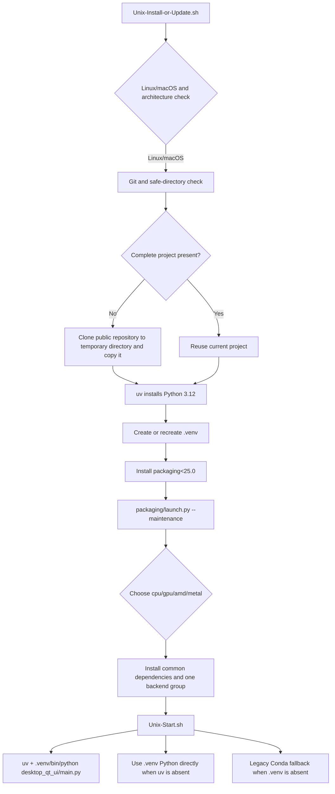

# Linux and macOS Installation

This guide covers the Linux/macOS source installation, update, and Qt desktop startup entry points. It is limited to the Unix bootstrap scripts, `.venv`, uv, and platform dependency selection; Windows portable installation, Docker, version switching, and uninstalling belong to their respective installation pages.

The scripts work in the directory containing the scripts. You can download the two scripts into a new, writable, trusted directory, or run the installer from the root of an already-cloned complete repository. Installation does not require entering keys, tokens, or user images on the command line.

## Install and start

### First installation

Linux and macOS share the `Unix-Install-or-Update.sh` and `Unix-Start.sh` scripts. Quick install:

```bash
curl -O https://raw.githubusercontent.com/hgmzhn/manga-translator-ui/main/Unix-Install-or-Update.sh
chmod +x Unix-Install-or-Update.sh
./Unix-Install-or-Update.sh
```

The script checks and installs Git when needed, uses uv to install Python 3.12, creates `.venv` in the project directory, and then opens the bilingual maintenance menu; the first full dependency installation is performed by the menu's Install action. Manual clone method:

```bash
git clone https://github.com/hgmzhn/manga-translator-ui.git
cd manga-translator-ui
chmod +x Unix-*.sh
./Unix-Install-or-Update.sh
```

Do not put the script into a non-empty directory containing unrelated files; it refuses to clone there. After the first confirmation, the script checks the platform and Git and bootstraps Git, uv, and Python 3.12 when needed, then creates `.venv` at the project root. It installs only `packaging<25.0`, which the maintenance menu needs, and opens the bilingual Python maintenance menu. When a complete repository has already been downloaded, run the same entry point from its root; it reuses the existing project instead of cloning again.

### Start the desktop UI

After installation, run this from the project root:

```bash
./Unix-Start.sh
```

`Unix-Start.sh` prefers `.venv/bin/python` and, when available, uses uv to execute `desktop_qt_ui/main.py`; if uv is absent, it directly invokes the `.venv` Python. Only when `.venv` is absent does it try fixed-path or Conda legacy-environment fallbacks. The legacy path is for compatibility with an existing installation, not a new installation method.

You can inspect the start command without launching the UI:

```bash
MANGAT_DRY_RUN=1 ./Unix-Start.sh
```

This mode only prints the command it would run; it still checks the project files and `.venv`. The bootstrap script also accepts `MANGAT_AUTO_CONFIRM=1` to answer its first confirmation automatically. Use that only in controlled automation; do not combine it with an unknown directory or repository URL.

### Maintenance menu

`Unix-Install-or-Update.sh` ultimately executes `packaging/launch.py --maintenance`. The menu shows the current branch and mirror, and persists its language selection in `packaging/maintenance_config.json`. Back up uncommitted source and local configuration before updating or switching branches/tags; update actions can alter the working tree. The menu options and their actual wording and stored values are listed in the [UI Options Reference](../reference/options-i18n-matrix.md).

## Platform dependency selection

The project requires Python `>=3.12,<3.13`, so the current installer fixes Python to 3.12. `pyproject.toml` separates common dependencies from four mutually exclusive dependency groups. One environment can select only one backend group.

The mapping from stored values to the displayed names is listed in the [UI Options Reference](../reference/options-i18n-matrix.md).

Automatic selection during installation works broadly as follows:

- Apple Silicon macOS selects `metal`, using PyTorch MPS, CPU ONNX Runtime, and Cocoa-framework support.
- Linux NVIDIA selects `cuda13.0` or `cuda12.6` from the driver-reported CUDA major version; CPU remains available as a fallback.
- Linux AMD recommends `rocm7.2.1` only for a detected supported ROCm architecture. When hardware cannot be identified or is incompatible, it recommends `cpu`. The force-ROCm choice explicitly warns that compatibility is not guaranteed.
- If hardware detection fails or an Intel GPU is detected, the script offers manual selection; CPU is the compatibility-first fallback.

The source-development defaults are `cuda13.0`, `packaging`, and `test`, but Unix maintenance disables defaults and selects only the detected hardware variant. Do not enable `cpu`, `cuda13.0`, `cuda12.6`, `rocm7.2.1`, and `metal` together; `tool.uv.conflicts` declares them mutually exclusive.

## What the installer does



The bootstrap script stops at bootstrapping the project, Python, and the maintenance menu. Full dependency installation, code updates, branches/tags, mirrors, and dependency-integrity checks are handled by `packaging/launch.py`. The start script does not automatically synchronize dependencies or silently substitute system Python when `.venv` is missing; it asks you to rerun the install entry point.

For Update, the maintenance menu checks local and remote versions/commits and the dependencies required by the current PyTorch variant. It fetches code and installs missing dependencies only when needed. A network failure can be retried by switching mirrors from the menu, but a mirror does not change the selected software backend.

## Dependencies, conflicts, and platform limits

- **Python:** only 3.12 is supported; 3.13 or another version is not a supported environment.
- **Mutual exclusion:** `cpu`, `cuda13.0`, `cuda12.6`, `rocm7.2.1`, and `metal` cannot coexist. Both CUDA groups include `onnxruntime-gpu` and `xformers`; CPU and macOS Metal use CPU ONNX Runtime.
- **ROCm:** PyTorch and Triton in `rocm7.2.1` are conditional on Linux x86_64. Do not choose this group on macOS. Unsupported AMD architectures may still fail when force-installed.
- **Architecture:** the installer explicitly supports macOS `arm64`/`x86_64` and Linux `x86_64`/`amd64`; other Linux architectures require confirmation and are not promised to work with bundled wheels.
- **Compilation and wheels:** `pydensecrf` is resolved from platform-specific prebuilt-wheel sources declared by the project. Installation fails if no matching wheel is available; do not expose or commit private wheels.
- **Graphical prerequisites:** the desktop UI depends on PyQt6. Linux Qt/system graphics libraries, macOS graphics permissions, and drivers remain operating-system responsibilities; a headless server is not the desktop-UI environment covered here.
- **Runtime resources:** detection, OCR, inpainting, translation, and rendering can download/read models, fonts, and dictionaries based on enabled features. Put API keys only in your own configuration, never in script arguments, logs, or screenshots.
