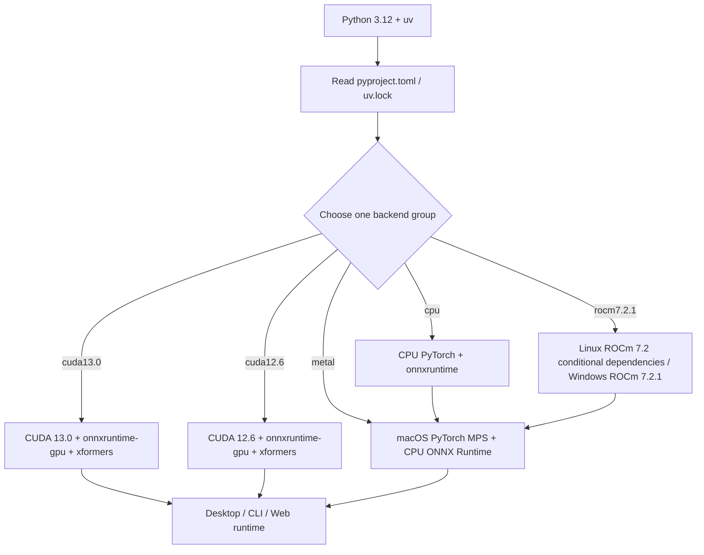

# Runtime Requirements

## Who this installation is for

This guide covers installation prerequisites: Python and uv versions, CPU/NVIDIA/AMD/Apple Silicon backends, common Python packages, models, fonts, and dictionaries. See [Windows portable](./windows-portable.md) for the Windows package menu and updates, [Linux and macOS](./linux-and-macos.md) for Unix scripts, and [Docker](./docker.md) for volumes. It does not document API keys, user configuration, or translation quality.

The current source of dependency truth is `pyproject.toml` and `uv.lock`. `requirements_cpu.txt`, `requirements_gpu.txt`, `requirements_amd.txt`, and `requirements_metal.txt` are retained legacy/platform notes and must not be mixed into a current uv environment.

## System requirements

| Item | Minimum | Recommended |
| --- | --- | --- |
| OS | Windows 10/11 (64-bit), Linux, or macOS 12+ (Apple Silicon) | Same as minimum |
| RAM | 8 GB | 16 GB or more |
| Disk | 5 GB free space | 10 GB SSD |
| Python (source) | 3.12 (`>=3.12,<3.13`) | 3.12 |
| NVIDIA GPU | GTX 1060 or newer with 6 GB VRAM; GeForce 10-series GPUs must use CUDA 12.6, while CUDA 13.0 requires Turing (compute capability 7.5) or newer | More VRAM is better |
> GeForce 10-series GPUs must use CUDA 12.6. RTX 50-series GPUs require CUDA 13.0. If the current driver does not support it, update the NVIDIA driver first.
| AMD GPU | RX 7000/9000 series only (RDNA 3/4); ROCm is experimental. Use the CPU build on RX 5000/6000 | — |

> Windows AMD users can choose the experimental AMD portable release or install through the maintenance script. Both require a supported GPU, Radeon ROCm 7.2.1, and AMD driver 26.2.2; this remains an experimental Windows path.

## Pre-install checks

1. Use Python **3.12**. The project requires `>=3.12,<3.13`; Python 3.13+ is unsupported.
2. Install `uv`, run the command for the target backend from the repository root, and select exactly one backend group.
3. Provide network access and disk space for PyTorch, models, and (when semantic line breaking is enabled) HanLP models.
4. Online translators still require provider credentials; credentials are outside this page.
5. Windows users: first make sure the Microsoft Visual C++ Redistributable ([vc_redist.x64.exe](https://aka.ms/vs/17/release/vc_redist.x64.exe)) is installed; otherwise the app may fail to start with errors such as missing VCRUNTIME140.dll.

| Target | Command | Meaning |
| --- | --- | --- |
| NVIDIA CUDA 13.0 (source-development default) | `uv sync` | Default `cuda13.0`, `packaging`, and `test` groups; PyTorch uses cu130 |
| NVIDIA CUDA 12.6 | `uv sync --no-default-groups --group cuda12.6` | PyTorch uses cu126 from the same source branch |
| CPU | `uv sync --no-default-groups --group cpu` | CPU PyTorch and `onnxruntime` |
| Linux AMD ROCm | `uv sync --no-default-groups --group rocm7.2.1` | Uses the ROCm 7.2 index; the Windows installer uses the fixed ROCm 7.2.1 runtime |
| macOS Apple Silicon | `uv sync --no-default-groups --group metal` | PyPI PyTorch/MPS; CPU ONNX Runtime |

Source installation steps: install Git, uv, and Python 3.12 → run `git clone https://github.com/hgmzhn/manga-translator-ui.git` and enter the repository root → run the matching `uv sync` command from the table above → launch with `uv run --no-sync`. `uv.lock` pins the resolution; use `uv sync --locked` when you need to verify consistency.

After syncing, launch the desktop UI with `uv run --no-sync python -m desktop_qt_ui.main`; `--no-sync` avoids resolving or installing dependencies at run time.

## Installation steps

There is no separate desktop installation page. Source users select a dependency group in the terminal; the Windows installer detects the GPU and selects a variant. Installer text is printed by `packaging/launch.py` and scripts, not by `desktop_qt_ui/locales/*.json`.

After installation, desktop controls change runtime behavior but do not replace the installed backend:

- “Use GPU” (`label_use_gpu`) requests GPU acceleration; it cannot turn a CPU environment into CUDA.
- “Disable ONNX GPU Acceleration” (`label_disable_onnx_gpu`) only disables the ONNX Runtime GPU path.
- “Unload Models After Translation” (`label_unload_models_after_translation`) controls post-task memory/VRAM release.
- “Font” (`label_font_family`) scans system fonts and project `fonts/`; reopen the dropdown after adding a file.

## What the installer does

Common runtime dependencies are `[project].dependencies`; hardware backends, packaging, and test tools are in `[dependency-groups]`. `default-groups = ["cuda13.0", "packaging", "test"]` makes source-development `uv sync` use CUDA 13.0 and install developer tooling. The installer disables default groups and selects exactly one hardware group, so it does not check the `test` group. `conflicts` marks `cpu`, `cuda13.0`, `cuda12.6`, `rocm7.2.1`, and `metal` as mutually exclusive. PyTorch and torchvision bind to explicit indexes per group; both CUDA groups include `xformers`, while Metal does not use a CUDA index.

Installation and models are separate stages. `manga_translator/utils/inference.py` uses `models/` as the model root; OCR, detection, inpainting, colorization, and upscaling modules generally create subdirectories and download/load models when first enabled. `rendering/chinese_linebreak.py` checks HanLP models and logs a fallback to normal wrapping when they are absent.

## Environment and compatibility

- **CPU**: no CUDA/ROCm; broadly compatible, but speed is limited by CPU and memory.
- **NVIDIA GPU**: the CUDA 13.0 group uses `onnxruntime-gpu==1.28.0`; the CUDA 12.6 group uses `onnxruntime-gpu==1.26.0` because PyPI switched the default GPU package to CUDA 13 starting with ONNX Runtime 1.27. Each group matches its CUDA-specific PyTorch and xformers packages; the driver must support that CUDA version.
- **AMD ROCm**: Linux x86_64 uses `pytorch-rocm72`; Windows AMD uses the installer to install the Radeon ROCm SDK and matching PyTorch wheels in two stages. This path is experimental.
- **Metal**: Apple Silicon uses PyTorch/MPS from PyPI and does not install CUDA, `onnxruntime-gpu`, or `xformers`.

Do not append another backend to the same environment or mix `onnxruntime` with `onnxruntime-gpu` or Torch packages from different CUDA/ROCm indexes. Create a new environment, or cleanly resync one group, when changing backends.

| Component | Conflict/prerequisite | Handling |
| --- | --- | --- |
| `pydensecrf` | Python 3.12 Windows/macOS/Linux x86_64 prefer platform wheels; fallback platforms may require C++ tools | Let uv select the platform source; do not copy wheels across platforms |
| `xformers` | Declared only in the GPU group | Do not copy it from the old GPU file into another group |
| Torch/Triton | Must match one platform index; Windows AMD also requires SDK/driver compatibility | Use the lock file or installer as a set |
| Legacy requirements | Versions may differ from current pyproject/lock | Prefer `uv sync --locked` for current installs |

**Hardware and resource prerequisites**: GPU backends need matching drivers; model downloads need network and storage; `fonts/` accepts `.ttf`, `.otf`, and `.ttc`; `dict/` contains `.txt` dictionaries and `.yaml`/`.json` prompts. Online services also need network access, model names, addresses, and credentials.
