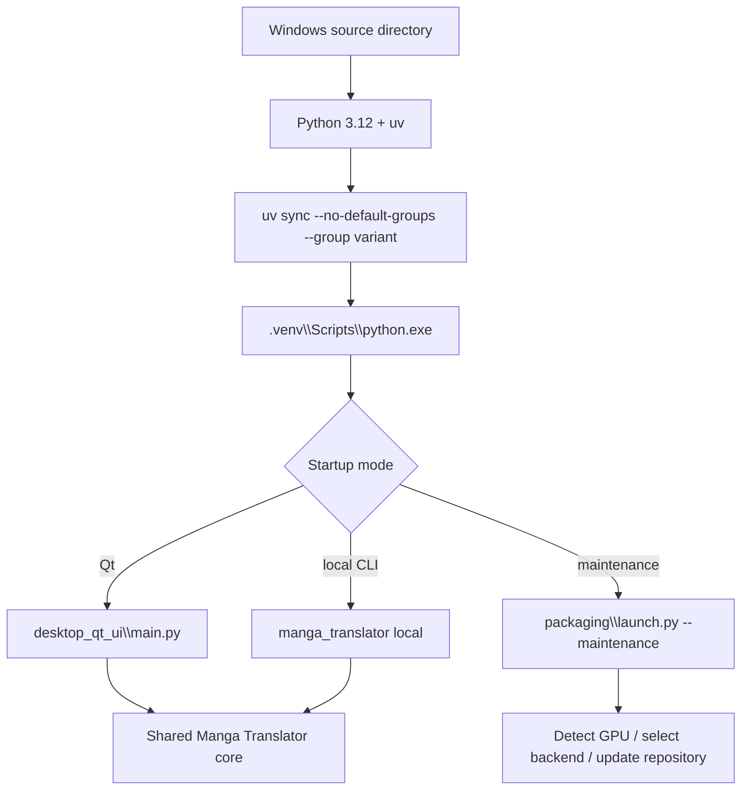

# Windows from Source

This page is for Windows users who need to modify source code, run an unpackaged checkout, or manage the Python environment themselves. It describes the shortest path from repository to Qt startup. It does not replace [Requirements](./requirements.md) for the full hardware/dependency table or [Windows Portable](./windows-portable.md) for packaged execution.

## Who this installation is for {#scope}

A source install manages dependencies with Python 3.12 and uv inside the repository, then starts the Qt desktop program or CLI directly. It does not install portable Python, create a Conda environment, or automatically turn the checkout into a Docker image. Windows AMD's special ROCm installation remains the launcher's responsibility.

Choose the portable package if you only want to extract and run it; choose Docker if you only need a browser-based service. A source environment enables branch switching, code changes, tests, and precise dependency selection, but you must maintain Git, uv, Python, models, and drivers yourself.

## Installation steps {#ui-operations}

### Prepare the repository and tools

> Windows users: first make sure the Microsoft Visual C++ Redistributable ([vc_redist.x64.exe](https://aka.ms/vs/17/release/vc_redist.x64.exe)) is installed; otherwise the app may fail to start with errors such as missing VCRUNTIME140.dll.

A source environment needs Git, uv, and Python 3.12 (`>=3.12,<3.13`). To install:

1. Install [Git](https://git-scm.com/), [uv](https://docs.astral.sh/uv/), and Python 3.12 (download the 3.12 installer from [python.org](https://www.python.org/downloads/) and check “Add python.exe to PATH”).
2. Clone the repository and enter it:
   ```powershell
   git clone https://github.com/hgmzhn/manga-translator-ui.git
   cd manga-translator-ui
   ```
3. Run exactly one `uv sync` group from the repository root, as described in the next subsection.

If the repository already exists, enter it and check the working-tree status before deciding whether to switch to `main`, `beta`, or a tag. Do not overwrite uncommitted changes with a branch switch or another destructive Git operation.

### Select exactly one backend group

Select exactly one backend group for the hardware; run the commands from the repository root:

```powershell
# NVIDIA CUDA 13.0 (source-development default)
uv sync

# NVIDIA CUDA 12.6
uv sync --no-default-groups --group cuda12.6

# CPU
uv sync --no-default-groups --group cpu

# Linux AMD ROCm (experimental)
uv sync --no-default-groups --group rocm7.2.1

# macOS Apple Silicon / Metal
uv sync --no-default-groups --group metal
```

Windows users generally choose CUDA 13.0, CUDA 12.6, or CPU. Windows AMD users should use the installer's ROCm 7.2.1 flow rather than treating the Linux ROCm command as the fixed Windows-wheel procedure.

### Start the source application

After the dependencies are synced, run the following from the repository root:

```powershell
# Qt desktop UI
uv run --no-sync python -m desktop_qt_ui.main

# Translate a single image from the command line
uv run --no-sync python -m manga_translator local -i <image-path>
```

The project also provides `Win-Start.bat`. It changes to the script directory, prefers `packaging\python\python.exe`, then falls back to legacy `manga-env`/`conda_env`; it is therefore not the only source-environment launcher. Prefer the `uv run` commands above for a source checkout, or call `.venv\Scripts\python.exe` directly after confirming the environment layout.

### Maintenance and version switching

When the project launcher must install/update, inspect the GPU, or switch versions, run:

```powershell
uv run --no-sync python packaging\launch.py --maintenance
```

The maintenance menu provides installation, code/dependency updates, `main`/`beta` switching, tag switching, Git mirror switching, version re-check, menu-language switching, and exit. Save your changes before switching branches or tags; the menu changes repository synchronization state and is not read-only. The menu options and their actual wording and stored values are listed in the [UI Options Reference](../reference/options-i18n-matrix.md).

## What the installer does {#runtime}



`uv sync` reads common `[project].dependencies` and the selected dependency group, then uses `tool.uv.sources` to select the CPU, CUDA, or ROCm PyTorch index. `uv run --no-sync` uses the existing `.venv` without resolving or upgrading dependencies again. If declarations and `uv.lock` disagree, update and sync the lock instead of ignoring the lock error.

The maintenance mode's `prepare_environment` detects the device and checks the installed PyTorch type. Automatic mode may select NVIDIA, AMD, Apple Silicon, CPU, or Intel GPU paths. Explicit `--requirements cpu|gpu|amd|metal` selects the requested group but still handles the extra Windows AMD path and PyTorch mismatches. After installation, the Qt entry calls `desktop_qt_ui.main` and the CLI entry calls `manga_translator.__main__`; both share the core processing chain.

## Environment and compatibility {#dependencies}

- **Python version**: `pyproject.toml` and the launcher both constrain Python to 3.12; Python 3.13 is rejected. Check `uv run --no-sync python --version`, not only the system `python`.
- **Mutually exclusive groups**: `cpu`, `cuda13.0`, `cuda12.6`, `rocm7.2.1`, and `metal` are mutually exclusive under `[tool.uv].conflicts`. Do not install multiple backend groups into one environment.
- **Default groups**: the project defaults to `cuda13.0`, `packaging`, and `test`; other runtime environments use `--no-default-groups` and do not install the `test` group.
- **NVIDIA**: `cuda13.0` uses `pytorch-cu130`, while `cuda12.6` uses `pytorch-cu126`; both are in the same source branch and include `onnxruntime-gpu` and `xformers`. RTX 50-series cards must use CUDA 13.0; other systems with CUDA 13.0-or-newer drivers can also run the CUDA 12.6 build.
- **ROCm**: the Linux `rocm7.2.1` group uses the ROCm 7.2 index and platform-marked torch/torchvision/triton. On Windows, the launcher installs ROCm SDK 7.2.1 and fixed PyTorch wheels; driver and gfx architecture determine compatibility.
- **Metal**: `metal` targets Apple Silicon macOS with MPS PyTorch, CPU ONNX Runtime, and Cocoa from normal PyPI; do not select it on Windows.
- **Switching conflicts**: if the installed PyTorch type differs from the target, the launcher may uninstall `torch`, `torchvision`, and `torchaudio` and purge the pip cache. Close other Python processes using PyTorch first.
- **Models and network**: dependency installation does not mean model downloads are complete; detector, OCR, translator, and inpainting models may download on first use or read local model files. Do not place credentials or proxy settings in public scripts.
