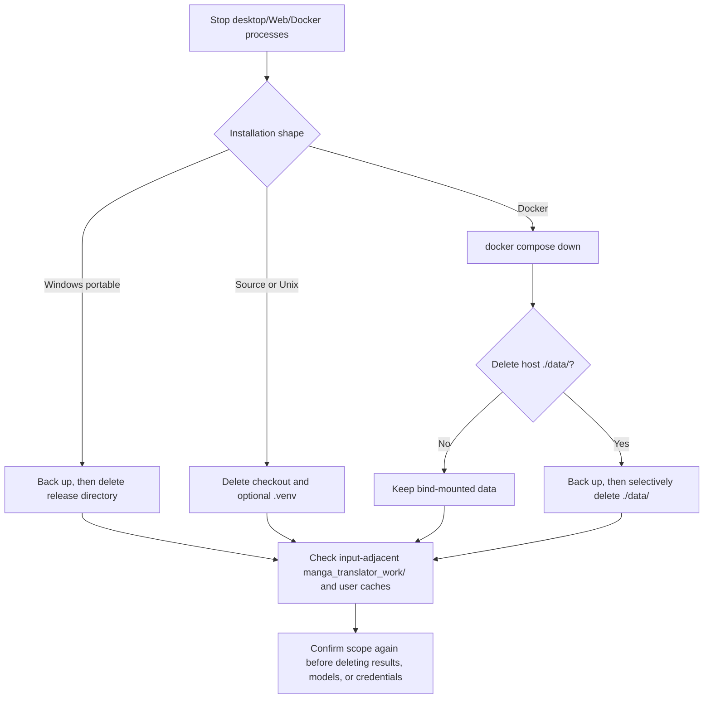

# Uninstall and Data Cleanup

## Who this installation is for {#scope}

This guide explains how to stop the application and remove a Windows portable package, a source/Unix installation, or a Docker deployment, plus which configuration, model, log, result, and server files require separate handling. The current `Win-*.bat`, `Unix-*.sh`, and Docker Compose files do not provide one universal “uninstall” button or command; uninstalling mainly means deleting the installation directory, virtual environment, or host-mounted data.

This guide does not replace the installation steps in [Windows portable](./windows-portable.md), [Linux/macOS installation](./linux-and-macos.md), or [Docker](./docker.md), and it does not treat in-app “Clear translation results” as a complete uninstall.

Uninstall by installation shape:

- **Windows portable (new build)**: it is fully green and self-contained. **Uninstalling simply means deleting the whole folder** — nothing else is needed (no registry entries, no services). Optional cleanup: AI model caches under `C:\Users\<you>\.cache\huggingface` and `.cache\torch` can be deleted directly, and the Git safe.directory entry in `.gitconfig` can be removed with `git config --global --unset-all safe.directory`.
- **Legacy Conda layout**: first uninstall Miniconda. If the installer-created Miniconda3 (inside the program folder or at a drive root) was used, double-click `Uninstall-Miniconda3.exe` inside it and then delete any leftover `Miniconda3` folder. If you installed Miniconda yourself and want to keep it, only remove the project environment with `conda env remove -n manga-env -y`. Then delete the whole program folder (including PortableGit, code, and scripts).

The detailed data-cleanup boundary per installation shape follows.

## Installation steps {#operations}

### General sequence

1. Wait for the current task to finish and close the desktop application; Web users should stop the service, and Docker users should first run `docker compose down`. Do not delete a directory while a process is still writing logs, results, or database files.
2. Back up any `config/`, `.env`, `models/`, `result/`, `manga_translator_work/`, or server `data/` that must be kept. Inspect each copy for keys, sessions, prompts, user images, and absolute paths before sharing or migrating it.
3. Delete the installation directory or virtual environment for the selected installation shape in the table below. If the goal is only to free space, clean selected caches/results instead; that is not the same as uninstalling.
4. Before reinstalling, confirm that no old environment path is still selected by the launcher, and check configuration compatibility if you kept settings.

### Installation shapes and deletion actions

| Installation shape | UI/command action | Locations normally worth preserving | Deletion scope |
| --- | --- | --- | --- |
| Windows portable | Close the application, then delete the complete release directory containing `Win-Start.bat` | `config/`, `models/`, `result/`, resources, and `packaging/python/` inside the release directory | The entire release directory; the scripts have no registry or service uninstall step |
| Legacy Windows Conda layout | Remove the environment used only by this project, then delete the program directory; do not remove shared Conda | External Miniconda, `manga-env`, or `conda_env/` inside the program directory | Only the confirmed project environment and program directory |
| Linux/macOS source | Stop processes, then delete the checkout; delete `.venv/` with it if it is not being kept | `.venv/`, `config/`, `models/`, and `result/` inside the checkout | The checkout; an input-adjacent `manga_translator_work/` must be handled separately |
| Docker Compose | Run `docker compose down` from the Compose directory, then delete selected host `data/` only if intended | `./data/config`, `server`, `models`, `result`, `logs`, `fonts`, and `dict` | Containers/images and host bind mounts are separate; `down` does not automatically delete `./data/` |

### In-app cleanup and UI wording

The Web admin cleanup feature only handles the directories defined by the server cleanup service; it is not an installer-directory remover. The results-page “Clear translation results” action clears the browser result list and blob URLs, not necessarily files on the host.

The actual wording of the cleanup-related UI strings is listed in the [UI Options Reference](../reference/options-i18n-matrix.md).

## What the installer does {#runtime}

Runtime paths are defined by `manga_translator.runtime_paths`: in source runs, the configuration directory is `config/` at the project root; in frozen runs, it is `config/` beside the executable. Models normally live under the application `models/` directory, and desktop logs are written under the application `result/` directory. When `save_to_source_dir` is enabled, output is written to `manga_translator_work/result/` beside the input image, so deleting the installation directory does not remove that input-adjacent work directory.

Docker mounts host `./data/{fonts,dict,result,models,logs,server,config}` into separate container paths. Removing a container therefore does not remove those host files. Server data also includes administrator configuration, user resources, and history-related data under `manga_translator/server/data`; back it up and redact it before deciding whether to delete it.

Server automatic cleanup is disabled by default. Its defaults are to check every 24 hours, delete files older than 7 days, and continue deleting oldest files when the relevant directories exceed 10 GiB. It traverses only server `data/results`, user fonts, and user prompts; it does not clean the application directory, model directory, desktop logs, or input-adjacent work directories.

## Environment and compatibility {#dependencies}

- **Open processes**: a running Qt app, Python process, uvicorn service, or Docker container may still write files; Windows may also refuse to remove locked DLLs. Stop processes or containers first.
- **Portable Python versus Conda/venv**: `Win-Start.bat` and `Win-Install-or-Update.bat` prefer `packaging/python/python.exe` and only then search for `manga-env` or `conda_env`. Do not remove Miniconda that another project uses, and do not leave an old PATH pointing at a deleted environment.
- **Hardware dependencies**: removing the application environment does not uninstall system NVIDIA/AMD drivers; drivers are shared dependencies of other software.
- **Docker persistence**: `docker compose down`, removing containers, removing images, and removing bind mounts are different actions. Deleting `./data/server` loses Web accounts, sessions, history, and server resources; deleting `./data/models` forces model downloads again.
- **Caches and credentials**: Hugging Face/Torch and similar user-level caches can live outside the application profile. `.env` and configuration files may contain API credentials. Decide whether to migrate them first, and redact keys, tokens, usernames, absolute paths, and user content before sharing logs.
- **Version switching**: uninstall is not update. The maintenance flow may clean uv/pip download caches and remove platform-inappropriate launcher files during an update, but it does not delete all user data directories.
