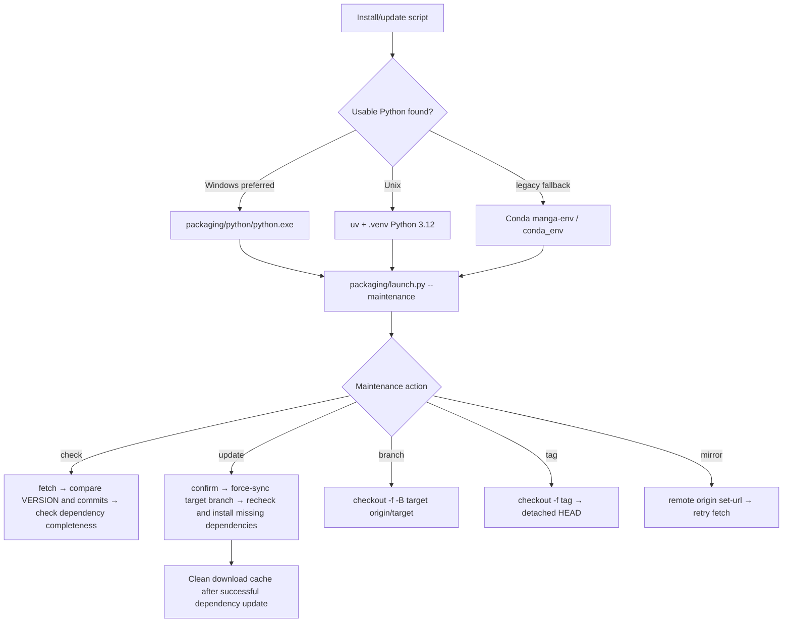

# Update and Version Switching

## Who this installation is for {#scope}

This guide documents the update-maintenance flow delegated to `packaging/launch.py --maintenance` by the install scripts: checking code and dependencies, switching Git branches or tags, changing mirrors, and changing the maintenance-menu language. It does not replace first installation, Windows runtime selection, Linux/macOS bootstrapping, or uninstall/data-cleanup documentation. Here, “version” means the code version and dependency environment, not a desktop translator setting.

The maintenance menu is an interactive command-line UI. Windows uses `Win-Install-or-Update.bat`; Linux/macOS uses `Unix-Install-or-Update.sh` as a bootstrapper. Both ultimately enter the same Python maintenance menu.

## Installation steps {#operations}

### Run the maintenance menu

Updates, branch/version switching, and mirror switching are all done through the maintenance menu; the entry points for the Windows portable package, Linux/macOS, and a source checkout follow. In a source checkout you can open the menu directly from the repository root with `uv run --no-sync python packaging\launch.py --maintenance`.

- On Windows, run `Win-Install-or-Update.bat` in the project directory. It changes to its own directory, then prefers `packaging\\python\\python.exe`; legacy Conda layouts are used only when that runtime is absent.
- On Linux/macOS, run `Unix-Install-or-Update.sh`. It checks the platform and Git, bootstraps uv, Python 3.12, and `.venv` when necessary, then starts the maintenance menu. An existing complete project is not cloned again; a non-empty unrelated directory is rejected.
- The menu first displays branch/tag state, mirror, local version, and remote version. When a networked check fails, the remote version is unavailable; that result must not be interpreted as “already up to date.”

### Update code and dependencies

1. Select `[2] Update (code + dependencies)`.
2. The menu fetches the remote, compares `packaging/VERSION` with the target branch version and compares local/remote commits, then checks whether the current environment lacks dependencies declared in `pyproject.toml`.
3. If both code and dependencies are satisfied, it reports that no update is needed. Otherwise it explicitly asks whether to continue. Only `y` or `yes` continues; other input cancels.
4. After code updates successfully, dependencies are checked again and missing packages are installed for the detected CPU/GPU/AMD/Metal variant. If code synchronization fails, dependency updating is skipped, so a partial update is not reported as successful.
5. When dependency installation fails, packages installed successfully are retained. You can retry; retry continues with the remaining packages. uv/pip download caches are automatically cleaned after dependency updating succeeds; completion is reported only after both code and dependencies finish.

Code updates force-sync to `origin/<branch>`, so uncommitted edits can be overwritten. Before proceeding, back up configuration or resources you need outside the application directory and inspect the worktree. The maintenance script is not a version-backup mechanism.

### Switch branches

Select `[3] Switch branch (main/beta)`, then choose `main` (stable) or `beta` (testing). After fetching, the script force-syncs with `git checkout -f -B <target> origin/<target>`; its confirmation explicitly says local changes will be overwritten. After success, run Update once so dependencies are reconciled with the new branch.

When switching from a tag or detached commit, the state is marked `tag/detached`. Update comparisons fall back to `main`, but that does not automatically return the checkout to main.

### Switch versions by tag

Select `[4] Switch version (by tag)`. The menu fetches tags, displays at most 20 in reverse creation-date order, and also accepts a tag name typed directly. After confirmation it performs a forced `git checkout`, which enters detached HEAD; after success it recommends updating dependencies for that version. To return to current branch code, use `[3] Switch branch`; do not treat a detached checkout as a normal development branch.

### Mirror, checking, and language

- `[5] Switch mirror`: choose the GitHub official remote, the Gitee mirror, or a manually entered repository URL; this changes `origin`. A failed fetch also offers to switch to the other route and retry. PyPI/PyTorch package-mirror fallback is a separate layer from the Git remote.
- `[6] Re-check version`: fetch and display local/remote version and commit differences only; it does not change code or dependencies.
- `[7] Language`: changes only maintenance-menu `L()` output and writes `packaging/maintenance_config.json`; it does not change desktop Qt `app.ui_language`.
- `[8] Exit`: exits the maintenance menu. After an update or switch, use `Win-Start.bat` on Windows or `Unix-Start.sh` on Linux/macOS to start the application.

## What the installer does {#runtime}

The update decision does not rely on a version string alone. Code needs updating when fetching failed, remote `packaging/VERSION` differs, or commits differ; dependency updating depends on the active PyTorch variant and package-completeness checks. Dependencies are recalculated only after a successful code update, preventing an old-code dependency list from producing the result.

Package installation prefers discoverable uv for bulk installation; when uv is unavailable, it falls back to per-package pip installation. Regular packages use PyPI mirror fallback, while PyTorch packages use the CPU/CUDA/ROCm-specific index or its fallback sources. Cleaning installation caches does not delete project configuration, models, or fonts.

## Environment and compatibility {#dependencies}

- `pyproject.toml` requires Python `>=3.12,<3.13`; Python 3.13 is not a replacement runtime.
- `cpu`, `cuda13.0`, `cuda12.6`, `rocm7.2.1`, and `metal` are mutually exclusive uv dependency groups. Do not layer backends in one environment after changing hardware; reinstall the matching variant selected by maintenance.
- Windows ROCm 7.2.1 is handled separately by `packaging/launch.py` in Radeon SDK → PyTorch order. Detecting the GPU brand does not prove that the driver or ROCm works.
- Legacy Conda is a fallback only when portable Python or Unix `.venv` is unavailable. Mixing `packaging/python`, `.venv`, `conda_env`, and external environments can create DLL, Torch, or ONNX Runtime conflicts.
- Code updates can overwrite local source edits, and tags create detached HEAD. Back up and review configuration, prompts, models, fonts, and workspace resources before switching.
- Updates need Git and package-index/mirror access. Translation API networking, credentials, and quota are a separate runtime path. A successful update neither proves the API works nor guarantees models are downloaded or VRAM is sufficient.
