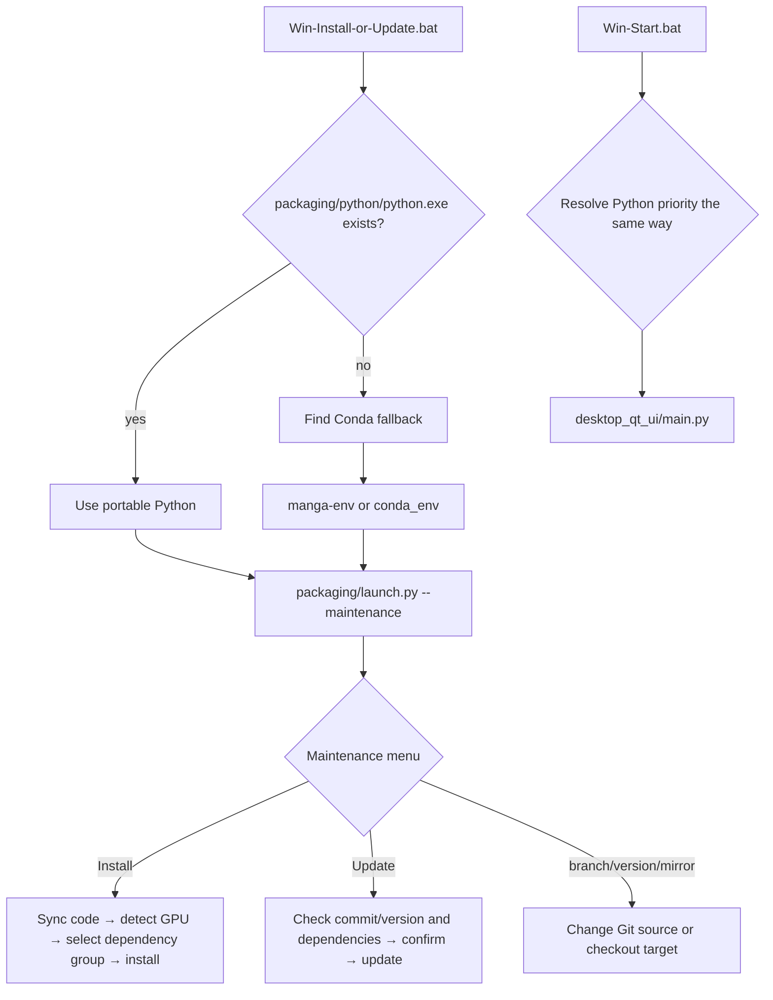

# Windows Portable

## Who this installation is for {#scope}

This guide documents the Windows startup chain, runtime selection, and maintenance menu provided by `Win-Install-or-Update.bat` and `Win-Start.bat` in the repository root. It is for Windows users whose source or release directory contains these scripts; it does not replace source installation, Docker, Linux/macOS, or version-uninstall pages, and it does not document desktop translation parameters.

“Portable” means that the scripts prefer `packaging/python/python.exe` inside the application directory instead of requiring the user to activate a system environment first. If that interpreter is absent, the current scripts still support the legacy Conda layouts; these are not two dependency schemes to mix in one environment.

## Installation steps {#operations}

### First installation or maintenance

> Before installing, first make sure the Microsoft Visual C++ Redistributable ([vc_redist.x64.exe](https://aka.ms/vs/17/release/vc_redist.x64.exe)) is installed; otherwise the app may fail to start with errors such as missing VCRUNTIME140.dll.

The portable package is published under the `portable` tag in GitHub Releases:

1. Download the latest version from the [portable package release page](https://github.com/hgmzhn/manga-translator-ui/releases/tag/portable) and extract it to any directory (for example `D:\manga-translator-ui\`). The package bundles Python 3.12 and uv, so no Python installation is required.
2. Double-click `Win-Install-or-Update.bat` to open the maintenance menu and select `[1] Install`:
   - Choose a download route (GitHub official or the Gitee mirror; Gitee is recommended in China).
   - The script force-syncs the latest code; if sync fails it suggests switching routes and retrying.
   - It detects the GPU (NVIDIA / AMD / integrated; lists them when several GPUs exist).
   - Choose the PyTorch build: CUDA 13.0 or newer defaults to `cuda13.0`; CUDA 12.x selects `cuda12.6`; AMD uses `rocm7.2.1` (experimental); anything else or integrated graphics selects `cpu`. No Git branch switch is involved.
   - uv installs dependencies in bulk (PyPI multi-mirror fallback: Tsinghua → Aliyun → Douban → official); failures can be retried and installed packages are kept.
   - The download cache is cleaned automatically when done.
3. Afterwards, start the app each time by double-clicking `Win-Start.bat`.
4. To update, run `Win-Install-or-Update.bat` again and select `[2] Update`.
5. To uninstall, delete the whole folder (the new build is fully green and writes no registry entries; legacy Conda uninstall is covered by [Uninstall and data cleanup](./uninstall-and-data-cleanup.md)).

> If installation keeps failing, use a [portable release](./release-download.md): download the CPU, NVIDIA GPU, or AMD volumes from GitHub Releases, extract `.001`, and run `Win-Start.bat` without installing Python.

The startup chain, environment selection, and maintenance-menu behavior of `Win-Install-or-Update.bat` and `Win-Start.bat` are described in the following sections.

### Updates, branches, and versions

- “Update” checks remote code version/commit and the current PyTorch dependencies first. If nothing is newer it reports that no update is needed; otherwise it asks for `y/yes` confirmation.
- “Switch branch” switches between `main` and `beta`; “Switch version” checks out a tag. Do not treat uncommitted local changes as a recoverable backup after switching; back them up and inspect the worktree first.
- “Switch mirror” changes the source used for subsequent Git/package downloads; a network failure is not reported as installation success.
- “Re-check version” is read-only; “Language” changes maintenance-menu output; “Exit” leaves the menu.

### Startup and error feedback

`Win-Start.bat` first prints `Starting...` and runs `desktop_qt_ui\\main.py`. A normal close prints `Application closed.`; a non-zero exit prints the exit code, recommends reinstalling, shows the public Issue URL, and asks whether to open the maintenance script. If neither portable Python nor a valid Conda environment is found, the script reports the missing environment and exits instead of silently using another Python.

## What the installer does {#runtime}

The batch files only locate the runtime, set `PYTHONUTF8=1`, prepend runtime directories to PATH, and call Python. Portable Python has priority over Conda: the script looks for `packaging\\python\\python.exe`; only if it is absent does it search the adjacent or drive-root `Miniconda3`, a Conda root found through `CONDA_EXE`, the named `manga-env` environment, and finally the legacy `conda_env` directory beside the application. The Conda fallback simulates activation by prepending PATH entries but does not modify the system environment.

The install flow in `launch.py` reads dependencies and PyTorch sources from `pyproject.toml`; updates compare `packaging/VERSION`, the remote commit, and dependency completeness. It prefers a discoverable uv for bulk installation, falls back to per-package pip when uv is unavailable, and tries configured alternate mirrors when a source fails. The Windows AMD path checks GPU/driver compatibility before installing the Radeon SDK and PyTorch in the script's required order; an unsupported device may fall back to CPU or require cancellation. Detecting an AMD device alone does not prove that ROCm was enabled.

## Environment and compatibility {#dependencies}

- **Python version**: The current launcher accepts Python 3.12 only; `pyproject.toml` requires `>=3.12,<3.13`. System Python 3.13 or another version cannot substitute for the portable runtime.
- **Mutually exclusive groups**: `cpu`, `cuda13.0`, `cuda12.6`, `rocm7.2.1`, and `metal` are mutually exclusive in the uv configuration. Do not layer CPU, NVIDIA CUDA, and AMD ROCm groups into one environment; after a hardware change, use the maintenance menu to reinstall the matching dependencies.
- **Windows ROCm**: the script handles ROCm SDK 7.2.1/PyTorch ordering separately and reports driver/support-list limits. Compatibility cannot be inferred from the AMD brand alone.
- **Legacy Conda**: It is used only when the portable interpreter is absent. Do not combine packages from `packaging\\python`, `conda_env`, and an external environment; an incorrect PATH can cause DLL, Torch, or ONNX Runtime conflicts.
- **GPU/CPU resources**: GPU dependencies do not mean models are downloaded or that available VRAM is sufficient; the first start may still download or initialize models. CPU can run the application but is usually slower. If installation fails, do not delete successful packages and repeatedly switch schemes without checking the cause.
- **Paths**: The script has a special drive-root Miniconda lookup when the installation path contains non-ASCII characters. To reduce DLL, Git, and model-path problems, prefer a short, writable path without special characters.
- **Network**: Installation/update needs Git and package-index or mirror access. API networking is a separate runtime path; successful installation does not prove a translation API is usable.
