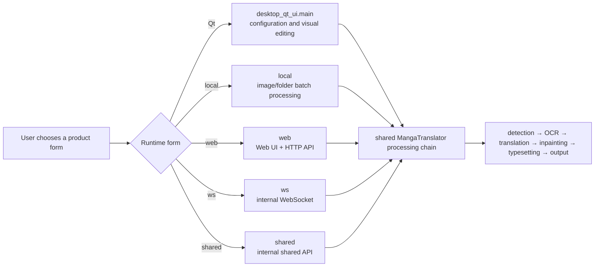

# Product Forms

This project provides a Qt desktop application, the `local` CLI, a Web interface, and the internal `ws` and `shared` service forms. They share the translation core, but differ in interaction, network boundaries, and intended use. Choose a form based on how you want to work before configuring individual features.

This page helps you choose a runtime form; it does not document translation parameters, API credentials, the nine workflows, or HTTP request fields. See [First Translation](./first-translation.md) for the common input and process, and [Windows Portable](../install/windows-portable.md), [Linux and macOS](../install/linux-and-macos.md), and [Docker](../install/docker.md) for installation options.

## What to know first {#scope}

| Form | Best for | Not responsible for |
| --- | --- | --- |
| Qt desktop application | Selecting files locally, adjusting settings, monitoring progress, and editing regions and styles in the visual editor | Turning editor actions into a public HTTP API |
| `local` CLI | Scriptable local translation, output, and batch processing for images or folders | Listening on a port or providing a browser workspace |
| `web` Web UI | Uploading, configuring, starting tasks, and viewing results and history in a browser; the same process also provides HTTP APIs | The internal `ws`/`shared` protocols |
| `ws` WebSocket | Connecting an internal backend to an upstream WebSocket for local integration | A public Web API for ordinary users |
| `shared` internal API | Calling a shared translation instance from a local integration | A service that is safe to expose publicly without authentication |
| Docker deployment | Running the Web form in a container while persisting resources and server data through volumes | A separate translation engine; container ports are not host ports |

## How to choose and start {#choose-and-start}

### Qt desktop application {#desktop}

Use this form when you are new to the project, need to inspect settings one by one, or want to revise a translation manually. The application opens on “Translation Interface”; the sidebar also provides “Settings”, “API Management”, “Prompt Management”, “Replacement Rules”, “Rich Text Rules”, “Batch Management”, and the bottom “Editor View”. Language and theme controls are in the General settings area; switching language refreshes the UI text immediately.

The shortest desktop path is: start the application → configure the required connection in “API Management” → add an image or folder in “Translation Interface” → choose a workflow and start. File input, output directories, progress, and editor details are covered by later pages.

### Local CLI {#local-cli}

Use this form for automation, batch processing, or a headless environment. The formal entry point is:

```text
uv run --no-sync python -m manga_translator local -i <image-or-folder> [options]
```

`-i` accepts one or more inputs; `-o` selects an output directory, `--config` selects a configuration file, and `--overwrite` permits replacing existing output. `--format`, `--batch-size`, and `--attempts` are explicit overrides. The downstream process consumes `--memory-limit`, `--memory-percent`, and `--batch-per-restart` only when `--subprocess` is enabled; without subprocess mode, do not treat those memory options as ordinary translation options.

If the first argument is not a formal mode and the command includes `-i`/`--input`, the parser inserts `local` implicitly. Scripts should still spell out `local` to avoid ambiguity.

### Web interface and server {#web}

Use this form when you need a browser, multiple-user permissions, or server-side task history. The formal entry point is:

```text
uv run --no-sync python -m manga_translator web
```

The default listener is `0.0.0.0:8000`, configurable through `MT_WEB_HOST` and `MT_WEB_PORT`. `0.0.0.0` means listening on all IPv4 interfaces; it is not the browser address. On the same machine, use `http://localhost:8000` in the usual case. The Docker GPU compose service maps host port `8001` to container port `8000`, so use the actual host mapping when connecting.

The Web workspace accepts images, folders, and `image/*`, PDF, JSON, and TXT inputs. After selecting a workflow, start a task; results can be previewed, downloaded individually, or downloaded in a batch. Authenticated requests use `X-Session-Token`, and the interface separates the normal workspace from the `/admin` administration UI. Do not copy tokens, API keys, or user images into documentation, logs, or screenshots.

### `ws` and `shared` internal forms {#internal-services}

Choose these only when an existing local integration or upstream service requires them. Both listen on `127.0.0.1:5003` by default, unlike `web`, which listens on all interfaces by default:

```text
uv run --no-sync python -m manga_translator ws
uv run --no-sync python -m manga_translator shared
```

`ws` also connects to the default upstream `ws://localhost:5000`; options such as `--ws-url` and `--nonce` can adjust it. `shared` uses `--nonce` to protect internal API communication. Message formats, locks, streaming responses, and nonce/secret contracts belong in developer pages; this guide does not present them as a general public API.

### Docker {#docker}

Docker suits users with an existing container operations workflow, dependency isolation requirements, or a need to run the Web UI. The CPU compose service maps host `8000` to container `8000`; the GPU service maps host `8001` to container `8000` and declares an NVIDIA GPU. Persistent volumes cover `/app/fonts`, `/app/dict`, `/app/models`, `/app/config`, and `/app/manga_translator/server/data`.

Do not use the administrator password shown in a compose example for production, and do not commit `.env`. Treat server data, user resources, sessions, quotas, and history metadata as sensitive data.

## How it works {#runtime}

The four formal command modes are parsed and dispatched by one entry point. Qt is a separate desktop entry point, but it ultimately shares the processing chain with the command modes:



Before dispatching, the CLI entry point ensures runtime files and then calls the `local`, `web`, `ws`, or `shared` execution module. Web adds authentication, permissions, concurrency, history, and download tickets around the core processing chain. Docker only places the Web process and its resource directories in a container. Normal `local` execution applies explicit CLI overrides; subprocess mode separately manages memory thresholds and restarts.

## What to consider {#dependencies}

- **Hardware**: every form may load PyTorch, ONNX, or stage models; choose the CPU/GPU/AMD/Metal dependency group in the installation documentation.
- **Configuration**: `config/config.json`, the distribution example, and code defaults are separate layers. User configuration takes precedence over the example, while CLI values override only fields that the CLI actually writes.
- **Ports**: Web defaults to `8000`; WS/shared default to `5003`. Avoid collisions when running internal services alongside the Web server.
- **Workflows**: the nine workflows are driven by configuration fields, and special workflows generally cannot enter the `batch_concurrent` pipeline. See the workflow matrix for skipped stages.
- **Network and privacy**: Web’s `0.0.0.0` listener broadens the exposure surface; requests may contain images, OCR text, and translations. Configure authentication, firewalls, and safe secret injection before public deployment.
- **Editor**: the visual editor belongs to the Qt desktop workspace. CLI/Web project JSON output does not imply the same editor interactions.
