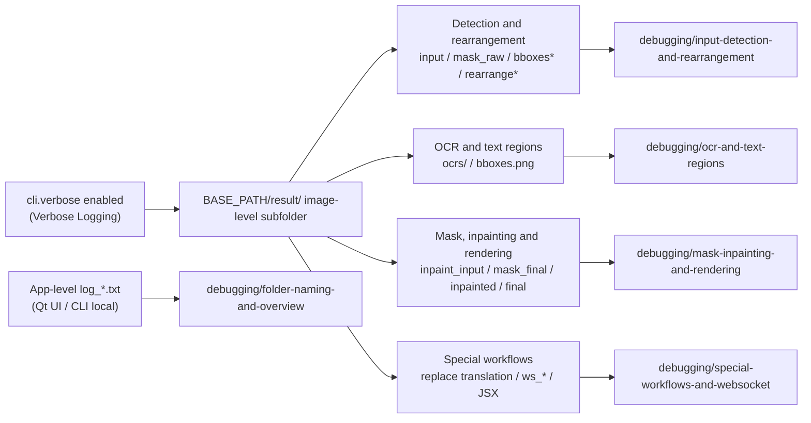

# Debug Artifact Index

When a translation result looks wrong or you need to report an issue to the developers, enabling “Verbose Logging” (`Verbose Logging`) makes the app write debug images, JSON, JSX, and log files under `BASE_PATH/result/`. This index summarizes the complete artifact list, their trigger conditions, and troubleshooting purpose, and links back to the dedicated pages under `debugging/`; in-depth explanations of individual artifacts are not expanded here.

This index only summarizes and backlinks. Naming rules, directory layout, and the core/conditional artifact overview are in [Debug folder naming and overview](../debugging/folder-naming-and-overview.md); the artifact families are covered in depth in [Input detection and rearrangement](../debugging/input-detection-and-rearrangement.md), [OCR and text regions](../debugging/ocr-and-text-regions.md), [Mask, inpainting and rendering](../debugging/mask-inpainting-and-rendering.md), and [Special workflows and WebSocket](../debugging/special-workflows-and-websocket.md). Cleanup, sanitization, and sharing are covered in [How to read and share a debug run](../debugging/how-to-read-and-share-a-debug-run.md).

## What's included

- This guide only summarizes debug artifacts and trigger conditions; it does not repeat the runtime behavior, parameters, or file-format explanations of the `debugging/` pages.
- Every image-level debug artifact is gated by the `cli.verbose` master switch (UI: “Verbose Logging” / `Verbose Logging`); when off, no timestamped image-level debug subfolder is created.
- The image-level debug subfolder is named `{timestamp_ms}-{image_md5_8}-{detection_size}-{target_lang}-{translator}`, built by `_set_image_context()` when each input image starts processing, under `BASE_PATH/result/`.
- Artifacts are grouped into “core artifacts” (most common in the normal verbose flow), “conditional artifacts” (generated only under specific settings, detectors, workflows, or modes), and “directory-level/fallback artifacts” (`log_*.txt` or fallback paths without an image-level subfolder).
- current code search found no later read-back of these debug file names in the repository: they are terminal diagnostic writes consumed by verbose-enabled operators or by the recipients of issue reports.

## How to use it

The full steps for enabling verbose logging in Settings are in [Debug folder naming and overview](../debugging/folder-naming-and-overview.md). This guide only records the UI strings directly relevant to this index:

## Debug artifact summary

The tables below group the complete set of artifacts the current source can generate under different modes as “core artifacts / conditional artifacts / directory-level and fallback artifacts”. The “In-depth page” column links to the dedicated page for each artifact; the “Stage and trigger condition” column records only statically verified write points and switches.

### Core artifacts

The following artifacts are the most common in the normal verbose flow; whether they are actually generated still depends on detection/OCR results and translation progress:

| Artifact | Stage and trigger condition | Content and troubleshooting purpose | In-depth page |
| --- | --- | --- | --- |
| `input.png` | `_translate_until_translation()` with `verbose=True` | Input image before processing; detection/OCR troubleshooting | [Input detection and rearrangement](../debugging/input-detection-and-rearrangement.md) |
| `mask_raw.png` | After detection, `verbose=True` and detection returns `ctx.mask_raw` | Raw detection confidence heatmap with color bar; detection-threshold troubleshooting | [Input detection and rearrangement](../debugging/input-detection-and-rearrangement.md) |
| `bboxes_unfiltered.png` | Text lines still exist after detection | Unfiltered text-line boxes on the original image; detection/OCR filtering troubleshooting | [Input detection and rearrangement](../debugging/input-detection-and-rearrangement.md) |
| `bboxes.png` | `ctx.text_regions` exists after OCR and text-line merging | Final text-block visualization; merging/sorting troubleshooting | [OCR and text regions](../debugging/ocr-and-text-regions.md) |
| `ocrs/<index>.png` | OCR implementations, when the text region is not pre-filtered | Perspective-cropped OCR inputs; vertical text is rotated | [OCR and text regions](../debugging/ocr-and-text-regions.md) |
| `inpaint_input.png` | `ctx.mask` exists after translation | Inpainting input preview | [Mask, inpainting and rendering](../debugging/mask-inpainting-and-rendering.md) |
| `mask_final.png` | Same as above | Final mask used for inpainting; mask-extent troubleshooting | [Mask, inpainting and rendering](../debugging/mask-inpainting-and-rendering.md) |
| `inpainted.png` | After inpainting in the normal verbose flow | Inpainted image; inpainting-result troubleshooting | [Mask, inpainting and rendering](../debugging/mask-inpainting-and-rendering.md) |
| `final.png` | `_revert_upscale()` called, `ctx.result` exists, and verbose | Final (or size-reverted) PIL output | [Mask, inpainting and rendering](../debugging/mask-inpainting-and-rendering.md) |

### Conditional artifacts

The following artifacts are generated only under specific settings, detectors, workflows, or modes; they must not be described as present in every verbose run:

| Artifact | Trigger condition | Content and troubleshooting purpose | In-depth page |
| --- | --- | --- | --- |
| `bboxes_unfiltered_labeled.png` | `ocr.merge_special_require_full_wrap=True` and the label drawer receives non-empty text lines | Indexed/labeled text-line boxes; model-assisted merging troubleshooting | [Input detection and rearrangement](../debugging/input-detection-and-rearrangement.md) |
| `bboxes_with_scores.png`, `mask_binary.png` | Detector third return value is a score-box/binary-mask debug tuple | Detection score boxes and their companion binary mask | [Input detection and rearrangement](../debugging/input-detection-and-rearrangement.md) |
| `hybrid_detection_boxes.png` | Detector third return value is an image and `detector.use_yolo_obb=True` | Merged main-detection and YOLO OBB boxes; hybrid detection troubleshooting | [Input detection and rearrangement](../debugging/input-detection-and-rearrangement.md) |
| `rearrange_<index>.png` | Default/DBConvNext/CTD detectors trigger the rearrangement plan | Square padded batches before detection; long-image rearrangement troubleshooting | [Input detection and rearrangement](../debugging/input-detection-and-rearrangement.md) |
| `yolo_rearrange_<index>.png` | `use_yolo_obb=True` and YOLO OBB gets a rearrangement plan | Single YOLO OBB rearrangement patch | [Input detection and rearrangement](../debugging/input-detection-and-rearrangement.md) |
| `mask_bubble_clip_debug.png` | `limit_mask_dilation_to_bubble_mask=True` and a non-empty model bubble mask is obtained | Overlay of bubbles, before/after clipping, and protected areas | [Mask, inpainting and rendering](../debugging/mask-inpainting-and-rendering.md) |
| `balloon_fill_boxes.png` | `layout_mode='balloon_fill'` and the renderer returns a non-empty debug view | Renderer debug view of the balloon-fill layout; typesetting troubleshooting | [Mask, inpainting and rendering](../debugging/mask-inpainting-and-rendering.md) |
| `chinese_linebreak_debug.json` | Same as above and non-empty line-break records accumulated | Chinese line-break records; may contain source/translation text, sanitize before sharing | [Mask, inpainting and rendering](../debugging/mask-inpainting-and-rendering.md) |
| `replace_debug_match.jpg`, `debug_extracted_text.png`, `inpainted.png` | Replace-translation workflow with verbose | Match boxes/overlap info, extracted text, and the replace-flow inpainted image | [Special workflows and WebSocket](../debugging/special-workflows-and-websocket.md) |
| `ws_final.png`, `ws_render_in.png`, `ws_render_out.png`, `ws_mask.png`, `ws_inmask.png`, `ws_output.png` | WebSocket mode with verbose | WS rendering intermediate/final PNGs | [Special workflows and WebSocket](../debugging/special-workflows-and-websocket.md) |
| `<input-stem>_photoshop_script.jsx` | PSD export with verbose or `script_only=True` | Photoshop automation script; may contain layer text and file paths, sanitize before sharing | [Special workflows and WebSocket](../debugging/special-workflows-and-websocket.md) |

### Directory-level and fallback artifacts

The following artifacts are not inside the image-level subfolder, or use a fallback path without an image-level subfolder:

| Artifact | Trigger condition | Content and troubleshooting purpose | In-depth page |
| --- | --- | --- | --- |
| `log_<yyyyMMddHHmmss>.txt` | Qt UI startup or CLI local log initialization | App-level run log; not part of a per-image debug subfolder | [Debug folder naming and overview](../debugging/folder-naming-and-overview.md) |
| `result/ocrs/<index>.png` | Direct OCR calls without the environment variable set, with verbose | OCR crop fallback path without an image-level subfolder | [OCR and text regions](../debugging/ocr-and-text-regions.md) |
| `result/rearrange_<index>.png` | Rearrangement without a `result_path_fn` callback | Rearrangement fallback path without an image-level subfolder | [Input detection and rearrangement](../debugging/input-detection-and-rearrangement.md) |
| `result/yolo_rearrange_<index>.png` | YOLO OBB rearrangement without a `result_path_fn` callback | YOLO rearrangement fallback path without an image-level subfolder | [Input detection and rearrangement](../debugging/input-detection-and-rearrangement.md) |

The diagram only shows the “trigger -> artifact family -> documentation page” ownership; it does not mean every verbose run generates every artifact. Early exits with no text, failures/cancellations, and special workflows skip the corresponding stages.

## Trigger-condition quick reference

| Trigger condition | Artifacts generated | In-depth page |
| --- | --- | --- |
| `cli.verbose` enabled | Image-level debug subfolder and all artifacts inside it | [Debug folder naming and overview](../debugging/folder-naming-and-overview.md) |
| Detector third return value is a score-box/binary-mask debug tuple | `bboxes_with_scores.png`, `mask_binary.png` | [Input detection and rearrangement](../debugging/input-detection-and-rearrangement.md) |
| `detector.use_yolo_obb=True` | `hybrid_detection_boxes.png`, `yolo_rearrange_<index>.png` | [Input detection and rearrangement](../debugging/input-detection-and-rearrangement.md) |
| Aspect ratio/detection size satisfies the rearrangement plan (default/DBConvNext/CTD) | `rearrange_<index>.png` | [Input detection and rearrangement](../debugging/input-detection-and-rearrangement.md) |
| `ocr.merge_special_require_full_wrap=True` | `bboxes_unfiltered_labeled.png` | [Input detection and rearrangement](../debugging/input-detection-and-rearrangement.md) |
| `limit_mask_dilation_to_bubble_mask=True` and a non-empty bubble mask is obtained | `mask_bubble_clip_debug.png` | [Mask, inpainting and rendering](../debugging/mask-inpainting-and-rendering.md) |
| `layout_mode='balloon_fill'` and the renderer returns a non-empty debug view | `balloon_fill_boxes.png`, `chinese_linebreak_debug.json` | [Mask, inpainting and rendering](../debugging/mask-inpainting-and-rendering.md) |
| Replace-translation workflow | `replace_debug_match.jpg`, `debug_extracted_text.png`, `inpainted.png` | [Special workflows and WebSocket](../debugging/special-workflows-and-websocket.md) |
| WebSocket mode | `ws_final.png` and the other `ws_*.png` | [Special workflows and WebSocket](../debugging/special-workflows-and-websocket.md) |
| PSD export (verbose or `script_only=True`) | `<input-stem>_photoshop_script.jsx` | [Special workflows and WebSocket](../debugging/special-workflows-and-websocket.md) |
| Qt UI startup / CLI local initialization | `log_<yyyyMMddHHmmss>.txt` | [Debug folder naming and overview](../debugging/folder-naming-and-overview.md) |

## Debugging page map

| Debugging page | Artifacts and topics it covers |
| --- | --- |
| [Debug folder naming and overview](../debugging/folder-naming-and-overview.md) | Subfolder naming rule, `result/` layout, core/conditional artifact overview, `log_*.txt` |
| [Input detection and rearrangement](../debugging/input-detection-and-rearrangement.md) | `input.png`, `mask_raw.png`, `bboxes*`, `hybrid_detection_boxes.png`, `rearrange_*`, `yolo_rearrange_*` |
| [OCR and text regions](../debugging/ocr-and-text-regions.md) | `ocrs/`, `bboxes.png`, OCR crop inputs and numbering behavior |
| [Mask, inpainting and rendering](../debugging/mask-inpainting-and-rendering.md) | `inpaint_input.png`, `mask_final.png`, `inpainted.png`, `mask_bubble_clip_debug.png`, `balloon_fill_boxes.png`, `chinese_linebreak_debug.json`, `final.png` |
| [Special workflows and WebSocket](../debugging/special-workflows-and-websocket.md) | Replace-translation artifacts, `ws_*.png`, `<input-stem>_photoshop_script.jsx` |
| [How to read and share a debug run](../debugging/how-to-read-and-share-a-debug-run.md) | Artifact cleanup, sanitization, and sharing of logs and directories |

## How to use this reference

- The image-level debug subfolder depends on `cli.verbose`, the image context, and `result_sub_folder`; missing any of them falls back to a path without an image-level subfolder (`BASE_PATH/result/<artifact>`).
- `BASE_PATH` points to different locations in frozen packaged runs versus source runs (executable directory vs repository root); keep this in mind when comparing across machines.
- The tables above are the complete set the current source can generate under different modes, not the files every run necessarily produces; conditional artifacts must not be written as always present.
- All debug images, OCR crops, line-break JSON, JSX, and logs may contain user images, source/translation text, box coordinates, or local paths; sanitize them before sharing and never package them for upload directly.
- This index does not replace the `debugging/` pages; parameter mechanics, file formats, and runtime behavior are covered by the corresponding feature and debugging pages.

## Developer Guide {#developer-guide}

### Option matrix {#option-matrix}

| UI call key | English actual value | Simplified Chinese actual value |
| --- | --- | --- |
| `General` | General | 通用 |
| `label_verbose` | Verbose Logging | 详细日志 |
| `Open log folder` | Open log folder | 打开日志文件夹 |

The full bilingual text of the `desc_cli_verbose` description panel (including the “When enabled, Qt UI writes these items under result/ …” wording and its difference from the actual code naming rule) is recorded verbatim in [Debug folder naming and overview](../debugging/folder-naming-and-overview.md) and is not repeated here.

### Related files and formats

| File/directory | Format and naming | Description |
| --- | --- | --- |
| `BASE_PATH/result/` | directory | Root of verbose debug artifacts |
| `BASE_PATH/result/<image-level subfolder>/` | directory | One per input image; naming rule on the folder-naming page |
| `BASE_PATH/result/<image-level subfolder>/ocrs/` | directory | OCR crop inputs, `<index>.png` |
| `BASE_PATH/result/log_<yyyyMMddHHmmss>.txt` | UTF-8 text log | Qt UI / CLI run log, app level |
| Image-level artifacts (`input.png`, `bboxes.png`, `mask_raw.png`, `inpaint_input.png`, `mask_final.png`, `inpainted.png`, `final.png`, etc.) | PNG | Terminal diagnostic writes for manual troubleshooting |
| Conditional artifacts (JSON/JSX/JPG, etc.) | see the debugging pages | Trigger conditions in “Debug artifact summary” |

### Code locations {#source-evidence}
| Layer | File | What was checked |
| --- | --- | --- |
| Path contract | `manga_translator/manga_translator.py` (`_result_path()`, `_set_image_context()`, write points) | Four path branches, subfolder naming, and core/conditional artifact write points |
| Detection and rearrangement | `manga_translator/detection/*.py`, `manga_translator/utils/generic.py` (`det_rearrange_forward()`), `manga_translator/detection/yolo_obb.py` | Triggers for `bboxes*`, `hybrid_detection_boxes.png`, `rearrange_*`, `yolo_rearrange_*` |
| OCR | `manga_translator/ocr/model_32px.py`, `model_48px.py`, `model_48px_ctc.py`, `model_manga_ocr.py`, `model_paddleocr.py`, `manga_translator/manga_translator.py` (`_run_ocr()`) | `ocrs/` subfolder, numbering, and 200px compression behavior |
| Mask/inpainting/rendering | `manga_translator/mask_refinement/__init__.py`, `manga_translator/manga_translator.py` | `mask_bubble_clip_debug.png`, `inpaint_input.png`, `mask_final.png`, `inpainted.png`, `balloon_fill_boxes.png`, `chinese_linebreak_debug.json`, `final.png` |
| Special workflows | `manga_translator/utils/replace_translation.py`, `manga_translator/mode/ws.py`, `manga_translator/utils/photoshop_export.py` | Replace translation, `ws_*.png`, and PSD JSX artifacts |
| App-level logs | `desktop_qt_ui/main.py`, `manga_translator/mode/local.py` | Generation of `log_<yyyyMMddHHmmss>.txt` |
| UI/i18n | `desktop_qt_ui/ui/main_page/settings_tab_layout.json`, `desktop_qt_ui/ui/main_page/dynamic_settings.py`, `desktop_qt_ui/locales/en_US.json`, `zh_CN.json` | Actual values of `label_verbose`, `desc_cli_verbose`, `Open log folder` |
| Research baseline | `doc/wiki/research/phase0-debug-artifact-path-trace.md`, `phase0-related-files-formats-debug-safety.md`, `phase0-page-coverage-matrix.md` | Artifact inventory, path contract, and coverage matrix |
