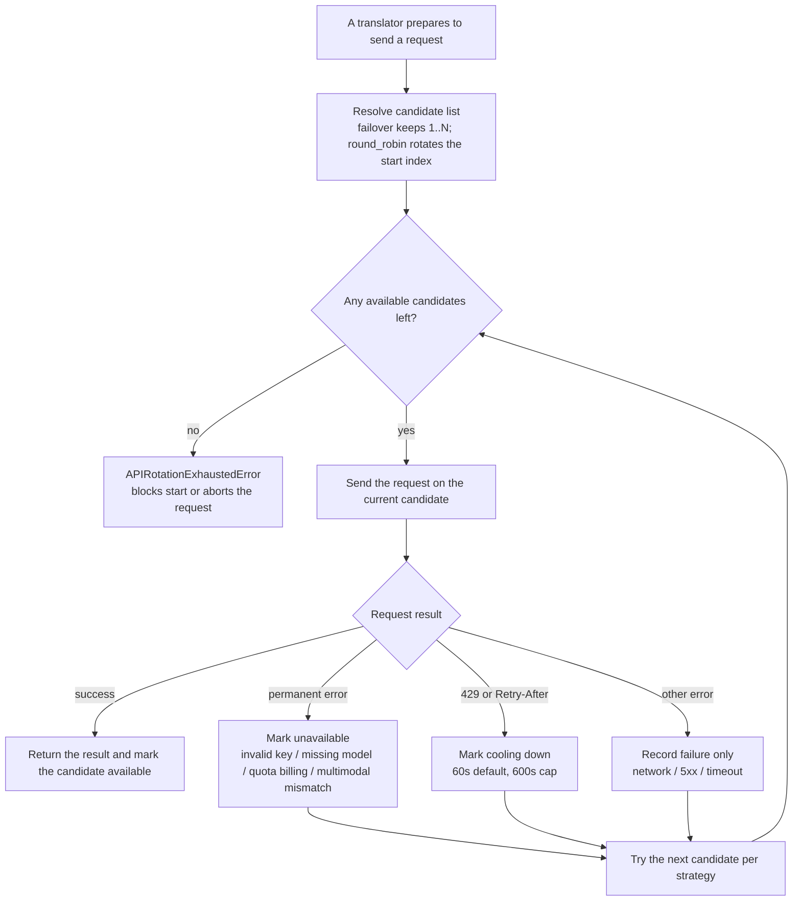

# API, Authentication, Rate Limit, and Timeout Troubleshooting

Use this page when translation, OCR, colorization, or rendering requests report API errors, authentication failures, rate limiting, or timeouts. First decide whether the problem is between your machine and the external API or between the browser and the Web service, then locate the configuration, network, or candidate-state issue by symptom. This guide covers the diagnosis order and fix entries for four symptom groups only; candidate slots, the cooldown state machine, retry/RPM parameters, connection tests, and Web deployment security have their own pages.

## Identify the problem {#feature-boundary}

- This guide covers four symptom groups: API errors (4xx/5xx), authentication failures (invalid key, 401/403), rate limiting (429/cooldown/RPM), and timeouts and network issues (timeout/connection/DNS).
- Candidate slot add/remove, numbering, and `failover`/`round_robin` strategies are documented in [API slots and rotation strategy](../desktop/api-management/slots-and-rotation.md); the cooldown/unavailable/recovery state machine in [Failures, cooldown, and recovery](../desktop/api-management/failures-cooldown-and-recovery.md); connection tests and model listing in [Connection tests and model list](../desktop/api-management/connection-tests-and-model-list.md); and Key/Base/Model fields and `.env` key mapping in [Credentials, addresses, and models](../desktop/api-management/credentials-addresses-models.md).
- The full parameter pages for `cli.attempts`, `translator.max_requests_per_minute`, and post-translation quality checks live in [Retry, rate limit, and quality](../desktop/translator/retry-rate-limit-and-quality.md); this guide does not repeat the parameter template.
- Web scenarios: login/registration/session rate limiting, concurrency, and quotas belong to [Web deployment, security, and troubleshooting](../web/deployment-security-and-troubleshooting.md) and [Login, language, and session](../web/login-language-and-session.md); the complete status-code contract belongs to the developer docs [Authentication and errors](../developer/http-api/authentication-and-errors.md) and [Translation endpoints](../developer/http-api/translation-endpoints.md).
- “Rate limiting” is a different layer on desktop vs. Web service: on desktop it is the external API RPM and candidate cooldown; on the Web service it is server-side login/registration/concurrency/quota limiting. Do not mix the two concepts when troubleshooting.

## Symptom quick reference {#symptom-quick-reference}

The table below follows the order “error signature -> source classification -> system behavior -> fix entry”. Classification is based on the permanent-error/cooldown checks in `manga_translator/api_key_rotation.py`; `cli.attempts` and the candidate count are two different layers, as described in [Retry, rate limit, and quality](../desktop/translator/retry-rate-limit-and-quality.md).

| Error signature | Classification (source) | System behavior | Primary fix entry |
| --- | --- | --- | --- |
| `invalid api key`, `api key not valid`, `api key expired`, `api key revoked`, `invalid authentication`, `invalid credentials`, `permission denied`, `access denied` | Permanent error (candidate unavailable) | The candidate is marked unavailable and skipped by later requests | Check the key in [Credentials, addresses, and models](../desktop/api-management/credentials-addresses-models.md); verify with [Connection tests](../desktop/api-management/connection-tests-and-model-list.md) |
| `401`, `403`, `unauthorized`, `forbidden` (message without the markers above) | Other error (failure recorded only) | Retries on the same candidate per `attempts`, then moves to the next candidate | Check key permissions, account status, and regional restrictions |
| `404`, `not found`, `model not found`, `model does not exist` | Permanent error (candidate unavailable) | The candidate is marked unavailable | Check the API address, model name, and translator/API-type match |
| `402`, `insufficient_quota`, `billing`, `payment required` | Permanent error (candidate unavailable) | The candidate is marked unavailable | Check account balance, quota, and billing status |
| `400` with messages such as `unsupported model`, `invalid model`, `unknown variant image_url`, `did not contain an image` | Permanent error (candidate unavailable) | The candidate is marked unavailable | Switch to a model with multimodal output support |
| `429`, `rate limit`, `too many requests`, `Retry-After` | Cooldown | After same-candidate retries per `attempts`, the candidate enters cooldown (60 seconds by default; `Retry-After` capped at 600 seconds) | Adjust RPM in [Retry, rate limit, and quality](../desktop/translator/retry-rate-limit-and-quality.md); inspect cooldown in [Failures, cooldown, and recovery](../desktop/api-management/failures-cooldown-and-recovery.md) |
| `408/409/425/500/502/503/504/520-524`, `bad gateway`, `service unavailable` | Other error (retryable) | Retries on the same candidate per `attempts`, then moves to the next candidate | Increase [retry attempts](../desktop/translator/retry-rate-limit-and-quality.md); wait for the service to recover |
| `timeout`, `timed out`, `connection`, `network`, DNS/`getaddrinfo` | Other error (retryable) | Retries per `attempts`; real requests use a 600-second client timeout and 300-second stream timeout | Check the network, proxy TUN mode, and API address |
| `No available API candidates`, `exhausting API candidates` | Candidates exhausted | Raises a candidate-exhausted error that blocks start or aborts the request | [Restore candidates](../desktop/api-management/failures-cooldown-and-recovery.md) or use “Test Current Tab” |

## Authentication failures {#authentication-failures}

- On desktop, keys live in `.env` and are edited through the “API Key” (`label_*_API_KEY`) field in API Management. First confirm that the active feature tab matches the translator/provider: OpenAI-compatible endpoints should use an OpenAI-family translator, and the Gemini official endpoint should use a Gemini-family translator. Then paste the key into the matching tab without extra spaces, line breaks, or a wrong row.
- Use “Test” (`Test`) or “Test Current Tab” (`Test Current Tab`) to verify. On failure the dialog title is “API connection test failed” (`API connection test failed`), and the body gives categorized advice for network errors, server-side issues, or general configuration.
- The source recognizes invalid keys by message and classifies them as permanent errors: `invalid api key`, `api key not valid`, `api key expired`, `invalid authentication`, `invalid credentials`, `permission denied`, `access denied`, and similar markers put the candidate into “Unavailable” so later requests skip it until the credentials change or “Restore” (`Restore`) is clicked.
- The Web service has two kinds of “authentication failures”: browser-session 401 (token missing/invalid/expired; the frontend clears the local token and redirects to the login page) and invalid server-side saved API keys (401/403 on translation requests). The former is covered by [Login, language, and session](../web/login-language-and-session.md); for the latter check the admin API-key policy and `.env` persistence in [Web deployment, security, and troubleshooting](../web/deployment-security-and-troubleshooting.md).
- This page never shows real keys; do not copy plaintext key fragments from error dialogs or logs into public reports.

## Rate limit and cooldown {#rate-limit-and-cooldown}

- External API rate limiting: `translator.max_requests_per_minute` (“Max Requests Per Minute”) keeps a per-model global request timestamp; `0` means no limit. It affects only real OpenAI/Gemini-family requests, not local translators.
- On `429` or messages containing `rate limit`/`too many requests`, the candidate enters “Cooling down” with a default cooldown of 60 seconds; if the response carries a `Retry-After` header, that value is used but capped at 600 seconds. When cooldown expires, the candidate automatically rejoins selection, but that does not guarantee the server has recovered.
- Cooldown/unavailable state lives only in process memory (`_API_STATUS`), is never written to `.env` or `config.json`, and is cleared on restart. “Restore” (`Restore`) only clears the state record; it does not fix the key, address, or model.
- Server-side rate-limit and quota rules for the Web service are summarized below; the full explanation is in [Web deployment, security, and troubleshooting](../web/deployment-security-and-troubleshooting.md).

| Rate-limit scenario | Rule (source) | Return when exceeded |
| --- | --- | --- |
| External API RPM | `translator.max_requests_per_minute`; `0` means no limit | The client paces itself; no 429 is produced |
| External API 429 / `Retry-After` | Account-level RPM/TPM or relay-channel limiting | Candidate enters cooldown (60 seconds by default, capped at 600) |
| Web login `/auth/login` | 15 per IP and 8 per username per 10 minutes | `429` + `Retry-After` |
| Web registration `/auth/register` | 5 per IP per 10 minutes | `429` + `Retry-After` |
| Legacy password gate `/user/login` | 10 per IP per 10 minutes | `429` + `Retry-After` |
| Concurrent tasks / daily quota | Concurrency cap and daily quota effective per user or group | `429` |

## Timeout and network {#timeout-and-network}

- Real translation-request client timeouts are hard-coded: OpenAI/Gemini regular requests use `timeout=600` seconds and streaming uses `stream_timeout=300` seconds; connection tests and model listing use 30 seconds (text/OCR) or 60 seconds (image-based); the Sakura local service uses a 999-second wait with 3 dedicated timeout retries. There is currently no UI switch for these values.
- Timeout/connection errors are retryable: markers such as `timeout`, `timed out`, `connection`, `network`, `reset by peer`, and `temporary failure` trigger retries per `cli.attempts`; the same-candidate backoff is 1, 2, then 3 seconds capped.
- First distinguish “this machine cannot reach the external API” from “the Web service itself is timing out”. For the former check the network, proxy TUN mode, DNS, and API address; the latter relates to Uvicorn `timeout_keep_alive=1800` (30-minute keep-alive), a 60-minute inactivity session timeout, and a default 5-minute download-ticket TTL, as described in [Web deployment, security, and troubleshooting](../web/deployment-security-and-troubleshooting.md) and [Web server ports and deployment](../developer/web-server-ports-and-deployment.md).
- `cli.attempts=-1` (unlimited retries) combined with persistent timeouts or 5xx can run for a long time; when interrupting a batch, inspect the failure list and logs instead of repeatedly restarting.

## Failure-handling order for one request {#failure-handling-order}

The diagram reflects the candidate-level order: the same candidate is retried per `cli.attempts` first; only permanent errors and rate limiting change candidate state before the strategy moves to the next candidate. “Retry attempts” and “API candidate count” are two different layers; `attempts=-1`, single-candidate, and no-failure runs take their documented bypasses, and
