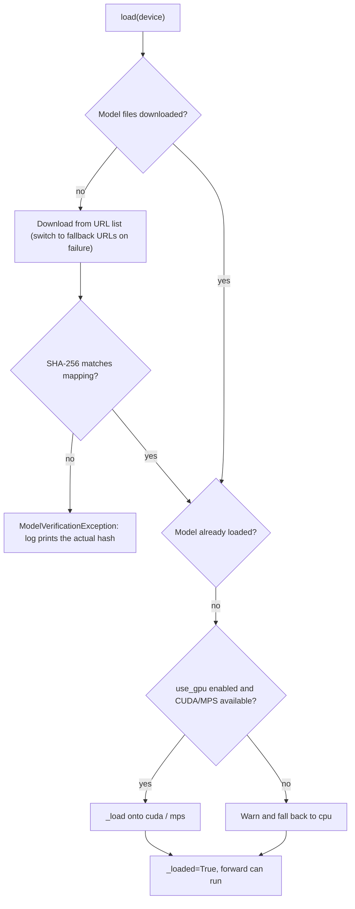
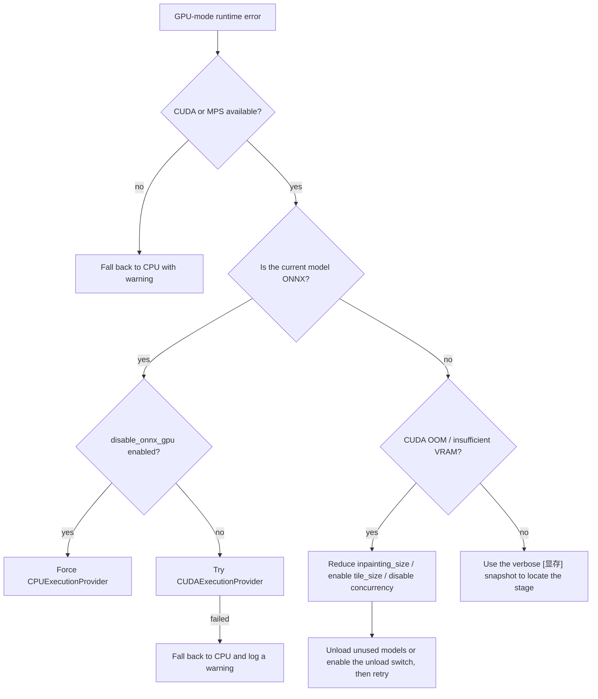
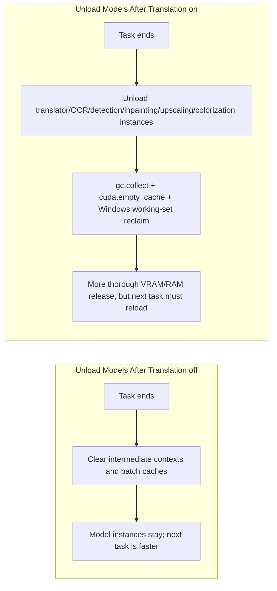

# Model, GPU, and Memory Troubleshooting

Use this page when a task stalls on model download, reports “CUDA out of memory”, GPU mode will not start, or memory/VRAM does not drop after translation. It covers model loading, GPU devices, VRAM, and RAM. Hardware backend groups are installed separately; see [Runtime Requirements](../install/requirements.md). The switches such as `app.unload_models_after_translation` are documented in [General and App Settings](../desktop/settings/general-and-app.md). This guide does not repeat the full parameter pages for translation, OCR, detection, inpainting, or upscaling, nor API auth and rate limiting (see [API Auth, Rate Limit, and Timeout](./api-auth-rate-limit-and-timeout.md)) or CLI subprocess whole-machine memory limits (see [Subprocess, Memory, and Recovery](../cli/subprocess-memory-and-recovery.md)).

## Identify the problem {#feature-boundary}

- This guide covers: model download/verification failures, device selection for `cli.use_gpu`, the ONNX path for `cli.disable_onnx_gpu`, post-task unload via `app.unload_models_after_translation`, and VRAM-related remedies such as `inpainting_size` and `tile_size`.
- This guide does not cover: how to choose installation dependency groups (see `install/requirements.md`), the full options of the inpainting/upscaling pages (see their settings pages), or how to share logs and debug artifacts (see [How to Read and Share a Debug Run](../debugging/how-to-read-and-share-a-debug-run.md)).
- The settings pages record where each switch lives in the UI; this guide explains their role in model, GPU, and memory troubleshooting and the underlying behavior.

## Common symptoms and quick diagnosis {#symptoms}

| Symptom | Common cause | Where to start |
| --- | --- | --- |
| First use of a model stalls on download or reports hash verification failure | Network unreachable, fallback URLs also fail, corrupted file or content differs from the actual weights | Check the `models/` subdirectory and the actual hash printed in logs; see [Model loading and download](#model-loading) |
| CUDA/Metal device not found and automatic fallback to CPU | CPU dependency group installed, driver mismatch, or `cli.use_gpu` enabled while the device is unavailable | [Runtime Requirements](../install/requirements.md); `label_use_gpu` |
| ONNX model fails to load or has GPU compatibility issues | ONNX Runtime CUDA provider unavailable or DLL conflict | Enable `label_disable_onnx_gpu` to force CPU and check whether it recovers |
| CUDA out of memory / insufficient VRAM | Per-inference input too large, `inpainting_size` too large, or high peak usage from concurrency and caches | Reduce `inpainting_size`, enable `tile_size`, disable concurrency, enable the unload switch |
| Memory/VRAM does not drop after a task | Model instances stay cached, Python and CUDA caches are not reclaimed | Enable `app.unload_models_after_translation`; inspect the `[显存]` snapshot in verbose logs |

## Relevant switches in the UI {#ui-controls}

### Settings → General {#general-group}

Open “Settings” (`Settings`) and select the “General” (`General`) group. The three switches all live in this group:

1. “Use GPU” (`Use GPU`) requests GPU acceleration. It only changes the runtime device; it cannot turn a CPU dependency environment into CUDA.
2. “Disable ONNX GPU Acceleration” (`Disable ONNX GPU Acceleration`) disables only the ONNX Runtime GPU path and forces CPU.
3. “Unload Models After Translation” (`Unload Models After Translation`) controls model unloading and memory reclamation after each task; when enabled, the next task reloads the models.

### Other relevant settings {#other-settings}

- Inpainting size `inpainter.inpainting_size`: Settings → Mask and Inpainting. The default is `2048`; a value that is too large directly causes insufficient VRAM.
- Upscaling tiles `upscale.tile_size`: Settings → Upscale / Colorization. `0` processes the full image without tiling; tiling significantly lowers peak VRAM.
- Concurrent batches `cli.batch_concurrent`: Settings → General. Concurrency loads intermediate results of multiple images at once and raises peak VRAM/RAM; disable it when VRAM is limited.

## Key settings {#key-settings}

> For the mapping of each parameter's UI name, stored key, and default value, see the [UI Options Reference](../reference/options-i18n-matrix.md).

#### Use GPU {#cli-use-gpu}

The “Use GPU” switch lives in the “Settings → General” group and requests GPU acceleration. It only changes the runtime device selection; it cannot turn a CPU dependency environment into CUDA. When on, the UI shows “Use GPU”; when off there is no separate UI label, it simply means GPU is not requested.

#### Disable ONNX GPU Acceleration {#cli-disable-onnx-gpu}

The “Disable ONNX GPU Acceleration” switch lives in the “Settings → General” group and disables only the ONNX Runtime GPU path, forcing CPU; it does not affect PyTorch/MPS models. When on, the UI shows “Disable ONNX GPU Acceleration”; when off, ONNX may use the CUDA provider.

#### Unload Models After Translation {#app-unload-models-after-translation}

The “Unload Models After Translation” switch lives in the “Settings → General” group and controls model unloading and memory reclamation after each task; when enabled, the next task reloads the models and the first response is slower. When on, the UI shows “Unload Models After Translation”; when off, model instances are kept after the task.

## Why it happens {#runtime-behavior}

### Model loading and download {#model-loading}

The model root is `BASE_PATH/models` (`BASE_PATH` is the repository root in development and the executable directory in frozen builds). Detection, OCR, inpainting, upscaling, colorization, and translation use separate subdirectories. Loading first checks whether the files are downloaded: if missing, it downloads from the URL list in the module’s model mapping, computes SHA-256, and compares it with the `hash` entry; a mismatch raises a verification error and prints the actual hash in logs. Only after the files are ready does it move the weights onto the target device.

On download failure or hash mismatch, first check the network and permissions of the `models/` directory, then compare the actual hash printed in logs against the mapping or delete corrupted files and retry. Do not copy local paths from download directories or logs into public reports.

### GPU and VRAM {#gpu-and-vram}

Device selection happens during initialization: with `use_gpu=True` and an available device it selects `cuda`/`mps`, otherwise it falls back to `cpu` with a warning. The ONNX runtime prefers `CUDAExecutionProvider` unless disabled, and a missing provider or failed session creation automatically falls back to `CPUExecutionProvider`. Both the desktop app and the CLI set `PYTORCH_ALLOC_CONF=expandable_segments:True` before importing PyTorch to reduce fragmentation and lower the chance of OOM. In verbose mode, VRAM snapshots are written to logs with the `[显存]` prefix (allocated/reserved/peak/free) to locate stage-by-stage growth.

Whether OOM occurs also depends on image size, `batch_concurrent`, and other processes on the same machine; enabling tiling or the unload switch does not guarantee that no model ever reports OOM.

### Unloading and memory reclamation {#memory-cleanup}

“Unload Models After Translation” triggers a full memory cleanup after a desktop task finishes; the core translator also cleans up per batch: normal cleanup does throttled garbage collection and CUDA synchronization, while aggressive mode also empties GPU caches; MPS has no equivalent cache-clearing API.

Enabling unload does not mean VRAM used by third-party processes (browsers, other PyTorch programs) is returned immediately, nor that system RAM usage drops to zero at once; it mainly releases the models and caches held by this process.

### Idle unloading in server modes {#idle-unload}

The `web`, `ws`, and `shared` modes support `--models-ttl` (seconds, default `0`). When greater than `0`, a background cleanup task unloads models idle longer than the TTL; `0` keeps models resident. The desktop app does not use this CLI parameter; its behavior is controlled by “Unload Models After Translation”.

## Related settings and limitations {#dependencies}

- GPU acceleration depends on the backend group and drivers selected at install time; with the wrong group or drivers, `cli.use_gpu` only triggers a fallback instead of fixing the environment; see [Runtime Requirements](../install/requirements.md).
- An oversized `inpainting_size` directly causes OOM; `upscale.tile_size` tiling lowers upscaling peak VRAM; `cli.batch_concurrent` raises concurrent peaks, so disable it when VRAM is limited.
- `cli.disable_onnx_gpu` affects only the ONNX path; PyTorch/MPS models still select their device through `cli.use_gpu`.
- Enabling `app.unload_models_after_translation` costs reload time on the next task; it and `models_ttl` are different entry points (desktop switch vs server-mode CLI parameter).
- RAM limits (subprocess RSS / whole-machine memory) are a different class from VRAM; see [Subprocess, Memory, and Recovery](../cli/subprocess-memory-and-recovery.md).
- `cli.ignore_errors` decides whether a per-image failure is skipped or aborts the task; CUDA OOM has no dedicated friendly Chinese message, and task logs keep the original traceback. Clean logs before sharing per [Privacy, Cleanup, and Log Sharing](./privacy-cleanup-and-log-sharing.md).
