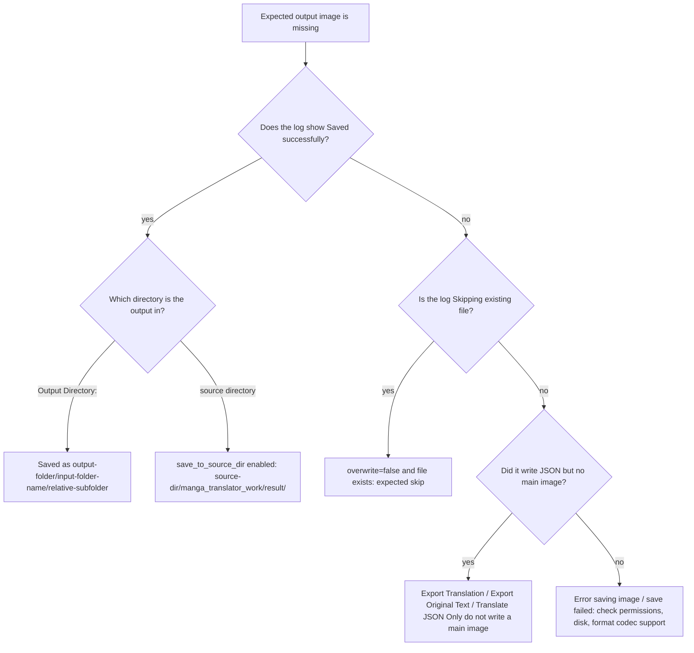
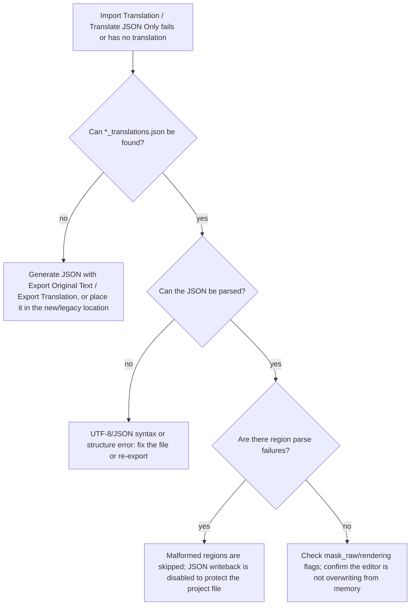
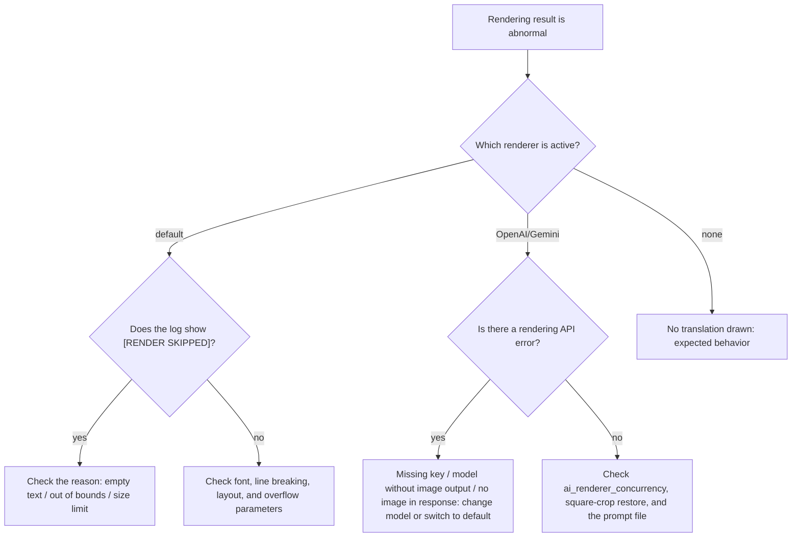

# Output, JSON, and Rendering Troubleshooting

Use this page when a task finishes but you cannot see the output image, a project JSON cannot be read, or the final image has no or broken translated text. Start with the "symptom → log → cause → fix" flow here, then open the feature page for parameters and operations. This page cross-links with [Output Directory and Workflow](../desktop/translation/output-directory-and-workflow.md), the [workflow](../workflows/normal.md) pages, [Editor Import/Export and Writeback](../desktop/editor/import-export-and-writeback.md), and [Typesetting and Rendering](../desktop/settings/typesetting-and-rendering.md) without duplicating their content: workflow inputs/outputs, editor writeback, and rendering parameters are defined on those pages.

## Identify the problem {#feature-boundary}

- This guide covers symptom-to-fix diagnosis: the main output image (location, format, quality, overwrite), the `*_translations.json` project JSON (lookup, parsing, masks, writeback, backups), and text rendering (local Qt, AI rendering, fonts, line breaking, layout).
- Parameter defaults, options, and UI operations belong to the settings pages: [CLI, Batch, and Output](../desktop/settings/cli-batch-and-output.md) documents `format`, `save_quality`, `overwrite`, `save_text`, and [Typesetting and Rendering](../desktop/settings/typesetting-and-rendering.md) documents every `render.*` parameter.
- Inputs, outputs, skipped stages, and file formats of the nine workflows belong to the [workflow](../workflows/normal.md) pages and [Output Directory and Workflow](../desktop/translation/output-directory-and-workflow.md); editor project-data reads and writes belong to [Editor Import/Export and Writeback](../desktop/editor/import-export-and-writeback.md).
- Not covered here: detection/OCR/translation/inpainting/colorization/upscaling failures (see the matching settings and debugging pages), API keys/rate limits/timeouts (see [API Auth, Rate Limit, and Timeout](./api-auth-rate-limit-and-timeout.md)), and log/privacy cleanup (see [Privacy Cleanup and Log Sharing](./privacy-cleanup-and-log-sharing.md)).

## Start with logs and debug artifacts {#start-with-logs}

Reproduce the task once and keep the logs; most output/JSON/rendering problems can be traced to a specific branch from the log:

1. Open “Settings” → “General” and enable “Verbose Logging” (`Verbose Logging` / `label_verbose`), then reproduce the task.
2. In `result/`, check `log_<timestamp>.txt` and the `<timestamp>-<image>-<target>-<translator>/` debug folder; see the "Verbose Logging" description for cleanup (close the Qt UI first, then delete).
3. Filter the log for: `Saved successfully` / `Skipping existing file`, `JSON saved to` / `Failed to read or parse`, `[RENDER SKIPPED]`, `Error saving image`, `stage='rendering'` / `stage='saving'`.
4. Do not copy local paths, translation bodies, request payloads, or debug images from logs into public reports or shared archives.

The `count` in “Translation completed, {count} files saved.” is the number of files actually saved or skipped in this run; it does not mean every file was re-rendered. Skipping an existing file also counts as success.

## Output file issues {#output-file-issues}

The main output path is computed by `_calculate_output_path` from `save_info` (output folder, input-folder set, `format`, `save_to_source_dir`, `overwrite`); it is not a fixed directory. First confirm the value of “Output Directory:” (`Output Directory:`) and whether “Save to Source Directory” (`Save to Source Directory` / `label_save_to_source_dir`) is enabled.

### Output image missing or misplaced {#output-image-missing-or-misplaced}

| Symptom | Common cause | Action |
| --- | --- | --- |
| Output image is not under “Output Directory:” | “Save to Source Directory” is enabled; it is written to `<source-dir>/manga_translator_work/result/` | Disable “Save to Source Directory”, or look in that directory |
| An extra subfolder named after the input folder appears in the output directory | The path keeps the structure “output folder + input-folder name + relative subfolder” | Expected behavior, not an error |
| Cannot find output for archive input | Output lands in the archive output directory of the extracted `original_images/` parent | See [Output Directory and Workflow](../desktop/translation/output-directory-and-workflow.md) |
| No output image at all | The workflow does not write a main image (Export Translation, Export Original Text, Translate JSON Only), or `overwrite=false` skipped an existing file | Check the workflow type and skip logs |
| Error while saving | Log shows `Error saving image to ...` or “保存输出文件失败” | Check output-directory permissions, disk space, and format codec support |

Path rules (source `_calculate_output_path`):

- `save_to_source_dir=true` → `<source-dir>/manga_translator_work/result/<filename>`.
- Otherwise → saved under `output_folder` mirroring the input structure: `output-folder/<input-folder-name>/<relative-subfolder>/<filename>`; the relative subfolder is omitted when the file is directly in the input root.
- Archive images that hit `original_images/` are written back to the archive output directory (`<output>/.../<archive-name>`).
- When `format` is empty, `不指定`, or `none`, the original filename (original extension) is kept; otherwise `<stem>.<format>` is used.
- Missing target directories are created automatically (`os.makedirs(..., exist_ok=True)`).

### Output format and quality {#output-format-and-quality}

Values of the “Output Format” (`Output Format` / `label_format`) dropdown and their encoding behavior; the stored value `不指定` keeps the original extension:

| Stored value | English | Simplified Chinese | Notes |
| --- | --- | --- | --- |
| empty / `不指定` / `none` | Not Specified | 不指定 | Keep the original extension |
| `png` | png | png | PNG, lossless |
| `jpg` / `jpeg` / `jfif` | jpg / jpeg / jfif | jpg / jpeg / jfif | JPEG, forced RGB conversion |
| `webp` | webp | webp | Supports the quality parameter |
| `avif` | avif | avif | Depends on Pillow/platform AVIF codec support |
| `bmp` | bmp | bmp | BMP, forced RGB conversion |
| `tiff` / `tif` | tiff / tif | tiff / tif | TIFF |
| `heic` / `heif` | heic / heif | heic / heif | HEIF, depends on platform codec support |

| UI call key | English actual value | Simplified Chinese actual value |
| --- | --- | --- |
| `label_format` | Output Format | 输出格式 |
| `label_save_quality` | Image Save Quality | 图像保存质量 |
| `desc_cli_format` | Output image format. Choose PNG, JPG/JPEG/JFIF, WebP, AVIF, BMP, TIFF/TIF, HEIC/HEIF, or leave empty to keep the original format. | 输出图片格式。可选 PNG、JPG/JPEG/JFIF、WebP、AVIF、BMP、TIFF/TIF、HEIC/HEIF，或留空保持原格式。 |
| `desc_cli_save_quality` | JPEG/WebP/AVIF/HEIC save quality (0-100). Higher values mean better quality but larger files. | JPEG/WebP/AVIF/HEIC 保存质量 (0-100)。值越高画质越好，文件越大。 |

Behavior notes:

- “Image Save Quality” (`Image Save Quality` / `label_save_quality`, 0–100, Qt/release default `100`) affects JPEG/WebP/AVIF/HEIF only; PNG, BMP, and TIFF ignore the quality parameter.
- JPEG/BMP are alpha-less RGB formats: RGBA/palette images are converted to RGB and alpha is flattened; CMYK is also converted to RGB.
- HEIC/HEIF and AVIF depend on Pillow and platform codecs; saving fails when support is missing. The shared `save_pil_image` entry point passes an explicit encoder and preserves source ICC and DPI metadata where possible.
- The unified server/CLI save guard (`save.py`) raises `FormatNotSupportedException` when the extension is not in the supported list.

### Overwrite and skip behavior {#overwrite-and-skip}

- “Overwrite Existing Files” (`Overwrite Existing Files` / `label_overwrite`, stored as `cli.overwrite`): core default `false`; Qt model and release config default `true`.
- When disabled, an existing target file is skipped without being overwritten; the log/summary shows “⏭️ Skipped … (overwrite detection disabled)” and the skip still counts as success without interrupting the task.
- Workflow pre-checks: Export Translation/Export Original Text check the matching `originals/` and `translations/` sidecar files, Translate JSON Only checks the original sidecar, and other modes check the main output image (`workflow_service`); see the workflow pages for details.
- Troubleshooting: when a whole batch “produces no new output”, first check whether `overwrite=false` and the outputs already exist.

### PSD and JSX export {#psd-and-jsx-export}

- “Export Editable PSD” (`Export Editable PSD` / `label_export_editable_psd`, stored as `cli.export_editable_psd`) writes layers to `manga_translator_work/psd/<stem>.psd` and requires Photoshop on the machine.
- “Generate PSD Script Only” (`Generate PSD Script Only` / `label_psd_script_only`, stored as `cli.psd_script_only`) generates only `<stem>_photoshop_script.jsx` without launching Photoshop or producing a PSD directly; temporary scripts are deleted unless verbose or script-only.
- PSD/JSX export failures are logged and do not interrupt image saving.
- JSX may contain layer text and local file paths; review every file before sharing.

### Output diagnostic flow {#output-diagnostic-flow}

## Project JSON issues {#json-issues}

The project JSON is `manga_translator_work/json/<stem>_translations.json` (new location preferred); the legacy location is `<stem>_translations.json` next to the source image. It is the input and writeback target for the editor, Import Translation and Render, and Translate JSON Only; field structure and manual-edit risks are described in [Editor Import/Export and Writeback](../desktop/editor/import-export-and-writeback.md).

### JSON file not found {#json-not-found}

Lookup order (`find_json_path`): new location → legacy location → legacy TXT (`<stem>_translations.txt`, no mask) → treat as no text when nothing exists.

| Symptom | Common cause | Action |
| --- | --- | --- |
| Import Translation and Render reports “JSON file not found” | The image never had a project JSON, or the file is not in the new/legacy location | Generate JSON with “Export Original Text” or “Export Translation” first (`import_mode_json_hint`), then retry |
| Translate JSON Only asks for existing JSON data | No parseable project JSON exists | Generate JSON and retry; on success the app deletes the `<stem>_original.<extension>` original sidecar |
| Import read a legacy TXT | Only `<stem>_translations.txt` exists, no JSON | Compatible fallback: regions load but there is no mask or rendering style |
| Web import only accepts JSON | A TXT file was selected | Follow `import_mode_json_only` and pass JSON only |

| UI call key | English actual value | Simplified Chinese actual value |
| --- | --- | --- |
| `import_mode_no_json` | Import mode: JSON file not found | 导入翻译模式：未找到JSON文件 |
| `import_mode_json_only` | Import mode: Only JSON files are supported, TXT files are not supported | 导入翻译模式：只支持JSON文件，不支持TXT文件 |
| `import_mode_json_hint` | Hint: Please use 'Export Original' or 'Export Translation' to generate JSON files | 提示：请使用「导出原文」或「导出翻译」功能生成JSON文件 |
| `label_translate_json_only` | Translate JSON Only | 仅翻译（JSON） |
| `Start JSON Translation` | Start JSON Translation | 开始仅翻译（JSON） |
| `Tip: Requires existing JSON data. The app reads original text from JSON, translates it, writes results back to JSON, and deletes imagename_original.txt after success` | Tip: Requires existing JSON data. The app reads original text from JSON, translates it, writes results back to JSON, and deletes imagename_original.txt after success | 提示：需要预先存在 JSON 数据。程序会从 JSON 读取原文并执行翻译，完成后回写 JSON，并删除图片名_original.txt。 |

### JSON parse failure or malformed structure {#json-parse-failure}

- The project JSON is read as UTF-8; the top level must be a non-empty object mapping a source-image absolute path to data, where the data is either the legacy form (a region list) or the new form (a dict with `regions`).
- Parse failure, an empty object, or an invalid value type makes the image fall back to “no text” and logs it (`Failed to read or parse translation file`, `JSON file ... is empty or invalid`, `Invalid data format`).
- Region-level errors: a `lines` shape other than `(N, 4, 2)` skips that region and increments a counter; `TextBlock` construction failure first retries without `translation_rich` (losing style, not the region) and only then skips.
- When any region fails to parse, JSON writeback is disabled for that image (`skipped JSON write-back to protect the project file`) so malformed regions cannot permanently lose their original text and coordinates on writeback.
- Literal `\\n` in text is converted to newlines; a region missing `target_lang` falls back to the configured target language.
- After hand-editing JSON, confirm it parses with a JSON-validating editor before importing or rendering.

| UI call key | English actual value | Simplified Chinese actual value |
| --- | --- | --- |
| `{count} malformed regions skipped` | {count} malformed regions skipped | 跳过 {count} 个结构异常的区域 |
| `File not found` | File not found | 文件不存在 |
| `Error reading file: {error}` | Error reading file: {error} | 读取文件出错：{error} |
| `JSON format error` | JSON format error | JSON 格式错误 |
| `JSON root must be an object` | JSON root must be an object | JSON 顶层必须是对象 |
| `JSON value is empty` | JSON value is empty | JSON 值不能为空 |

The three `JSON ...` strings above are also used by the config-JSON editors (custom API params, filter list); parse failures of the project JSON itself are recorded in the log, as described above.

### Masks, overlays, and rendering flags {#mask-overlay-and-flags}

- `mask_raw` is stored as a base64-encoded PNG; loading accepts a base64 string, an in-memory `ndarray` (editor pass-through), or a numeric list. A decode failure is logged as `Failed to decode base64 mask`.
- When `mask_is_refined=true`, Import Translation and Render can skip mask refinement and reuse the mask.
- `paint_overlay` / `stamp_overlay` store editor brush/stamp layers: the base64 value in JSON wins; the legacy single file `manga_translator_work/paint_overlay/<stem>_overlay.png` is still read for compatibility.
- The rendering flags below are written by `_save_text_to_file` and read by `_load_text_and_regions_from_file`; deleting them by hand changes later rendering behavior:

| JSON field | Meaning | Effect |
| --- | --- | --- |
| `skip_font_scaling` | `false` re-runs smart font scaling on import/render; `true` replays with a fixed font size | Export Original Text / Translate JSON Only write `false`; Export Translation writes `true` |
| `skip_text_replacements` | `true` means the translation is final and import rendering does not apply replacement rules again | Rendered contexts write `true`; unrendered exports stay `false` |
| `last_export_dir` | Output directory of the last main translation run | The editor re-exports to the same directory |
| `upscale_ratio` and similar markers | Whether upscaling/colorization was enabled | The editor looks up the `editor_base` image and deletes stale bases without the markers |

### JSON writeback, backup, and restore {#json-writeback-and-backup}

- Normal translation writes JSON when `save_text` (“Editable Image” / `Editable Image` / `label_save_text`, Qt/release default `true`) is on and the image has `text_regions` (an empty region list is still written).
- Translate JSON Only writes back unconditionally; Export Translation / Export Original Text write `translations/` and `originals/` text sidecars and no main image.
- Batch management backs up each JSON to `<json-file>.bak` in the same directory before writing (“Writes a .bak next to each modified JSON”); restoring overwrites the JSON and deletes the `.bak`; see [Preview, Apply, and Restore](../desktop/batch-management/preview-apply-restore.md).
- `translation_map.json` in the output directory maps “result image → source image” and is used by the editor and file list to resolve source images; without it the editor still falls back by output filename.
- Troubleshooting “JSON edits did not take effect”: check whether the editor has the same image open (its in-memory snapshot overwrites disk changes), or whether batch writeback and the editor touched the same JSON; see the editor page.

### JSON diagnostic flow {#json-diagnostic-flow}

## Rendering issues {#rendering-issues}

With `render.renderer` set to `default`, text is rendered locally by Qt offscreen rendering; `openai_renderer` / `gemini_renderer` use AI image rendering; `none` draws no translation. All parameters and options are in [Typesetting and Rendering](../desktop/settings/typesetting-and-rendering.md); AI-rendering API configuration lives in the API-management pages.

### No translation drawn {#no-translation-drawn}

| Symptom | Common cause | Action |
| --- | --- | --- |
| No text at all on the image | The renderer is `none` | Expected behavior; switch to `default` or an AI renderer |
| Some regions have no text | The region translation is empty and the render loop skips it (log `[RENDER] 跳过空文本区域`) | Check the `translation` field of that region in JSON |
| Region is outside the image | Layout placed it off-canvas (log `Text region completely outside image bounds`) | Check region coordinates/anchor for anomalies |
| Rendering skipped | Text rendering returned None, dimensions were invalid, or the OpenCV 32767 limit was exceeded (log `[RENDER SKIPPED] ...`) | Read the exact log reason and adjust font size or region |

### Fonts and missing glyphs {#font-and-glyphs}

- The “Font” (`Font` / `label_font_family`) dropdown enumerates system fonts plus `.ttf`, `.otf`, and `.ttc` files under the project `fonts/` directory; reopen the dropdown after adding a font.
- When the requested family is not found, rendering falls back to `Microsoft YaHei UI` (log `Qt font family not found ... using ...`); legacy font-file path values are mapped to a family name.
- Bracketed “Family [Foundry]” names are sanitized so Qt does not treat the bracket segment as a foundry and degrade matching.
- Missing glyphs: fonts without the target-language glyph set produce boxes or replacement characters; use a font that covers that glyph set.
- Mind font licenses: do not redistribute commercial fonts from the project `fonts/` directory.

### AI renderer failures {#ai-renderer-failures}

- Missing rendering API key: the UI blocks starting translation and shows “API Keys Required”, asking you to fill `RENDER_OPENAI_API_KEY` / `RENDER_GEMINI_API_KEY` (or fallback `OPENAI_API_KEY` / `GEMINI_API_KEY`) in API Keys (.env); at runtime the error is `... Renderer is not configured. Set ... in .env`.
- Model without image output: the classified error says “当前模型不支持渲染”; switch the “Renderer” back to `default`, or choose a model that supports image output/editing in “API Management → Rendering”.
- Response without an image: Gemini reports `response did not contain an image`; OpenAI may return text or be blocked by content moderation.
- The request crops the page to a square and restores it afterwards; failures retry through API candidate rotation; concurrency is capped by “AI Renderer Concurrency” (`AI Renderer Concurrency` / `label_ai_renderer_concurrency`) and higher values are more likely to hit rate limits.
- Troubleshooting steps: ① test the connection/current tab in “API Management → Rendering”; ② change the model or Base URL; ③ temporarily switch back to `default` to verify local rendering; ④ check `render request` errors in the log.

| UI call key | English actual value | Simplified Chinese actual value |
| --- | --- | --- |
| `label_renderer` | Renderer | 渲染器 |
| `label_ai_renderer_concurrency` | AI Renderer Concurrency | AI 渲染并发数 |
| `label_ai_renderer_prompt_path` | AI Renderer Prompt | AI 渲染提示词 |
| `API Keys Required` | API Keys Required | 需要填写 API 密钥 |
| `desc_render_renderer` | Rendering engine. default renderer; openai_renderer and gemini_renderer require the corresponding API Key in API Keys (.env), otherwise the UI will block translation start. | 渲染引擎。default 默认渲染器；openai_renderer / gemini_renderer 需要先在 API密钥(.env) 中填写对应 API Key，否则 UI 不会开始翻译。 |

### Line breaking, layout, and overflow {#linebreak-layout-and-overflow}

- “Chinese Semantic Line Break” (`Chinese Semantic Line Break` / `label_semantic_linebreak`) requires local HanLP models; when models are missing or the download fails, rendering falls back to normal wrapping (log `... falling back to normal line breaking`).
- AI line-break check failures (`BR markers missing` / `BRMarkersValidationException`): disable “AI Line Break Check” (`check_br_and_retry`), raise “Retry Attempts”, change the translation model, or disable “AI Line Break Auto Enlarge” (`optimize_line_breaks`).
- “Smart Bubble” layout (`balloon_fill`) needs `original_img` to build the bubble mask; when missing it falls back to strict layout (log `balloon_fill mode requires original_img, fallback to strict layout`).
- Overflow/clipping: fixed font size, strict boundary, min/max font size, disabled auto wrap, and forced horizontal layout tighten the region and may shrink or clip text; adjust “Layout Mode” (`Layout Mode` / `label_layout_mode`), minimum font size, and font-scale ratio.
- A YAML syntax error in `rich_text_rules.yaml` prevents matched regions from applying rich-text styles (the editor shows an error state); never share real rule content.

| UI call key | English actual value | Simplified Chinese actual value |
| --- | --- | --- |
| `label_layout_mode` | Layout Mode | 排版模式 |
| `label_semantic_linebreak` | Chinese Semantic Line Break | 中文语义断句 |
| `label_disable_auto_wrap` | AI Line Breaking | AI断句 |
| `label_check_br_and_retry` | AI Line Break Check | AI断句检查 |
| `label_optimize_line_breaks` | AI Line Break Auto Enlarge | AI断句自动扩大文字 |
| `desc_render_semantic_linebreak` | Use local HanLP models to line-break Chinese translations by semantic phrases. Currently supports Chinese target text only; falls back to normal wrapping if models are missing. | 使用本地 HanLP 模型按中文短语进行自动断句。目前仅支持中文译文；模型缺失时自动回退普通断句。 |

### Rendering diagnostic flow {#rendering-diagnostic-flow}

## Related settings and limitations {#dependencies-and-conflicts}

- Output directory, `save_to_source_dir`, `format`, and `overwrite` interact with the workflow type; export/JSON-only/replace-translation modes do not write a main image.
- Disabling overwrite also skips images, TXT, and JSON; with `save_text=false` normal workflows do not write JSON, but Translate JSON Only still writes back unconditionally.
- `batch_concurrent` is incompatible with import/export/JSON-only/replace-translation modes and is forced non-concurrent to keep per-image file writeback ordered; see [CLI, Batch, and Output](../desktop/settings/cli-batch-and-output.md).
- AI rendering depends on API configuration, network, and model capability; concurrency, large images, and rich-text styles increase resource use, and cancelled tasks must not share intermediate requests or user images.
- Fonts, layout modes, and AI line breaking constrain each other; `check_br_and_retry` can loop indefinitely and must be used with care.
- PSD export requires local Photoshop; JSX, JSON, and TXT may contain text and paths — sanitize before sharing per [Privacy Cleanup and Log Sharing](./privacy-cleanup-and-log-sharing.md).
