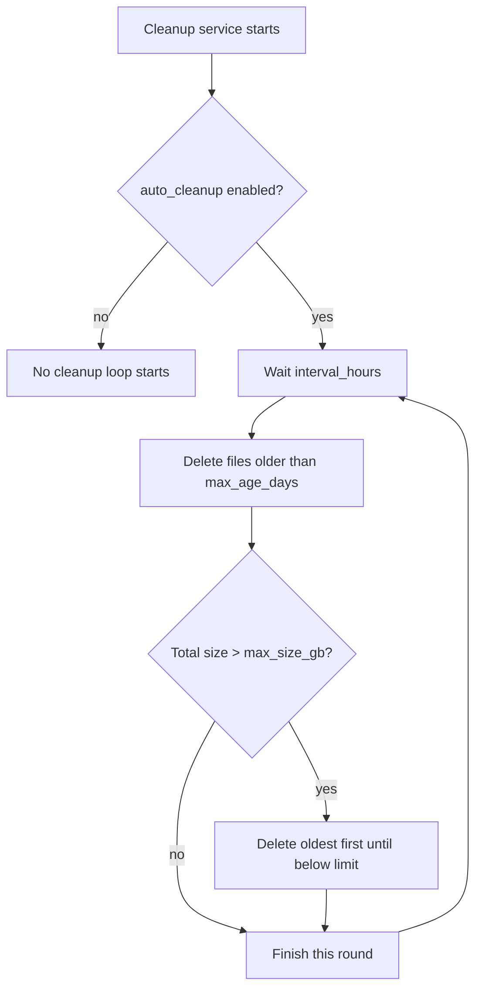
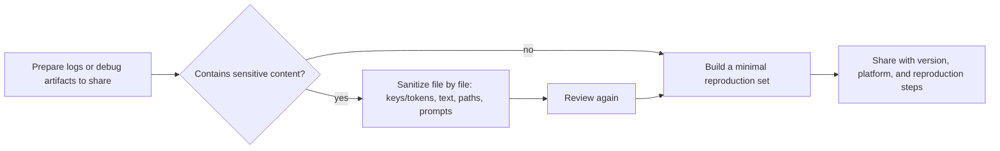

# Privacy, Cleanup, and Log Sharing

Use this page when you need to free disk space, delete runtime data that contains personal content, or send logs and debug artifacts to someone else for troubleshooting. The per-artifact generation stages and reading order are covered by [How to Read and Share a Debug Run](../debugging/how-to-read-and-share-a-debug-run.md); full uninstall by installation type is covered by [Uninstall and Data Cleanup](../install/uninstall-and-data-cleanup.md); the complete Web admin operations are covered by [Administrator Interface](../web/administrator-interface.md).

## Scope {#scope}

- This guide covers: cleaning up logs and runtime data, sanitization rules before external sharing, viewing/exporting desktop and CLI logs and Web session/system logs, and automatic rebuilding of runtime configuration tables.
- This guide does not repeat: where data is stored and sent (see the data-and-privacy page), the meaning of each debug artifact (see the debug-run page), uninstall steps by installation type (see the uninstall page), or every button and state of the Web admin UI (see the administrator-interface page).
- Cleanup is neither uninstall nor backup. Deleting `.env`, `config/`, server `data/`, results, model caches, and debug directories is irreversible; confirm the scope and back up anything you need first.

## How to use it {#operations}

### Clean up runtime data {#cleanup-data}

Before cleaning up the desktop app, fully exit the Qt UI (or stop the CLI). Otherwise the log files under `result/` are held by the file handler and deletion may fail on Windows:

1. Open “Settings” (`Settings`) → “General” (`General`) and read the cleanup hint in the “Verbose Logging” (`Verbose Logging`) description panel: close the Qt UI first, then delete the unneeded `log_*.txt` files and the matching timestamp debug folders under `result/`.
2. Delete `log_<timestamp>.txt` and the `timestamp-image-MD5-size-language-translator/` debug subfolders under `result/`; delete them together rather than only half of them.
3. `manga_translator_work/` next to the input directory may contain per-image JSON, exported text, PSD/JSX, and intermediate images; delete selectively per task.
4. Runtime tables under `config/` (filter list, replacements, rich-text rules, translation template, prompts, and so on) are rebuilt with defaults by `ensure_runtime_files()` on the next start, but custom changes are lost.

The “Cleanup” (`Cleanup`) module in the Web admin panel only acts on the directories defined by the server cleanup service. It is not an uninstaller that deletes the program directory, and it does not cover the desktop `result/` folder or the work directory next to the input directory. “Clear all translation results” on the results page only clears the browser result list and blob URLs; it does not delete result files on the server.

### View and export logs {#view-and-export-logs}

- Desktop and CLI runtime logs are both written to `result/log_<yyyyMMddHHmmss>.txt` under the application root (the repository root in a dev environment, or the folder of the executable in a packaged build). When the “Translation Error” (`Translation Error`) dialog appears, click “Open log folder” (`Open log folder`) to jump to the log directory.
- The “Logs” (`Logs`) module in the Web admin panel shows system logs and session logs, filtered by session or level, and can “Export Logs” (`Export Logs`) or “Clear Logs” (`Clear Logs`).
- Before sharing logs, follow the “Sanitizing and sharing logs” section of this page: remove local paths, credentials, user text, and session tokens, and keep only version, platform, and reproduction steps.

### Config import/export and secret display {#config-import-export}

- The “Export Config” (`Export Config`) message states that the exported file does not include sensitive information such as API keys; “Import Config” (`Import Config`) preserves existing sensitive information instead of overwriting it.
- API key fields in the API-management page default to password mode and are shown in the window only when you actively click the reveal icon; this is not protection against clipboard, screen recording, or external services.

## Why it happens {#runtime}

### Log writing and cleanup boundaries {#log-writing}

Run logs are written at DEBUG level to `result/log_<yyyyMMddHHmmss>.txt` in the same location and format for both the desktop app and the CLI, independent of the console log level. Logs may contain absolute local paths, error stacks, request stages, and session information; they must be sanitized before public sharing.

### Server auto cleanup {#server-auto-cleanup}

The server cleanup service cleans only three server data directories:

- results: `SERVER_DATA_DIR/results`
- user fonts: `USER_RESOURCES_DIR/fonts`
- user prompts: `USER_RESOURCES_DIR/prompts`

The settings (`admin_settings['cleanup']`) default to `auto_cleanup: false`, `interval_hours: 24`, `max_age_days: 7`, and `max_size_gb: 10`. Each round first deletes files whose modification time is older than the retention period; if the total size still exceeds the limit, it keeps deleting the oldest files until the size is below the limit, then removes empty directories. The service does not cover the desktop `result/` folder, `manga_translator_work/` next to the input directory, or browser `localStorage`.

Auto cleanup deletes only by modification time and total size; it does not distinguish files that contain sensitive content. Data outside the covered directories must still be handled manually.

### Runtime-file rebuild {#runtime-files-rebuild}

At startup, the system prepares user-editable runtime tables for every entry point: `custom_api_params.json`, AI OCR/renderer/colorizer prompts, `filter_list.json`, `text_replacements.yaml`, `rich_text_rules.yaml`, and `translation_template.json`. It never overwrites user files; a file is deleted and recreated by the follow-up flow only when its content matches the MD5 of a legacy built-in default. Deleting these files restores defaults on the next start, but custom changes are lost, so automatic rebuilding must not be treated as a backup.

### Sanitization boundary {#sanitization-boundary}

- The server recursively masks configuration values (replaced with `***`) whose key names contain `api_key`, `api_secret`, `password`, `token`, or `key` — and only at that specific output boundary. It is not a general scrubber for logs, debug directories, or databases.
- `mask_raw` is just a base64-encoded PNG; encoding is not anonymization. PSD/JSX scripts may contain layer text and local file paths; error messages may carry addresses, model names, and request stages. Any file containing this kind of content must be checked item by item before sharing.

## Cleanup and sanitization flows {#cleanup-and-sanitize}

### Data cleanup {#cleanup-table}

| Data location | Possible contents | Cleanup action | Note |
| --- | --- | --- | --- |
| `result/log_<timestamp>.txt` | Desktop/CLI runtime logs, paths, error stacks | Close the app, then delete | Deletion fails on Windows while the file is held open |
| `result/<timestamp>-<MD5>-<size>-<language>-<translator>/` | Verbose debug intermediates, `ocrs/`, JSON, JSX | Close the app, then delete the whole folder | Delete together with `log_*.txt` |
| `<input-dir>/manga_translator_work/` | Per-image JSON, exported text, PSD/JSX, intermediate images | Delete selectively per task | Contains source images, OCR, translations, and paths |
| `config/` runtime tables | Filter list, replacement/rich-text rules, translation template, prompts | Deleted and rebuilt by `ensure_runtime_files()` on restart | Custom changes are lost |
| `manga_translator/server/data/` | Accounts, sessions, history, logs, user resources | Back up and clean per deployer policy | The cleanup service covers only results/fonts/prompts |
| Browser `localStorage` | `session_token`, result list, `user_env_vars` | Log out and clear site data | Separate storage from server history |

### Sanitizing and sharing logs {#sanitize-and-share}

The goal of sharing logs or debug artifacts is to let the recipient reproduce the issue without your images or keys. Prefer a minimal reproduction set over packaging the whole `result/` folder or work directory.

| Include | Do not include |
| --- | --- |
| App/CLI version and operating system | Real API keys, tokens, passwords, session tokens |
| Reproduction steps, target language, translator, and key parameters | User source images, long source/translation text, OCR text |
| Sanitized log excerpts and matching debug subfolder | The entire `result/` folder or entire work directory |
| Sanitized config excerpts | Absolute local paths, private prompts |

## Related settings and limitations {#dependencies}

- `verbose` and the final output directory are independent: debug artifacts are written to `result/` under the app root, while final images are written elsewhere per output configuration; cleaning the debug folder does not affect saved outputs.
- The server cleanup service is not uninstall. “Clear all translation results” on the Web results page clears only the browser list and blob URLs, not the result files on the host. See the uninstall page for full uninstall.
- Runtime files are rebuilt with defaults after deletion, but custom content is lost; do not treat automatic rebuilding as a backup or treat example configuration as user configuration.
- Server `_sanitize_config` applies only to a specific output boundary and does not replace item-by-item review; base64 `mask_raw` is not sanitization.
- Deleting `.env`, `config/`, server `data/`, results, and model caches is irreversible; logs and error screenshots must be sanitized before external sharing.
