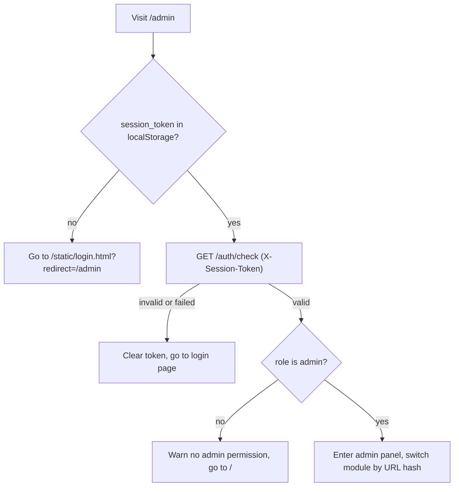
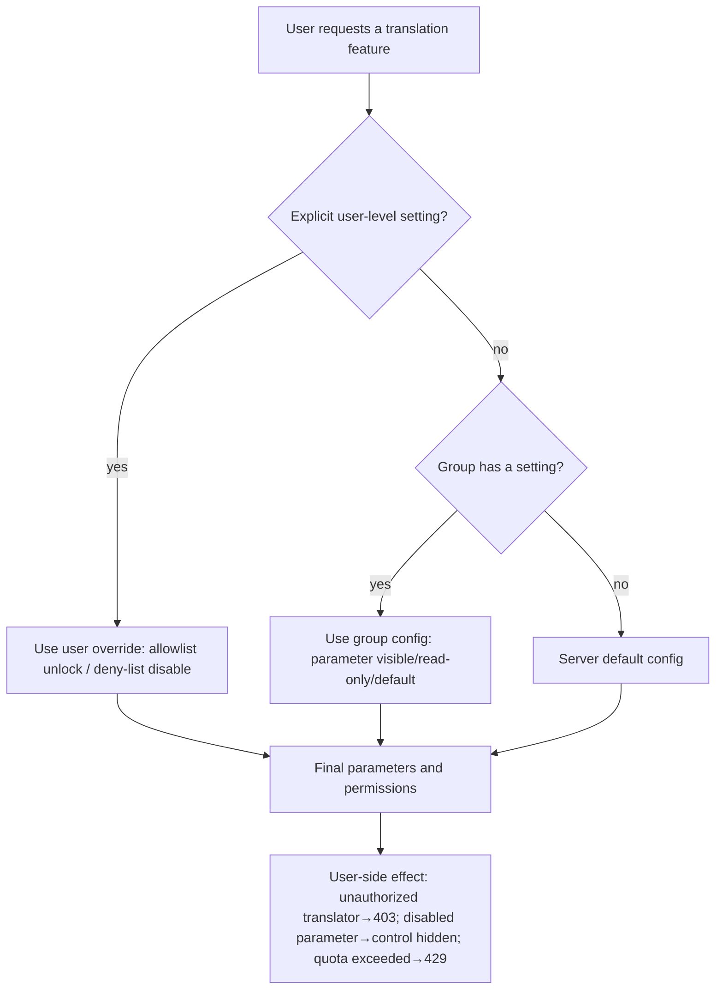

# Administrator Interface

When a server is shared by multiple users, the administrator uses the admin interface (`admin-new.html` served at `GET /admin`) to manage accounts and runtime state: create users, organize groups and permissions, configure quotas, inspect and revoke sessions, monitor and cancel translation tasks, review user history and system logs, manage API-key presets and the server `.env`, set server parameters, publish announcements, and clean up storage. Only a session whose `role` is `admin` can enter; non-admin visitors are warned and sent back to the home page.

This guide focuses on what an administrator does in the browser. The request, response, and status-code contracts of the underlying JSON/form endpoints (for example `/api/admin/users`, `/api/admin/groups`, `/api/admin/quota/*`, `/audit/events`) belong to the developer HTTP API pages. Login and first-time admin setup are described in [Login, language, and session](./login-language-and-session.md); the user-side workspace is covered in [Upload, configure, and translate](./upload-config-and-translate.md).

## UI and API scope {#feature-boundary}

- Entry is restricted: the “admin” link in the user home-page top bar is shown only when the session role is `admin` (`static/script.js` checks `userSession.role === 'admin'`). Visiting `/admin` directly still runs `GET /auth/check` first; when the token is missing or invalid, `localStorage.session_token` is cleared and the browser is redirected to `/static/login.html?redirect=/admin`; a non-admin is told “您没有管理员权限” (no admin permission) and returned to `/` (`static/js/admin/app.js`).
- The panel has 12 navigation modules: dashboard, user management, group management, quota management, session management, task monitoring, history, system logs, API-key management, server configuration, announcement management, and cleanup management.
- The `app.js` title map also contains “权限管理” (permission management), but `admin-new.html` does not register `modules/permissions.js` in its navigation or initialization, so that module is an unwired static list and is not treated as an operable feature on this page.
- Auditing (`AuditService` plus the `/audit/*` routes) automatically records login, password change, user creation, permission changes, and translation start/complete/failure events. The current admin panel has no audit module; querying and exporting go through the developer HTTP API.
- The admin panel is not a reuse of the desktop Qt UI: `admin-new.html` hardcodes most copy in Chinese and only a few controls use i18n (see the UI-copy table below), which differs from the user site and desktop locales.

## Entering the admin interface {#enter-admin-panel}

1. Log in with an administrator account, or open `/admin` directly; after a successful login the login page returns to the admin interface via `redirect=/admin`.
2. The page first calls `GET /auth/check` with the `X-Session-Token` header. When the session is invalid, the token is cleared and the page returns to the login page; when `role` is not `admin`, the user is warned and sent back to the home page.
3. The left navigation is grouped into “概览 / 用户管理 / 系统监控 / 系统设置” (Overview / User management / System monitoring / System settings). Clicking an item switches modules and writes the module ID into the URL hash (for example `#users`); the top title and the “管理控制台 / 当前模块” (Admin console / current module) breadcrumb update together.
4. The “logout” button calls `POST /auth/logout`, clears the token, and returns to the login page.

## Dashboard and task monitoring {#dashboard-and-tasks}

### Dashboard

The dashboard shows four stat cards: active users, today's translations, running tasks, and storage usage, followed by an “active tasks” table (task ID, user, status, progress, start time, actions) with a refresh button. `app.js` only wires the task count and user count; today's translations and storage usage start as `--`, and the storage card only shows real values in the cleanup module.

### Task monitoring

“Task monitoring” lists all running tasks (task ID, user, type, status, progress bar, start time, actions) and auto-refreshes every 3 seconds while the module is open; “暂停刷新 / 自动刷新” (pause/auto refresh) toggles it. “Cancel” calls `POST /admin/tasks/{task_id}/cancel` for tasks in `pending/queued/processing/running` states; “details” is only a front-end alert placeholder. Note that “cancel all” calls `POST /admin/tasks/cancel-all`, which is not defined in the current `routes/admin.py` (code checks), so the actual behavior may vary by release.

## User management {#user-management}

### Create and edit a user

The “user list” table columns are username, role, group, status, created time, and actions.

1. Click “➕ 添加用户” (add user), enter a username, a password (at least 6 characters), choose a group, an API-key preset (empty means “inherit the group setting”), and a role (regular user / administrator), then click “✅ 创建” (create); this maps to `POST /api/admin/users`.
2. Click row “编辑” (edit) to change the new password (leave empty to keep it), group, API-key preset, role, and the “账户启用” (account enabled) switch, then click “💾 保存” (save); this maps to `PUT /api/admin/users/{username}`.
3. “⚙️ 编辑权限配置（翻译器、参数限制等）” (edit permission configuration) opens the permission editor. In user mode it only shows the current group and states that the user's permissions and quota are fully determined by the group.

### Delete a user

Rows for non-`admin` users have a “删除” (delete) button mapping to `DELETE /api/admin/users/{username}`; administrator accounts show no delete button. Deleting a user also invalidates their sessions.

## Groups and permissions {#groups-and-permissions}

### Create a group

The “group list” table columns are group name (with ID), description, member count, API-key preset, default flag, and actions.

Click “➕ 创建用户组” (create group) and fill in: group ID (letters, digits, and underscores only), display name, description, and an optional default API-key preset (empty uses the server default), then click “✅ 创建” (create); this maps to `POST /api/admin/groups`. The system groups `admin`, `default`, and `guest` show no delete button; deleting a group moves its users to the `default` group.

### The shared permission editor

Click “编辑” (edit) on a group row to open the shared permission editor (`components/permission-editor.js`), which has 6 tabs:

| Tab (UI call key) | English actual value | Simplified Chinese actual value | Notes |
| --- | --- | --- | --- |
| `Basic Settings` | Basic Settings | 基础设置 | Default API-key preset plus translator, OCR, detector, and other parameter selects/inputs |
| `CLI Options` | Missing (falls back to “输出选项”) | 输出选项 | Output format, save quality, retries, batch size, GPU, and other CLI parameters |
| `Advanced Settings` | Advanced Settings | 高级设置 | Inpainter, upscaler, and colorizer parameters |
| `label_renderer` | Renderer | 渲染器 | Renderer and typesetting parameters |
| `web_quota_management` | Missing (falls back to “配额限制”) | 配额限制 | Daily quota, batch settings, upload limits |
| `web_group_permissions` | Missing (falls back to “功能权限”) | 功能权限 | Visible presets, capability allowlists, workflows, API-key policy, resource and feature permissions |

Each parameter row has a “✓ 启用 / 🚫 禁用（用户不可见）” (enable / disable, invisible to users) toggle; disabling a parameter hides it from the user side. Saving calls `PUT /api/admin/groups/{group_id}/config`, writing parameter config, allow/deny lists, the default preset, and visible presets.

### Feature permissions and inheritance

The “feature permissions” tab offers “allow all” plus per-item checkboxes for four capability classes (translator, OCR, colorizer, renderer) and a workflow selector. The “API keys” section can set: allow users to edit API keys on the home page, allow using server-default API keys, require users to provide API keys or a preset, and allow saving user-entered API keys to the server (this writes to the server `.env` and affects everyone, so it is not recommended in multi-user setups). The “resource management” section controls font and prompt upload/delete permissions, and the “feature permissions” section controls batch processing, API access, text export, history viewing, and log viewing.

After adding or modifying a feature, the parameters and feature permissions for the new capability appear in the shared permission editor and the “Feature Permissions” tab, where administrators can configure visibility and availability; see [Adding or Changing a Feature](../developer/adding-or-changing-a-feature.md) for the feature development workflow.

Permission and quota resolution follows the priority: explicit user-level settings > group configuration > server defaults. User mode only saves deltas relative to the group (checking unlocks a disabled capability as an allowlist entry; unchecking adds an extra deny-list entry).

## Quota and sessions {#quota-and-sessions}

### Default quota settings

The “default quota settings” form contains daily limit, monthly limit, max file size, and max batch size; clicking “💾 保存配额设置” (save quota settings) maps to `PUT /admin/settings` (writes `default_quota`). These are server defaults edited directly on the page and are a different entry point from the “quota limits” tab of the group permission editor.

### Per-user quota usage

The “user quota usage” table shows each user's daily usage (with a progress bar that turns red above 80%) and monthly usage. Note that the row “编辑” (edit) and “重置” (reset) buttons are currently front-end `prompt`/`alert` placeholders that call no backend endpoint; the backend does expose `/api/admin/quota/set-limits` and `/api/admin/quota/reset`, but this admin UI is not wired to them (code checks), so real persistence may vary by release.

### Session management

The “active sessions” table columns are user, token (first 12 characters), IP address, device (first 30 characters of the user agent), login time, and actions. The current session is highlighted green with a “当前” (current) badge and no revoke button; other sessions can be revoked with `DELETE /sessions/{session_token}`. “Revoke all other sessions” calls `POST /sessions/revoke-all`, which is not defined in the current `routes/sessions.py` (code checks) and may vary by release.

## History and system logs {#history-and-logs}

### History

“Translation history” first requests `/api/history/admin/all?limit=1000&offset=0`, then aggregates by user into: user, translation count, file count, total size, and last activity, with “📷 查看相册” (view gallery) and “🗑 删除全部” (delete all) actions. The gallery modal reuses the user-side gallery style: preview images, select several, download the selection as a ZIP, download a single item, or download a user's entire history (each first requests a download ticket), and delete selected or single records. “Clear history” deletes records one by one and warns that the operation cannot be undone.

### System logs

“System logs” renders a dark terminal-style stream (time, level, session-ID tag, message) that auto-refreshes every 5 seconds while the module is open. It supports filtering by session ID, filtering by level (All / DEBUG / INFO / WARNING / ERROR), “暂停滚动 / 自动滚动” (pause/resume scrolling), and “📥 下载” (download, `GET /admin/logs/export`). Logs may contain paths, filenames, and request details, so they must be sanitized before export or sharing. “Clear” calls `POST /admin/logs/clear`, which is not defined in the current `routes/admin.py` (code checks) and may vary by release.

## API keys and presets {#api-keys-and-presets}

1. The “📦 API 密钥预设” (API-key presets) section can create presets (name, description, multi-select visible groups, and per-provider API-key forms), edit them, and delete them; presets are assigned to groups, and a group chooses which preset's keys to use.
2. The “🔐 服务器默认API密钥” (server default API keys) section reads the server `.env` (`GET /api/admin/config/server?show_values=true`) and shows the key fields in category forms; “💾 保存API密钥” (save API keys) maps to `PUT /api/admin/config/server`, which backs up `.env` first by default.
3. The user-side resolution order is: user-entered > current preset > server default; provider-specific OCR/colorizer/renderer keys left empty fall back to the provider's general translation key.

This page never shows real keys, tokens, or `.env` content; documentation and screenshots use sanitized placeholders only.

## Server configuration, announcements, and cleanup {#config-announcement-cleanup}

### Server configuration

“Basic settings” contains server name, max concurrent tasks, task timeout (seconds), max file size (MB), allowed formats, max batch size, the “allow user registration” switch, and a default-group dropdown for new registrations (excluding the `admin` group); “💾 保存设置” (save settings) maps to `PUT /admin/settings`.

“Server font management” can upload `.ttf` / `.otf` / `.ttc` fonts, and list and delete server-shared fonts (available to all users); “server prompt management” can list, view, upload, and delete server prompts. The endpoints are `/upload/font`, `/fonts`, `/fonts/{name}` and `/upload/prompt`, `/prompts`, `/prompts/{name}` respectively.

### Announcement management

“Announcement management” can enable an announcement, choose its type (info = blue, warning = yellow, error = red), enter content, and preview it live; “💾 保存公告” (save announcement) maps to `PUT /admin/announcement`, writing to `admin_settings`. Once enabled, the user site reads it via `GET /announcement` and displays an announcement bar. “Clear announcement” only empties the form and needs a subsequent save to take effect.

### Cleanup management

“Storage usage” shows the size and file count of the uploads directory (user fonts + prompts), results directory, cache directory, and the total. The cache directory is currently always 0 (the source has no separate cache directory). Each directory has a “clean” button, plus “clean all”, mapping to `POST /admin/cleanup/{uploads|results|cache|all}`; this deletes directory contents but keeps `index.json` and returns the freed space. Cleanup cannot be undone and requires confirmation first.

“Auto-cleanup settings” contains enable auto-cleanup, interval (hours), max file retention (days), and max storage (GB); “💾 保存设置” (save settings) maps to `PUT /admin/settings` (writes `cleanup`).

## Permissions, security, and limits {#dependencies-and-conflicts}

- Users, groups, quotas, sessions, tasks, history, and logs are managed by different services but depend on each other: quota resolution follows “user level > group level > global default” (`quota_service.py`), permission resolution is done by `permission_service.py` / `permission_calculator.py`, and changing a group immediately affects all its users.
- The admin “quota management” and the permission editor's “quota limits” are two entry points with different field keys (the former `daily_limit`/`monthly_limit`, the latter `daily_image_limit`/`daily_char_limit`); the backend contract is defined by the developer HTTP API pages.
- Saving the server `.env` (including “allow saving user-entered API keys to the server”) affects all users globally; not recommended in multi-user environments.
- The admin “history” is a cross-user aggregated view; it is neither the user-site `localStorage` results list nor the server history store itself.
- Cancelling tasks, clearing history, and cleaning storage are irreversible; deletions and revocations that touch real users must be careful and leave audit records.
- Audit events from login, password change, registration, task creation, permission denials, translation progress, and user/permission management are written automatically to `audit.log` (10 MB rotation, 5 backups kept); the current admin UI has no audit module, so querying/exporting goes through the `/audit/*` endpoints.

> See the reference index: [UI Options Reference](../reference/options-i18n-matrix.md).
