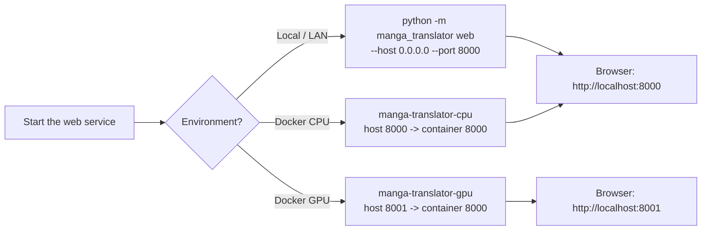
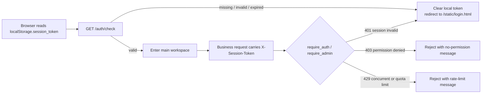

# Web Deployment, Security, and Troubleshooting

Use this page when you need to deploy the web interface locally, on a LAN, or with Docker; confirm the session-token, rate-limit, and permission boundaries; or run into problems such as “port already in use”, “LAN clients cannot connect”, or “login is rate limited”. This guide covers web deployment, security boundaries, and troubleshooting only. Account, permission, and API-key operations live in [Accounts, permissions, and API keys](./accounts-permissions-and-api-keys.md); login and session UI flows live in [Login, language, and session](./login-language-and-session.md); the admin console is covered in [Administrator interface](./administrator-interface.md). The complete HTTP routing, status-code, and port contracts are developer documentation; see [Web server ports and deployment](../developer/web-server-ports-and-deployment.md) and [Authentication and errors](../developer/http-api/authentication-and-errors.md).

## UI and API scope

- The web service serves the user interface (`GET /`), the admin interface (`GET /admin`), the login page (`/static/login.html`), and the developer HTTP API together. This guide documents user-facing deployment, security boundaries, and troubleshooting only and does not repeat the developer API contract.
- The default listen address is `0.0.0.0:8000`, overridable with `--host`/`--port` or the `MT_WEB_HOST`/`MT_WEB_PORT` environment variables. `0.0.0.0` means listening on all IPv4 interfaces; it is not a browser access address.
- Docker Compose ships two services: the CPU image maps `8000:8000` and the GPU image maps `8001:8000`.
- Sessions, permissions, rate limits, and audit logging are enforced server-side; hiding a control in the browser or deleting the front-end token does not replace server-side checks.
- This page never records real passwords, tokens, API keys, usernames, or private paths, and it does not show `.env` plaintext.

## Deployment methods {#deploy-methods}

### Run locally or on a LAN

Run `uv run python -m manga_translator web` from the project root (in an installed environment you can also run `python -m manga_translator web`). It listens on `0.0.0.0:8000` by default; use `--host 127.0.0.1` when only local access is needed.

Browser access addresses: `http://127.0.0.1:8000` on the local machine; LAN clients must use the server’s actual LAN IP, e.g. `http://192.168.x.x:8000`, and the host firewall must allow the port. Whether the service is reachable from outside depends on the firewall, port mapping, and network environment; it cannot be asserted from the listen address alone.

### Docker CPU and GPU

`packaging/docker-compose.yml` defines two services:

| Service | Image | Port mapping | GPU | Memory limits (template example) |
| --- | --- | --- | --- | --- |
| `manga-translator-cpu` | `manga-translator:cpu` | `8000:8000` | Off | limit 8G / reserve 2G |
| `manga-translator-gpu` | `manga-translator:gpu` | `8001:8000` | On | limit 16G / reserve 4G |

The in-container service always listens on `8000`; the host entry points are `8000` (CPU) and `8001` (GPU). Do not confuse the GPU service with the container-default port. Compose sets the first-start admin password through `MANGA_TRANSLATOR_ADMIN_PASSWORD` (the template contains an example placeholder value that must be changed in production) and passes `MT_USE_GPU`, `MT_MODELS_TTL`, `MT_RETRY_ATTEMPTS`, and `MT_VERBOSE`.

Compose mounts `./data/fonts`, `./data/dict`, `./data/result`, `./data/models`, `./data/logs`, `./data/server`, and `./data/config` as volumes. To keep server API keys saved from the web admin UI across container rebuilds, create an empty `./data/app.env` file and uncomment the `.env` volume mount. The entry script `packaging/docker-entrypoint.sh` restores defaults from the built-in `default_config`, `default_fonts`, `default_dict`, and `default_server_data` when a mounted volume is empty, so emptying a volume returns to the default state instead of failing.

The container health check requests `http://localhost:8000/` every 30 seconds with a 60-second start period and up to 3 retries; brief health-check failures during first startup, while services initialize or models load, are normal.

## Security boundary {#security-boundary}

### Session tokens and authentication

After a successful login the server creates a session that expires automatically after 60 minutes of inactivity. When the session becomes invalid, the front end clears the local token and redirects to the login page.

The session security service (`session_security_service.py`) adds ownership and anti-enumeration protections:

- Ownership tokens use UUID v4 (128-bit random); tokens with an invalid format are rejected immediately.
- More than 10 failed access attempts for the same user within 5 minutes trigger rate limiting, preventing token-enumeration attacks.
- Regular users can only access their own sessions; admins can view all sessions.
- Every denial is written to an access-attempt log for audit queries.

### Permission boundaries

- `require_auth` verifies the token, refreshes activity time, and rejects missing, expired, or deactivated accounts (`401`).
- `require_admin` additionally requires `role == 'admin'`; non-admin access to admin endpoints returns `403`.
- Translation endpoints also validate translator, OCR, colorizer, and renderer permissions and filter user-submitted parameters server-side; unauthorized parameters are silently dropped.
- Download tickets are short-lived tokens (default 5 minutes). `GET|HEAD /api/history/downloads/t/{ticket}` does not read the session header and depends only on the ticket; invalid or expired tickets return `404`.
- The CORS source configuration is `allow_origins=["*"]` with `allow_credentials=True`. This is server configuration and does not mean the browser will allow every origin/credential combination; tighten origins behind a reverse proxy for public deployments and verify with a browser preflight.

### Credentials and sensitive data

- With no account on first start, the login page enters “initial setup”: it creates the first admin account (username at least 2 characters, password at least 6 characters). Accounts flagged `must_change_password` are forced to change the password after login.
- Registration is controlled by the admin “Allow user registration” toggle and is disabled by default; registration requests return `403` when disabled.
- The admin “Server default API keys” section maps to `.env`; `/env` and `/env/effective` never return server key plaintext, and the front end only shows “saved”-style statuses.
- The “API Keys (.env)” tab is hidden by default; whether it is shown and editable depends on login state and the permission policy. User input is temporarily kept in `localStorage.user_env_vars`.
- Before deploying or sharing troubleshooting details, remove logs, error messages, tickets, tokens, `.env` content, private paths, and user images. The admin password in the Docker Compose template is an example placeholder and must be replaced in production.

## Common problems {#troubleshooting}

| Symptom | Common cause | Fix |
| --- | --- | --- |
| Startup reports “port already in use / address already in use” | `8000` is occupied by another process | Use `--port 8001` or set `MT_WEB_PORT`; on Windows locate the process with `netstat -ano` |
| LAN devices cannot connect | The listen address is `127.0.0.1`, the firewall blocks the port, or the wrong IP is used | Confirm `--host 0.0.0.0`, allow the port in the firewall, and use the server’s actual LAN IP |
| The Docker GPU service is unreachable | The container-default port `8000` was used | The host entry point is `8001`, matching the Compose mapping `8001:8000` |
| Repeated login failures show “too many attempts” | Login rate limiting was triggered | Wait for the time indicated by `Retry-After`; never record real passwords in documentation or public logs |
| The page redirects back to the login page | Session expired (60 minutes of inactivity), token invalid, or local storage cleared | Log in again; a missing token after clearing site data is expected |
| The admin UI or an operation returns `403` | The current account is not an admin or lacks the permission | Log in with an admin account or have an admin grant permissions via users/groups |
| A batch task returns `499` | The task was cancelled or cancellation was detected | Restart the task; cancellation is a user action, not a server crash |
| A request returns `422` | The request body failed FastAPI validation | Check field types and required fields; the response includes `detail` and the request body string |
| The Docker health check is red | The service is still initializing, models are loading, or the port mapping is wrong | Inspect `docker logs` and confirm the host port maps to container `8000` |
| Config/fonts/data “revert to defaults” after container start | A mounted volume is empty and the entry script restored defaults | This is by design; do not delete files such as `admin_config.json` or `accounts.json` from the volume |

The full status-code matrix and trigger sources are in [Authentication and errors](../developer/http-api/authentication-and-errors.md); detailed translation, import, and export request errors are in [Translation endpoints](../developer/http-api/translation-endpoints.md).

> See the reference index: [UI Options Reference](../reference/options-i18n-matrix.md).
