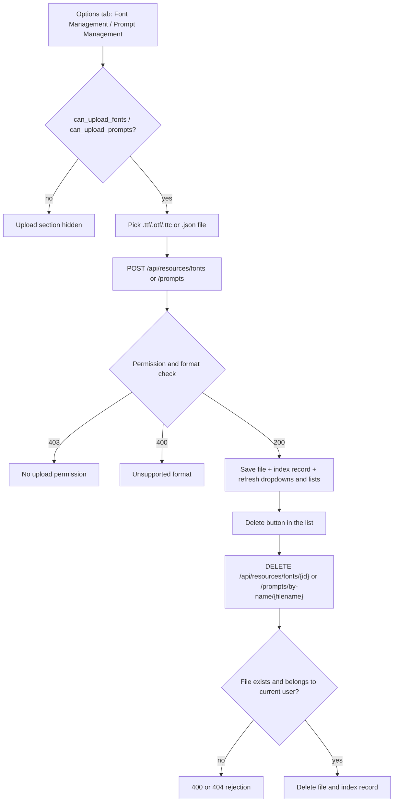
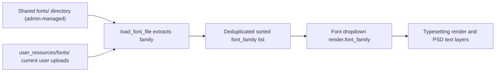
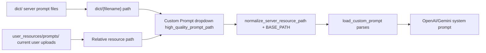

# Resources, Fonts, and Prompts

When the server lacks the font you need, or the translator needs a custom prompt, upload your own font and prompt files in the “Options” tab of the web workspace and select them from the configuration dropdowns. This guide focuses on ordinary-user resource upload, listing, deletion, and configuration use; admin-managed shared fonts and prompts are described in [Administrator interface](./administrator-interface.md), and HTTP endpoint contracts live in [Config, environment, and resources API](../developer/http-api/config-env-and-resources.md).

## UI and API scope {#feature-boundary}

- This guide covers web user resources: upload, list, and delete fonts (TTF/OTF/TTC) and prompts (JSON), plus the `render.font_family` and `translator.high_quality_prompt_path` configuration fields.
- Upload-section visibility is decided by `can_upload_fonts` and `can_upload_prompts` returned from `/user/settings`; whether deletion is allowed is decided by the server-side permission check.
- It does not cover admin-managed shared fonts and prompts (`/upload/font`, `/upload/prompt`, `/fonts`, `/prompts` management endpoints), nor the desktop prompt-list CRUD (see [Prompt list, apply, and preview](../desktop/prompts/list-apply-and-preview.md)).
- This page never shows real API keys, private prompt bodies, or user file contents.

## Use it in the Web UI {#ui-operations}

### Find the resource and configuration entries {#find-resource-entry}

After signing in, the right settings panel of the main workspace has four tabs: “Basic Settings”, “Advanced Settings”, “Options”, and “API Keys (.env)”.

- “Font Management” and “Prompt Management” are located in the right column of the “Options” tab.
- The corresponding upload section is shown only when `can_upload_fonts` / `can_upload_prompts` is true; hiding the section does not mean the server forbids it, and the permission is ultimately enforced by the server.
- The `render.font_family` dropdown is on the “Advanced Settings” tab (render group), and the `translator.high_quality_prompt_path` dropdown is on the “Basic Settings” tab (translator group). Both render as dropdowns even when the option list is empty, with a “-- 不使用 --” empty option.

### Upload fonts {#upload-fonts}

1. On the “Options” tab, click “上传字体文件” (Upload font file) in the “Font Management” area.
2. The file picker only accepts `.ttf`, `.otf`, and `.ttc`; the backend accepts exactly the same three formats.
3. After a successful upload the frontend re-requests `/config/options`, refreshes the Font dropdown and the uploaded-font list, and logs “字体上传成功” (Font uploaded successfully).

### Upload prompts {#upload-prompts}

1. On the “Options” tab, click “上传提示词文件” (Upload prompt file) in the “Prompt Management” area.
2. The file picker only accepts `.json`; the server-side `resource_service` `PROMPT_FORMATS` is `.txt`/`.json`, but the prompt loader (`load_prompt_file`) parses only `.json`/`.yaml`/`.yml`, so use JSON.
3. After a successful upload the Custom Prompt dropdown and the uploaded-prompt list are refreshed.

### Delete resources {#delete-resources}

- Font rows always show a “删除” (Delete) button; prompt rows show “删除” only for user resources whose path contains `user_resources`, while server-provided prompts show a “服务器提示词” (Server prompt) label.
- Clicking “删除” opens a confirmation dialog; after confirmation the delete endpoint is called and the frontend refreshes dropdowns and lists.
- The frontend does not hide delete buttons according to `can_delete_fonts` / `can_delete_prompts`; the server rejects requests without permission with `403`.

## Parameters and options {#parameters-and-options}

> For detailed parameter information (UI names, storage keys, default values, and effective stages) on this page, see the reference index: [UI Options Reference](../reference/options-i18n-matrix.md).

#### Font {#font-family}

The “Font” dropdown is on the “Advanced Settings” tab (render group) and selects the font used for typesetting rendering and editable PSD text layers; options are the deduplicated union of the server-shared font directory and the current user's uploaded fonts. See [Typesetting and Rendering](../desktop/settings/typesetting-and-rendering.md) for details.

#### Custom Prompt {#high-quality-prompt-path}

The “Custom Prompt” dropdown is on the “Basic Settings” tab (translator group) and selects the custom prompt file used for translation requests; options come from the server prompt directory (system prompts excluded) plus the current user's uploaded prompts. See [Context and Prompts](../desktop/translator/context-and-prompts.md) for details.

## Requests and data flow {#runtime-behavior}

### Resource lifecycle {#resource-lifecycle}

Limitation: both upload and delete require a session and each checks resource permissions; even when the UI shows a button, a request without permission is rejected by the server with `403`.

### How the font dropdown merges {#font-merge}

Note: `/config/options` returns family names only, not file paths; `load_font_file` registers the font into the Qt font library and returns the family, so newly uploaded fonts appear in the dropdown only after options are re-requested.

### How the prompt dropdown merges {#prompt-merge}

Note: the `dict/` scan excludes the four system stems `system_prompt_hq`, `system_prompt_hq_format`, `system_prompt_line_break`, and `glossary_extraction_prompt`; user prompt paths come from `get_user_prompts` and are appended after server prompts, so server prompts appear first and user prompts follow.

## Permissions, security, and limits {#dependencies-and-conflicts}

- After uploading a font, reload the configuration options first (focus the dropdown or sign in again) before it appears in the selector; if the font is not registered, the renderer falls back to the default family.
- Prompts must be parseable JSON; `.txt` can be uploaded but cannot be loaded and is treated as missing during translation.
- Admin-managed shared fonts/prompts and user private resources are two separate storages and permission sets: shared resources are covered in [Administrator interface](./administrator-interface.md), and the HTTP contracts for both are in [Config, environment, and resources API](../developer/http-api/config-env-and-resources.md).
- Resource permissions come from the user-group configuration (`can_upload_fonts`, `can_upload_prompts`, `can_delete_fonts`, `can_delete_prompts`); hiding UI elements only affects display and cannot bypass server checks.
- Uploaded filenames are sanitized and duplicates get numeric suffixes; do not rely on the original uploaded filename.

> See the reference index: [UI Options Reference](../reference/options-i18n-matrix.md).
