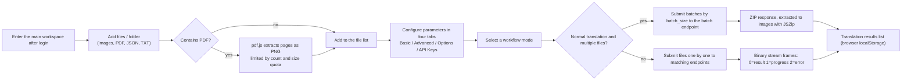

# Web Upload, Configuration, and Translation

After logging into the web interface (`/`), the main workspace covers the full "upload images → configure parameters → start translation" flow: the left panel adds files, selects a workflow mode, and starts the task, while the four tabs on the right configure parameters and API keys. This guide describes user-interface operations only. The request, response, authentication, and status-code contracts of the HTTP endpoints the browser calls are documented in the developer pages `../developer/http-api/translation-endpoints.md` and `../developer/http-api/streaming-protocol.md`.

## UI and API scope

- This guide covers upload, configuration, and starting a translation in the web user interface. Login and sessions are covered in [Login, language, and session](./login-language-and-session.md), progress, results, and history in [Progress, results, and history](./progress-results-and-history.md), accounts, permissions, and API keys in [Accounts, permissions, and API keys](./accounts-permissions-and-api-keys.md), font and prompt uploads in [Resources, fonts, and prompts](./resources-fonts-and-prompts.md), and access URLs in [Launch and access](./launch-and-access.md).
- The web frontend is not a direct reuse of the desktop Qt UI: `index.html` ships with initial Chinese text, and `script.js` overrides part of the static text through i18n keys. Strings such as "添加文件夹" (Add Folder), "文件列表" (File List), "翻译结果" (Translation Results), "翻译历史" (Translation History), and "N 个文件" (N files) remain hardcoded in HTML/script and have no i18n key.
- Uploading, PDF extraction, config import/export, and the results list all happen in the browser. The results list in `localStorage` and the server-side translation history are two separate stores.
- Keys controlled by the workflow-mode dropdown — `cli.load_text`, `cli.translate_json_only`, `cli.template`, `cli.generate_and_export`, `cli.colorize_only`, `cli.upscale_only`, `cli.inpaint_only` — and also `cli.batch_size`, `cli.batch_concurrent`, and `cli.use_gpu` are hidden by the server-side `SERVER_HIDDEN_CONFIG_KEYS` set and never appear in the web config form; do not edit them by hand.
- Upload count/size limits, the API-key editor switch, and font/prompt upload permissions come from `/user/settings`; `0` means unlimited.

## Use it in the Web UI

### Add files and folders

1. The left "File List" panel provides three buttons: "Add Files" (`Add Files`), "Add Folder" (hardcoded Chinese in HTML, not i18n), and "Clear List" (`Clear List`).
2. Click "Add Files" to open the system multi-select dialog, or "Add Folder" to choose an entire directory. The file input `accept` is `image/*,.pdf,.json,.txt`.
3. When a PDF is selected, the browser renders every page at 2x with pdf.js and extracts PNG pages (file names like `{base}_page_{pageNumber}.png`). Extraction is limited by `max_pdf_size_mb` (frontend fallback 50 MB) and `max_images_per_batch`; when the quota is exceeded, only the remaining pages are extracted and a warning is logged. PDF-related log messages are hardcoded Chinese fallbacks in the script (neither `en_US` nor `zh_CN` has these keys).
4. `.json`, `_original.txt`, and `_translated.txt` files selected at the same time are matched to images by base file name for the "Import Translation and Render" mode; match success or failure is written to the log.
5. The `✖` button on a list item removes that item; "Clear List" clears everything; the counter shows `N 个文件` (hardcoded Chinese).
6. When the count or size limit is exceeded, the frontend shows an `alert` and rejects the addition.

### Configure parameters

1. The right settings area has four tabs: "Basic Settings" (`Basic Settings`), "Advanced Settings" (`Advanced Settings`), "Options" (`Options`), and "API Keys" (`API Keys (.env)`). Switching tabs only changes local display; it does not trigger a request.
2. The config form is generated from `GET /config?mode=authenticated`; dropdown options come from `/config/options`, `/translators`, `/languages`, and `/workflows`. Labels prefer the `label_<key>` translation key, then `t(key)`, then a formatted key name.
3. The server filters by user permissions: parameters the user cannot use are hidden as a group (`allowed_parameters`); the workflow dropdown keeps only `allowed_workflows`; the "API Keys" tab is shown only when `show_env_editor` is true and the user is logged in; font/prompt upload sections are controlled by `can_upload_fonts`/`can_upload_prompts`.
4. Boolean parameters render as "True"/"False" dropdowns (`True`/`False`), numbers as number inputs, and strings/enums as text inputs or dropdowns.
5. "Export Config" (`Export Config`) serializes the current form values into a `config.json` download; "Import Config" (`Import Config`) reads a local JSON file and regenerates the form. Both happen entirely in the browser and never touch the server.
6. When API keys are required, switch to the "API Keys" tab: the editor renders key inputs in four groups (translation, OCR, colorizer, renderer) with password or text fields. The "Save API Keys" button POSTs the filled keys to `/env` and also stores them in `localStorage.user_env_vars`. `/env` and `/env/effective` never return server key plaintext, and this document does not record any real key.

### Select a workflow mode

The "Translation Workflow Mode:" (`Translation Workflow Mode:`) dropdown lists seven modes, restricted by `/workflows` permissions.

### Start a translation

1. After confirming the file list and parameters, click "Start Translation" (`Start Translation`). If the file list is empty, the log asks you to add image files first.
2. Normal translation with more than one file: files are split into batches of `cli.batch_size` (frontend fallback `5` when missing). Each batch converts images to data URIs and posts to the batch endpoint with a 30-minute browser timeout (`AbortController`); the response is a ZIP, which the browser extracts with JSZip and adds each image to the "Translation Results" list. If JSZip is unavailable or extraction fails, the ZIP is downloaded directly.
3. Normal translation of a single file, or any non-normal mode: files are submitted one by one. The normal mode uses the binary stream endpoint; the browser parses the custom frames (1 status byte + 4 length bytes + data; `0`=result data, `1`=progress JSON, `2`=error). Progress messages are written to the "Log output" panel and an error aborts the current file.
4. API keys: single-file requests submit the currently entered keys as the `user_env_vars` form field; batch requests use the keys saved for that user on the server. `runtime_api.py` maps these values to per-feature/provider runtime overrides.
5. Task logs: during translation the frontend polls for new logs every 500 ms (`/api/logs?limit=200&task_id=...`) and after the task finishes fetches the full log by `task_id`; a `401` response stops polling and prompts you to log in again.
6. Finished images appear in the "Translation Results" list, where you can view, download individually, download all as a ZIP, or clear them. This list lives in browser `localStorage` and is unrelated to server history.

## Parameters and options

> For detailed parameter information (UI names, storage keys, default values, and effective stages) on this page, see the reference index: [UI Options Reference](../reference/options-i18n-matrix.md).

#### Batch Size {#cli-batch-size}

This parameter is not rendered in the web config form (it is hidden server-side). It determines how many files are submitted per batch when normal translation processes more than one file; the file list is split into batches of this size. Default: `3`. See [CLI, Batch, and Output](../desktop/settings/cli-batch-and-output.md) for details.

#### Translator {#translator}

The “Translator” dropdown is in Settings → Basic Settings and selects the translation service used for translation requests; options come from the server and are filtered by permissions. It selects the translation implementation only; OCR, colorizer, and renderer models and key groups are independent. Default: `openai`. See [Translator Selection and Target Languages](../desktop/translator/selection-and-languages.md) for details.

#### Target Language {#target-lang}

The “Target Language” dropdown is in Settings → Basic Settings and selects the language the translation is rendered into; the selected translator must support it. It is independent from the keep-source-language option. Default: `CHS`. See [Translator Selection and Target Languages](../desktop/translator/selection-and-languages.md) for details.

#### Keep Source Language {#keep-lang}

The “Keep Source Language” dropdown is in Settings → Basic Settings and selects how text regions are filtered by source language; `none` (shown as “No Filter”) disables source-language filtering. When enabled, regions whose detected language does not match the selected language are not translated. Default: `none`. See [Translator Selection and Target Languages](../desktop/translator/selection-and-languages.md) for details.

## Upload and translation data flow

"Normal translation with multiple files" uses the batch endpoint (returning a ZIP); all other modes submit files one by one. Progress frames appear only in the binary stream of single-file normal translation; the batch endpoint returns its result uniformly after the request completes or is cancelled.

## Permissions, security, and limits

- Upload limits (count, per-image size, PDF size) come from `/user/settings` and are set by admin/group quotas; `0` means unlimited, and the frontend rejects additions that exceed them.
- The config form is filtered by permissions: a group can hide parameters or set defaults; a user allowlist can unlock parameters disabled by the group. Filtered parameters are not shown and should not be injected by hand.
- `cli.batch_size` only controls batching for multi-file normal translation; it is a different level from `context_size` and `batch_concurrent` and cannot replace them.
- "Import Translation and Render" requires an image and a matching JSON file uploaded together; uploading only the image logs a missing-JSON warning and skips that file.
- The batch and single-file endpoints get API keys from different sources: single-file requests send the currently entered keys, while batch requests use the keys saved for that user on the server. Switching languages or refreshing the page does not lose keys already saved to `/env`, but unsaved temporary input is cleared.
- The browser results list (`localStorage`) and the server translation history are two separate stores; clearing the results list does not affect server history.
- Uploads and translations can contain business content. Before sharing logs, exported files, or debug directories, remove request bodies, historical page text, paths, and credentials.

> See the reference index: [UI Options Reference](../reference/options-i18n-matrix.md).
