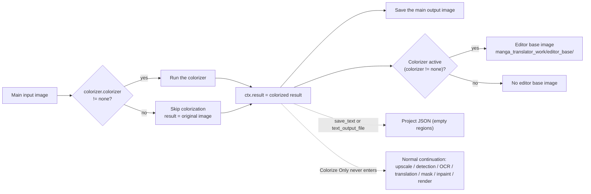

# Colorize Only

Use the Colorize Only workflow when you want to colorize a batch of images without detection, OCR, translation, inpainting, or rendering. In the "Translation Workflow Mode:" combo box on the translation page it sits after "Import Translation and Render", and its start button reads "Start Colorizing". The mode only runs the colorization stage and then returns immediately to save the main output image; selecting the mode does not force a colorizer, and when `colorizer.colorizer` is `none` the result is the original image.

Colorize Only, [Upscale Only](./upscale-only.md), and [Inpaint Only](./inpaint-only.md) are the single-stage workflows; the overall boundaries of the nine workflows are in [Output Directory and Workflow](../desktop/translation/output-directory-and-workflow.md), with a summary table in [Workflow Matrix](../reference/workflow-matrix.md). The colorizer type, colorization size, and denoise strength parameters are covered by [Upscale and Colorization](../desktop/settings/upscale-and-colorization.md), and the forced parameter overrides of the nine modes by [Mode-Specific Workflows and Template Alignment](../desktop/settings/mode-specific.md).

## When to use it

- Inputs: the main input images (the same file-discovery rules as normal translation: supported extensions are found recursively, collected in natural sort order, and directories named `manga_translator_work` are skipped).
- Stages executed: colorization (conditional). Whether colorization actually runs is decided by `colorizer.colorizer`; when it is `none`, the result is the original image.
- Stages skipped: upscaling, detection, OCR, textline merge, translation, mask refinement, inpainting, and rendering. The Colorize Only branch sits right after colorization and before upscaling in the source, so upscaling never runs even when `upscale_ratio` is set.
- Output files: the main output image; the editor base image `manga_translator_work/editor_base/<original-filename>` when the colorizer is active (`colorizer != none`); and, when `cli.save_text` is enabled, the batch path also writes a project JSON with empty `regions` (the exact JSON fields may differ by release).
- Workflow field: combo index 5 writes `cli.colorize_only=true`; GUI switching keeps the eight workflow booleans mutually exclusive.

## Run this workflow

### Select the Colorize Only workflow

1. Open the translation page and choose "Colorize Only" in the "Translation Workflow Mode:" combo box.
2. The page title becomes "Colorize Only" and the subtitle shows the hint: only colorize images, no detection, OCR, translation or rendering.
3. The start button becomes "Start Colorizing"; clicking it starts the backend task in this mode.

Selecting a mode only writes configuration and updates the UI texts; it does not start a task. Before starting, add the main input images ("Add Files...", "Add Folder...", or drag-and-drop) and enter or drop an output folder into "Output Directory:". When the colorizer is `openai_colorizer` / `gemini_colorizer`, the matching API key must be configured in API Management first; the i18n description says the UI will not start translation without the key, and whether the same blocking check applies when starting this workflow may vary by release.

## Processing order

### Stages and outputs

Colorize Only reuses the colorization step of `_translate_until_translation()` and returns early after the colorizer runs and before upscaling starts. The Mermaid diagram below shows the stage order, result assignment, and output branches; the dashed edges are the normal-flow continuation that Colorize Only never enters.

The diagram expresses the branches: with `colorize_only=true`, `_translate_until_translation()` sets `ctx.result` to the colorized image after colorization, sets `ctx.text_regions` to an empty list, reports the progress state `colorize-only-complete` (a core-internal finished state with no dedicated desktop locale text), writes the editor base when needed, and returns; the batch path never calls `_complete_translation_pipeline()` and never runs upscaling, detection, OCR, translation, mask refinement, inpainting, or rendering. When `colorizer.colorizer=none`, the colorization step is skipped, `ctx.img_colorized = ctx.input`, and the result is the original image.

### Concurrency and mutual exclusion

- `batch_concurrent` is incompatible: both the desktop controller and the core `translate_batch()` list Colorize Only among the incompatible modes and force non-concurrent processing; keeping the concurrent setting in the UI does not turn this into a concurrent pipeline.
- Manually stacking multiple workflow fields is not a supported combination. GUI switching keeps the eight fields mutually exclusive; in the core dispatch, the Colorize Only branch returns before the Upscale Only and Inpaint Only branches, so combining it with `upscale_only` or `inpaint_only` results in Colorize Only behavior only. This guide does not describe such stacking as supported.
- As with normal translation, whether colorization runs is decided by `colorizer.colorizer`; Colorize Only does not force a colorizer. Normal, Upscale Only, Inpaint Only, and Replace Translation also colorize first when `colorizer.colorizer != none`; that is the colorization stage itself, not unique to this workflow.

## Inputs, outputs, and limitations

- `colorizer.colorizer=none`: no colorization runs, the output is the original image, and no editor base is written; this is the direct consequence of Colorize Only not forcing a colorizer.
- AI colorizers: `openai_colorizer` / `gemini_colorizer` need the matching API key (`.env`) and a reachable network; the i18n description says the UI will not start translation without the key, and the actual blocking prompt when starting this workflow may vary by release.
- `upscale_ratio`: the Colorize Only branch returns before upscaling, so upscaling settings are ignored in this mode.
- `cli.overwrite=false`: the GUI filters images whose main output image (from `_calculate_output_path`) already exists before starting; if every image is skipped, the task ends before translation begins.
- `cli.save_text`: default is `true`; the batch save path writes a project JSON with empty `regions` (current behavior; the actual content of an empty-regions JSON and editor behavior need confirmation in the deployed version).
- No text regions means none of the detection, OCR, translation, mask, inpainting, or rendering intermediate files are produced: no inpainted image, no original/translated TXT, and no template-export files.
- PSD export (`export_editable_psd`) belongs to the shared save logic `_save_and_cleanup_context()`; the actual PSD content for this mode with no text regions may vary by release.
- Colorization model, VRAM, network, and API costs follow `colorizer.colorizer` and the colorization parameters; this guide does not repeat those parameter descriptions.

## Read next {#related-pages}

- Other workflows: [Normal Translation](./normal.md) · [Export Original Text](./export-original.md) · [Export Translation](./export-translation.md) · [Translate JSON Only](./translate-json-only.md) · [Import Translation and Render](./import-translation-and-render.md) · [Upscale Only](./upscale-only.md) · [Inpaint Only](./inpaint-only.md) · [Replace Translation](./replace-translation.md)
- Selecting a workflow, output directory, and mutually exclusive writes: [Output Directory and Workflow](../desktop/translation/output-directory-and-workflow.md)
- Inputs, skipped stages, and outputs of all nine workflows: [Workflow Matrix](../reference/workflow-matrix.md)
- Mutually exclusive workflow fields, parameter overrides, and template alignment: [Mode-Specific Workflows and Template Alignment](../desktop/settings/mode-specific.md)

> See the reference index: [Workflow Matrix](../reference/workflow-matrix.md).
