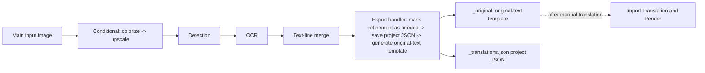

# Export Original Text

Use this mode when you want to export the text on the original images as text, translate it manually outside the app, and render it back later. This is the export-original workflow among the nine workflows; its UI name is “Export Original Text”. It runs only conditional colorization/upscaling, detection, OCR, and text-line merging on each main input image, then skips translation, inpainting, and rendering and writes the per-image project JSON and `<stem>_original.<template-format>` original-text template. After translating those templates manually, [Import Translation and Render](./import-translation-and-render.md) reads them back and renders.

See [Output Directory and Workflow](../desktop/translation/output-directory-and-workflow.md) for the nine-mode overview and output-directory settings, and [Mode-Specific Workflows and Template Alignment](../desktop/settings/mode-specific.md#cli-template) and [CLI Batch and Output](../desktop/settings/cli-batch-and-output.md#cli-save-text) for the `cli.template` and `cli.save_text` parameters.

## When to use it {#feature-boundary}

- This guide focuses on the “Export Original Text” workflow (combo index `2`) among the nine workflows. Selecting it clears all eight mutually exclusive workflow fields and sets only `cli.template=true`; at runtime the export branch is entered only when `cli.save_text=true` as well.
- Inputs are the main input images and a readable translation template; outputs are the project JSON and the original-text sidecar, with no main output image. Each image's work directory is keyed by its `<stem>` without the extension.
- This guide does not repeat the parameter algorithms of detection, OCR, colorization, upscaling, masking, inpainting, or rendering; selecting a workflow is not translator selection or API-candidate rotation (see [Translator selection](../desktop/translator/selection-and-languages.md)).

## Run this workflow {#ui-operations}

### Select the Export Original Text workflow {#select-export-original}

1. Open the “Translation” page and click the “Translation Workflow Mode:” combo box in the “Translation Task” card.
2. Select “Export Original Text”. The UI sets only `cli.template=true`, clears the other seven workflow fields, and saves the configuration; the title changes to “Export Original Text” and the subtitle shows the matching tip.
3. Click “Generate Original Text Template” to start the task. Switching modes does not start a task automatically; while a task is running, the button shows states such as “Stop Translation”; see [Progress, Stop, and Task State](../desktop/translation/progress-stop-and-task-state.md).

`imagename` in the tip is the program's example name for the input `<stem>`, not a private user file name; `manga_translator_work/originals/` is a fixed subdirectory under each image's work directory.

## Processing order {#runtime-behavior}

The “Export Original Text” mode enters the export branch only when `template=true` **and** `save_text=true` (`is_template_save_mode` in source). Core `translate_batch()` forces `batch_size=1` for per-image write-out and lists this mode as incompatible with `batch_concurrent`; the desktop controller also sets the concurrency local variable to `false` for this run. The high-quality translator flow is skipped for import/export modes as well.

The diagram expresses only the stage order: `_translate_until_translation()` runs conditional colorization/upscaling, detection, OCR, and text-line merging; `_handle_template_and_save_text()` then refines the mask as needed, saves the JSON, and generates the original-text template. When there are no text regions, an empty JSON and an empty template file are still written.

### Input and discovery rules {#input-and-discovery}

- Main inputs must be images supported by the file service. Adding a folder searches recursively in natural order and skips directories named `manga_translator_work`. Archive and document extensions are recognized by the same service, but archive-sidecar pairing for this workflow may vary by release.
- Each image's work directory is keyed by the input's original path and its `<stem>` without the extension: the original-text sidecar is written to `manga_translator_work/originals/<stem>_original.<template-format>`.
- A readable template is required; when `config/translation_template.json` is missing or unreadable, `output_format` falls back to `json`.
- With `detector.import_yolo_labels=true` and imported labels present, detection uses the imported boxes directly and marks the run as “template mode”.

### Skipped and kept stages {#skipped-and-kept-stages}

- Skipped: translation, inpainting, rendering, and main-output-image saving; no translation service is called, so no API translation requests are produced.
- Kept: conditional colorization → conditional upscaling → detection → OCR → text-line merging; mask refinement runs when non-empty regions and an original mask exist.
- Exception: imported-YOLO-label export modes skip mask refinement and do not save a mask in the JSON.
- Boundary: the GUI sets only `template`; the configuration defaults set `save_text=true`. If an external configuration sets `save_text=false`, the export branch is not entered and the actual fallback path may vary by release.

### Mask and JSON details {#mask-and-json-details}

- The project JSON is written by `_save_text_to_file()` to `manga_translator_work/json/<stem>_translations.json` (the new location is preferred; the legacy image-directory location is the fallback).
- Export Original Text writes `skip_font_scaling=false` into the JSON so a later import-and-render run re-runs smart typesetting instead of inheriting old font sizes; because translation did not run, region `translation` values are still the originals.
- The refined `ctx.mask` is saved with `mask_is_refined=true`; without a refinement result, `mask_raw` is saved with `mask_is_refined=false`. Imported-YOLO-label export modes do not save a mask.
- `generate_original_text()` renders each region as an `<original>` line per the template, using the original text as a placeholder when `translation` is empty; with no text regions it logs and creates an empty file.

### Output files {#output-files}

| Output | Path | Notes |
| --- | --- | --- |
| Project JSON | `manga_translator_work/json/<stem>_translations.json` | Regions, dimensions, mask, and export markers; read by import-and-render |
| Original-text template | `manga_translator_work/originals/<stem>_original.<template-format>` | Extension comes from the template `output_format`; defaults to `json`; an empty file is created when there are no text regions |
| Main output image | not written | Rendering is skipped, so no main image is produced |
| Editor base image | `manga_translator_work/editor_base/<original-filename>` | Written conditionally only when colorization or upscaling is enabled |

## Inputs, outputs, and limitations {#dependencies-and-conflicts}

- Requires `cli.save_text=true` and a readable template; incompatible with `batch_concurrent` (both the frontend and core process it non-concurrently), and Export Original Text additionally forces `batch_size=1`.
- With `cli.overwrite=false`, the existing `<stem>_original.<template-format>` is checked before starting; existing files are skipped and recorded as skipped.
- Shares the template and JSON write path with Export Translation, and pairs with Import Translation and Render as “export original → manual translation → import and render”; see [Import Translation and Render](./import-translation-and-render.md).
- The display name describes the goal and does not automatically enable or disable colorization/upscaling models; the colorizer and ratio are still governed by `colorizer.colorizer` and `upscale.upscale_ratio`.

## Read next {#related-pages}

- Other workflows: [Normal Translation](./normal.md) · [Export Translation](./export-translation.md) · [Translate JSON Only](./translate-json-only.md) · [Import Translation and Render](./import-translation-and-render.md) · [Colorize Only](./colorize-only.md) · [Upscale Only](./upscale-only.md) · [Inpaint Only](./inpaint-only.md) · [Replace Translation](./replace-translation.md)
- Selecting a workflow, output directory, and mutually exclusive writes: [Output Directory and Workflow](../desktop/translation/output-directory-and-workflow.md)
- Inputs, skipped stages, and outputs of all nine workflows: [Workflow Matrix](../reference/workflow-matrix.md)
- Mutually exclusive workflow fields, parameter overrides, and template alignment: [Mode-Specific Workflows and Template Alignment](../desktop/settings/mode-specific.md)

> See the reference index: [Workflow Matrix](../reference/workflow-matrix.md).
