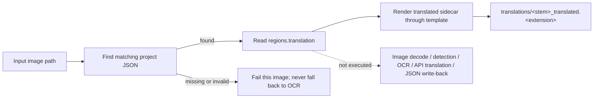

# Export Translation

Export Translation uses the legacy image detection, OCR, translation, and JSON-write flow by default. Enabling Settings → Mode Specific → Text Export → “Export Text from Local JSON Only” instead exports translated text from the existing local project JSON into a `translations/` sidecar without reopening the image, calling a translation API, or writing project JSON back, so exporting cannot overwrite user-edited translations.

Export Translation forms the template/JSON family together with [Export Original Text](./export-original.md), [Translate JSON Only](./translate-json-only.md), and [Import Translation and Render](./import-translation-and-render.md). The overall boundaries of the nine workflows are in [Output Directory and Workflow](../desktop/translation/output-directory-and-workflow.md), with a summary table in [Workflow Matrix](../reference/workflow-matrix.md).

## When to use it

- Default input: the main image and a readable export template; detection, OCR, and translation run.
- With the toggle on: each image's existing `manga_translator_work/json/<stem>_translations.json` plus a readable template; the image path only locates JSON and is not decoded.
- With the toggle on: read `regions[].translation`, remove `[BR]`, export through the template, and skip image loading, colorization, upscaling, detection, OCR, translation, mask processing, inpainting, rendering, main-image saving, and JSON write-back.
- Output with the toggle on: `manga_translator_work/translations/<stem>_translated.<template-extension>`; project JSON stays unchanged.
- Workflow field: combo index 1 writes `cli.generate_and_export=true` at runtime; GUI switching keeps the eight workflow booleans mutually exclusive.

## Run this workflow

### Select the Export Translation workflow

1. Open the translation page and choose “Export Translation” in the “Translation Workflow Mode:” combo box.
2. The page title becomes “Export Translation” and the subtitle shows the hint: after exporting, check the translated sidecars in `manga_translator_work/translations/`.
3. The start button becomes “Export Translation”; clicking it starts the backend task in this mode.

Selecting a mode only writes configuration and updates the UI texts; it does not start a task. Before starting, add the main input images (“Add Files...”, “Add Folder...”, or drag-and-drop) and make sure the export template exists and parses. The UI hint always reads `imagename_translated.txt`, but the actual extension comes from the template's `output_format` (default `json`); the hint text does not change with the template extension.

“Output Directory:” only determines where the main output image goes. Export Translation writes no main image, so in this mode it does not affect the JSON or translated-sidecar locations; both always follow the per-image work-directory rules.

## Processing order

### Stages and outputs

When `cli.export_from_local_json` is enabled, `translate_batch()` enters the local-JSON export branch before image materialization. Missing JSON fails that image without OCR fallback. The toggle defaults off; when off, the legacy pipeline runs.

### Template-export details

- Template path resolution order: a user-specified path > the `MANGA_TEMPLATE_PATH` environment variable > the default `config/translation_template.json`.
- The first `output_format:` line in the template determines the sidecar extension; valid values are safe 1–32-character extensions, falling back to `json` when missing or invalid.
- `generate_translated_text()` collects items from the `regions` list of the project JSON: only non-empty original-text regions are included, `[BR]` markers are removed from both original and translated text, `<original>` is filled with the original and `<translated>` with the translation. An empty translation is exported as an empty string (it does not fall back to the original text, unlike Export Original Text).
- The template must contain at least one line with the `<original>` placeholder; otherwise parsing raises an error and the export log records “Failed to export clean text”.
- The built-in default template uses `output_format` `json` and an `<original>` / `<translated>` line structure.

### Project JSON boundary

- With the toggle on, local export reads project JSON without writing `skip_font_scaling`, masks, model metadata, or any other field.
- User-edited `translation`, rich text, paint/stamp overlays, and unknown extension fields remain unchanged.
- With the toggle off, the legacy pipeline can regenerate and write runtime fields.

### Concurrency and mutual exclusion

- `batch_concurrent` remains incompatible; local JSON export itself processes entries without loading models.
- GUI workflow flags remain mutually exclusive. `cli.export_from_local_json` is a separate toggle shared by both text-export workflows.
- With the toggle off, conditional colorization/upscaling, detection, OCR, and translation run with their model/API costs.

## Inputs, outputs, and limitations

- Template dependency: an unparsable template prevents the translated sidecar; the project JSON remains unchanged.
- Project JSON dependency: only when the toggle is on; missing or unreadable JSON fails that image without OCR fallback, avoiding accidental reconstruction and overwrite.
- `cli.overwrite=false`: the GUI skips images whose translated sidecar already exists.
- `cli.save_text`: Export Translation does not depend on it; with the toggle on, JSON is read without being written.
- With the toggle off, the legacy flow uses colorization, upscaling, detection, OCR, translation models, and APIs.
- The main output directory, `save_to_source_dir`, and `cli.format` affect only the main output image; this mode writes no main image, so those settings have no direct effect on this workflow's outputs.

## Read next {#related-pages}

- Other workflows: [Normal Translation](./normal.md) · [Export Original Text](./export-original.md) · [Translate JSON Only](./translate-json-only.md) · [Import Translation and Render](./import-translation-and-render.md) · [Colorize Only](./colorize-only.md) · [Upscale Only](./upscale-only.md) · [Inpaint Only](./inpaint-only.md) · [Replace Translation](./replace-translation.md)
- Selecting a workflow, output directory, and mutually exclusive writes: [Output Directory and Workflow](../desktop/translation/output-directory-and-workflow.md)
- Inputs, skipped stages, and outputs of all nine workflows: [Workflow Matrix](../reference/workflow-matrix.md)
- Mutually exclusive workflow fields, parameter overrides, and template alignment: [Mode-Specific Workflows and Template Alignment](../desktop/settings/mode-specific.md)

> See the reference index: [Workflow Matrix](../reference/workflow-matrix.md).
