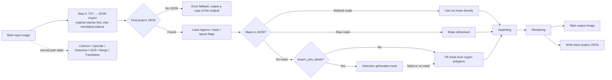

# Import Translation and Render

Use the Import Translation and Render workflow when translations already exist — for example, after manually translating the `imagename_original.txt` produced by Export Original Text, obtaining a translated sidecar from Export Translation, or saving a project JSON from the editor — and you only need to render those translations onto the images. The workflow loads text regions, the mask, and layout flags from the project JSON, optionally updating the JSON from a text sidecar first, then runs mask refinement, inpainting, and rendering, writes the result back to the project JSON, and saves the main output image. The normal path does not run colorization, upscaling, detection, OCR, text-line merging, or translation.

Import Translation and Render forms the template/JSON family together with [Export Original Text](./export-original.md), [Export Translation](./export-translation.md), and [Translate JSON Only](./translate-json-only.md). The overall boundaries of the nine workflows are in [Output Directory and Workflow](../desktop/translation/output-directory-and-workflow.md), with a summary table in [Workflow Matrix](../reference/workflow-matrix.md).

## When to use it

- Inputs: the main input images (the same file-discovery rules as normal translation), and a project JSON that must be found for each image; optional inputs are the original/translated text sidecars (TXT import) and an existing inpainted image.
- Stages executed: JSON/in-memory payload load → (reuse the refined mask when present, otherwise) mask refinement → inpainting → rendering → main-image saving and JSON write-back. When the JSON has no mask and `detector.import_yolo_labels` is enabled, detection runs additionally to generate a mask.
- Stages skipped: colorization, upscaling, detection, OCR, text-line merging, and translation (detection for a missing mask is the only exception).
- Output files: the main output image and the updated project JSON; an inpainted image is written when inpainting is rerun and `save_text=true`; a PSD is exported when `export_editable_psd` is enabled.
- Workflow field: combo index 4 writes `cli.load_text=true` at runtime; GUI switching keeps the eight workflow booleans mutually exclusive.

## Run this workflow

### Select the Import Translation and Render workflow

1. Prepare a project JSON for each image (`manga_translator_work/json/<stem>_translations.json`, with the legacy image-side location also accepted). For manual translation, first run Export Original Text and translate `imagename_original.txt` in `manga_translator_work/originals/`.
2. Open the translation page and choose “Import Translation and Render” in the “Translation Workflow Mode:” combo box.
3. The page title becomes “Import Translation and Render” and the subtitle shows the hint: TXT files will be read from `manga_translator_work/originals/` or `translations/` and rendered (prioritizing `_original.txt`).
4. The start button becomes “Import Translation and Render”; clicking it starts the backend task in this mode.

Selecting a mode only writes configuration and updates the UI text; it does not start a task. Before starting, add the main input images (“Add Files...”, “Add Folder...”, or drag-and-drop) and make sure every image has a parsable project JSON. An image without a JSON enters the error fallback branch and produces a copy of the original image.

The UI hints always read `_original.txt` / “TXT files”, but the actual sidecar extension comes from the template's `output_format` (default `json`); the hint text does not change with the template extension.

## Processing order

### Input discovery and TXT import

`translate_batch()` runs `_preprocess_load_text_mode()` before per-image processing. For each image it looks up the project JSON with `find_json_path()` (the new location `manga_translator_work/json/<stem>_translations.json` takes priority, falling back to the image-side `<stem>_translations.json`), then looks up the original and translated sidecars with `find_txt_files()`. The original sidecar (`originals/<stem>_original.<template-extension>`) takes priority; the translated sidecar (`translations/<stem>_translated.<template-extension>`) is used only when the original does not exist. Images without a JSON or without a TXT skip the import (the former errors in the per-image stage).

When a JSON and a TXT are found, `safe_update_large_json_from_text()` parses the TXT using the placeholder structure of `config/translation_template.json`, updates each region's `translation` field by exact original-text match followed by whitespace-normalized fuzzy match, and writes back atomically through a temporary file. A successful import forces `skip_font_scaling=false` so this render re-runs smart font scaling instead of reusing old font sizes. When the template file is missing, `_get_default_template_path()` auto-creates the built-in default template; when the TXT cannot be parsed (for example the template has no `<original>` placeholder), the import is skipped and only a debug log is written.

### Processing stages and outputs

The Mermaid above shows the stages and branches confirmed in the source. Limitation notes: detection runs additionally only when the JSON has no mask and `import_yolo_labels=true`; an AI renderer (`renderer` set to OpenAI/Gemini) skips real inpainting and uses the work image as the render base; an existing inpainted image is reused only when the JSON carries a mask, otherwise inpainting reruns.

### Mask, inpainting, and rendering

- When loading, a JSON mask with `mask_is_refined=true` is used directly as `ctx.mask`; otherwise it becomes `ctx.mask_raw` and goes through mask refinement.
- With no mask in the JSON: if `import_yolo_labels` is enabled, detection is tried first to generate a mask (falling back on failure); otherwise a mask is filled from the region `lines` polygons.
- Inpainting order: AI renderer skip → editor in-memory payload provides an inpainted image → existing on-disk inpainted image (requires a mask in the JSON) → rerun inpainting. A rerun writes `manga_translator_work/inpainted/<stem>_inpainted.<original-extension>` when `save_text=true`.
- Rendering honors `skip_font_scaling` from the JSON (treated as `true` when absent; a TXT import writes `false`; a JSON written by Export Translation replays fixed font sizes) and `skip_text_replacements` for whether text-replacement rules are applied again.
- When loading, regions with an empty `translation` fall back to the original text, and a missing `target_lang` falls back to the configured target language.

### JSON write-back and editor export

After rendering, `_save_text_to_file()` writes the latest regions (including post-render fields such as `translation` and `font_size`) back to the project JSON: it preserves existing `paint_overlay`/`stamp_overlay` layers, records `last_export_dir`, saves the mask with `mask_is_refined`, and writes `skip_text_replacements=true` when the image was rendered. If any region failed to parse (`region_parse_failures > 0`), the write-back is skipped to protect the project file from losing regions.

The editor “export” channel does not go through the on-disk JSON: `export_service.py` injects an in-memory payload via `set_preloaded_load_text_payload()`, and the backend treats such a payload as an authorized final draft and only renders — skipping text replacements and JSON write-back, and using the editor-provided inpainted image directly. The editor UI and project saving are documented on the editor pages; this guide only notes that the channel shares the same `load_text` branch as file-based import.

### Concurrency and mutual exclusion

- `batch_concurrent` is incompatible: both the desktop controller and `translate_batch()` treat this mode as incompatible and force non-concurrent processing; saving a concurrent configuration in the UI does not produce a concurrent pipeline.
- Manually stacking multiple workflow fields is not a supported combination. GUI switching keeps the eight booleans mutually exclusive; when syncing the combo from configuration, import translation has lower priority than replace translation, inpaint only, upscale only, and colorize only.
- This mode makes no translation service calls and does not run conditional colorization/upscaling from `colorizer.colorizer`/`upscale.upscale_ratio`; the main output is based on the original image.

## Inputs, outputs, and limitations

- The project JSON is a hard prerequisite: when `find_json_path()` finds no JSON, the per-image stage reports “translation file not found or invalid” and the error fallback outputs a copy of the original image (current behavior; the user-visible prompt may vary by release).
- The TXT import depends on the template: a missing template auto-creates the default; an unparsable template or a TXT with no valid entries skips the import (debug log only) and translations are not updated.
- `cli.overwrite=false`: the GUI skips images whose main output image already exists before starting (it checks the result of `_calculate_output_path()`).
- `cli.save_text`: the JSON write-back in this mode does not depend on it, but a rerun inpainted image is saved only when `save_text=true`.
- `detector.import_yolo_labels`: it triggers detection-based mask generation only when the JSON has no mask; with a mask present the parameter has no effect on this workflow.
- `render.enable_template_alignment` is a Replace Translation-only setting and is unrelated to this workflow.
- Inpainting and rendering still consume model, VRAM, and API costs according to the selected models; this guide does not repeat those parameter descriptions.
- The main output directory, `save_to_source_dir`, and `cli.format` determine the main image location and extension; the JSON, inpainted image, and sidecars always follow the per-image work-directory rules.

## Read next {#related-pages}

- Other workflows: [Normal Translation](./normal.md) · [Export Original Text](./export-original.md) · [Export Translation](./export-translation.md) · [Translate JSON Only](./translate-json-only.md) · [Colorize Only](./colorize-only.md) · [Upscale Only](./upscale-only.md) · [Inpaint Only](./inpaint-only.md) · [Replace Translation](./replace-translation.md)
- Selecting a workflow, output directory, and mutually exclusive writes: [Output Directory and Workflow](../desktop/translation/output-directory-and-workflow.md)
- Inputs, skipped stages, and outputs of all nine workflows: [Workflow Matrix](../reference/workflow-matrix.md)
- Mutually exclusive workflow fields, parameter overrides, and template alignment: [Mode-Specific Workflows and Template Alignment](../desktop/settings/mode-specific.md)

> See the reference index: [Workflow Matrix](../reference/workflow-matrix.md).
