# Inpaint Only

Use the Inpaint Only workflow when you only need to erase the text areas from the artwork and keep a clean background image, without recognizing text content, translating, or typesetting and rendering. It still runs conditional colorization, conditional upscaling, detection, text-line merge, mask refinement, and inpainting, but skips OCR, translation, and rendering. The branch clears the text regions before finishing, so the main output is a clean image without translated text.

Inpaint Only, [Colorize Only](./colorize-only.md), and [Upscale Only](./upscale-only.md) are image-only bypass modes; the difference from the full pipeline is covered in [Normal Translation](./normal.md). The overall boundaries of the nine workflows are in [Output Directory and Workflow](../desktop/translation/output-directory-and-workflow.md), with a summary table in [Workflow Matrix](../reference/workflow-matrix.md). The mask and inpainting parameters themselves are documented in [Mask and Inpainting](../desktop/settings/mask-and-inpainting.md).

## When to use it

- Inputs: the main input images (the same file-discovery rules as normal translation). No workflow sidecar such as a project JSON, TXT, or paired image is required.
- Stages executed: conditional colorize (when `colorizer.colorizer != none`) → conditional upscale (when `upscale.upscale_ratio` is set) → detection → skip OCR and fill detected lines with the literal `TEXT` → text-line merge → mask refinement → inpainting.
- Stages skipped: OCR, translation, rendering, and text typesetting. `text_regions` is cleared before the branch ends, so the result is never rendered with translated text.
- Output files: the main output image (the inpainted clean image; the un-inpainted work image when there are no text lines, no merged regions, or an AI renderer is selected); an editor base image when conditional colorization or upscaling is active; and a project JSON with empty `regions` when `save_text` is enabled (the exact JSON fields may differ by release).
- Workflow field: combo index 7 writes `cli.inpaint_only=true` at runtime; GUI switching keeps the eight workflow booleans mutually exclusive.

## Run this workflow

### Select the Inpaint Only workflow

1. Open the translation page and choose “Inpaint Only” in the “Translation Workflow Mode:” combo box.
2. The page title becomes “Inpaint Only” and the subtitle shows the hint “Tip: Detect text regions and inpaint to output clean images, no translation or rendering”.
3. The start button becomes “Start Inpainting”; clicking it starts the backend task in this mode.

Selecting a mode only writes configuration and updates the UI texts; it does not start a task. Before starting, add the main input images (“Add Files”, “Add Folder”, or drag-and-drop). No sidecar file is required in this mode.

“Output Directory:” determines where the main output image goes, with the same naming rules as normal translation: the input folder name and relative hierarchy are preserved under the normal output directory, `save_to_source_dir=true` switches to `manga_translator_work/result/` next to the source image, and an empty or `none` `cli.format` keeps the original extension.

## Processing order

### Stages and outputs

Inpaint Only reuses the first half of the normal-translation preprocessing and finishes inside the “Inpaint Only” branch of `_translate_until_translation`. The Mermaid diagram below shows the stage order, skip branches, and outputs. It shares conditional colorization, conditional upscaling, and detection with normal translation, but OCR and translation are skipped.

```mermaid
flowchart LR
    Input["Main input images"] --> Pre["Conditional: colorize -> upscale"]
    Pre --> Detect["Detection"]
    Detect --> HasLine{"Text lines and a valid raw mask?"}
    HasLine -->|no| Pass["Use the un-inpainted work image as the result"]
    HasLine -->|yes| Fill["Skip OCR: fill detected lines with literal TEXT"]
    Fill --> Merge["Text-line merge"]
    Merge --> HasRegion{"Merged text regions exist?"}
    HasRegion -->|no| Pass
    HasRegion -->|yes| Refine["Mask refinement"]
    Refine --> AiRenderer{"AI renderer selected?"}
    AiRenderer -->|yes| WorkBase["Skip inpainting; use the work image as the inpaint base"]
    AiRenderer -->|no| HasMask{"Mask empty?"}
    HasMask -->|yes| WorkBase
    HasMask -->|no| Inpaint["Inpainting"]
    WorkBase --> Result["Result image"]
    Inpaint --> Result
    Result --> Clear["Clear text_regions; never render translated text"]
    Result --> Save["Save the main output image"]
    Save -. "skipped" .-> SkipStages["OCR / translation / rendering"]
    Clear -. "skipped" .-> SkipStages
```

- Each detected line is filled with the literal `TEXT` placeholder while OCR is skipped; text-line merge combines the detected lines into `text_regions`.
- When there are no text lines, no raw mask, or no merged regions, the un-inpainted work image is returned directly as the result without mask refinement or inpainting.
- When mask refinement fails, it degrades to a simple dilation driven by `kernel_size` and `mask_dilation_offset`.
- Real inpainting is skipped when an AI renderer (OpenAI/Gemini) is selected or the mask is empty; the work image passes through as the “inpaint base”.
- Before the branch ends, `text_regions` is cleared and the `inpaint_only_complete` flag is set; the save stage skips `_complete_translation_pipeline`, so the regular post-mask rendering does not run.

### Mask and inpainting details

- Mask refinement and inpainting parameters come from the “Inpainting” tab in Settings (inpainting model, inpainting size, precision, per-block inpainting, solid-fill pure bubbles, mask dilation offset, and so on); see [Mask and Inpainting](../desktop/settings/mask-and-inpainting.md).
- The inpainting input is the work image after conditional colorization/upscaling (`load_image(ctx.upscaled)`), not the raw input image.
- The inpainting result is stored in `ctx.img_inpainted`, converted to a PIL image, and saved as `ctx.result` as the main output. This mode does not write an extra `inpainted/` sidecar.

### Concurrency and mutual exclusion

- `batch_concurrent` is incompatible: both the desktop controller and `translate_batch()` treat it as an incompatible mode and force non-concurrent handling. Keeping the concurrent configuration in the UI does not turn this mode into a concurrent pipeline.
- Manually stacking multiple workflow fields is not a supported combination; GUI switching keeps the eight fields mutually exclusive, and the backend `translate_batch()` only builds the concurrent pipeline when no incompatible mode is present.
- As with normal translation, preprocessing still runs conditional colorization and upscaling according to `colorizer.colorizer` and `upscale.upscale_ratio`; those values are not forced by this workflow.

## Inputs, outputs, and limitations

- Input dependency: the main inputs must be images supported by the file service; no project JSON, TXT, or paired image is required.
- `cli.overwrite=false`: the GUI checks whether the main output image already exists before starting (it shares the normal-translation check branch with other main-image-only modes).
- `cli.save_text`: the default is `true`. When enabled, the save stage still writes a project JSON with empty `regions` (including the mask and colorize/upscale info). This is the current behavior; the actual GUI file behavior may vary by release.
- AI renderer: with the OpenAI/Gemini renderer selected, this mode does not perform real inpainting and outputs the un-inpainted work image. The name “Inpaint Only” therefore differs from the actual behavior in that case; this is current.
- Detection, mask refinement, and inpainting consume model and VRAM costs according to their parameters; OCR and translation are skipped, so they incur no such costs.
- The main output directory, `save_to_source_dir`, and `cli.format` affect only the main output image. This mode writes no original/translated TXT, so the export template file has no effect here.

## Read next {#related-pages}

- Other workflows: [Normal Translation](./normal.md) · [Export Original Text](./export-original.md) · [Export Translation](./export-translation.md) · [Translate JSON Only](./translate-json-only.md) · [Import Translation and Render](./import-translation-and-render.md) · [Colorize Only](./colorize-only.md) · [Upscale Only](./upscale-only.md) · [Replace Translation](./replace-translation.md)
- Selecting a workflow, output directory, and mutually exclusive writes: [Output Directory and Workflow](../desktop/translation/output-directory-and-workflow.md)
- Inputs, skipped stages, and outputs of all nine workflows: [Workflow Matrix](../reference/workflow-matrix.md)
- Mutually exclusive workflow fields, parameter overrides, and template alignment: [Mode-Specific Workflows and Template Alignment](../desktop/settings/mode-specific.md)

> See the reference index: [Workflow Matrix](../reference/workflow-matrix.md).
