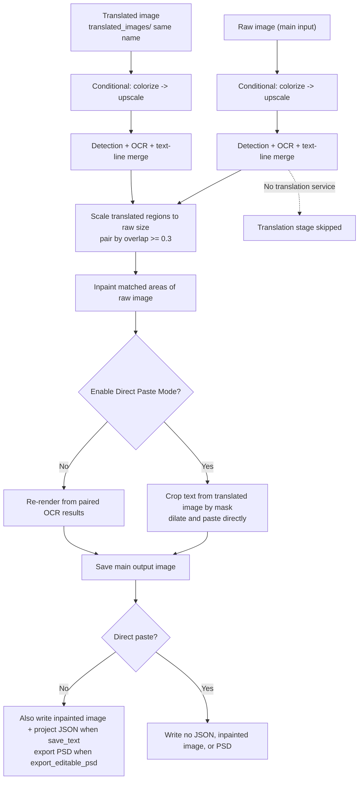

# Replace Translation

Use the Replace Translation workflow when you have an untranslated "raw" image and an already-translated image of the same work (for example a fan-translated, restored, or differently-resolved version) but no reusable project JSON. It runs detection and OCR on both the raw image and the translated image, pairs regions by scaled overlap, and moves the translated text onto the raw image: it inpaints the original text areas and then re-renders, or directly pastes text cropped from the translated image. No translation service is called.

This guide focuses on the inputs, skipped stages, and output files of this workflow. See [Output Directory and Workflow](../desktop/translation/output-directory-and-workflow.md) for the overall boundaries of the nine workflows and [Workflow Matrix](../reference/workflow-matrix.md) for the summary table; [File List and Input](../desktop/translation/file-list-and-input.md) covers adding files, the list, and drag-and-drop.

## When to use it

- Inputs: the main input images are raw images with the same file-discovery rules as normal translation; for each raw image, a same-name translated image must be placed in the per-image work directory `manga_translator_work/translated_images/`.
- Pairing lookup: first look for a translated image with the same extension in `translated_images/`, then try the other supported image extensions in order; if none is found, that image is skipped and counted as failed.
- Stages executed: conditional colorize → conditional upscale → detection → OCR → text-line merge on both the raw and the translated image; the translated regions are scaled to the raw image size and paired by overlap (threshold `0.3`, based on the smaller box); the matched areas of the raw image are inpainted; finally the text is re-rendered or pasted directly.
- Stages skipped: the translation service. The translation stage (`translator`) never runs; the translation comes from the OCR result of the translated image.
- Output files: the main output image. When not in direct paste mode and `save_text=true`, an inpainted image and a project JSON are also written; direct paste mode explicitly writes neither and also skips PSD export.
- Workflow field: combo index 8 writes `cli.replace_translation=true` at runtime; GUI switching keeps the eight workflow booleans mutually exclusive.

## Run this workflow

### Select the Replace Translation workflow

1. Open the translation page and choose “Replace Translation” in the “Translation Workflow Mode:” combo box.
2. The page title becomes “Replace Translation” and the subtitle shows the hint: place translated images in `manga_translator_work/translated_images` with matching filenames.
3. The start button becomes “Start Replace Translation”; clicking it starts the backend task in this mode.

Selecting a mode only writes configuration and updates the UI texts; it does not start a task. Before starting, add the raw images and place the same-name translated image for each raw image in `manga_translator_work/translated_images/`. Files with the same extension take priority; if `translated_images/` does not exist or contains no same-name file, the corresponding raw image is skipped and counted as failed.

“Output Directory:” determines where the main output image goes; the inpainted image, project JSON, and pairing image always follow the per-image work-directory rules and do not change with “Output Directory:”.

The `manga_translator_work/translated_images` shown in the hint is fixed program text and a work-directory name, not a user's private path; “matching filenames” means the same file name (without extension).

## Processing order

### Input and pairing

`find_translated_image()` calls `get_work_dir()` with the raw image path to obtain the per-image work directory, then joins `translated_images/<stem><ext>`. The lookup tries the same extension first, then iterates `SUPPORTED_IMAGE_EXTENSIONS`; a `.png` raw image can therefore pair with a `.jpg` translated image, but a same-name same-extension file always wins.

Pairing proceeds as follows:

1. Run `_translate_until_translation()` on the raw image (conditional colorize → conditional upscale → detection → OCR → text-line merge) and filter low-confidence regions with `ocr.prob`.
2. Run the same first half of the pipeline on the translated image and filter it the same way.
3. Scale the translated regions to the raw image size (by width/height ratio).
4. Compute overlap and match with `iou_threshold=0.3` (based on the smaller box); `create_matched_regions()` produces the paired regions used for rendering, and unmatched raw regions are not inpainted.

### Stages and outputs

The Mermaid diagram below shows the two-image pipeline, the two finishing modes, and the skipped stage shown in the current code; the main differences from normal translation are the translated image as a second input, no translation service, and the optional direct paste branch.

Limitation: the pairing threshold is a fixed `0.3` overlap and is not adjusted by any user parameter; when the translated image and the raw image differ in size, they are aligned by scaling, which does not guarantee exact text positions, and unmatched regions keep the raw image's original text.

### The two finishing modes

- Re-render (default): with “Enable Direct Paste Mode” off, the paired OCR results become `text_regions` and are handed to `_run_text_rendering()`, which renders the translation with the regular typesetting parameters; the inpainted image and project JSON are written when `save_text=true`.
- Direct paste: with “Enable Direct Paste Mode” on, a mask is taken from the translated image (its raw mask first, falling back to the raw image's mask), dilated by `paste_mask_dilation_pixels`, and the text cropped from the translated image is composited onto the inpainted image, preserving the translated image's original font style; no JSON, inpainted image, or PSD is written, and `export_editable_psd` is ignored.

In both finishing modes, the main output image is saved through `_calculate_output_path()`.

### Skip and failure paths

- No paired translated image: the image is skipped and counted as failed, and no main output image is produced.
- The raw image has no detected text regions, or no valid regions remain after filtering: the original image is output as the main output without inpainting or rendering.
- The translated image has no detected text regions: the original image is output.
- No matches (no regions to inpaint): the original image is saved.
- Cancel: `_check_cancelled()` runs between steps, so no further images are processed after stopping; each image's context memory is cleaned up right after processing.

### Concurrency and mutual exclusion

- `batch_concurrent` is incompatible: both the desktop controller and `translate_batch()` treat it as an incompatible mode and force non-concurrent processing; keeping the concurrency config in the UI does not create a concurrent pipeline.
- Manually combining multiple workflow fields is not a supported combination. In the `translate_batch()` dispatch order, the replace-translation branch runs before load_text, translate_json_only, and the regular preprocessing; GUI switching keeps the eight fields mutually exclusive.
- As with normal translation, the preprocessing stage still applies conditional colorization and upscaling to both images according to `colorizer.colorizer` and `upscale.upscale_ratio`; these values are not forced by this workflow.

## Inputs, outputs, and limitations

- Translated-image dependency: a missing `translated_images/` directory, or a directory without a same-name file, skips that image. If the pairing image has a different name, resolution, or greatly shifted text positions, fewer regions match and unmatched areas keep the original text.
- `render.enable_template_alignment`: its description states it is specific to Replace Translation; when on, the direct paste path writes no JSON, inpainted image, or PSD; when off, the paired regions from OCR are re-rendered.
- `cli.save_text=false`: outside direct paste mode, neither the inpainted image nor the project JSON is written, leaving only the main output image; direct paste mode does not write them anyway.
- `cli.overwrite=false`: the GUI checks whether the main output image already exists (the “normal translation” branch) and skips that image before starting.
- Mask refinement: the inpainting stage chooses a model by `inpainter`; when the inpainter is `none`, a replace-translation-specific detection module re-extracts the raw mask and refines it with `REFINEMASK_INPAINT`, otherwise the regular `_run_mask_refinement` runs, followed by extra dilation according to `mask_dilation_offset`.
- Colorization, upscaling, detection, and OCR still consume model, VRAM, and network costs according to their parameters; this guide does not repeat those parameter descriptions.
- The main output directory, `save_to_source_dir`, and `cli.format` affect only the main output image; the JSON, inpainted image, and pairing image are unaffected.

## Read next {#related-pages}

- Other workflows: [Normal Translation](./normal.md) · [Export Original Text](./export-original.md) · [Export Translation](./export-translation.md) · [Translate JSON Only](./translate-json-only.md) · [Import Translation and Render](./import-translation-and-render.md) · [Colorize Only](./colorize-only.md) · [Upscale Only](./upscale-only.md) · [Inpaint Only](./inpaint-only.md)
- Selecting a workflow, output directory, and mutually exclusive writes: [Output Directory and Workflow](../desktop/translation/output-directory-and-workflow.md)
- Inputs, skipped stages, and outputs of all nine workflows: [Workflow Matrix](../reference/workflow-matrix.md)
- Mutually exclusive workflow fields, parameter overrides, and template alignment: [Mode-Specific Workflows and Template Alignment](../desktop/settings/mode-specific.md)

> See the reference index: [Workflow Matrix](../reference/workflow-matrix.md).
