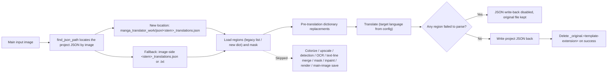

# Translate JSON Only

Use the Translate JSON Only workflow when each image already has a project JSON (for example, the `manga_translator_work/json/<stem>_translations.json` produced by Export Original Text, or a project saved from the editor) and you only want the app to re-translate the original text inside the JSON and write the translations back, without re-running detection, OCR, inpainting, or rendering. It loads text regions from the JSON, applies pre-translation dictionary replacements, translates, writes the project JSON back, and deletes the image's original-text sidecar on success. It does not run colorization, upscaling, detection, OCR, text-line merging, masks, inpainting, or rendering, and writes no main output image.

Translate JSON Only forms the template/JSON family together with [Export Translation](./export-translation.md), [Export Original Text](./export-original.md), and [Import Translation and Render](./import-translation-and-render.md). The overall boundaries of the nine workflows are in [Output Directory and Workflow](../desktop/translation/output-directory-and-workflow.md), with a summary table in [Workflow Matrix](../reference/workflow-matrix.md). The `cli.translate_json_only` parameter is documented in [Mode-Specific Workflows and Template Alignment](../desktop/settings/mode-specific.md#cli-translate-json-only).

## When to use it {#feature-boundary}

- This guide focuses on the "Translate JSON Only" workflow (combo index `3`) of the nine workflows. Selecting the mode clears the eight mutually exclusive workflow fields first, then sets only `cli.translate_json_only=true` and saves the configuration.
- Inputs: the main input images (the same file-discovery rules as normal translation), and each image must have a findable, parseable project JSON. The JSON accepts both the legacy format (the value is a list of regions) and the new format (the value is a dict containing `regions`).
- Stages executed: load regions and the mask from JSON → pre-translation dictionary replacements → translation → JSON write-back; on success the same image's `<stem>_original.<template-extension>` original-text sidecar is deleted.
- Stages skipped: conditional colorization, conditional upscaling, detection, OCR, text-line merging, mask refinement, inpainting, rendering, and main-output-image saving.
- Output files: the project JSON `manga_translator_work/json/<stem>_translations.json` is written back (new location takes priority; even when the JSON was read from the legacy location, write-back lands in the new location).
- Workflow field: combo index `3` → `cli.translate_json_only=true`; GUI switching keeps the eight workflow booleans mutually exclusive.

## Run this workflow {#ui-operations}

### Select the Translate JSON Only workflow {#select-translate-json-only}

1. Open the "Translation" page and click the "Translation Workflow Mode:" combo box in the "Translation Task" card.
2. Choose "Translate JSON Only". On switching, the UI sets only `cli.translate_json_only=true`, clears the other seven workflow fields, and saves the configuration; the title becomes "Translate JSON Only" and the subtitle shows the matching hint.
3. Click the "Start JSON Translation" start button to launch the task. Switching modes does not start a task automatically; while a task is running the button changes to "Stop Translation" and similar states, see [Progress, Stop, and Task State](../desktop/translation/progress-stop-and-task-state.md).

In the hint, `imagename` is the program's example name for the input `<stem>`, not a user's private filename; `manga_translator_work/json/` is a fixed subdirectory of each image's work directory. The `imagename_original.txt` in the hint is fixed sample text; the actual extension comes from the template's `output_format` (default `json`), and the original-text sidecar is located with that extension when it is deleted.

"Output Directory:" only determines where the main output image goes. This mode writes no main image, so it does not affect where the JSON is read from or written back to; both always follow the per-image work-directory rules.

## Processing order {#runtime-behavior}

### Input and discovery rules {#input-and-discovery}

- Main input images: the same file-discovery rules as normal translation ("Add Files...", "Add Folder...", or drag-and-drop; recursive lookup, natural sorting, skipping directories named `manga_translator_work`).
- JSON lookup: `find_json_path()` checks the new location `manga_translator_work/json/<stem>_translations.json` first, then falls back to the legacy location (the image-side `<stem>_translations.json`). If neither exists but the legacy `<stem>_translations.txt` is present, it falls back to TXT loading (that format has no mask).
- If no JSON is found, the image raises `FileNotFoundError` and is marked failed; it does not enter translation or write-back.
- Two JSON structures are accepted: the legacy format stores a list of regions as the value of the image key; the new format stores a dict with `regions`, `mask_raw` (base64/list), `mask_is_refined`, `skip_font_scaling`, `skip_text_replacements`, and more. The code does not validate the image key and takes the first value; a region without `target_lang` is backfilled from the config's `translator.target_lang`.

### Skipped and kept stages {#skipped-and-kept-stages}

The Mermaid diagram below shows the stage order, the parse-failure fuse, and the output files. It is the "JSON read → translate → JSON write-back" branch of the nine-workflow matrix; it shares the JSON read/write facilities with Export Original Text and Export Translation but skips their image stages.

### JSON write-back details {#json-writeback-details}

- Write-back calls `_save_text_to_file()`: it writes `regions` (each region with coordinates, original text, translation, font size, and other rendering fields), `original_width`, `original_height`, and forces `skip_font_scaling=false` (same as Export Original Text) so a later "Import Translation and Render" re-runs smart typesetting instead of inheriting the old font size.
- `skip_text_replacements` stays at its default `false`: this mode does not render, so the JSON stores the raw translation before replacement rules; the rules are applied only when importing and rendering.
- Mask: the `mask_raw` loaded from the JSON (decoded from base64/list) is written back, and the `mask_is_refined` state is kept. The `paint_overlay` and `stamp_overlay` (editor brush/stamp layers) and `last_export_dir` of an existing JSON are preserved so write-back does not drop them.
- Fuse: when any region failed to parse (`load_text_parse_failures > 0`), write-back is disabled and the image fails explicitly while the original file is kept, so lost regions are never permanently overwritten into the project JSON.
- On success, `_delete_original_txt_after_json_translation()` deletes the image's original-text sidecar; a deletion failure only logs a warning and does not fail the task.

### Output files {#output-files}

| Output | Path | Notes |
| --- | --- | --- |
| Project JSON (written back) | `manga_translator_work/json/<stem>_translations.json` | New location takes priority; even when read from the legacy location, write-back lands in the new location |
| Original-text sidecar (deleted) | `manga_translator_work/originals/<stem>_original.<template-extension>` | Deleted after a successful translation; the extension comes from the template's `output_format`, default `json` |
| Main output image | Not written | Rendering is skipped; this mode produces no main image |

## Inputs, outputs, and limitations {#dependencies-and-conflicts}

- Depends on a findable, parseable project JSON per image; if it is missing or fails to parse, the image fails and the original file is kept.
- `batch_concurrent` is incompatible: both the desktop controller and `translate_batch()` treat it as an incompatible mode and force non-concurrent processing; saving the concurrent config in the UI does not make it a concurrent pipeline.
- Manually stacking multiple workflow fields is not a supported combination. In the runtime dispatch order of `translate_batch()`, the `load_text` TXT pre-import runs first and `replace_translation` is dispatched first; only then is `translate_json_only` handled. GUI switching keeps the eight fields mutually exclusive.
- Not controlled by `cli.save_text`: the JSON-only branch writes the JSON back unconditionally after translation. This differs from Export Original Text, which requires `template=true` and `save_text=true`.
- High-quality translators (`openai_hq`/`gemini_hq`) are treated as import/export modes here: the dedicated high-quality flow is skipped, the standard translation flow runs, and a log warning is recorded.
- This mode still consumes API/model costs for the selected translator; colorization, upscaling, detection, OCR, inpainting, and rendering consume nothing (their stages are skipped).
- The main output directory, `save_to_source_dir`, and `cli.format` affect only the main output image; this mode writes no main image, so those settings have no direct effect on this workflow's outputs.

## Read next {#related-pages}

- Other workflows: [Normal Translation](./normal.md) · [Export Original Text](./export-original.md) · [Export Translation](./export-translation.md) · [Import Translation and Render](./import-translation-and-render.md) · [Colorize Only](./colorize-only.md) · [Upscale Only](./upscale-only.md) · [Inpaint Only](./inpaint-only.md) · [Replace Translation](./replace-translation.md)
- Selecting a workflow, output directory, and mutually exclusive writes: [Output Directory and Workflow](../desktop/translation/output-directory-and-workflow.md)
- Inputs, skipped stages, and outputs of all nine workflows: [Workflow Matrix](../reference/workflow-matrix.md)
- Mutually exclusive workflow fields, parameter overrides, and template alignment: [Mode-Specific Workflows and Template Alignment](../desktop/settings/mode-specific.md)

> See the reference index: [Workflow Matrix](../reference/workflow-matrix.md).
