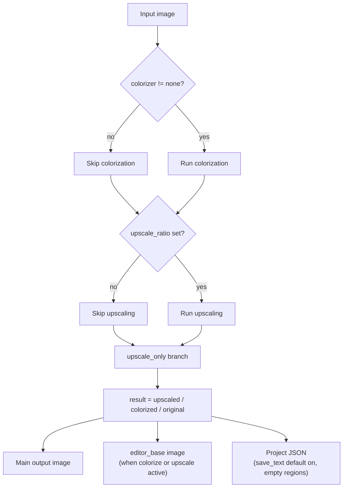

# Upscale Only

Use the Upscale Only workflow when you only need to enlarge images in bulk (for example, before manual cleanup, printing, or archiving) and do not need detection, OCR, translation, inpainting, or layout rendering. It sends each input image through the upscaler and writes the main output image directly, without producing translated text or entering the mask, inpainting, and rendering stages.

Upscale Only belongs to the same bypass family as Colorize Only and Inpaint Only: all of them skip the second half of the translation pipeline and differ only in which pre-stage they keep. The overall boundaries of the nine workflows are in [Output Directory and Workflow](../desktop/translation/output-directory-and-workflow.md), with a summary table in [Workflow Matrix](../reference/workflow-matrix.md); the upscaling model, ratio, and tiling parameters are described in [Upscaling and Colorization](../desktop/settings/upscale-and-colorization.md).

## When to use it

- Inputs: the main input images (the same file-discovery rules as normal translation: Add Files, Add Folder, or drag-and-drop; folders are searched recursively in natural sort order and directories named `manga_translator_work` are skipped).
- Stages executed: colorize (conditional) → upscale (conditional). Colorization runs first when `colorizer.colorizer` is not `none`; upscaling runs when `upscale.upscale_ratio` has a value.
- Stages skipped: detection, OCR, text-line merge, translation, mask refinement, inpainting, and layout rendering. The `upscale_only` branch clears `text_regions` so the translation and rendering branches are never entered.
- Output files: the main output image (its path is computed by the output-path rules, see Related Files and Formats); when either colorization or upscaling is active, the editor base image `manga_translator_work/editor_base/<original-filename>` is written as well.
- Workflow field: combo index 6 writes `cli.upscale_only=true` at runtime; GUI switching keeps the eight workflow booleans mutually exclusive.

Upscale Only does not force a ratio: `upscale_only=true` only decides which stages are skipped, while whether the image is actually enlarged is decided by `upscale_ratio`. When the ratio is empty, the output is the colorized result (if the colorizer is on) or the original image. The source code also does not turn colorization off in this mode, so the UI hint "only upscale images" is not fully consistent with the actual pre-colorization when a colorizer is enabled.

## Run this workflow

### Select the Upscale Only workflow

1. Open the translation page and choose “Upscale Only” in the “Translation Workflow Mode:” combo box.
2. The page title becomes “Upscale Only” and the subtitle shows the hint: only upscale images, no detection, OCR, translation or rendering.
3. The start button becomes “Start Upscaling”; clicking it starts the backend task in this mode.

Selecting a mode only writes configuration and updates the UI texts; it does not start a task. Before starting, add the main input images (“Add Files...”, “Add Folder...”, or drag-and-drop) and, if needed, choose the upscaling model and ratio under “Settings → Mode Specific → Upscaling”; when the ratio stays at “Not Use”, this mode does not change the image.

## Processing order

### Processing branches and outputs

The desktop task enters the standard or high-quality batch loop through `translate_batch()`, and each image goes through `_translate_until_translation()` for conditional colorization and conditional upscaling. The `upscale_only` branch returns directly with `ctx.result = ctx.upscaled` after upscaling, so the subsequent detection, OCR, translation, and rendering stages are skipped as a whole.

The diagram shows the branches of Upscale Only: an empty ratio still outputs the colorized image or the original; the editor base image is written only when `colorizer != none` or `upscale_ratio` is set; and the project-JSON write depends on `cli.save_text`/`text_output_file` (see Dependencies and Conflicts) and is subject to the actual output. This mode does not become a concurrent pipeline just because the UI still stores the concurrent setting.

## Inputs, outputs, and limitations

- `upscale_only=true` does not force a ratio: when `upscale_ratio` is “Not Use” (`null`), the output is the colorized result or the original image; the UI hint and the actual code behavior are not fully consistent (the code does not turn colorization off).
- Pre-colorization: when `colorizer.colorizer` is not `none`, Upscale Only still runs colorization first, incurring model, VRAM, and API costs; with an empty ratio the output keeps that colorized result.
- `revert_upscaling` only restores the output size; it does not cancel upscaling. The image is enlarged and then downscaled, so upscaling computation still happens.
- `tile_size=0` only disables tiling; it does not disable upscaling. An empty value uses the runtime default 400.
- `cli.overwrite=false`: the GUI skips images whose main output image already exists before starting (the “normal mode” branch checks the output image).
- `cli.save_text`: the default is `true`. The batch loop calls `_save_text_to_file` even when `text_regions` is empty, as long as `save_text` or `text_output_file` is enabled, so with default settings Upscale Only also writes a project JSON with empty `regions` (recording `upscale_ratio`, `upscaler`, and `last_export_dir`). The research matrix lists only the main image and the editor base image as outputs; actual file retention needs the actual output.
- `batch_concurrent` is incompatible: both the desktop controller and `translate_batch()` treat Upscale Only as an incompatible mode and force non-concurrent processing.
- Manually combining multiple workflow fields is not a supported combination; GUI switching keeps the eight fields mutually exclusive, and core dispatch does not rely on stacked fields.
- The main output directory, `save_to_source_dir`, and `cli.format` determine the main output image location and extension; the JSON and editor base image always follow the per-image work-directory rules and are not affected by the output directory.
- This mode does not render, so it does not write `skip_text_replacements`; paint/stamp overlay layers in an existing JSON are preserved.

## Read next {#related-pages}

- Other workflows: [Normal Translation](./normal.md) · [Export Original Text](./export-original.md) · [Export Translation](./export-translation.md) · [Translate JSON Only](./translate-json-only.md) · [Import Translation and Render](./import-translation-and-render.md) · [Colorize Only](./colorize-only.md) · [Inpaint Only](./inpaint-only.md) · [Replace Translation](./replace-translation.md)
- Selecting a workflow, output directory, and mutually exclusive writes: [Output Directory and Workflow](../desktop/translation/output-directory-and-workflow.md)
- Inputs, skipped stages, and outputs of all nine workflows: [Workflow Matrix](../reference/workflow-matrix.md)
- Mutually exclusive workflow fields, parameter overrides, and template alignment: [Mode-Specific Workflows and Template Alignment](../desktop/settings/mode-specific.md)

> See the reference index: [Workflow Matrix](../reference/workflow-matrix.md).
